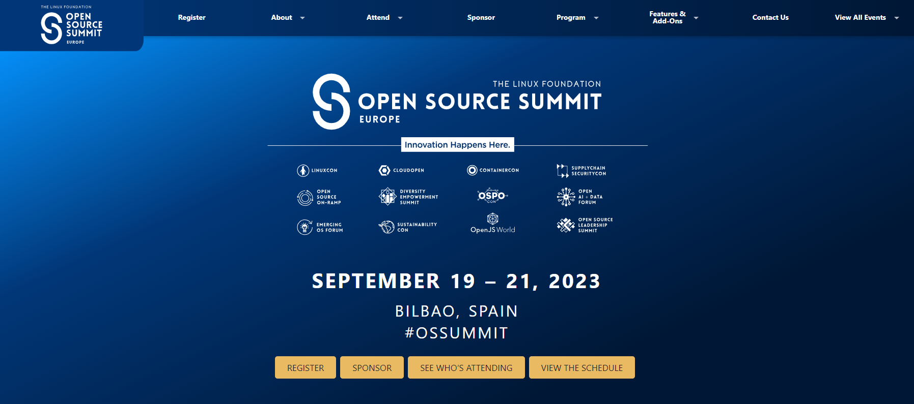
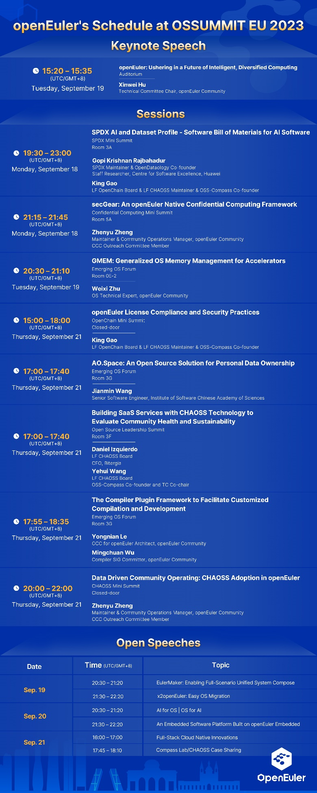
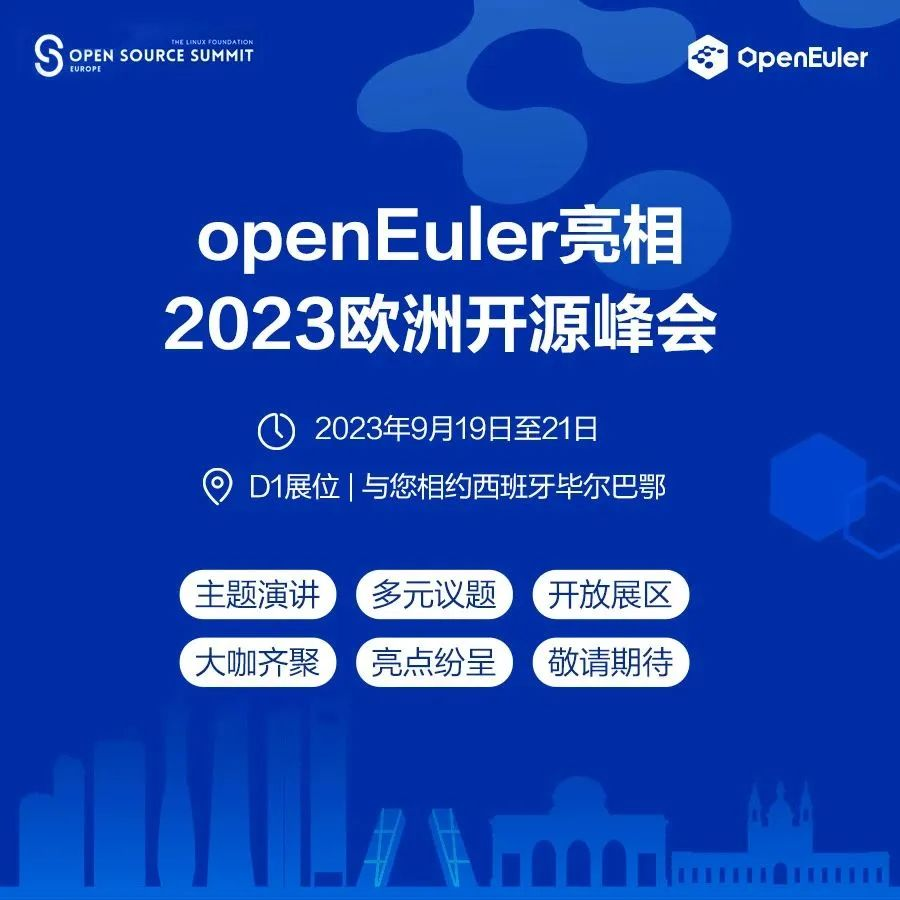

2023年9月19日-21日，openEuler将参加在西班牙毕尔巴鄂举办的 OSSUMMIT
2023（Open Source Summit Europe
2023），这是openEuler继去年正式亮相后的第二次全面参加该峰会。

Open Source Summit Europe是由Linux基金会主办，围绕 Linux
开发者的一系列开源会议的总称，是全球最顶级的开源盛会之一。围绕大会主题"Innovation
Happens
Here"，届时全球开源开发者、开源厂商、开源大咖、用户、高校科研机构将齐聚西班牙毕尔巴鄂共议开源创新与未来。本次峰会上openEuler将在主题演讲、技术议题、展览展示以及open
speech等环节全面呈现，精彩内容，敬请期待。

**openEuler 参会议程**

**欢迎注册，免费参会**

<https://events.linuxfoundation.org/open-source-summit-europe/register/>

**大会直播**

<https://www.youtube.com/watch?v=vVpvRUKRwRs>

**就等你们啦！**

