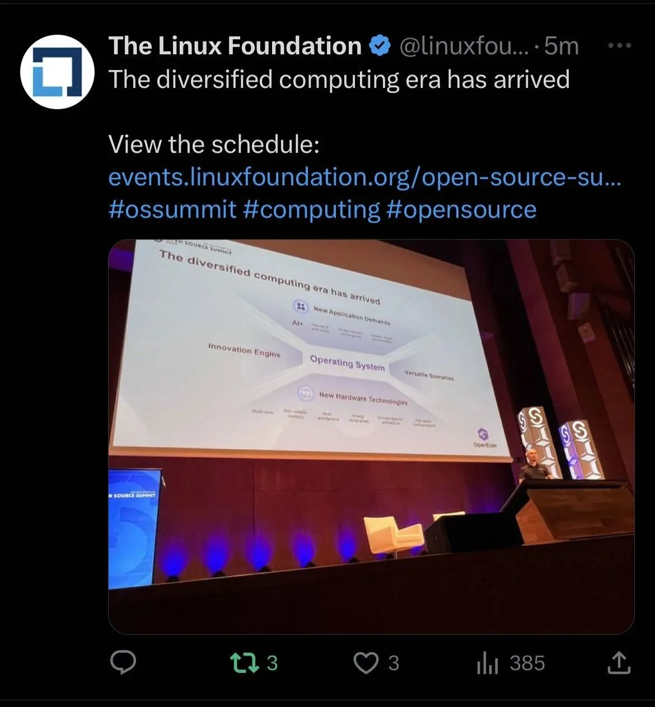
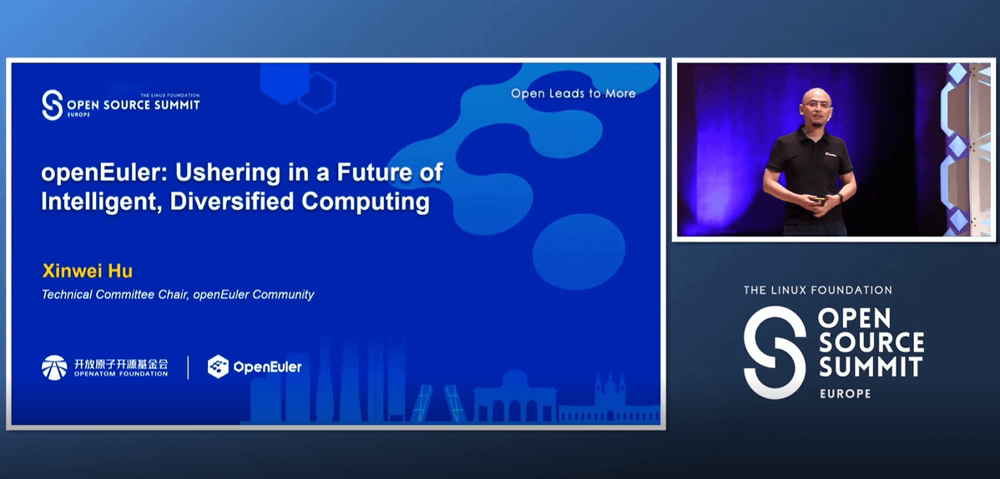
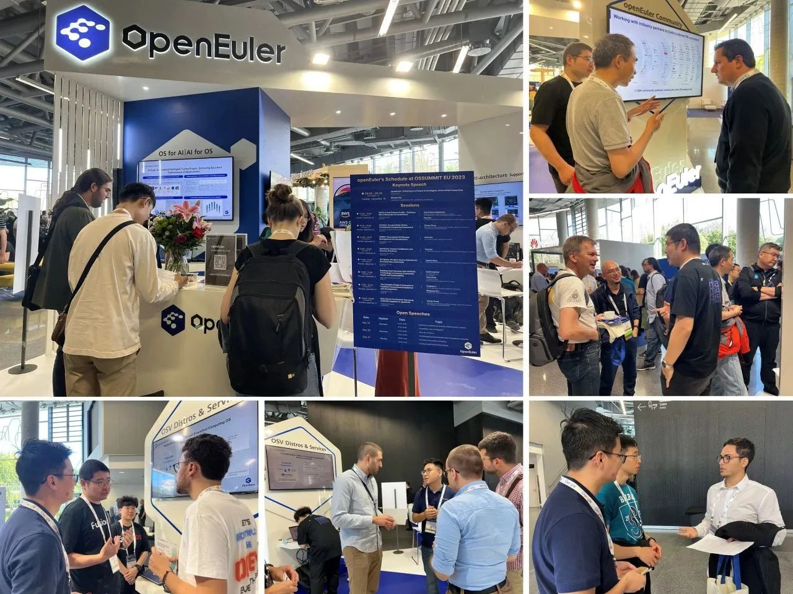

2023年9月19日，全球顶级开源峰会 OSSUMMIT EU 2023 在西班牙-毕尔巴鄂正式开场。openEuler 作为钻石级别赞助参会。这是 openEuler 继去年正式亮相后的第二次全面参加该峰会。本次会议，openEuler带来Keynote及多场分论坛演讲，涵盖Linux Kernel、编译器、AI、多样性计算、软件供应链安全、机密计算、社区治理等众多领域以及多项创新项目。

峰会首日，openEuler技术委员会主席胡欣蔚在Keynote现场发表了主题演讲《openEuler: Ushering in a Future of Intelligent, Diversified Computing》，向全球的开发者分享openEuler开源3年多以来，在全场景创新、多样性算力、人工智能等方面取得的进展和成果。

openEuler通过持续的技术创新，开放的社区运作和广泛地规模商用构建了一个可持续发展的操作系统。演讲中，胡欣蔚强调了其支持多样化计算架构的能力以及构建全场景多样化、智能计算的愿景。他还强调了openEuler对人工智能的支持，开发了名为EulerCopilot的AI助手，将大模型与系统管理员的日常工作相连接。

除了精彩纷呈的Keynote，openEuler展台也空前火爆，来自不同社区和企业的开发者来到openEuler展台，与openEuler社区专家们进行了详尽的技术探讨。未来两天，我们还有更多精彩的分论坛演讲和open speech，期待更多朋友能够来到openEuler展台与我们交流！

openEuler的成功离不开社区开发者的贡献和持续努力。过去3年的发展，社区每日活跃的开发者数量从311人增加到了近4000人。openEuler已成为一个充满活力和创新的社区项目。未来，openEuler将继续发展，为各种场景和应用提供强大的操作系统支持，推动智能化未来的实现。