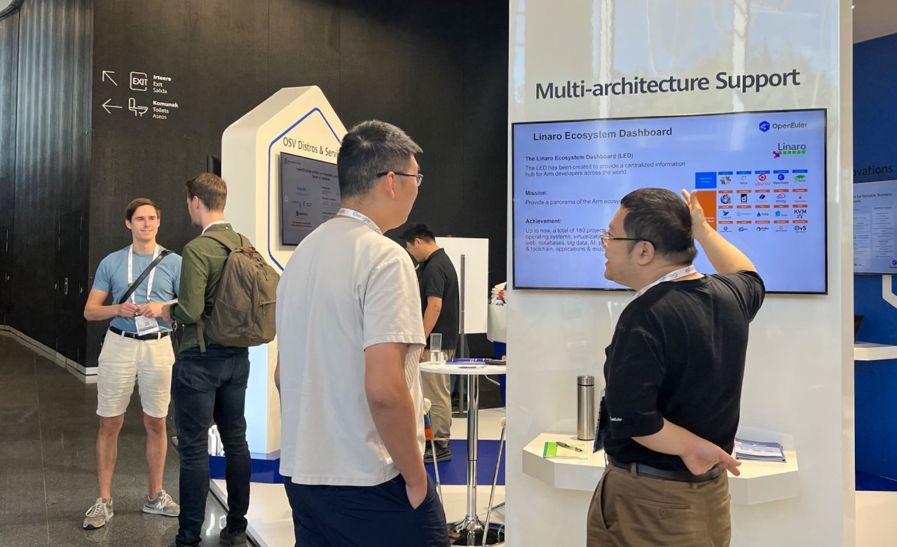

2023年9月19日，全球顶级开源峰会 OSSUMMIT EU 2023 在西班牙-比尔巴鄂正式开幕。作为由Linux基金会主办的世界顶级开源活动之一，峰会以“Innovation Happens Here”的主题，汇集了全球开源开发者、厂商、技术专家、用户和高校科研机构等，共同探讨开源创新和未来。本次峰会，openEuler深度参加主题演讲、技术议题、展台展示以及开放演讲等多个环节。

作为openEuler社区的国际基金会伙伴，Linaro将和openEuler一起参加本次峰会，并展示基于Arm生态系统的合作成果，包括Apache BigTop等大数据领域项目的openEuler原生支持，通过SVE到SVE2的优化进一步释放多样性算力，UADK、Arm存储的进一步优化，以及Linaro Ecosystem Dashboard的最新进展等。

欢迎来欧洲开源峰会现场参观我们的展位（D1），如有任何问题，欢迎通过contact@openeuler.io 或 support@linaro.org 与我们联系。

### 关于Linaro

Linaro致力于推动Arm生态的软件合作，并帮助会员公司使用最新的开源技术。基于共同项目的合作能够减少整体的软件碎片化，从而可以让会员公司减少Arm软件开发和验证的成本，相关合作横跨多个领域包括手机、数据中心、边缘计算、物联网等等。

### 欢迎注册，免费参会

<https://events.linuxfoundation.org/open-source-summit-europe/register/>