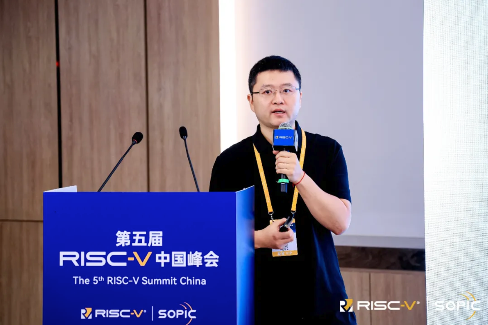
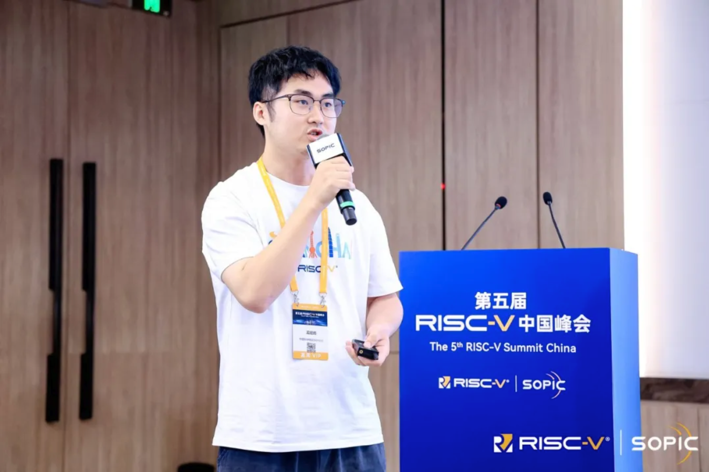
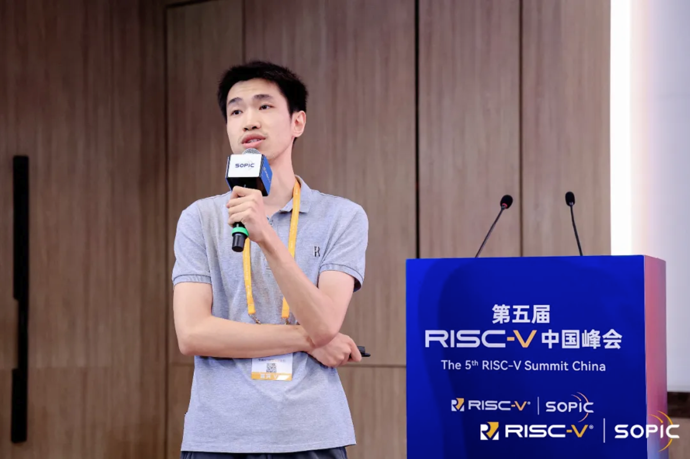
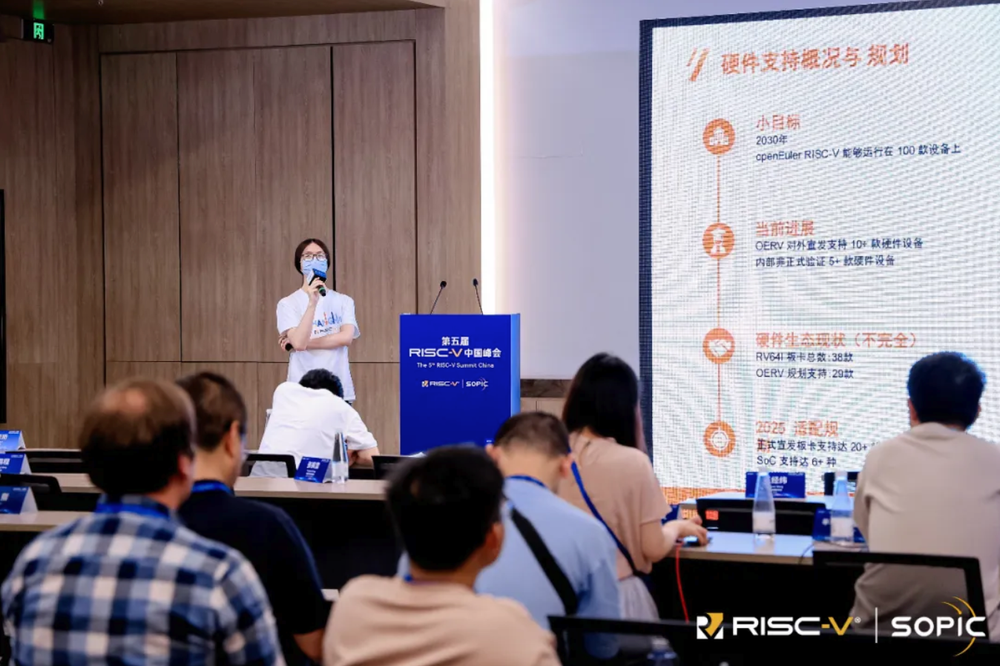
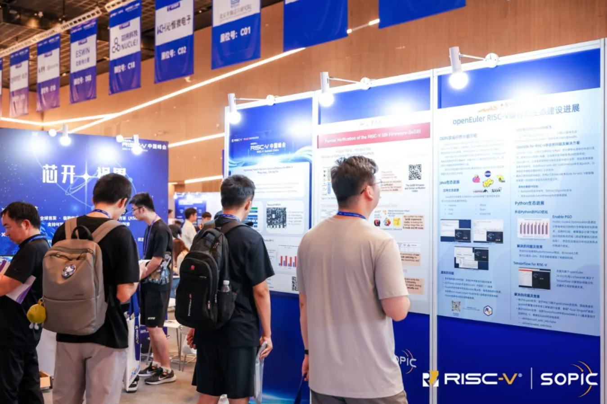
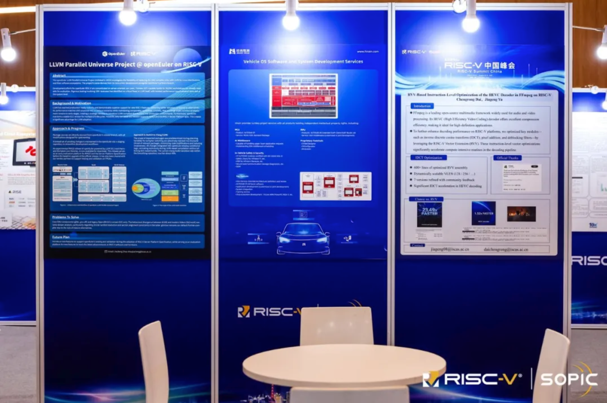
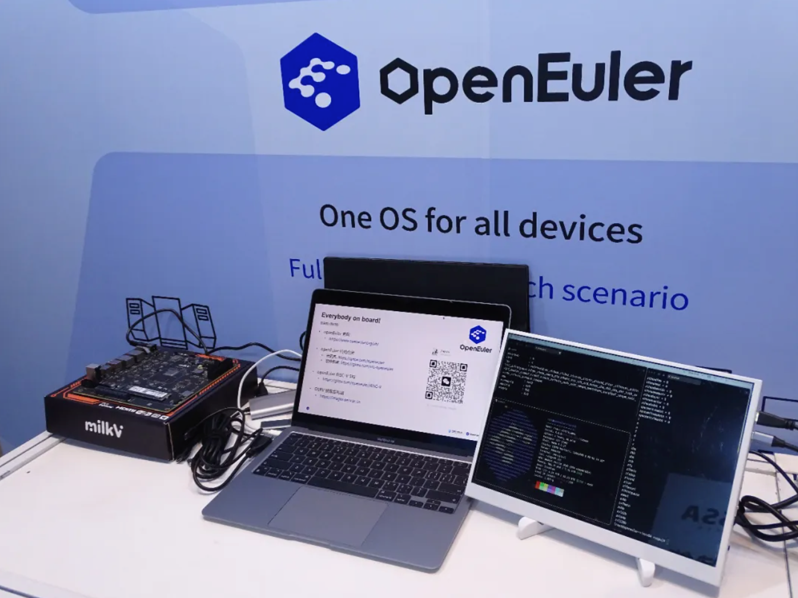

2025 年 7 月 16 日 - 19 日，第五届 RISC-V 中国峰会在上海张江科学会堂成功举办，作为 RISC-V 生态的重要建设者与贡献者， OpenAtom openEuler（简称：openEuler或开源欧拉） 社区深度参与了本届峰会，全面展示了在 RISC-V 架构上的最新进展、创新成果与生态实践。  

OERV 是 openEuler on RISC-V 操作系统的简称，同时也指代 openEuler 社区 RISC-V SIG ，OERV的核心任务是完善 openEuler 系统在 RISC-V 架构上的软硬件生态建设，并且在此基础上探索对 RISC-V 碎片化等生态性问题的解决方案，进一步为 RISC-V 的应用落地提供可靠的系统基座与公共基础设施平台。  

## 演讲  

在本次峰会中，OERV 团队积极参与了服务器平台技术工作组（Server Platform TG）和认证指导委员会（Certification Steering Committee）的会员日会议并展开了深入讨论。此外，团队还在软件与生态系统分论坛上发表了四场主题演讲，内容涵盖 openEuler on RISC-V 的总体生态建设、RVCK 内核同源项目、虚拟化生态以及硬件生态支持等议题，并与参会者们进行了广泛交流  

### 作为 RISC-V 服务器的 openEuler: 挑战和路线图  

**演讲者：** **屈晟 openEuler常务委员会委员 中国科学院软件研究所 高级工程师**  

演讲介绍了 OERV 团队的核心工作是实现 openEuler 社区对 RISC-V 架构的原生支持，主要通过标准演进、内核同源、测试测评、战略基建四个生态计划构建 openEuler on RISC-V 通用服务器发行版基座。团队紧密跟进 RVA23、RISC-V Server Platform 等上游标准并持续演进，积极推动 RISC-V 在高性能计算领域的落地应用。为保障 openEuler on RISC-V 的高质量发展和生态适配，社区构建了强大的基础设施支撑体系；同时，OERV 团队与香山昆明湖团队合作，将 RVA23 试验版本成功移植到处于 FPGA 验证阶段的昆明湖 v2 处理器上，并完成了典型应用测试  

  

### 内核同源项目：驱动 openEuler on RISC-V 生态  

**演讲者：** **王经纬 openEuler 技术委员会委员 中国科学院软件研究所 操作系统工程师**  

该演讲聚焦于为解决 RISC-V 生态碎片化难题而发起的“内核同源项目（RVCK）”。王经纬阐述了该项目如何基于openEuler Kernel 6.6长期支持版本，为众多 RISC-V 芯片及硬件厂商构建一个统一的、公共的内核开发基座。此举旨在消除各厂商重复维护私有内核分支带来的维护灾难，通过统一基线、共享成果、共建上游，协同中兴、算能、进迭时空等产业伙伴，共同加速 RISC-V 服务器生态的成熟。演讲还介绍了为保障项目质量而建设的自动化测试平台等关键基础设施，展示了以公共协作工程推动 RISC-V 生态标准落地和繁荣的清晰路径  

  

### Towards Secure Container Infrastructure on RISC-V: the Development from Rust-vmm to Kata-Containers  

**演讲者：** **何若轻 中国科学院软件研究所 软件工程师  Kata-Containers 架构委员会委员**  

演讲介绍了 OERV 团队在安全方向的云原生基础设施上游所做的贡献，以及相关虚拟化软件栈的 RISC-V 支持工作路线图，工作进展。为充分使能 RISC-V 进入服务器场景，虚拟化小组已完成 RustVMM，Cloud-Hypervisor 以及 Kata-Containers 基本支持，正稳步拉平与其他架构的 IOMMU，CoVE 等特性差距。计划于 2026 年第四季度落地安全容器基础设施的计算面支持  

  

### RISC-V 百板挑战：多元化硬件的支持方案实践  

**演讲者：** **李航帆 中国科学院软件研究所 操作系统工程师**  

该演讲分享了 OERV 团队对 RISC-V 硬件板卡的深度支持：从 2030 年百款板卡愿景出发，详解当前十余款板卡适配成果，创新性提出基于 extlinux.conf 的通用启动方案，突破固件与内核版本耦合难题。同时探索 UEFI + FDT 标准化路径，并构建测试体系保障稳定性，推动 RISC-V 开发者生态软硬件协同演进  

  

## Posters  

### openEuler on RISC-V 运行时生态建设进展  

**作者：** **张定立 openEuler 社区 Java SIG Maintainer 中国科学院软件研究所 操作系统工程师**  

运行时小组是 OERV 主要的系统软件维护小组。该 Poster 主要介绍 OERV 团队在 RISC-V 运行时生态上的工作成果以及之后的工作计划。Java 生态方面，已经基本上对标 x86/aarch64 完成了软件生态支持；Python 生态方面，开启了 PGO 优化并完成了对 TensorFlow 的支持  

  

### LLVM Parallel Universe Project @ openEuler on RISC-V  

**作者：** 周嘉诚 openEuler 社区 RISC-V SIG Maintainer 中国科学院软件研究所操作系统工程师  

「openEuler LLVM 平行宇宙计划」 是 openEuler 社区于 2023 年由 Compiler SIG 与 RISC-V SIG 联合发起的探索性项目。该项目旨在探索使用 LLVM 编译器套件替代 GCC 套件来构建完整的 Linux 发行版及其软件包。因其独立推进、与社区主要基于 GCC 的版本平行发展，故得名「平行宇宙」。Poster 详细阐述了该项目的背景、动机及进展，并特别强调了 LLVM 在支持 RISC-V 架构特性方面展现出的优越性  

   

## 展台  

展台展示了由 openEuler 社区 RISC-V SIG 发布符合 RVA23 标准的试验镜像。本次镜像基于 LLVM20 工具链，内核采用 openEuler Kernel 6.6 版本的 24.03 LTS SP2 分支。openEuler RVA23 试验镜像完全基于 openEuler 社区源码和基础设施开发，符合最新 RISC-V Profile 的规范，是 openEuler 迈向 RISC-V 通用服务器标准的关键一步  

  

## 相关链接  

- Gitee 协作主页: https://gitee.com/openeuler/RISC-V  
- 构建仓库协作地址: https://build.tarsier-infra.isrc.ac.cn/  
- 第三方 repo 源: https://repo.tarsier-infra.isrc.ac.cn/openEuler-RISC-V  
- OERV 工作中心: https://github.com/openeuler-riscv  
- 邮件列表: riscv@openeuler.org  
- Discord 邀请链接: https://discord.gg/drG6qUsRc4