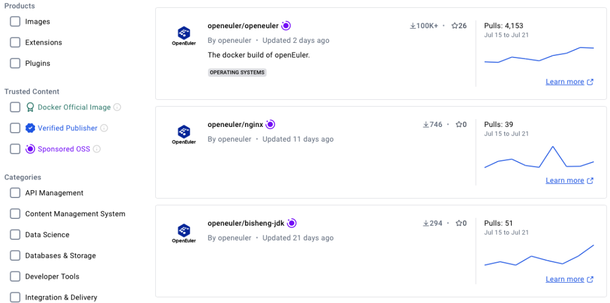

OpenAtom openEuler(简称\"openEuler\") 容器镜像正式获得Docker
Hub开源软件(OSS)认证：https://hub.docker.com/r/openeuler/openeuler这意味着
openEuler 镜像经过了 Docker Hub
的严格审核，被确认为开源、安全、可靠。获得认证后，openEuler
镜像仓库会显示OSS徽标，且镜像下载速率不再受限。\
openEuler 社区将持续更新基础容器镜像和应用容器镜像至 Docker
Hub，以便开发者下载使用。

 此外，openEuler 24.03 LTS全场景镜像已经在AWS、Azure、阿里云、微软商店、Linux Container、OrbStack等平台同步上线。不论在Windows，Mac还是Linux平台上，开发者都可以一键体验最新的openEuler
24.03 LTS版本。

 欢迎访问 Get openEuler OS 查看详情：

https://www.openeuler.org/zh/download/get-os/

Docker Hub上的OSS (Open Source Software)
镜像是指由开源软件项目（open-source
projects）维护和发布的Docker镜像。OSS镜像作为Docker
Hub官方认证可信的三类镜像之一（其他两个分别是"Docker Official
Image"和"Verified
Publisher"镜像），具备更高的曝光度和信任度，详细说明如下：

1\. 可设置仓库logo

2\. 镜像上标注OSS徽章

3\. 提供了数据统计和分析功能

4\. 可使用Docker Scout

5\. 取消对开发者下载镜像的速率限制
