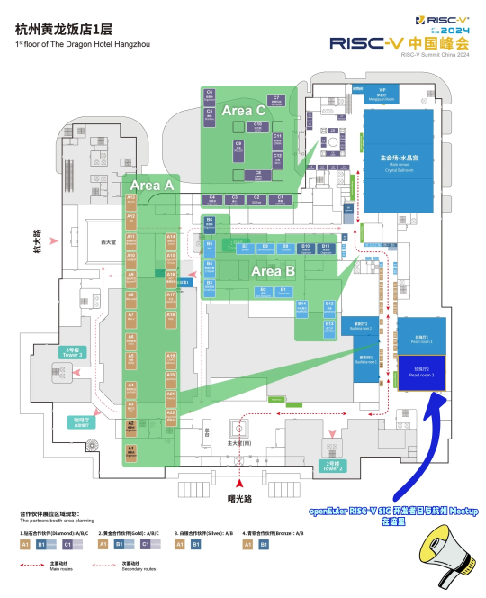

第四届RISC-V 中国峰会将于8月19-25日在杭州举办， OpenAtom
openEuler（简称\"openEuler\"）社区与中国科学院软件研究所将于RISC-V
中国峰会期间联合开展 **openEuler RISC-V SIG 开发者日活动与杭州
Meetup**，共同探讨openEuler RISC-V 架构最新进展、RISC-V
技术未来趋势等内容，欢迎感兴趣的用户和开发者参加。**RISC-V SIG
开发者日与杭州 Meetup **

**活动信息**

**时间**2024年8月23日 9:00-12:00

**地点**浙江杭州黄龙饭店珍珠厅2

**活动议程**

**路线指引**

openEuler RISC-V SIG
开发者日与杭州Meetup将于杭州黄龙饭店珍珠厅2举办，欢迎各位朋友与openEuler一起探讨RISC-V最新技术！

