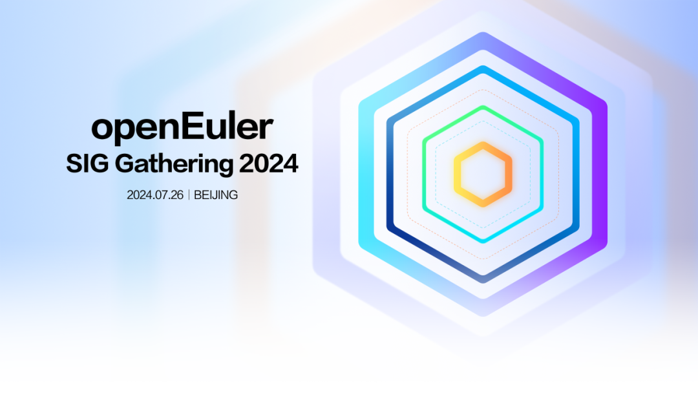
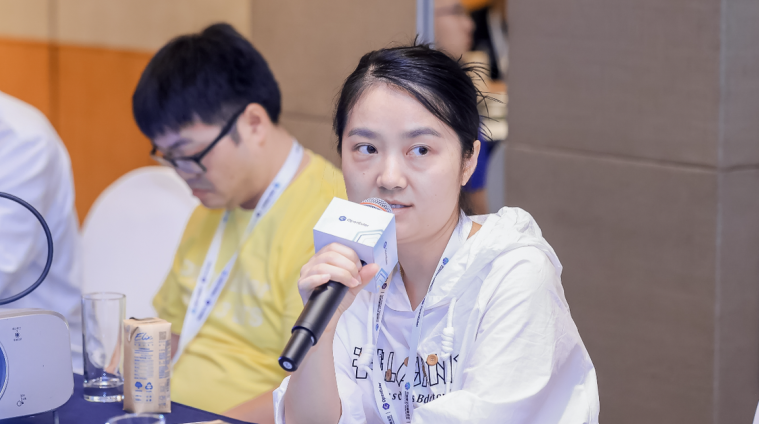
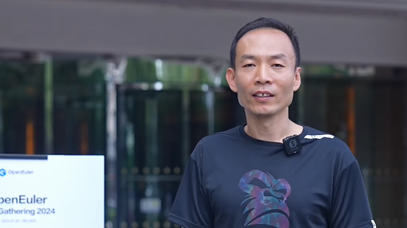
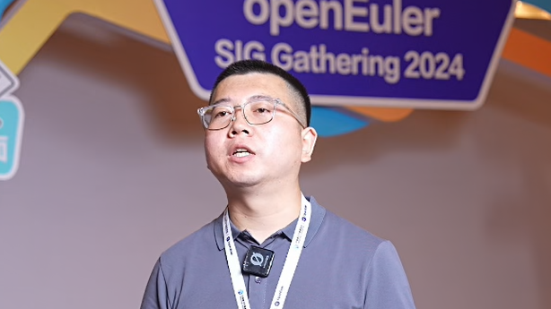
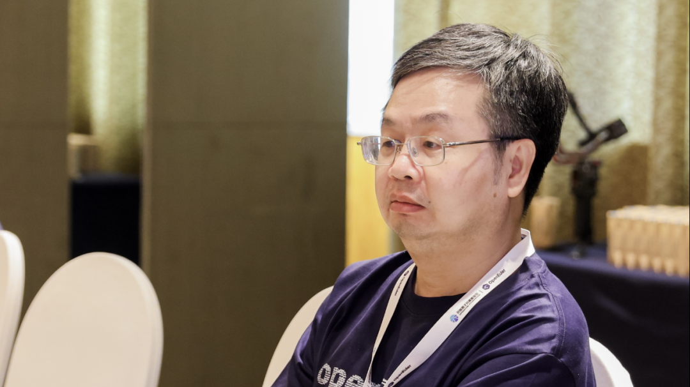
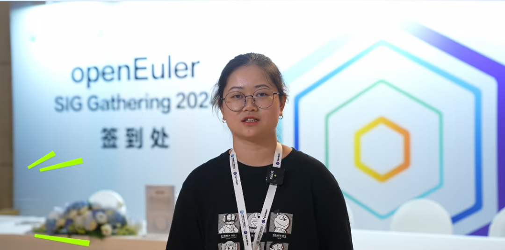
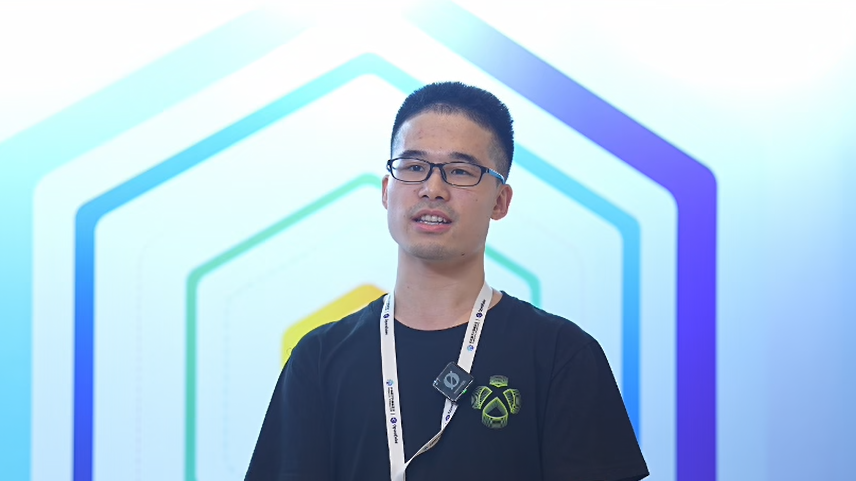

在当前科技飞速发展的背景下，OpenAtom
openEuler（简称\"openEuler\"）作为迅速崛起的开源操作系统社区，不仅承担着推进技术创新与突破的重任，更孕育了"共建、共治、共享"的社区文化，鼓舞着社区成员们不断探索，追求技术的无限可能。

近日，openEuler SIG Gathering
2024在北京圆满举行，这场年度盛事再次让openEuler成为焦点。此次大会全面回顾了openEuler的技术成果，同时也是对社区成员团结协作、勇于创新精神的一次生动展现和深刻实践。让我们深入openEuler社区，一同倾听开发者们与openEuler共成长的精彩故事。

**技术绿洲**

**技术发展的无限活力**

技术专家作为创新的核心动力，持续探索前沿技术与新领域，为社区带来了持续的创新活力。他们引领社区捕捉技术脉动，规划发展战略，共同促进openEuler生态系统的繁荣兴盛。

**openEuler社区Infra SIG Maintainer  钟君**

钟君在openEuler社区担任基础设施服务开发的角色，积极参与了社区多项基础设施的升级与优化任务，成功引入了先进的云计算技术和自动化工具，显著提高了系统的可扩展性和容错能力。此外，钟君还促进了社区内部的资源共享与协作，加强了不同SIG组之间的有效合作。

钟君认为，openEuler不仅是一个技术平台，更是一个生机勃勃的创新生态系统。在这个平台上，每位成员都能自由地发表见解、分享成果，共同拓展技术的边界。这种开放和包容的环境激发了她对技术无尽的热情和探索精神。

**天翼云操作系统研发专家 王麟**

作为CloudNative SIG和eBPF
SIG的Maintainer，王麟对此也有着同样的感受。他深知云原生技术和eBPF对于现代软件开发的重要性，因此一直致力于推动相关技术在openEuler社区中的应用与发展。

openEuler社区的技术氛围融洽，也让王麟感到十分温馨。他如今也效仿曾经指导自己的资深成员，为社区的其他成员提供帮助和支持。同时，openEuler社区在技术创新方面展现出较强的原创性，不仅诞生了众多高质量的自主研发项目，而且对这些项目持开放和激励的态度，进一步促进了社区的繁荣发展。

**麒麟信安系统工程师 何仁贵**

来自麒麟信安的资深技术专家何仁贵深知在硬件多样化的大背景下，操作系统必须具备出色的跨平台兼容性。因此，他积极投身于openEuler的多架构支持方面的研发工作，为社区成功引入了对Loongarch、RISC-V等新兴架构的全面支持。得益于openEuler的跨平台能力，麒麟信安的服务器操作系统得以同时支持x86/Arm/Loongarch/SW64等多种架构，使用户能够在不同的硬件平台上获得一致的使用体验。

何仁贵热衷于促进openEuler在自主创新领域的持续发展。他对openEuler社区的未来持有坚定信心，并积极参与多个创新项目的研发工作。他深信，在openEuler社区所有成员的共同努力下，openEuler必将在全球开源生态系统中占据更加重要的位置，并为推动中国开源事业的繁荣发展贡献更加深远的影响。

**大咖领航**

**绘制openEuler破浪之路**

**麒麟软件有限公司资深专家 陈棋德**

作为社区中的佼佼者，陈棋德坚信，只有不断突破技术瓶颈，才能在激烈的竞争中立于不败之地。他鼓励社区成员积极参与上游社区的开发，推动上游社区原生支持openEuler，力求让openEuler的技术成果得到更广泛地认可与应用。他强调，操作系统产业的生态建设离不开规模的积累，openEuler系操作系统在国内已经形成了局部的生态。

正如陈棋德所说，openEuler成立之初就坚持根社区技术路线自建生态，选择了一条难而正确的路线。openEuler社区要建立自己的生态必须依靠技术创新，唯有依靠持续的技术创新，方能开辟出属于自己的天地。这不仅是对openEuler社区的期许，也是对所有致力于开源事业的开发者的共勉。

**携手共创**

**openEuler社区的美好未来**

在openEuler社区这片沃土上，每一位开发者都是独一无二的风景线。他们通过个人努力与团队协作，攻克技术难题，同时推动创新，为社区带来活力。

**OpenStack  SIG Committer、统信软件云计算研发工程师 王静**

对于王静而言，openEuler社区不仅是技术孵化器，更是发行版平台。她最初在工作中接触到openEuler，并选择加入openEuler
OpenStack SIG组。在openEuler 24.03 LTS版本开发过程中，她参与了OpenStack
Wallaby/Antelope两个版本的选型、开发、测试、文档编写等工作。openEuler
24.03
LTS在基础设施等关键领域实现了全面优化，而基于这一版本技术路线的统信UOS服务器版V25也将进一步增强稳定性、安全性和兼容性，以提升用户体验。王静认为，统信软件既为openEuler社区贡献力量，又从中获得收益，形成了健康可持续的双向互动。

**中国科学院软件研究所工程师 刘鑫**

在openEuler RISC-V
SIG组中，刘鑫不仅是社区发展的见证者，也是积极的参与者。他最引以为豪的成就，便是成功主导并发布了openEuler
RISC-V的23.03版本，这是openEuler社区首个RISC-V版本，展现了openEuler在多样化硬件平台上的适应能力与创新精神。刘鑫深切体会到，社区的协作文化不仅助力了个人技术的飞速提升，也促进了来自不同背景的开发者之间的交流与融合。

随着openEuler SIG Gathering
2024活动的成功举行，我们再次感受到了社区成员们的活力与激情。在过去的一年中，openEuler社区在技术革新和生态构建方面取得了重大成果。让我们携手同行，为打造更加繁荣的openEuler社区开源生态共同努力！
