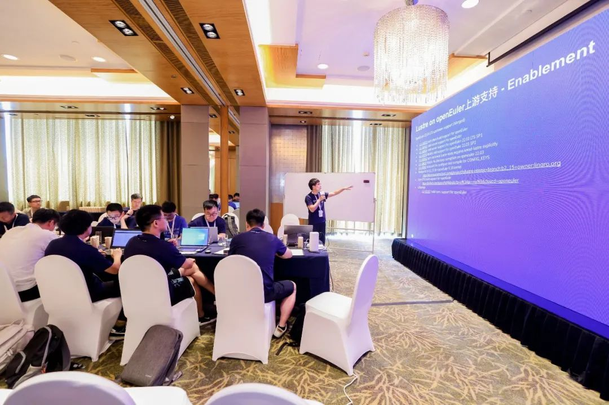

OpenAtom openEuler（简称\"openEuler\"） SIG Gathering
于2024年7月26日在北京胜利举行，大约有300多名开发者参加了会议，共同探讨了
openEuler社区下阶段的规划，主题分为6个分论坛：多样性算力、AI原生支持、全场景应用、openEuler原生开发、上游原生支持和用户体验研究。在本文中，我们将回顾这次会议的一些亮点。

在多样性计算能力分论坛中，针对硬件的验证规则、openEuler的Kernel
CI增强展开了高效的讨论 ；此外，在上游原生支持分论坛中，与Apache
Bigtop和Lustre的上游合作与支持也是讨论的焦点。其中Linaro分享了在openEuler合作中的3个议题，并积极参与了讨论。

图1: openEuler SIG Gathering开幕仪式

作为openEuler Arm SIG的维护者，Linaro的数据中心工作组的tech lead Kevin
Zhao担任了多样性计算能力分论坛的出品人，领导了多个SIG之间的讨论，包括Kernel
SIG、Intel-Arch SIG、Arm SIG、RISC-V
SIG等，探讨了如何增强openEuler对各种主流架构最新平台的支持。讨论提出了多样性计算能力认证的概念，分享了一些性能优化和用户场景，并讨论了对Arm保密计算（Arm
CCA）技术用户场景的展望。作为Arm V9的最新特性，Arm
CCA在讨论中得到大量关注，并且几家芯片厂也分享了产品对CCA以及端到端的安全增强功能解决方案的兴趣。

图2:Kevin正在分享多向性算力论坛的总结报告

来自Linaro/海思Landing team的Tech
lead徐国栋和Linaro数据中心工作组的专家刘新良参加了"上游原生支持"的论坛。该论坛主要关注于Linux内核、编译器、大数据组件、存储等上游社区对openEuler关键特性的支持。国栋分享大数据SIG的工作成果，实现了Apache
Bigtop 3.3.0对openEuler的原生支持 ，大数据 SIG 还孵化了Bigtop-manager
，成为Apache Bigtop 内部的子项目。接下来，他们将继续推动openEuler 24.03
LTS对Bigtop的支持，针对Arm
Aarch64生态系统的大数据组件进行各个方面的优化。

图3: 国栋在分享openEuler 大数据SIG的工作成果

新良分享了Lustre对openEuler的启用及版本状态。他还分享了Lustre Arm64
CI的建立以及openEUler 24.03 LTS的下一阶段发布计划。openEuler 22.03 LTS
上的 Lustre 已跟随发布周期发布，并且也致力于将 Lustre 移植到 openEuler
20.03 LTS，作为 HPC 环境相对保守的演进策略。

图4:新良在分享Lustre支持openEuler上所做的工作

**openEuler和Linaro的合作**

OpenAtom
openEuler（简称openEuler）是由OpenAtom基金会孵化和运营的开源项目。作为操作系统根社区，openEuler目前已在
2023 年占据中国约
36.8% 的市场份额，并且在全球范围内快速增长。Linaro于2021年签署CLA加入OpenAtom
openEuler社区，双方在Arm服务器的多个关键技术领域进行了深度合作，如标准化、数据存储、大数据、Arm机密计算、用户空间加速器（UADK）等方面取得了不小的成就。Linaro的国际影响力为openEuler社区带来了更广阔的视野和更深层次的国际合作机会，加速了openEuler的国际化进程。

**结论：**

openEuler SIG
Gathering在openEuler社区中激发了富有成效的讨开发讨论。已经提出了一些具体的想法，旨在指导下半年的上游开发工作。如需了解
Linaro 和 openEuler 合作的更多信息，请查看以下链接：

1\. OpenEuler Arm-SIG Biweekly：\
https://etherpad.openeuler.org/p/sig-Arm-meetings

2\. Apache Bigtop 3.3.0 Release Official support openEuler：\
https://cwiki.apache.org/confluence/display/BIGTOP/Bigtop+3.3.0+Release

3.Enhance Software Define Storage Project(Includes all Lustre
collaboration)：https://linaro.atlassian.net/wiki/spaces/STOR/pages/24132551124/Enhance+Software-Defined-Storage+on+Arm+Servers
