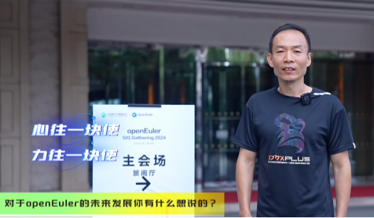

7月26日，以"我参与，我做主"为主题的OpenAtom
openEuler（简称\"openEuler\"） SIG Gathering
2024大会在北京举办。大会围绕openEuler技术竞争力、生态竞争力和用户体验，分为多样性算力、全场景应用、AI原生支持、上游原生支持、openEuler原生开发、以及户体验研究等六个专题方向进行研讨，确定了下阶段openEuler社区的版开发计划和关键技术方案。

本次活动，天翼云委派代表深度参与openEuler原生开发、全场景应用等专题的研讨，展示了近期的工作成果与进展，共同推动社区繁荣。

在openEuler原生开发方向，天翼云操作系统研发专家、openEuler CloudNative
SIG Maintainer 王麟 介绍了原创开发的精准漏洞评估工具 ct-oval
。该工具能够方便、快速、免费、低依赖、低消耗、100%准确的扫描并输出某个天翼云CTyunos系统漏洞升级情况。未来，该工具将兼容openEuler系统，具有较高的开源价值。同时，天翼云也在会上介绍了在社区summer
of code活动中 k8s-install 项目的最新研发进展情况。

在全场景应用方向，天翼云积极参与了KubeOS，NestOS,
Kubemat等项目的相关讨论，为未来落地实践作了铺垫。

**嘉宾交流**

王麟老师作为社区主力贡献者之一，我们有幸能与其进行一次交流。期间，他也分享了一些对社区的看法和经验，希望能帮到小伙伴们更好地融入社区。以下为采访嘉宾的问题。

**\# 嘉宾介绍**

**王麟**天翼云操作系统研发专家，CloudNative
SIG 和 eBPF
SIG的Maintainer，负责轮值主持SIG例会、PR审批、参与SIG组的运作，协助社区活动组织工作等。

Q：您认为openEuler社区在技术发展上有哪些独到之处？

王麟老师：原创度是比较高的。开始时是有很多高水平的华为自研项目，后来对待其它企业的自研项目也是非常包容和鼓励的。因此在自研内容这块，openEuler社区是非常活跃的。

Q：您在面对技术难题时，通常如何寻求社区的帮助和资源？

王麟老师：通常是在SIG组的微信群发信息，或是发Issue、邮件列表等。有时等不及也会直接摇人。

Q：您在参与openEuler社区的技术研发过程中，有哪些特别的收获或感悟？

王麟老师：无论你觉得某个技术点有多偏，或者在你的企业中你可能是唯一了解这块的人，但在社区中总能找到在这个技术点上和你认知基本对齐、志同道合的小伙伴。

Q：您如何看待openEuler社区对于新技术、新方向的探索与尝试？

王麟老师：社区对待新技术是比较欢迎且积极的，有新的技术都会去关注探索。我认为这是比较好的，即使后来发现路行不通或效果不好，但至少我们尝试了。

Q：您觉得openEuler社区的技术氛围如何？它如何促进您的个人成长？

王麟老师：技术氛围很好，很融洽。有问题（大家）基本都很乐意帮忙。对新加入社区的朋友也很友好，大家会帮助引导他们融入社区，也愿意给新人机会去展示。

Q：在您看来，openEuler社区在解决技术难题方面有哪些独特的机制或方法？

王麟老师：相比其他社区，openEuler这块是比较直接、快速，能够落地的。不管是哪个领域的开发者，都能为共同目标前进，朝共同的方向努力，这也使得一些技术能够实实在在地落地，而不是停留在说的层面。

Q：您认为openEuler社区的技术发展方向与当前行业趋势有哪些契合点？

王麟老师：openEuler是从操作系统入手，但远不满足于操作系统范畴了。当前AI很火爆，可以预见未来的十年是各行各业的AI+时代，而openEuler已经在着手布局了。
