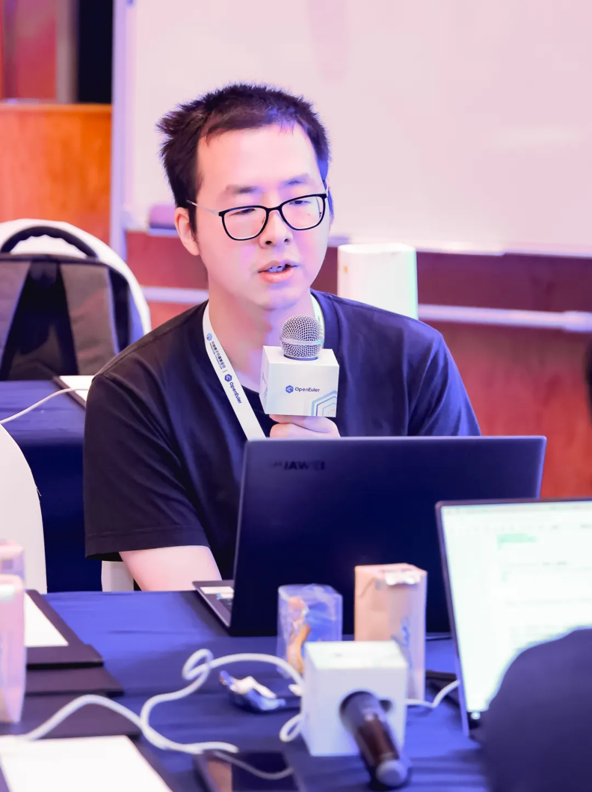

7月26日，openEuler SIG Gathering
2024在北京香格里拉饭店成功举办。本次活动以"我参与，我做主"为主题，来自108个SIG组的近300名开发者聚焦OpenAtom
openEuler（简称\"openEuler\"）社区后续重要规划和各SIG
2024年下半年重要技术方案以及开发计划进行了深入的探讨。

openEuler Compiler SIG
深度参与本次线下交流会议，共发表4个议题演讲，汇报最新进展及后续规划。

**LLVM平行宇宙计划---LLVM与openEuelr协同进展与展望**
--

赵川峰

openEuler TC 委员

LLVM是采用模块化解耦架构、统一IR表示的编译器项目，近年来，获得各大互联网和芯片厂商大力支持，新架构支持友好，技术创新涌现，并拥有一个活跃的开发者社区，业界多个OS已经或正在尝试采用LLVM默认构建。当前，社区也提出了openEuler拥抱LLVM技术的oEEP（openEuler演进计划），探索LLVM如何更好地与openEuler协同，并在24.03
LTS版本上获得多个突破。嵌入式场景，Compiler
SIG协同嵌入式SIG发布了LLVM构建的24.03 LTS
Embedded正式版本，支持Aarch64和Qemu平台，在镜像体积、程序安全有更多的潜在收益。RISC-V服务器场景，协同RISC-V
SIG发布了LLVM构建的preview版本。另外在云场景，LLVM通过全栈全链路优化可以提升典型数据库性能20%+，社区也在持续进行进一步优化。后续，Compiler
SIG将加强LLVM编译器的维护和增强，并协同相关SIG持续发布openEuler版本。

**openEuler默认使能LTO探索与实践**
--

王淳洋

Compiler SIG Contributor

LTO（Link Time
Optimization）全称链接时优化。与传统编译流程由独立编译单元直接生成包含汇编代码的对象文件不同，LTO在生成对象文件时，会保留中间表达信息，允许链接器在链接时调用插件执行跨编译单元的优化，以获取更多的优化机会，生成具有更优性能与更小的体积的二进制文件。海外友商已经将
LTO
广泛应用于版本应用的构建。openEuler社区也正在尝试将LTO应用于版本构建中，目前已成功对1000+软件包默认使能LTO构建，削减相关可执行文件与动态库的整体体积9%+，并在场景化测试中获得了一定的性能收益。未来，社区会持续推进解决LTO使能过程中遇到的编译构建问题，源码适配以及测试套补全等问题，逐步扩大LTO使能范围，将LTO打造为openEuler基础优化能力。

**AI for Compiler：GCC基于BOLT采样的基本块精度修正模型**
--

刘飞扬

Compiler SIG Committer

AI for Compiler
技术是一种新型的编译优化技术，编译器可以通过用ML（机器学习）策略替换复杂的启发式算法或者用ML模型进行编译调优，来拓展编译器优化中的更多机会，提高编译优化算法的泛化性，并改善维护时的调优效率。目前，学术界和业界都在AI
for Compiler技术上有过积极探索。Compiler SIG近期在社区引入AI for
Compiler技术的开发和构建，部分优化已显示出在运行时间、吞吐量等性能目标提升，同时优化具备一定的泛化性：例如，GCC基于BOLT采样的基本块精度修正模型，通过预测BOLT
CFG基本块计数的插桩值，来弥补当前BOLT采样模式上的部分精度缺失问题。未来，Compiler
SIG希望打通GCC编译器和LLVM编译器的技术壁垒，共建共享AI for
Compiler的技术底座。

**AI for Compiler：MLGO和LLM Compiler的介绍及使用**
--

谢志恒

Compiler SIG Maintainer

本议题主要介绍了谷歌的MLGO技术和Meta的LLM
Compiler技术的使用方法和落地效果，以及存在的问题。目前AI for
Compiler领域在code
size和性能优化上都取得了不错的学术进展，相比性能优化，code
size优化由于其结果更稳定、受环境影响更小，因此更容易进行落地使用，且通用性更好，MLGO框架在openEuler
Embedded LLVM嵌入式版本上初步获得了4%以上的code size收益。而LLM
Compiler作为首次大语言模型和编译优化结合的尝试，打破了传统编译器的形态，尽管它在正确率、输入限制以及编译耗时上还不够完善，我们仍期待这项技术在后续的学术发展中能够取得进一步的成果。

Compiler SIG 专注于编译器领域技术交流探讨和分享，包括 GCC/LLVM/OpenJDK
以及其他的程序优化技术，聚集编译技术领域的学者、专家、学术等同行，共同推进编译相关技术的发展。

