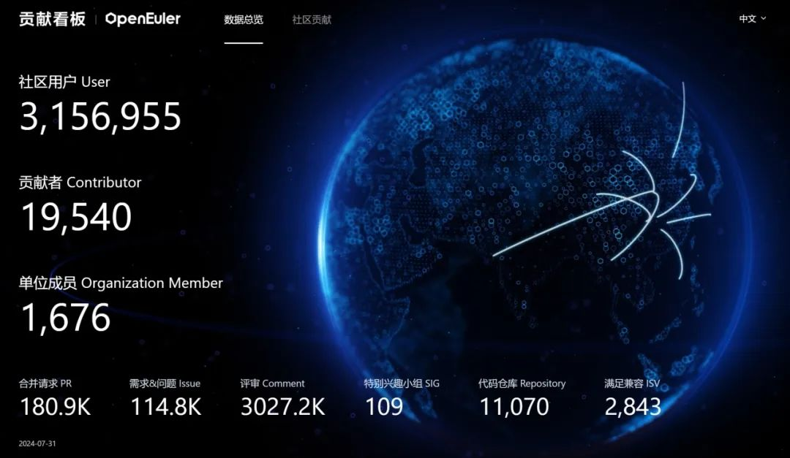
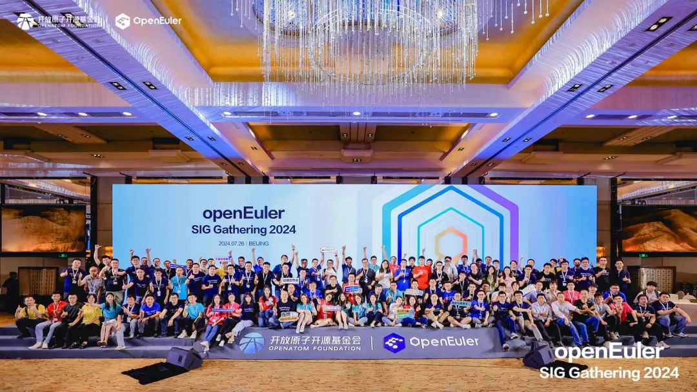
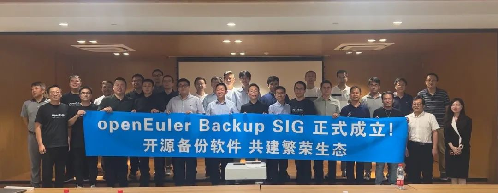
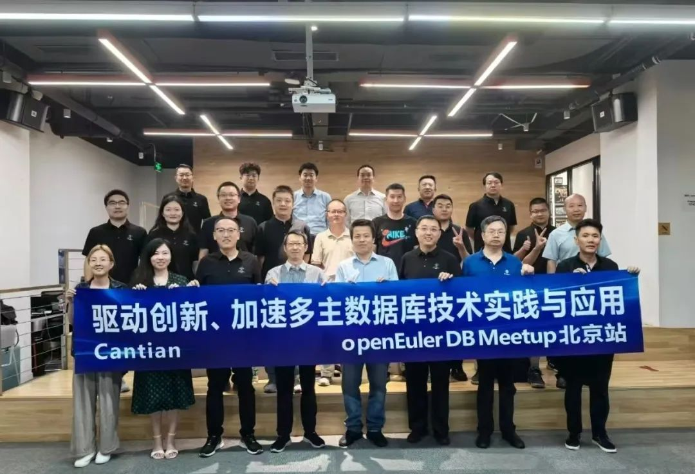
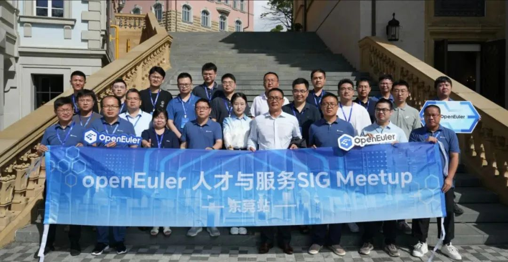
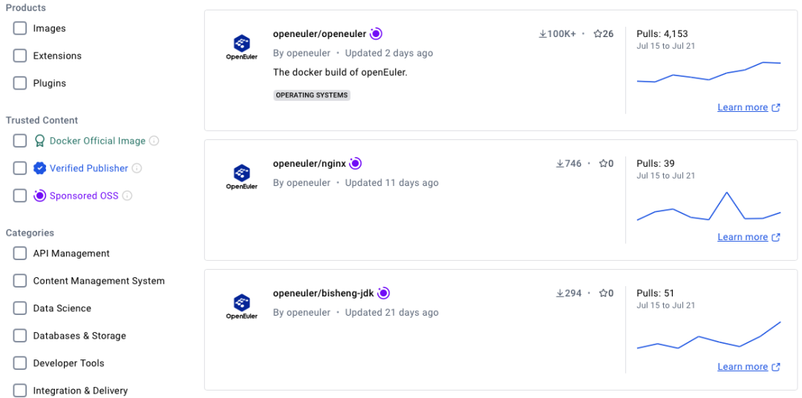
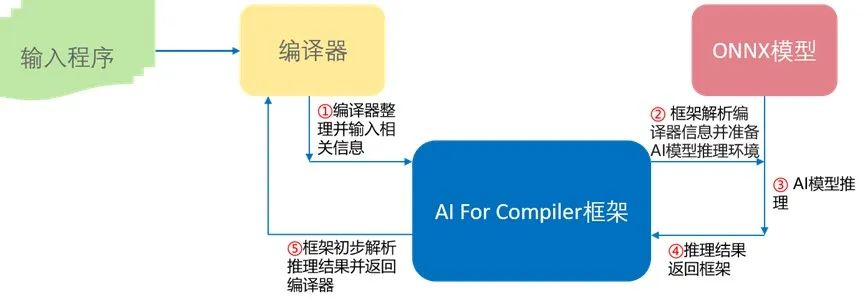
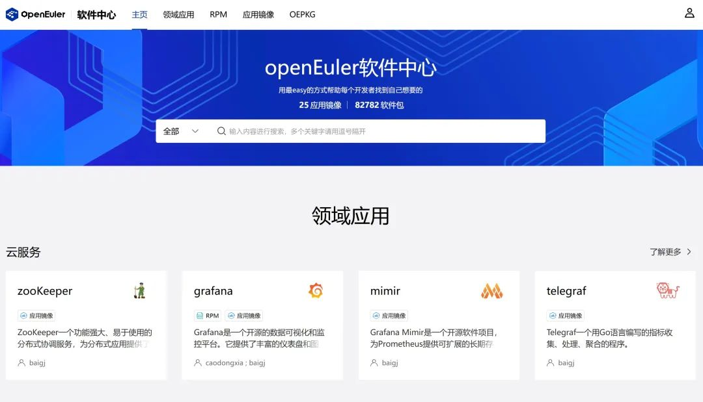
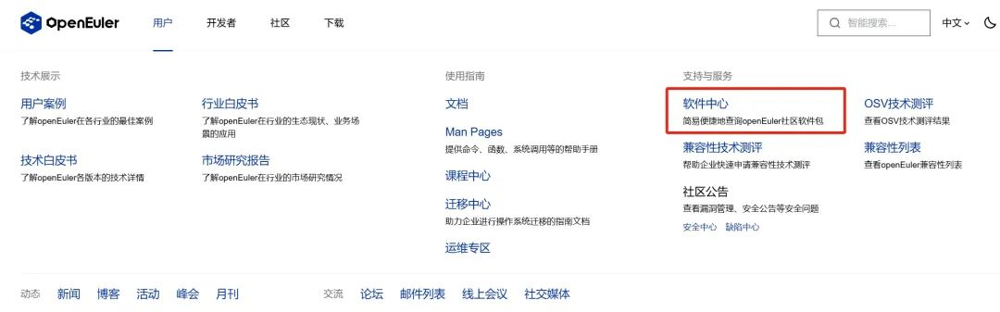

**概述**
--

7月26日，OpenAtom openEuler(简称\"openEuler\") SIG Gathering
2024（即openEuler社区SIG工作会议）在北京举办。来自108个SIG的主力贡献者齐聚现场，围绕openEuler技术竞争力、生态竞争力和用户体验，分为多样性算力、全场景应用、AI原生支持、上游原生支持、openEuler原生开发、以及户体验研究等六个专题方向进行深度研讨，确定了下阶段openEuler社区的版开发计划和关键技术方案。

本月，openEuler容器镜像正式获得Docker
Hub开源软件(OSS)认证。获得认证后，openEuler镜像仓库会显示OSS徽标，且镜像下载速率不再受限。同时，openEuler
24.03 LTS全场景镜像已经在AWS、Azure、阿里云、微软商店、Linux
Container、OrbStack等平台同步上线。不论在Windows、Mac还是Linux平台上，开发者都可以一键体验openEuler
24.03 LTS版本。

在技术发展方面，Compiler SIG完成GCC和LLVM多版本方案，进入实施阶段。ROS
SIG
持续推进ROS软件包及第三方软件包的移植适配工作。高性能存储项目fastblock、加速库UADK、虚拟机监控器Rust-Shyper、NestOS、iSulad等项目均迎来新的进展。面向云原生领域的项目KubeMate、AI
for Compiler
框架（AI4Compile）、GCC-14副版本编译工具链等新项目相继在社区完成建仓并投入运作。

在安全方面，openEuler已开始支持对通用安全通告框架（CSAF）规范的安全公告披露。为提升系统的安全性，openEuler建立以
PKI （Public Key
Infrastructure，公钥基础设施）为基础的软件发布签名体系，对软件构建、发布、安装、运行等各环节进行有效防护。

在其他方面，OceanBase成功适配openEuler，Apache
Bigtop也正式宣告了对openEuler的原生支持。

本月，经技术委员会委员审定，IDE SIG在社区成立，该SIG组为openEuler
生态系统量身打造，旨在为开发者提供一套更为高效、优质的工具链解决方案，加速业务开发迭代进程，推动嵌入式行业更广泛的技术应用与创新，进而增强嵌入式软件在全球市场的竞争力。欢迎感兴趣的开发者关注。

在社区活动上，DB、BigData、Embedded、Backup、Talent-and-Service等SIG组开发者相继举办Meetup活动。北航openEuler技术小组在本月成立。

为方便广大开发者使用，openEuler上线软件中心。该平台不仅支持开发者快速查询、下载使用所需要的软件；还提供一系列软件工具和解决方案，提供对openEuler社区版各个版本的状态查询和使用方式，方便开发者根据自己的使用场景选择openEuler软件包。欢迎访问体验：https://easysoftware.openeuler.org/

感谢大家的支持。

本月报阅读时长预计25分钟，欢迎细品。

**社区规模**
--

截至2024年7月31日，openEuler
社区用户累计超过315万。超过1.9万名开发者在社区持续贡献。社区累计产生
180.9K个PRs、114.8K条Issues。目前，加入openEuler
社区的单位成员1676家，本月新增46家。

社区贡献看板（截至2024/07/31）

**社区事件**
--

**openEuler SIG Gathering在北京举办**

7月26日，openEuler SIG Gathering
2024（即openEuler社区SIG工作会议）在北京举办。来自108个SIG的主力贡献者齐聚现场，围绕openEuler技术竞争力、生态竞争力和用户体验，分为多样性算力、全场景应用、AI原生支持、上游原生支持、openEuler原生开发、以及户体验研究等六个专题方向进行深度研讨，确定了下阶段openEuler社区的版开发计划和关键技术方案。

**openEuler Backup Meetup 在北京举办**

7月22日下午，由openEuler Backup
SIG、华为数据存储产品线、北京中关村创业大街联合主办的openEuler首场开源备份Meetup在北京举办。活动吸引了数据库、虚拟化、备份等多领域的40+生态伙伴及意向使用客户参会，围绕备份软件生态和架构创新进行分享。

openEuler Backup
SIG是openEuler社区针对备份领域在今年成立的开源技术兴趣小组，联合用户、开发者和伙伴共同组建，致力于构筑开放的备份软件生态，促进备份领域的技术发展和创新，解决备份应用兼容性等难题。

**openEuler DB Meetup 在北京举办**

7月19日下午，openEuler DB
Meetup 在北京举办。来自华为、泽拓科技、云和恩墨、北京海量数据、北京科蓝软件、优炫软件、openEuler社区等20余位数据库领域的专家和开发者在会上交流，共同探讨多主数据库技术的创新进展及其在行业中的应用前景。

**openEuler Talent-and-Service Meetup 在东莞举办**

7月18日，openEuler Talent-and-Service
Meetup 在东莞举办。20余位社区技术专家就windows迁移、智能运维、大模型应用等方面展开探讨，推动社区生态与人才的发展。

**openEuler Embedded Meetup 在北京举办**

7月10日，openEuler Embedded
Meetup 在北京举办。北京航空航天大学计算机学院、华郅（北京）技术有限公司、易百纳技术社区与openEuler社区等多位技术专家参与本次活动，分享嵌入式领域的创新和实践经验。同时，北航openEuler技术小组在本次会上成立。

**openEuler BigData Meetup 线上举办**

7月5日，由 openEuler BigData SIG 发起的大数据 Meetup活动在线上举办。此次
Meetup 汇聚了大数据领域的技术专家和行业先锋，分享了4个大数据议题：\
  （1）Empower BigData on Arm64\
  （2）UADK加速大数据：鲲鹏服务器的关键应用场景\
  （3）Bigtop Manager：面向云原生的大数据集群管理平台\
  （4）一种高效的Spark SQL Native引擎实现方案

感兴趣的小伙伴可以访问以下链接，回看本次活动：

https://mp.weixin.qq.com/s/JhE-Je5XRbQxZTLbcYzvDQ

**社区治理**
--

**openEuler 技术委员会7月会议摘要**

在7月的例会上，经 openEuler 技术委员会委员们审定，同意IDE
SIG在社区成立。该SIG组由华为技术有限公司、粤港澳大湾区国家技术创新中心和蚂蚁科技集团股份有限公司发起，联合江苏润和软件股份有限公司、深圳开鸿数字产业发展有限公司、深圳行云创新科技有限公司等国内多家领先科技企业共同设立。

随着智能制造的快速发展和 openEuler
的影响力不断扩大，嵌入式系统开发需要一个易用、好用的IDE（集成开发环境，Integrated
Development Environment）来支撑快速便捷的开发工作。IDE SIG为openEuler
生态系统量身打造，旨在为开发者提供一套更为高效、优质的工具链解决方案，加速业务开发迭代进程，推动嵌入式行业更广泛的技术应用与创新，进而增强嵌入式软件在全球市场的竞争力。欢迎感兴趣的开发者关注。

IDE SIG：https://www.openeuler.org/zh/sig/sig-detail/?name=sig-IDE

**技术进展**

**openEuler容器镜像正式获得Docker Hub开源软件(OSS)认证**

本月，openEuler容器镜像正式获得Docker Hub开源软件(OSS)认证：

https://hub.docker.com/r/openeuler/openeuler

这意味着openEuler镜像经过了Docker
Hub的严格审核，被确认为开源、安全、可靠。获得认证后，openEuler镜像仓库会显示OSS徽标，且镜像下载速率不再受限。

openEuler社区将持续更新基础容器镜像和应用容器镜像至Docker
Hub，以便开发者下载使用。

openEuler 24.03 LTS 全场景镜像已经在阿里云，Azure，Windows App
Store，Linux Container 和
OrbStack等平台上线，不论在Windows，Mac还是Linux平台上，开发者都可以一键体验最新的openEuler
24.03 LTS版本：

**Azure:**

登录https://portal.azure.com，在Community
images中搜索openEuler即可获得可用的版本

**AWS：**

https://aws.amazon.com/marketplace/pp/prodview-rdfglgsng7veo?sr=0-2&ref\_=beagle&applicationId=AWSMPContessa

**阿里云：**

登录阿里云控制台https://www.aliyun.com/，在云服务器ECS的镜像中选择社区镜像，搜索openEuler

**华为云：**https://marketplace.huaweicloud.com/contents/b295de63-8718-4477-961a-46fdffaad701\#productid=OFFI1004941126717046784

**腾讯云：**https://market.cloud.tencent.com/products/40910?keyword=open%20euler

**中科院软件所镜像站：**

访问https://hub.oepkgs.net，搜索openeuler/openeuler

**微软商店：**

https://apps.microsoft.com/store/detail/9PKZ8GN18L5C?cid=DevShareMCLPCS

**DockerHub：**https://hub.docker.com/r/openeuler/openeuler

**Linux Container：**

https://images.linuxcontainers.org/

**OrbStack：**

https://www.openeuler.org/zh/blog/20230530-OrbStack/Orbstack支持openEuler发行版.html

**面向云原生领域的项目KubeMate在社区建仓**

由麒麟软件和华为联合发起孵化的项目 KubeMate，经CN
SIG讨论并通过，目前已完成建仓及初始化工作。

KubeMate 是一个使用 Kubernetes
进行统一操作系统升级和Kubernetes部署及拓展的平台，具有以下特色功能：

1\. 使用 Kubernetes 进行统一的操作系统管理。

2\. 支持多种操作系统升级

3\. 支持 Kubernetes 集群的部署和worker节点拓展

4\. 支持对已有的Kubernetes集群进行复制

5\. 支持多Kubernetes集群的管理工作

**框架特点：**

1.  提供统一的操作接口，方便用户使用 Kubernetes 进行各种操作。

1.  架构设计合理，易于理解和扩展。

1.  与Gitee社区的资源和工具紧密结合，如
kubeos、nestos-kubernetes-deployer等，便于用户获取相关信息和支持。

1.  只需简单的接口对接就可以无缝对接用户已有的运维管理平台

**AI4Compiler 项目在社区建仓**

AI for Compiler 框架（AI4Compiler）为编译器提供在编译优化阶段与预训练 AI
模型交互并推理的能力。在编译器内部的优化pass内，编译器将收集的
IR、硬件等信息传递给 AI for Compiler
框架作为输入。框架在解析并预处理信息后，调用目标预训练 AI
模型执行推理，将模型的推理结果解析并处理后反馈给编译器，用于指导相关编译优化手段的实施。当前，本项目已在
openEuler 建仓，由 Compiler SIG 维护管理。

项目应用场景如下：

• 面向 openEuler 用户：通过开启特定选项，轻松使用 AI
模型指导调优，提升目标程序性能，提高使用体验。

• 面向 openEuler 开发者：编译器与 AI
模型解耦合，使得开发者可以轻松便捷地自主训练模型并使用 AI
模型结果辅助编译器调优。

项目地址：https://gitee.com/openeuler/AI4C

**OceanBase 成功适配 openEuler**

近日，在 openEuler 社区和 OceanBase 社区的共同努力下，OceanBase 4.2.1
LTS 成功适配 openEuler 24.03 LTS，并将 OceanBase 软件包上传至 openEuler
的官方源。这一系列举动为企业在推进数字化转型的过程中提供了更多选择。

**openEuler支持CSAF规范的安全公告披露**

通用安全通告框架（CSAF），是构化信息标准促进组织（OASIS）
发布的官方标准，是一种用于以机器可读格式披露安全建议的标准。CSAF应用场景偏重于提供对漏洞的解决方案，目前有五种类型的配置文件，分别是CSAF
Base、Security incident response、Informational Advisory、Security
Advisory和VEX，适用于不同漏洞披露场景。

openEuler目前已支持对Security
Advisory类型的披露，并计划逐步补齐对历史数据和VEX类型的披露。

CSAF文件下载地址：

https://repo.openeuler.org/security/data/csaf/advisories/

**openEuler 社区签名体系建立**

对开源软件来说，软件组件的安全与完整性保护至关重要。openEuler 通过建立以
PKI （Public Key
Infrastructure，公钥基础设施）为基础的软件发布签名体系，在软件构建阶段，自动为目标文件添加数字签名，并在关键组件中预置公钥证书，从而使用户在安装
openEuler 镜像后，可以直接开启相关的签名校验机制，提升系统安全性。

**iSulad 完成了对 CDI 规范的支持**

随着容器技术的迅速发展，容器引擎已经成为云原生时代的基石。在人工智能和大数据越来越普及的今天，如何让容器能够更快速、更便捷的使用GPU、NPU等设备也成为了社区热门课题之一。openEuler
CloudNative SIG 在 iSulad v2.1.5实现了 Container Device
Interface规范，支持通过CRI接口使用CDI功能，降低了底层运行时和Kubernetes管理面使用设备的复杂度，标准化了容器设备加载功能。

**高性能存储项目fastblock开发进展**

本月，由联通数科发起，SDS
SIG共同维护的面向全闪场景的高性能分布式块存储系统 fastblock
项目迎来重要更新和优化。

fastblock
重点解决数据库场景和中小企业的虚拟化场景对低成本高性能块存储的急缺需求，总结了联通数科在云存储方向多年的开发、运维和运营的经验及教训，在只使用普通NVME介质的情况下，三副本单路单并发时延性能是ceph的5倍以上。该项目代码于去年11月推送至社区。

fastblock开发者团队本月完成了以下更新和优化：

1.  **SPDK版本升级：**将SPDK升级至24.05版本，适配API变更并进行了回归测试，将fastblock
bdev相关的RPC添加到SPDK源码中；

1.  **性能优化：**通过多核优化及多核均匀分配pg,
基本能够跑满磁盘的性能，同等条件下集群4k随机写性能由6月份的17万提高到了42万；

1.  **IO延迟优化：**解决了osd日志添加osd id引起的延迟问题,
优化了RPC数据传输方式并减少了序列化开销;

1.  **问题修复: **新增了UUID合法性验证，优化了osd绑定端口重试机制、内存池API及CPU绑定方式；

1.  **集群稳定性优化：**新增集群fsid字段以避免不同集群的osd加入，解决了osd的monitor客户端因解析monitor信息出现bug造成异常退出造成集群不稳定的问题。

**加速库UADK迎来重要更新**

本月，由 Linaro 和华为团队共同开发，Acclib SIG维护的UADK迎来重要更新。

UADK，全称为用户态硬件加速器开发工具包（User Space Accelerator
Development
Kit），支持共享虚拟地址（SVA）技术，为用户提供高效利用硬件加速器能力的统一编程接口。同时，UADK
提供了一组不断扩展的高性能算法实现，涵盖了加密、压缩等功能。

在最新的openEuler 24.03 LTS版本中，UADK已经能够同时支持硬件加速引擎和
Arm64 SVE 以及 Crypto Extension CPU指令加速。UADK支持的加速算法有：

压缩算法: GZIP，ZLIB，DEFLATE，LZ77\_ZSTD

非对称加解密: RSA，DH，ECC（SM2，ECDSA，ECDH，X25519/X448）

对称加解密: AES，SM4，DES/3DES

摘要算法: SHA-1，SHA-2，SM3，MD5

**虚拟机监控器Rust-Shyper的开发进展**

Rust-Shyper
由北京航空航天大学计算机学院王雷教授团队设计开发的虚拟机监控器（Hypervisor），于去年托管在社区开发运作。该系统基于
Rust 语言，旨在实现一个高可靠、嵌入式的 Hypervisor。近期，Rust-Shyper
迎来了一些新变化：

实现RISC-V架构的CPU虚拟化，在一个物理CPU上运行多个vCPU,
实现了模拟中断控制器PLIC；

支持直通设备和模拟设备，并能通过模拟PLIC向VM注入中断,
实现SBI接口虚拟化，为VM模拟了一套Hypervisor上的SBI环境；

实现设备树裁剪和修改，为VM呈现各自独特的设备视图。

相关链接：

\[1\] 项目地址：https://gitee.com/openeuler/rust\_shyper

\[2\] Rust-Shyper：基于 Rust 语言的高可靠、开源嵌入式 Hypervisor

**混合关键性部署框架MICA，推动多 OS 高效混合部署的实现**

在嵌入式场景中，虽然 Linux
已经得到了广泛应用，但并不能覆盖所有需求，例如高实时、高可靠、高安全的场合。这些场合往往是实时操作系统的用武之地。有些应用场景既需要
Linux
的管理能力、丰富的生态，又需要实时操作系统的高实时、高可靠、高安全。面对上述要求，openEuler
Embedded 提出了多 OS 混合关键性部署框架(MIxed
CriticAlity，MICA)，能够实现多 OS
高效混合部署，各尽其才，各取所需，满足嵌入式系统以功能、实时、功耗为代表的多目标约束。通过
MICA，实现 SoC 上融合部署、管理、协同多个 RTOS 能力。

原文阅读：

MICA：面向复杂嵌入式系统的混合关键性部署框架

**BigData SIG 本月工作进展**

BigData SIG持续构建和完善openEuler社区下的大数据生态。本月，BigData
SIG主要集中在：

**Apache Bigtop正式支持openEuler**

BigData SIG持续构建和完善openEuler社区下的大数据生态。在 BigData SIG 与
Linaro 的携手努力下，Apache Bigtop
于2024年7月8日发布的3.3.0新版本中，正式宣告了对openEuler操作系统的原生支持。

这一里程碑式的进展，标志着openEuler在大数据生态适配方面取得了Bigtop社区的权威认可，进一步夯实了openEuler在大数据领域的生态建设基础。

详见：

https://mp.weixin.qq.com/s/1sJTJ8AakZDkj9CJcrDRoA

 

**技术创新项目的发展**

bigtop-manager是一款现代化的，面向云原生的大数据集群管理平台，提供了一套轻量级的方案高效地管理bigtop所支持的大数据组件。目前，经过 BigData
SIG 持续维护和运作，该项目已作为Bigtop子项目进入Apache Bigtop社区。

仓库地址：https://github.com/apache/bigtop-manager

更多技术创新项目正在规划和上架中，欢迎大家敬请期待。

**Compiler SIG完成GCC和LLVM多版本方案，进入实施阶段**

openEuler Compiler SIG 为编译器技术提供了一个交流和分享的平台，涵盖
GCC、LLVM、OpenJDK 等程序优化技术。本月，Compiler
SIG完成GCC和LLVM多版本方案：

**GCC-14副版本编译工具链在社区建仓**\
在openEuler 24.03 LTS版本周期内，GCC主版本为12.3.1。在Compiler
SIG的推动下，openEuler
24.09版本将引入GCC-14副版本，跟随上游社区最新版本演进，同时使能X86，ARM多样算力新特性，需要建立相关制品仓承载此副版本。作为编译工具链的重要组成部分，我们引入binutils-2.42多版本制品仓配套GCC-14使用。当前，项目已在openEuler社区建仓，由Compiler
SIG维护管理。

**LLVM已完成多版本方案设计，并创建了llvm-latest相关软件包仓。**后续openEuler版本在支持系统默认版本的同时，也支持至少一个新的llvm版本。主要目的是保持默认LLVM版本质量和稳定性同时，引入新版本帮助开发者使用上游社区最新的成果。

**ROS SIG 持续推进ROS软件包及第三方软件包的移植适配工作**

在openEuler 24.03 LTS版本，我们对 ROS1-noetic 和 ROS2-humble
两个版本软件包进行维护和更新，如rosbrige、dynamixel-workbench、orge等包。其中Gazebo包主流ROS仿真软件，移植难度大，社区贡献者正在紧锣密鼓的艰苦攻坚中，期望在
openEuler 22.03 SP4中完成相关工作，提供给广大开发者。

本月，ROS SIG 吸引了数十位实习生小伙伴参与openEuler & ROS
开发工作，帮助其成为开源开发者，丰富社区开发者生态。

欢迎关注ROS
SIG获取更多详细信息，SIG组期待与更多开发者的交流和参与。感兴趣的小伙伴可以访问以下链接，了解更多：

https://etherpad.openeuler.org/p/sig-ROS-meetings

**Embedded SIG 本月工作进展**

随着22.03 LTS SP4发布，openEuler
Embedded做了例行的升级和维护，持续完善并修复在进一步的测试中所发现的问题，包括但不限于：

嵌入式图形功能，初步支持FireFox浏览器和Chromnium浏览器

嵌入式AI相关组件的更新和完善

海鸥派上适配Kubeedge

后续，openEuler Embedded SIG将持续推动完善24.03 LTS的功能。

**openEuler 软件中心上线**

为方便广大开发者的使用，openEuler上线软件中心。开发者可以快速找到、下载使用所需要的软件。点击访问某个软件页面时，开发者可以直观地查看其状态信息、使用方式、应用镜像、维护团队、评分和反馈建议等。

同时，该平台提供一系列软件工具和解决方案，提供对openEuler社区版各个版本的状态查询和使用方式，方便开发者根据自己的使用场景选择openEuler软件包。

欢迎访问体验：

https://easysoftware.openeuler.org/

官网入口：

**软硬件兼容性认证**

2024年7月，兼容性方案 1839 个，北向1214个，南向607个，OS 157个。7月新增
北向88个，南向15个, OS 5个。

社区兼容性列表：

https://www.openeuler.org/zh/compatibility/

**安全公告**

2024年7月，社区共发布安全公告136个，修复漏洞197个（其中 Critical
7个，High 32个，其它158个）。

-   

**重点漏洞提醒**

-   

如下漏洞评估影响较大，请重点关注：

在Linux内核中，修复了以下漏洞:keys:修复了实例化时覆盖密钥过期问题实例化时无条件覆盖密钥过期时间，默认为永久失效。这将导致DNS解析出现问题，因为用户空间设置的过期时间被覆盖为time64\_max，从而禁用进一步的DNS更新。通过恢复key\_set\_expiry仅在预解析器设置特定到期时调用的条件来修复此问题。**（CVE-2024-36031）**

CVSS评分为9.8分

公告链接：

https://www.openeuler.org/zh/security/cve/detail/?cveId=CVE-2024-36031&packageName=kernel

影响范围：

openEuler-22.03-LTS-SP3

openEuler-24.03-LTS

FFmpeg 4.4中的libavformat/ adtsence
.c中的adts\_decode\_extradata不检查init\_get\_bits返回值，这是一个必要的步骤，因为init\_get\_bits的第二个参数可以被精心制作。**（CVE-2021-38171）**

CVSS评分为9.8分

公告链接：

https://www.openeuler.org/zh/security/cve/detail/?cveId=CVE-2021-38171&packageName=ffmpeg

影响范围：

openEuler-20.03-LTS-SP4

openEuler-22.03-LTS-SP1

openEuler-22.03-LTS-SP3

openEuler-22.03-LTS-SP4

**漏洞防护**

openEuler社区针对在维版本例行修复漏洞，发布安全补丁。建议用户关注openEuler官网安全公告，及时安装漏洞补丁进行防护。

openEuler 安全公告：

https://www.openeuler.org/zh/security/security-bulletins/

**感谢每一位朋友、开发者的支持**

因为大家的辛勤贡献，openEuler
的每一天都发生着好的事情。小编限于视野和能力，难免有所遗漏，在此表示歉意。同时，衷心感谢社区朋友、开发者们以及openEuler
SIG组成员的贡献：

\* 以上不分先后顺序

如果您希望在月报中增加您的工作内容，或对内容有任何改进建议，请联系wengqiaozhen@openeuler.sh。
