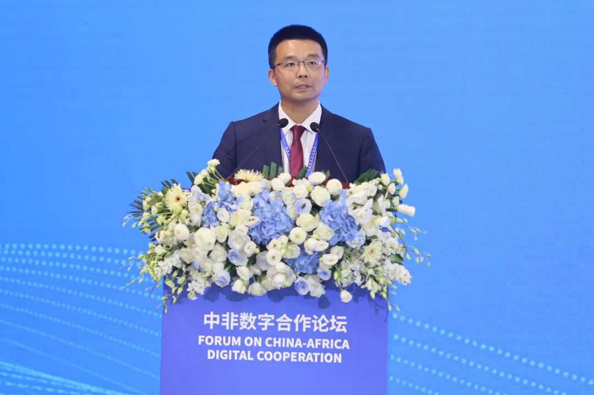
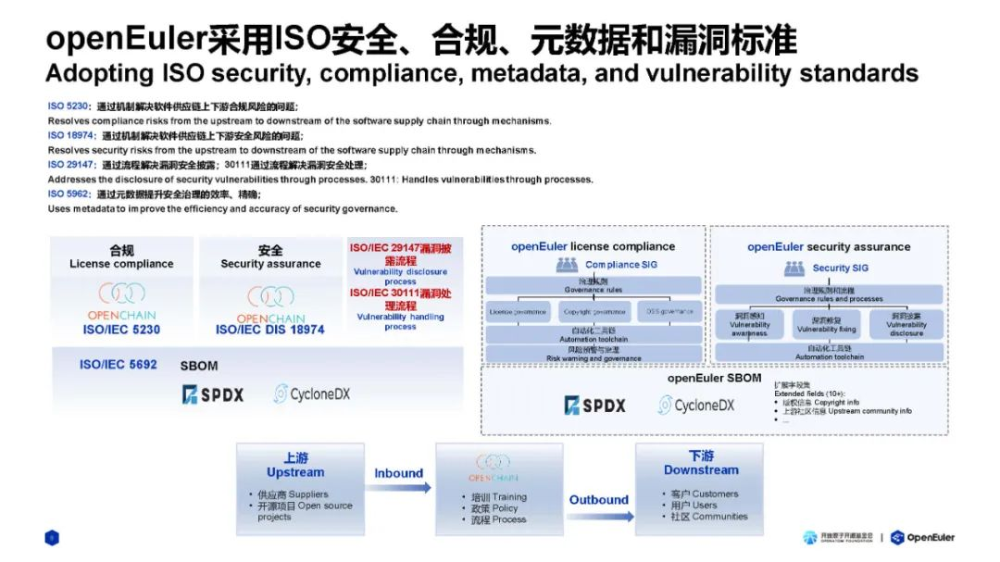

\[中国，北京，2024年7月29日\]
由中国工业和信息化部主办的中非数字合作论坛在北京成功召开，来自几内亚比绍、加蓬、塞拉利昂、索马里、突尼斯等40余个非洲国家的数字部长和驻华大使出席论坛。开放原子开源基金会技术监督委员会副主席，OpenAtom
openEuler（简称\"openEuler\"）委员会执行总监熊伟在论坛上发表演讲，openEuler
社区希望与非洲的企业积极开展数字领域合作，共同构建数智时代领先的基础设施，共建中非数字未来。

开放原子开源基金会技术监督委员会副主席
 
  openEuler 委员会执行总监熊伟

在会上，开放原子开源基金会技术监督委员会副主席熊伟表示，随着移动支付在非洲快速落地和应用，金融数据的安全问题逐步凸显。openEuler
作为开放原子开源基金会孵化的开源操作系统，在安全性、漏洞管理和运维方面都具备完善的解决方案。非洲金融科技公司M-Pesa以openEuler开源操作系统为底座，打造了MPA移动支付钱包，并在肯尼亚等国成功打开市场。这也是中国开源数字基础设施走向非洲的开端。openEuler
作为立足中国，面向世界的开源操作系统。坚持与全球的开发者"共创、共建、共享"社区在多样性计算、全场景创新和AI等方面的创新成果，持续汇聚全球开源开源力量。

社区汇聚了来自全球1600余家企业，19000余名开发者，在全球建立37个镜像站，覆盖153个国家和地区。openEuler
联接全球主流基金会，坚持 Upstream
First，积极参与国际开源社区的技术创新，与
Linux、OpenInfra、Apache、Eclipse、RISC-V等国际主流建立战略合作，在社区开发者的努力下，这些基金会中的部分项目已经完成了对
openEuler的原生支持，openEuler 社区成员在 Linux
内核贡献上持续领先。openEuler 社区在可持续发展上持续投入，最新发布的
openEuler 24.03 LTS
在供应链安全和可信方面又取得了长足的进展。首先，openEuler与OpenChain
深入合作，成为全球首个通过 OpenChain ISO 18974
供应链安全自认证的开源社区，该标准旨在确保开源软件的供应链安全，构建安全可信的开源软件解决方案，openEuler
24.03 LTS
的开发完全遵循该标准，进一步增强了操作系统的安全合规能力。

同时，openEuler
与 Linux 基金会下的 SPDX 项目深入合作，基于 Linux 基金会 SPDX 2.2 SBOM
标准，openEuler 24.03 LTS 发布了 SBOM 清单，是业界首批发布 SBOM
清单的操作系统平台。后续会持续更新，确保供应链的完整性和可追溯性。

openEuler 持续与全球开发者展开技术交流，自
2022年以来，openEuler
持续参与全球开源会议OSSEU、FOSSASIA等，并在大会上发表主题演讲，与全球的开发者和企业探讨在多样性计算、全场景创新和AI领域的技术创新与应用场景，受到了全球开发者和企业的热烈欢迎。目前已有1000余名海外开发者加入
openEuler 社区，为社区贡献代码。2024年9月16-19日，openEuler
社区在开放原子开源基金会的带领下，与社区企业一起，即将亮相OSSEU
2024并发表主题演讲，在会场中设有 openEuler
展区，欢迎来自全球的开发者到时来展区交流，共同探讨
openEuler海外的技术、生态、商业新进展。
