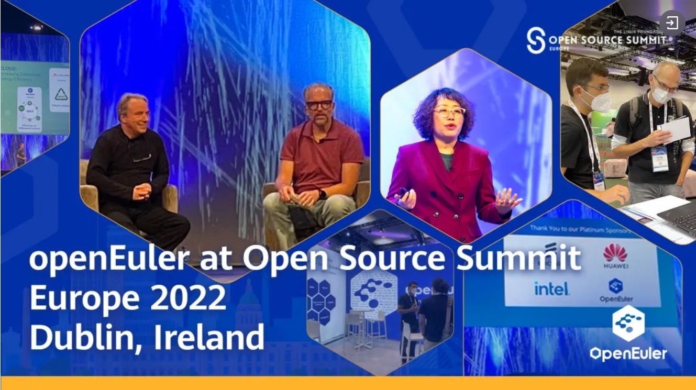
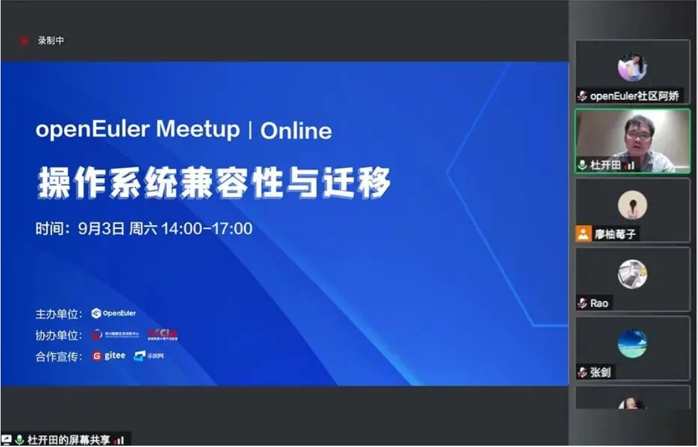
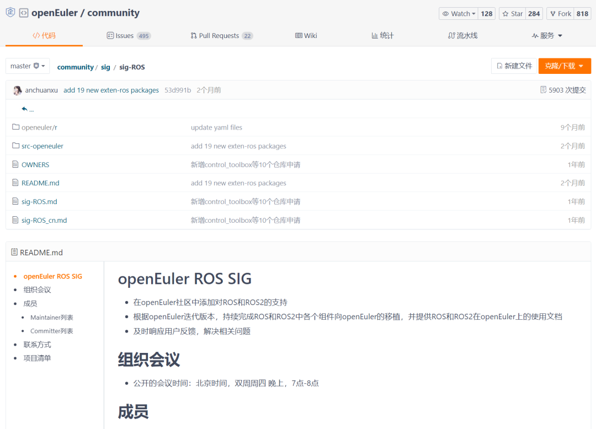
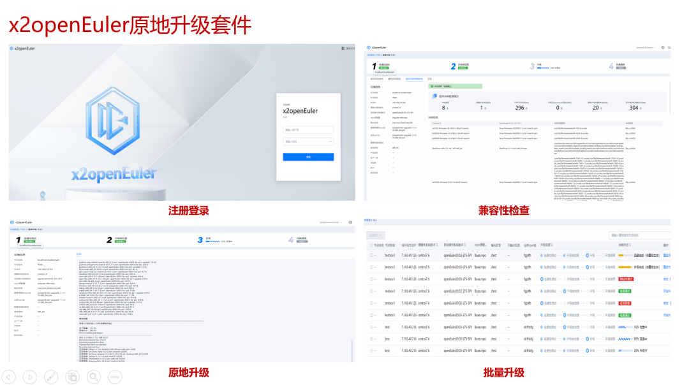
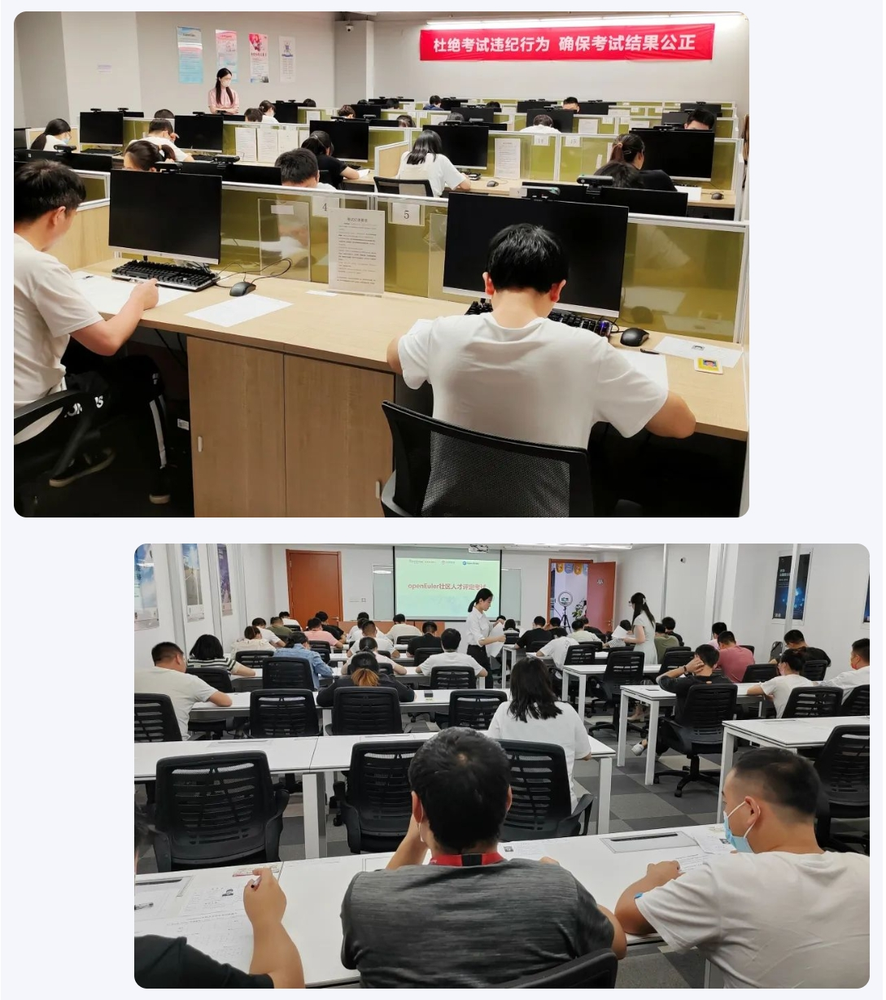
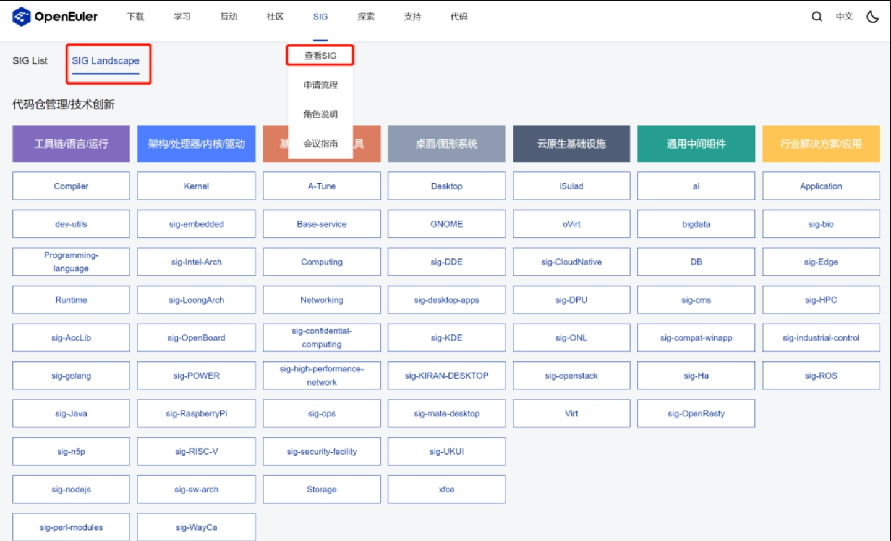
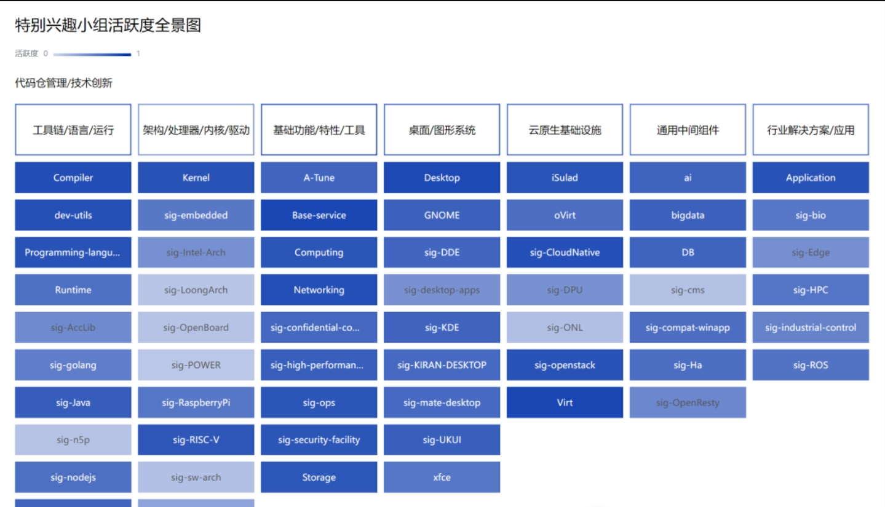
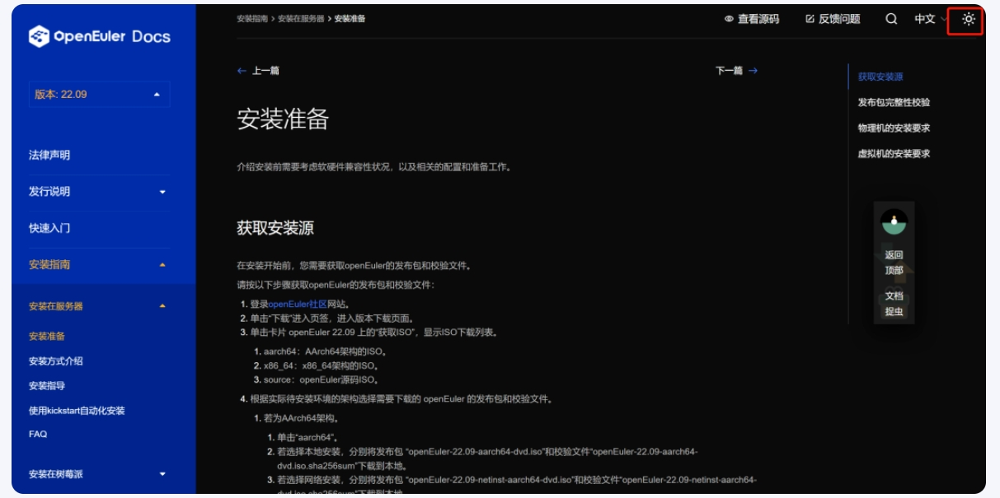
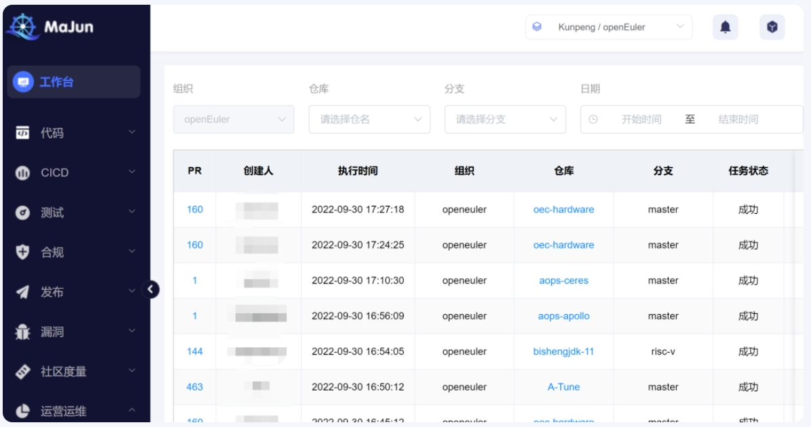
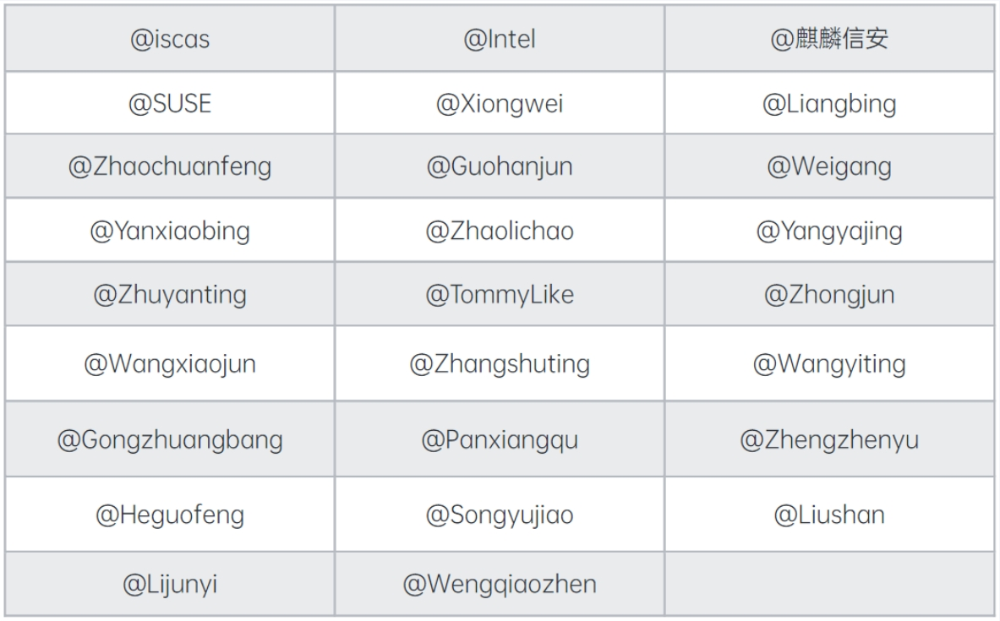

## 社区规模

9月底，openEuler社区用户累计超过75万，11,100+ 名开发者在社区内持续贡献，累计产生 41.5 K Issue、74K PR。

目前，加入openEuler社区的单位成员已超过390家。在9月，万达信息股份有限公司和上海宏时数据系统有限公司等10余家伙伴加入社区。

## 社区大事件

### openEuler 22.09 正式发布，与1265名开发者共建面向数字基础设施的开源操作系统

[9月30日，openEuler 22.09是社区构建的最新创新版本，充分释放多样性算力，深化全场景创新，实现欧拉与鸿蒙的互联互通。](https://mp.weixin.qq.com/s?__biz=MzI2NDE4OTE2Mg==&mid=2247496554&idx=1&sn=3cb56a23cea92ccafa29cda33a7c9c71&chksm=eab2d6efddc55ff9861b6a4a33771038bc9aa9ddd2407774ed67d279c305bdf5d4ed10e5b635&scene=21#wechat_redirect)作为贡献到开放原子开源基金会后的首个创新版本，openEuler 22.09 持续迸发创新活力，版本全量代码已达 6.7 亿行，新增代码 2012 万行 ，内核新增原创代码 4.8 万行，北向源码软件包新增超 12000 个，总量达 28087 个，为成为最佳支持多样性计算的操作系统构建了丰富的软件生态。

### 湖南欧拉操作系统生态大会圆满召开，湖南欧拉生态创新中心成立

[2022年9月29日，首个面向区域和行业的欧拉操作系统生态大会在长沙成功举办。](https://mp.weixin.qq.com/s?__biz=MzI2NDE4OTE2Mg==&mid=2247496533&idx=1&sn=dfe47aa2388078ff5659edc93aa46740&chksm=eab2d6d0ddc55fc6c3ee42f772b748b24f8d5249b53da7d857292d19591855afa63edb8ecaf9&scene=21#wechat_redirect)大会受到各界大力支持。湖南湘江新区（长沙高新区）党工委委员、管委会副主任郭力夫，湖南省工业和信息化厅党组成员、总经济师熊琛，中共湖南省委网络安全和信息化委员会办公室副主任郭天保和开放原子基金会理事长孙文龙先后为大会致辞。中国科学院王怀民院士等行业专家为本次大会作主题演讲。

会上，湖南湘江新区管委会与麒麟信安、华为公司签署合作协议共建湖南欧拉生态创新中心。16家企业、高校共同发起湖南欧拉技术创新与产业发展联盟(拟)仪式，联盟将聚焦根技术创新，共推产业繁荣；麒麟信安与4家湖南欧拉生态支持单位进行意向签约。

### openEuler 首次亮相国际会议，与全球开发者共同构建安全可持续发展的开源软件未来

[9月16日，openEuler社区首次亮相国际开源峰会OSSEU2022（Open Source Summit Europe 2022）。](https://mp.weixin.qq.com/s?__biz=MzI2NDE4OTE2Mg==&mid=2247496360&idx=1&sn=79f1a53f54504339fbbcea7818e0dcf5&chksm=eab2d72dddc55e3b126035264a3b3aff15ee768a9a6d26d310136acbf98151cb0cf6b62c00ed&scene=21#wechat_redirect)

openEuler社区品牌委员会主席梁冰在会上发表主题演讲《Unleashing Diversified Computing Power to Innovate Enterprises》，向全球的开发者分享欧拉开源3年以来，在面向全场景，支持多样性计算以及构建开放透明安全可信的软件供应链方面取得的进展。这是openEuler首次在国际会议中正式亮相，也是openEuler走向国际化的重要里程碑。

### openEuler 兼容性与迁移 Meetup 在线上举办

[9月3日，由openEuler主办，四川鲲鹏生态中心和成都鲲鹏计算产业联盟协办的“openEuler Meetup 操作系统兼容性与迁移” 在线上顺利进行。](https://mp.weixin.qq.com/s?__biz=MzI2NDE4OTE2Mg==&mid=2247496283&idx=2&sn=356712c07abb827e4dae748eb76435d0&chksm=eab2d7deddc55ec82631091cd2d1e7fd9a73c155594bb3dd73e3ee53fb66d7dd2b0a3e484145&scene=21#wechat_redirect)活动吸引了来自ISV、金融、互联网、运营商等170+企业近两百名专家和开发者踊跃参与。线上会议、交流群讨论热烈，不少开发者就操作系统兼容性、技术测评与操作系统迁移等方面进行深入的交流。

## 社区治理

### 社区理事会

理事会评审通过北京软通动力教育科技有限公司、中软国际科技服务有限公司、华为（杭州）培训中心有限公司成为openEuler人才能力评定伙伴。

理事会评审通过湖南麒麟信安科技股份有限公司成立湖南欧拉生态创新中心。

### openEuler 技术委员会

1. 批准成立了RFO SIG，Rancher生态和openEuler生态正式合作发展

    9月7日，由SUSE申请成立的RFO SIG获openEuler技术委员会全票通过，正式开启Rancher生态和openEuler生态合作的新章程。

    Rancher 是一个由多个软件组成的企业级容器管理平台，包括多集群管理平面，Kubernetes发行版，以及容器安全管理等，并兼容主流的公有云生态。

    RFO 的含义为 Rancher For openEuler，旨在打造面向 openEuler 的 Rancher 基础平台系统，致力于在openEuler系统上打造一款最好用的Kubenetes发行版。

    - [SUSE 成立 RFO SIG，建设面向 openEuler 的容器基础设施平台](https://mp.weixin.qq.com/s?__biz=MzI2NDE4OTE2Mg==&mid=2247496332&idx=1&sn=5fa44340e57f63cda74dc168a20ff55a&scene=21#wechat_redirect)

    - [一次 Rancher 和 openEuler 的上云之旅](https://mp.weixin.qq.com/s?__biz=MzI2NDE4OTE2Mg==&mid=2247496516&idx=1&sn=ee528d09f1b1adbcb7026d1822a60a03&chksm=eab2d6c1ddc55fd74373c9100d06b846342928db35cbe364ed739d78e9beec7bdb0b0a6cff90&scene=21#wechat_redirect)

2. 正式发布“openEuler社区开发行为规范 V1.0”
   
   [openEuler社区开发行为规范 V1.0](https://gitee.com/openeuler/community/blob/master/zh/technical-committee/governance/openEuler社区开发行为规范.md)经技术委员会评审投票通过，这是openEuler社区的一个以规范开发行为所制订的章程。

   其目的是为了倡导积极向上的工程师开发文化，在早期能够避免一些不合规范的开发行为。

   随着社区逐步的发展壮大，技术委员会认识到，一个社区的健康成长，根本上是取决于社区是否能够树立起一个良好的开发文化，

   因此技术委员会经过严谨的讨论和广泛的征求意见，推出了该开发行为规范，希望社区里的工程师能够按照规范的要求在社区里开发，共建一个繁荣的开源社区。

   技术委员会也认识到，行为规范也不是一成不变的，在后续的实施过程中，我们依然欢迎大家持续的提出建议，帮助我们优化该规范，为openEuler的良性发展保驾护航。

3. 赵川峰 接替 彭成寒 成为2022届openEuler技术委员会委员

   9月中旬，经全体技术委员会委员的确认，赵川峰 接替 彭成寒 接任2022届技术委员会委员。

   彭成寒因个人工作原因，无法继续在技术委员会中服务，申请退出并推荐赵川峰接任。

   经全体技术委员会委员同意，赵川峰接任2022届技术委员会委员。

   赵川峰是Compiler SIG maintainer，华为编译器资深技术专家，具有十多年编译器开发及性能调优经验，精通GCC/LLVM编译器架构，

   目前主要聚焦于通用场景优化设计与实现及毕昇编译器技术生态建设工作。未来，他将尽自己的绵薄之力，参与技术项目的研发与优化，继续为社区服务。

4. 可编程内核SIG组开始筹备成立

   9月21日，经openEuler社区技术委员会决议批准，由天翼云发起，华为响应的[可编程内核 SIG（Samrt Kernel SIG）开始筹备成立](https://mp.weixin.qq.com/s?__biz=MzI2NDE4OTE2Mg==&mid=2247496473&idx=2&sn=5ef0bd682cea1864ab21007410f7a968&chksm=eab2d69cddc55f8a19a9aef64ac2ec64a5c5d61e5013e8859819634ee772c560dbd09b71db20&scene=21#wechat_redirect)。该SIG组旨在推动以 eBPF 为技术基础的内核可编程能力在社区内进行孵化，将内核能力服务化（KaaS），以便能够弹性适配 openEuler 社区多样性场景（包括服务器、CT、工控、终端、车等场景）差异化诉求。

   可编程内核SIG愿景是从场景维度定义内核可编程能力，垂直整合场景、内核、硬件数据及资源，为社区用户提供性能加速、安全加固、智能观测等特性，同时通过定义 eBPF service 行业标准，实现内核能力服务化（KaaS）、集市化，惠及更多社区用户。

## 技术进展

### Intel在openEuler社区积极推进22.09对Sapphire Rapids平台的支持

近期Intel Arch SIG在openEuler Kernel, virtualization, compiler等仓库提交了约30组PR合入近400个Sapphire Rapids(SPR)平台支持的补丁，已基本完成了openEuler 22.09计划中的对SPR内核和虚拟化全面支持的目标。

这个月Intel Arch SIG重点完成了22.09对SPR各类虚拟化的支持。除个别特例外，openEuler 22.09已经合并完成了主线KVM和QEMU的所有虚拟化特性的backport。

为推动openEuler的x86生态的完整性，Intel Arch SIG也交叉参与到了各其他合作的SIG的工作中，包括和Compiler SIG合作为22.09引入了Multiple devtools的支持，以此为未来支持多平台工具链提供了基础支持。并且Intel team也正在推动openEuler compiler的编译和性能优化选项的升级工作。

为了在openEuler率先支持oneAPI异构计算的基础框架，Intel Arch SIG为openEuler引入了Intel CPU Deep Learning Boost的相关内核支持和oneDNN, oneDAL等基础AI库的支持；另外在和Confidential Computing SIG的合作上，Intel也从SGX的内核，KVM和SGX库和相关工具上做了完备的集成和验证。

为了对openEuler提供更完善的Sapphire Rapids数据加速引擎的支持，Intel也验证了openEuler对QAT, DLB等加速器库版本的功能和兼容性测试。同时，Intel也在积极推进openEuler在SPR的功能验证等工作。

### 多 SIG 联合探讨资源利用率提升

为了提升数据中心服务器和云资源的利用率，业界引入在线离线混合部署方案。然而，事物的发展是具有两面性的，混合部署也不例外，提升资源利用率的同时也会带来资源隔离的问题。为此，我们发布了[第四篇技术博文《CPU 抢占和 SMT 隔离控制》](https://mp.weixin.qq.com/s?__biz=MzI2NDE4OTE2Mg==&mid=2247496422&idx=1&sn=9e546612aeafea6bab8c5c82c65475ef&chksm=eab2d763ddc55e75bbefcfc8b277863a18fad54dd8736942da7ae0b7ff4d843875178e8e3e00&scene=21#wechat_redirect)，通过介绍提升 CPU 资源隔离的混部技术，让大家了解我们在本领域的探索。

在调研过程中，我们发现，有许多朋友对资源利用率提升过程中所使用的内核技术非常感兴趣，为此，我们特地开发了[《资源利用率提升专题》系列视频](https://space.bilibili.com/527064077/channel/collectiondetail?sid=719180)教学，以帮助使用者和开发者更好地理解混合部署特性。关于特性的描述也同步更新在了我们的[rubik仓库](https://gitee.com/openeuler/rubik)，欢迎感兴趣的朋友关注.

### StratoVirt 中的 PCI 设备热插拔实现

热插拔，即带电插拔。在虚拟化场景下，热插拔就是在虚拟机运行过程中对磁盘网卡等设备进行动态调整。目前，StratoVirt 标准机型中实现了基于 PCIe-Native 机制的热插拔。支持热插拔的设备包括磁盘、网卡、PCI 直通设备。欢迎感兴趣的朋友关注Virt SIG。

- [StratoVirt 中的 PCI 设备热插拔实现](https://mp.weixin.qq.com/s?__biz=MzI2NDE4OTE2Mg==&mid=2247496194&idx=1&sn=832675f7a5e12fd1e4dd17b79e998c60&chksm=eab2d787ddc55e91ffa6c04013a45537bc7fe3063c9c9236a6f1a09ba8b5538c1a1668412843&scene=21#wechat_redirect)

### CloudNative SIG：基于22.03 LTS社区版的主流容器镜像发布

在云原生技术领域方面，CloudNative SIG在dockerhub上发布基于22.03 LTS社区版镜像的Rabbitmq、Prometheus、OpenSSH-Server、openGauss、Nginx、Memcached、Grafana、Redis、Python、Postgres、Golang等主流容器镜像。

更多应用镜像持续发布中：https://hub.docker.com/u/openeuler，欢迎大家关注。

### HPC SIG完成了mfem、QMPack openEuler适配

本月，HPC SIG完成了mfem、QMPack openEuler适配及OpenFoam，贾维斯工具已支持KML数学库/迁移工具DevKit /Nvidia HPC SDK/Intel oneAPI及65+HPC依赖，25+HPC应用一键部署。感兴趣的朋友可以关注：

https://gitee.com/openeuler/hpcrunner

- [揭开HPC应用的神秘面纱](https://mp.weixin.qq.com/s?__biz=MzI2NDE4OTE2Mg==&mid=2247496447&idx=2&sn=4fce579e60a2aca8bc9f7548ca0974fa&chksm=eab2d77addc55e6c60719078310bea7ba8e981319d17f00a753c779efad7c3dfce4ae66adee1&scene=21#wechat_redirect)

- [我和容器有个约会：浅析HPC容器的前世今生](https://mp.weixin.qq.com/s?__biz=MzI2NDE4OTE2Mg==&mid=2247496448&idx=1&sn=9ea96aa949487490dfc0b11d7379be3e&chksm=eab2d685ddc55f93b7abcbfc07884b7fefc779ca68d8e239e245abc1b01ea3902230ca622127&scene=21#wechat_redirect)

### ROS SIG 决定在openEuler22.03-sp上发布ROS和ROS2两个基础尝鲜版，目前已启动申请流程。

9月，[ROS SIG](https://gitee.com/openeuler/community/tree/master/sig/sig-ROS)决定在openEuler22.03-sp上发布ROS和ROS2两个基础尝鲜版，目前已启动申请流程。

ROS，即 Robot Operating System，是机器人领域主流的开源平台，提供类似于操作系统的服务，包括硬件抽象描述、底层驱动程序管理、共用功能的执行、程序间消息传递、程序发行包管理等功能。ROS 还提供一些工具和库用于获取、建立、编写和执行多机融合的程序，为机器人产学研究提供了便利的开发环境。ROS SIG 跟随 openEuler 的20.03、21.03、22.03版本，分别适配移植了 ROS-kinetic、ROS-melodic、ROS-noetic、ROS2-foxy 四个版本的全部基础功能包，以及部分桌面扩展包、第三方工具包等等。其中，在openEuler 21.03 版本上成功编译运行ROS melodic 桌面版，在openEuler 22.03 版本上成功编译并运行 ROS melodic 桌面版和 ROS2 foxy 基础版。

如今，ROS SIG 已经成功将 ROS 真机在 ARM 和 x86 两种架构上的 openEuler 操作系统上面运行，在树莓派、RK3399、TX2 等开发板上安装运行并测试通过。当前，ROS SIG计划将在今年年底发布的openEuler SP版本上线ROS基础版。感兴趣的朋友们可以期待，也欢迎大家加入 ROS SIG，一起参与该项目的工作，推动ROS领域的技术发展。

### 兼容性与OS迁移：x2openEuler 工具全新发布，支持原地升级

将操作系统迁移至openEuler时，借用x2openEuler工具（[下载](https://www.openeuler.org/zh/migration/download/)），能够很好地帮助我们对软件、硬件和配置进行兼容性评估，以提升迁移的效率。9月底，x2openEuler迎来全新的升级，支持原地升级能力，全新的Web UI视觉，让用户在使用过程中更加清晰、简单。

## 社区安全

9月份发布安全公告92个，修复CVE漏洞220个。其中 Critical 6个，High 70个，其它 144个

- [openEuler社区安全公告](https://www.openeuler.org/zh/security/safety-bulletin/)

## 人才发展

### openEuler 社区开源贡献微认证

[openEuler社区发布了开源贡献实践微认证](https://www.hikunpeng.com/learn/micro-certification/detail/ad537279d82b4d38bcd96afbdb2181d3)，为高校开发者提供开源通识、openEuler开源社区及Linux环境下软件开发提供赋能和相关认证，

当前已有450+高校开发者参与并通过相关认证。

### openEuler 社区人才能力评定考试

9月14日-9月16日，openEuler社区人才与服务SIG组，联合软通动力、中软国际在西安组织了三场线下[openEuler社区人才评定考试](https://talent-assessment.openeuler.org/#/)，共有107人参加考试，其中软通动力47人，中软国际60人；最终66人通过评定考试，其中软通动力20人，中软国际46人。

### 国家教育部教育考试院同意增加openEuler到计算机等级考试中

9月9日，在国家教育部教育考试院，组织举行了教育部教育考试院计算机等级考试处与华为的交流会议。

会上，国家教育部教育考试院 同意 增加openEuler到计算机等级考试中，计划在计算机等级考试三级和四级里增加openEuler的中高级考试内容，建议在二级考试中开openEuler方向，普及openEuler基础知识及操作内容。

### 第五届中国软件开源创新大赛 openEuler 赛道报名中

由中国计算机学会（CCF）主办第五届“中国软件开源创新大赛”已进入报名阶段。openEuler参与的两个赛道：[开源项目贡献](https://www.gitlink.org.cn/competitions/index/openEuler-01)、[开源案例教学](https://www.educoder.net/competitions/index/gcc-courses-2022)，目前已超过600支队伍报名参赛，已有10支队伍提交作品。

openEuler社区导师将基于大家提交的作品，积极参赛队伍进行交流，帮助其优化参赛作品。如果你对openEuler赛题的感兴趣，欢迎报名参加（截止时间：2022年11月）。

### 2022 CCF BDCI 大赛 openEuler 赛题报名中

由中国计算机学会创办的 CCF BDCI 大赛（CCF Big Data & Computing Intelligence Contest）正在报名阶段。

作为最活跃的操作系统开源社区之一，[openEuler社区在训练赛道中贡献赛题「openEuler 社区视频会议纪要自动生成」](https://www.datafountain.cn/competitions/591)，欢迎感兴趣的朋友们报名参加（截止时间：2022 年 12 月 05 日）。

## 基础设施

openEuler SIG Landscape 

openEuler 社区有近百个 SIG 组，每个 SIG 组都由该SIG的核心成员（如 Maintainer）主导治理。

9月底，基础设施团队在官网SIG中心上线了[openEuler SIG Landscape](https://www.openeuler.org/zh/sig/sig-list/)，以方便社区朋友更快地了解社区SIG组的分布，找到自己感兴趣的技术领域。

### MoocStudio服务平台英文版上线

今年7月，可支持用户在虚拟机环境中体验openEuler的[MoocStudio （中文版）](https://moocstudio.openeuler.org/zh)上线后，得到不少社区朋友的肯定。时隔两个月，该服务平台[英文版](https://moocstudio.openeuler.org/en )正式上线，用户无需安装，网页版可直接试用openEuler。

感兴趣的朋友可以尝鲜体验。

### 社区贡献看板新增SIG活跃全景图

为了方便SIG Maintainer了解SIG运作情况，方便开发者快速找到自己感兴趣的技术领域，也方便技术委员会成员与SIG组更高效的协作，[社区贡献看板](http://datastat.openeuler.org/ )做了升级，增加SIG组活跃全景图

### 官网文档提升

- 视觉升级

   [官网文档升级](https://docs.openeuler.org/zh/)后，左侧主目录以「openEuler的版本选择」为主，当开发者选择所需的版本时，便可查看该版本的详细内容，同时，页面的右侧增加当前文档的目录，从而优化整体的视觉，方便开发者快速查阅，提升阅读体验.

  

  如果您喜欢深色的阅读模式，可以一键换肤。

  

- 捉虫活动系统升级

   为方便开发者更简单地参与捉虫活动，基础设施团队将捉虫系统升级至2.0，新增PR提交功能，开发者可根据自身的需求选择提交Issue还是PR。

   

- 镜像站点

   [社区镜像仓列表](https://www.openeuler.org/zh/mirror/list/)新增3个高校镜像站点：浙江大学、哈尔滨工业大学、中国科学技术大学

- 社区小工具

   为支持社区开发者熟练使用、开发Linux操作系统，社区提供一款能够查询Linux命令的小服务：e[xplainshell](https://explainshell.openeuler.sh/)。该服务轻便简洁，是新接触Linux操作系统开发人员的入门小帮手。

- 防投毒版本级扫描工程服务

   [防投毒版本级扫描工程服务](https://majun.osinfra.cn/antipoisoning/poisoningdetail)已经部署，欢迎使用。

   据悉，该工程服务已初步具备扫描识别恶意代码的能力；运维人员能够根据社区代码仓选择需要的扫描规则；该规则亦支持社区以repo粒度按需裁剪定制。
   
   从恶意代码、漏洞的发现、预警，到分析排查，再到修复和消控审核，防投毒版本级扫描工程服务提供了较为成熟的风险跟踪闭环机制，以确保社区代码的安全。目前防投毒版本级扫描工程服务已接入31个代码仓，待评估规则成熟后加入社区门禁。

   

## 感谢每一位朋友、开发者的支持

因为大家的辛勤贡献，openEuler的每一天都发生着好的事情。小编限于视野和能力，难免有所遗漏，在此表示歉意。同时，衷心感谢以下社区朋友、openEuler
SIG组成员以及开发者们对本月月报的贡献：

- 以上不分先后顺序

如果您希望在月报中增加您的工作内容，或对内容有任何改进建议，请联系wengqiaozhen@openeuler.sh。

**- END -**

编辑/排版：翁巧贞

封面设计：王一婷

审校：李永乐、梁冰、熊伟
