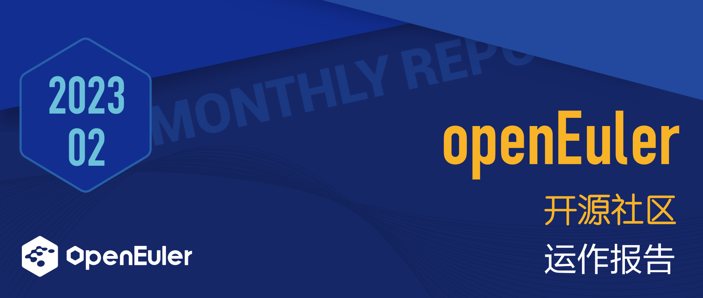

## 社区规模

截止2023年2月28日，openEuler社区用户超过108万，累计产生52.4K条 Issue，95.8K 个PR。当前，加入openEuler社区的单位成员已超过 780 家，2月新增 22 家。

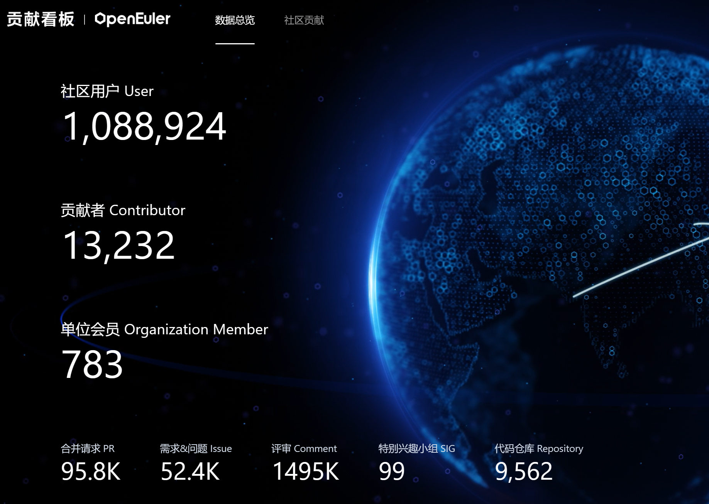

## 社区大事件

### openEuler用户仓服务(EUR)上线

在操作系统的世界，软件包的丰富程度和是否易于分发，一定程度上决定了操作系统用户和开发者的使用体验。[EUR(openEuler User Repo)](https://our.openeuler.openatom.cn/)是openEuler社区针对开发者推出的个人软件包托管平台，目的在于为开发者提供一个易用的软件包分发平台。

EUR专注于为开发者提供便利，支持自动从pypi，rubygem（未来可以扩展更多的方式）打包软件包，支持通过webhook自动触发持续构建，后续还将支持一键将个人仓库的软件包引入社区。欢迎感兴趣的朋友使用，有任何建议欢迎联系[infra@openeuler.org](mailto:infra@openeuler.org)或在[社区论坛](https://forum.openeuler.org/)一起交流。

- EUR(openEuler User Repo)：<https://our.openeuler.openatom.cn/>

- 如何使用openEuler用户仓（视频）：<https://b23.tv/sKHjKUU>

- 如何使openEuler用户软件仓：<https://www.openeuler.org/zh/blog/waaagh/openEuler-user-repo-intro.html>

### openEuler 城市用户组招募中，欢迎加入本地用户交流圈！

为帮助各区域用户构建本地交流圈子，openEuler社区启动成立[城市用户组计划](https://mp.weixin.qq.com/s?__biz=MzI2NDE4OTE2Mg==&mid=2247501432&idx=1&sn=c597cdad68e93566dd5c439cba0168e0&chksm=eab2e3fdddc56aeb4d0c96655fe174854a5465e4c97992506a929c46323bf0afa08e0f0a1ac7&token=1311247283&lang=zh_CN&scene=21#wechat_redirect)，北京、上海、深圳、广州、杭州、长沙、南京、武汉、成都、兰州、西安、郑州12个城市用户组招募中！

### 《openEuler 在电力行业应用和生态白皮书》正式发布

2023年2月17日，为积极应对能源互联网在新形势下的机遇与挑战，清华大学、中国南方电网有限责任公司、国家能源互联网产业及技术创新联盟盛大召开“2022 国家能源互联网大会”。大会现场[《openEuler 在电力行业应用和生态白皮书》正式发布。](https://mp.weixin.qq.com/s?__biz=MzI2NDE4OTE2Mg==&mid=2247501298&idx=1&sn=95bd4d1bd79b90d53a25794124397852&scene=21#wechat_redirect)

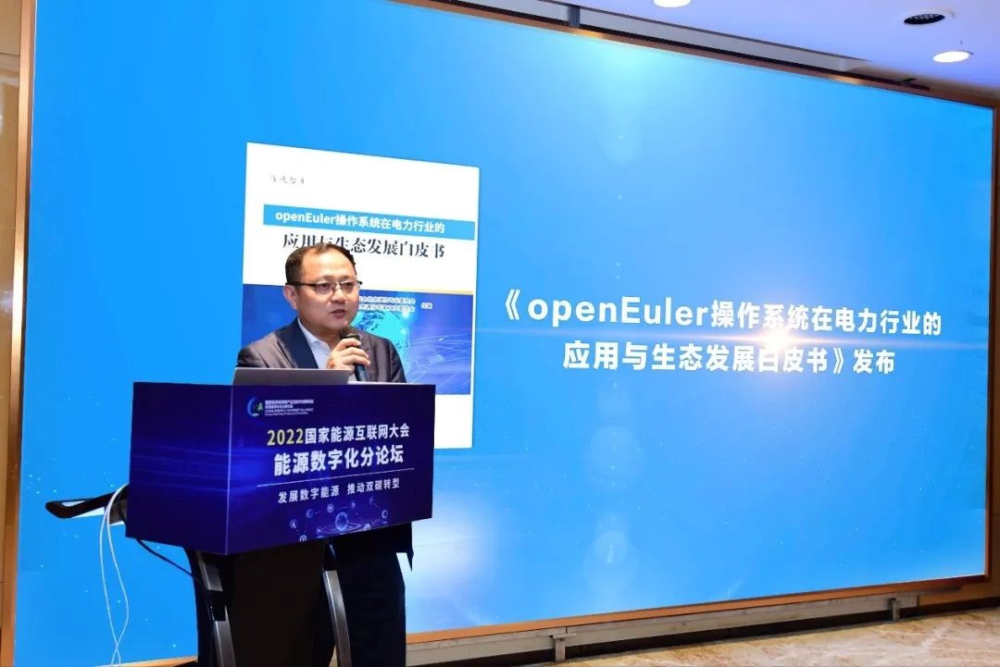

### openEuler 2023年度活动规划上线

为帮助大家更好地参与社区活动，openEuler社区上线了[2023年度活动规划](https://www.openeuler.org/zh/interaction/event-list/)，并定期进行更新。如果您想增加社区开发者活动，或想分享您的技术成果，欢迎邮件联系events@openeuler.sh。

进入方式：【官网】→【互动】→【活动】

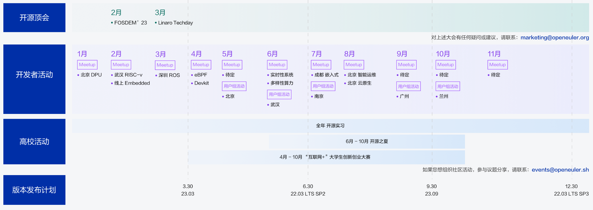

### openEuler 参加 Linaro Techday

[2023年3月7日，Linaro Techday 将在线上召开](https://mp.weixin.qq.com/s?__biz=MzI2NDE4OTE2Mg==&mid=2247501209&idx=2&sn=7299c07db1c5c16a0f13580a8222da70&chksm=eab2e01cddc5690aac5652795295cd57d9de47c931e9e715e35b0ef8d6f5c55dfa20b82ece66&token=868080095&lang=zh_CN&scene=21#wechat_redirect)。活动聚焦安全、虚拟化、Linux 内核以及测试和 CI 等核心技术。作为国内操作系统开源社区的代表之一，openEuler参与其中，与BigTop、Arm CCA、Oniro、SVE、UADK、Linaro、Trusted Reference Stack等领域的技术专家一起探讨最新的技术趋势与进展，分享最新动态与实践，欢迎朋友们来听听。

### openEuler Embedded Meetup

本月底，openEuler社区首场全英技术讨论会—openEuler Embedded Meetup在Youtube和B站直播。活动聚焦嵌入式场景，特邀Embedded、RISC-V、RT-Thread等领域的技术专家，从不同角度解读嵌入式系统的热门话题。在宣传过程中，openEuler与RISC-V、RT-Thread loT OS等官方账号形成良好的互动，活动总曝光量3000+次，吸引了200+名来自不同地区的开发者观看，参与讨论。欢迎关注[openEuler社区Linkedin账号](https://www.linkedin.com/company/86315548)，与开发者们一起讨论。

### 面向英语开发者的Newsletter已开通，欢迎订阅

在openEuler 社媒平台LinkedIn，[Newsletter功能](https://www.linkedin.com/newsletters/openeuler-buzz-7036250762506633216/)已开通，新栏目openEuler Buzz也同步上线，欢迎订阅。开发者订阅后，可在邮箱中及时查看社区动态。

### openEuler X CNRV RISC-V Meetup

[2月25日，openEuler X CNRV RISC-V Meetup在武汉举办](https://mp.weixin.qq.com/s?__biz=MzI2NDE4OTE2Mg==&mid=2247501461&idx=2&sn=f185a798be8cb530186ee4467283e82d&chksm=eab2e310ddc56a062a07904bf3f849e2ec5eb3b8e20d11e827d3e8f1f25df063cf50778a2bf6&token=1311247283&lang=zh_CN&scene=21#wechat_redirect)，来自openEuler、CNRV、HelloGCC、HelloLLVM等社区的 40+ 位开发者就SIG RISC-V工作进展、编译技术发展、2023活动规划等进行分享与讨论。

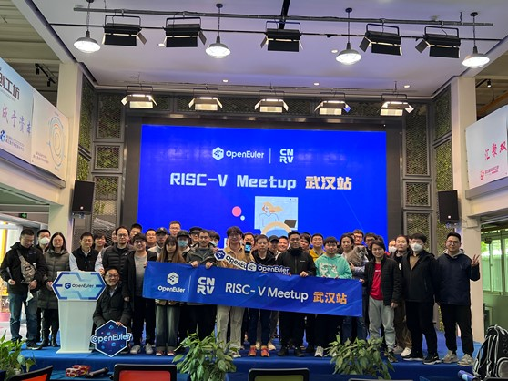

## 技术进展

### 新项目oebuild在openEuler社区开源

2023年2月，新项目[oebuild](https://gitee.com/openeuler/oebuild)在openEuler SIG Embedded中孵化并持续运作。该项目是帮助开发openEuler Embedded而衍生的辅助开发工具。

目前oebuild主要实现了主体框架，当前业务涵盖了构建，将来会涉及到CICD，本地测试，云构建等等。与yocto相比，oebuild在应用定制和实现上降低了学习和环境成本，仅需要几个指令即可获取想要的应用镜像，免去了下载、环境编译等过程。

### 湖南大学谢国琪教授团队贡献了新项目ZVM

2023年2月，由湖南大学谢国琪教授团队开发的新项目ZVW在openEuler SIG-Zephyr中孵化，并持续运作，希望通过社区的力量，打造一款高质量的嵌入式实时虚拟机，并回馈上游社区。

[ZVM(Zephyr Virtual Machine)](https://gitee.com/openeuler/zvm)是一款基于Zephyr RTOS的嵌入式虚拟机。目前已经在SIG-Zephyr 例会中进行了分享。

### CTinspector项目在openEuler社区开源

CTinspector是一个基于ebpf机制的云环境下的运维平台系统，它充分利用ebpf性能高，对系统扰动小的优势，结合天翼云长期积累的技术实践，实现对大规模云环境下的性能检测，故障诊断等基础能力。整套系统部署灵活简单，性能好，对系统扰动小，是云环境下的运维利器。我们欢迎行业中的同仁一起共同打造高效的运维工具平台。

项目地址：<https://gitee.com/openeuler/CTinspector>

### openGemini项目加入openEuler SIG DB

2023年2月，openGemini项目加入openEuler，并在 openEuler SIG DB中持续运作，希望可以在物联网、嵌入式、边缘计算、运维监控（AIOPS）等领域共同创新，增强openEuler社区的影响力和竞争力。

openGemini是一款华为云开源的云原生分布式时序数据库，具备高性能、高扩展、高并发等优势。主要面向物联网和运维监控场景，提供海量时序数据库处理和分析的开源解决方案，openGemini支持单机和集群，部署形式多样，可边缘、可云、可物理机部署，支持主流开发语言，二进制运行，无第三方组件依赖，带有260+项系统运行指标监控，运维简单。

项目地址：

- <https://gitee.com/src-openeuler/openGemini>

- <https://github.com/openGemini>

### RISC-V 成功适配 VisionFive 2 单板计算机

近日，[SIG  RISC-V 成功在 VisionFive 2 开发板上适配openEuler操作系统](https://mp.weixin.qq.com/s?__biz=MzI2NDE4OTE2Mg==&mid=2247501221&idx=1&sn=84293a2ca5a579ab92043e374a110fad&scene=21#wechat_redirect)，目前最新版本的 openEuler RISC-V 22.03 V2 镜像已在 VisionFive 2 开发板上可用，这是 openEuler 推动 RISC-V 生态演进的又一新进展。

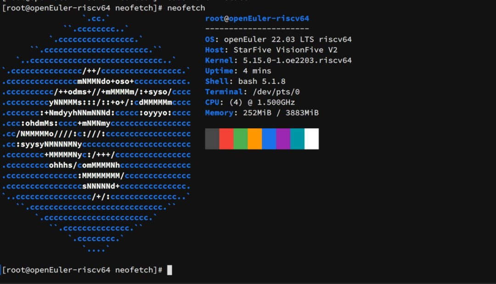

### SIG RISC-V 创建专属邮件列表和论坛板块

近日，为了适应 RISC-V 架构在 openEuler 社区的快速发展，同时为相关开发人员和技术爱好者们提供一个专注的 RISC-V 相关问题的交流环境，SIG RISC-V分别向社区申请并创建了 RISC-V 专属的邮件列表和社区论坛中相对应的 channel 模块，目前已经正式投入使用。

- 项目地址：<https://gitee.com/openeuler/RISC-V>

- 邮件列表：[riscv@openeuler.org](mailto:riscv@openeuler.org)

- 社区论坛：<https://forum.openeuler.org/t/topic/359>

### openEuler SIG BigData 致力于持续构建和完善社区大数据生态

SIG BigData持续构建和完善openEuler社区下的大数据生态，打造活跃的大数据交流平台，丰富和提升大数据组件功能和性能，发掘用户大数据需求，孵化有潜力的大数据组件。本月，SIG BigData工作主要在以下几个方面：

1. 新增了技术创新项目：

  - VectorBLAS：VectorBLAS库是Java端的BLAS库，主要通过Java VectorAPI特性提升BLAS库的在ARM平台的性能。

  - Spark SQL Native：采用SparkSQL Native Codegen框架，重新实现Spark SQL执行层，基于列式内存布局实现向量化，使用LLVM动态优化生成代码提升Spark SQL的性能。

  - 更多技术创新项目正在规划和上架中，大家敬请期待。

2. Apache社区生态拓展：Apache bigtop适配openEuler版本

  - 完成了openEuler版本puppet and slaves docker移植构建。

  - 完成了所有23个组件的编译和smoke test验证（基于openEuler 22.03版本）。

   - 已进入到Apache bigtop社区下个版本规划讨论列表中(BIGTOP-3909)。

3. 新增了两个开源实习项目，欢迎大家参与

  - Redis场景使能SMC-R：SMC-R是一种混合协议，即通过TCP实现建联时信息交互，通过RDMA网络实现数据路径高性能数据传输。

  - Hadoop Terasort测试场景分析--任务拉起阶段：Terasort是Hadoop自带的用于集群性能基准测试的工具，主要是对Hadoop集群的HDFS和MapReduce层进行综合测试。

  - 在openEuler上进行深入分析该测试场景的性能，提升大数据领域Hadoop的性能生态竞争力。
  
  - bigtop项目：<https://issues.apache.org/jira/browse/BIGTOP-3875>

SIG BigData：<https://www.openeuler.org/zh/sig/sig-detail/?name=bigdata>

### openEuler SIG dev-utils 推出sysMaster

近期，SIG dev-utils 推出sysMaster，重新定义服务管理，已实现秒级恢复、保障系统24小时在线。

自2022年9月份发布首个技术验证版本后，最新的sysmaster在服务管理进程中引入了故障恢复机制。当sysmaster服务管理功能异常导致进程崩溃时，会秒级恢复而不是重启整个系统恢复故障。当前 sysMaster 已完成故障恢复框架并进行了功能适配。

欢迎对 1 号进程和系统可靠性感兴趣的小伙伴关注该项目。

项目地址：<https://gitee.com/openeuler/sysmaster>

## 社区基础设施

### openEuler Forum支持英文翻译

自[论坛](https://forum.openeuler.org/)上线以来，为方便社区用户与开发者更好地交流，除了社区资讯与活动、互助交流之外，我们新增了Kernel、迁移、运维、RISC-V、iSulad等不同技术板块。基于大家语言使用习惯的不同，论坛界面支持中英文语言的切换。

- 界面语言设置：【论坛】→【个人资料】→【偏好设置】→【界面语言】

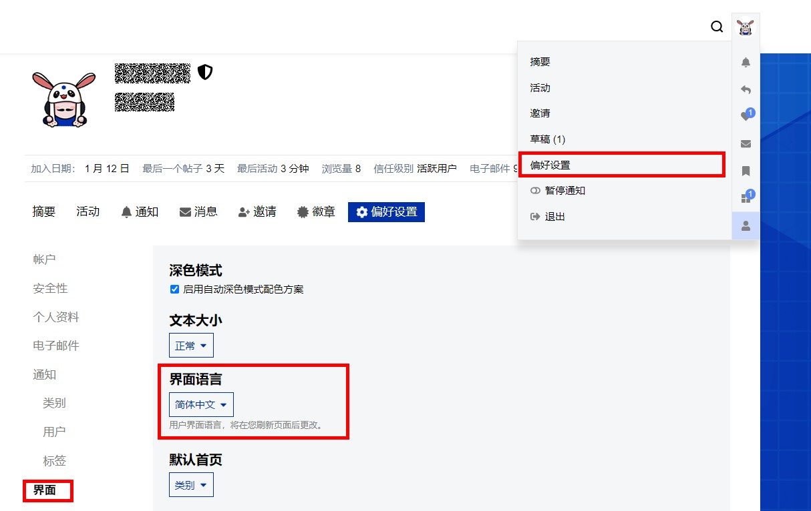

- 开发者在浏览论坛过程中，若某个帖子的语言与【偏好设置】中的语言不一致，该帖子右下角会出现翻译按钮，点击后翻译文本会出现在帖子下方。

- 此外，开发者通过官网搜索功能，亦能够检索论坛信息。

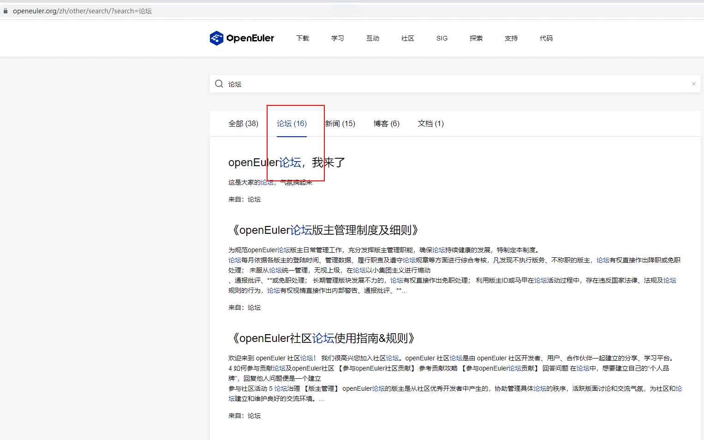

### 官网文档地图发布

为方便开发者快速找到所需要的文档资料，社区上线了[文档地图](https://docs.openeuler.org/zh/)。欢迎大家查阅。

进入方式：

【官网】→【学习】→【文档】

### 社区账号系统支持开放原子开源基金会账号

[社区账号服务系统](https://id.openeuler.org/login)支持第三方账号登录：Gitee、GitHub、开放原子开源基金会。

### 社区邮件列表订阅流程优化

开发者订阅邮件列表时，直接点击邮件中的链接确认即可成功订阅，无需再回复确认邮件。

发生误订邮件列表时，开发者可通过界面【退订】交互框，并在系统发的确定邮件中点击链接退订。

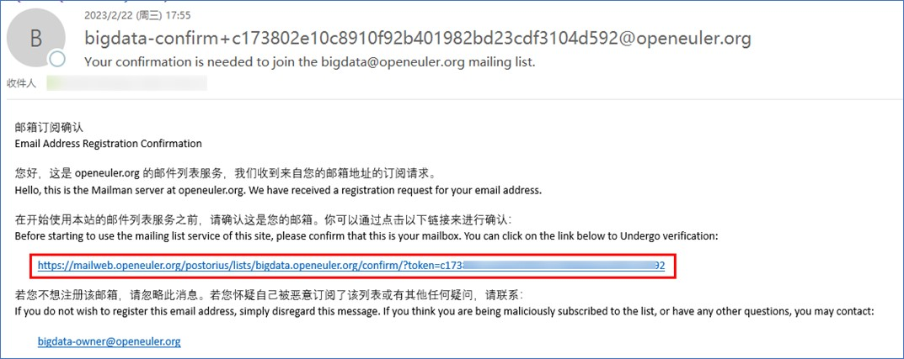
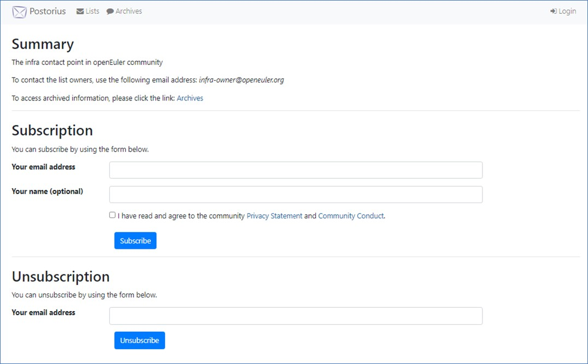

### 社区上线版本归档仓

随着openEuler版本的更新，Repo容量快速膨胀，经TC和SIG release讨论，增加版本归档仓，将部分版本的文件迁移至该仓库。Repo仓库功能保持不变，存放活跃版本，且提供归档仓库中相关版本跳转。

已迁移至归档仓的版本文件：

- openEuler 1.0
- openEuler 20.09
- openEuler 21.03
- openEuler 21.09

Repo仓：<https://repo.openeuler.org/>

版本归档仓：<https://archives.openeuler.openatom.cn/>

### 社区新增5个海外镜像站点

本月，社区新增5个海外镜像站点，分别为：

- （德国）AGDSN：<https://ftp.agdsn.de/openeuler/>

- （德国）xTom：<https://mirrors.xtom.de/openeuler/>

- （丹麦）dotsrc：<https://mirrors.dotsrc.org/openeuler/>

- （哈萨克斯坦）PSCS: <http://mirror.ps.kz/openeuler/>

- （韩国）ALA：<https://mirror.anigil.com/openeuler/>

## 软硬件兼容性清单

截至2023年2月底，当前兼容性方案745个，其中北向391个，南向358个，OS 56个；2月新增北向42个，南向8个，OS 4 个。

- 社区兼容性清单：<https://www.openeuler.org/zh/compatibility/>

## 安全公告

2023年2月份发布安全公告87个，修复CVE漏洞88个（其中 Critical 7个，High 35个，其它 46个），公告不受影响CVE 49个。

- openEuler安全公告：<https://www.openeuler.org/zh/security/safety-bulletin/>

## 感谢每一位朋友、开发者的支持

因为大家的辛勤贡献，openEuler的每一天都发生着好的事情。小编限于视野和能力，难免有所遗漏，在此表示歉意。同时，衷心感谢以下社区朋友、openEuler
SIG组成员以及开发者们对本月月报的贡献：

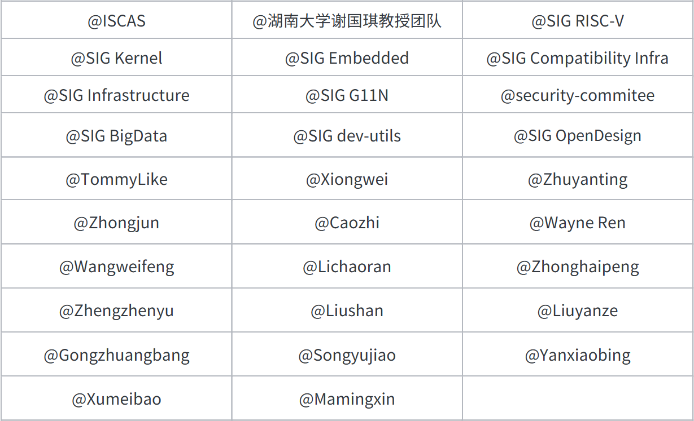

- 以上不分先后顺序

如果您希望在月报中增加您的工作内容，或对内容有任何改进建议，请联系wengqiaozhen@openeuler.sh。

**- END -**

编辑/排版：翁巧贞

封面设计：王一婷

审校：李永乐、梁冰、熊伟
