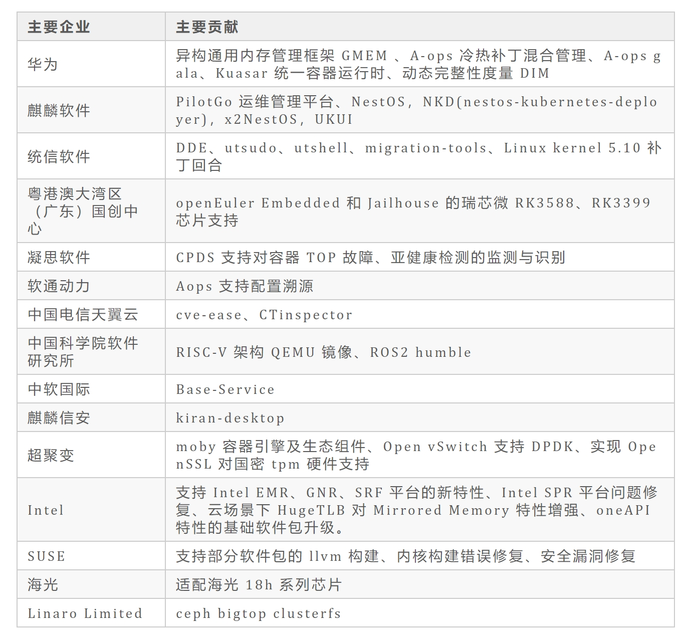

 9 月 30 日，openEuler 23.09 创新版本正式发布。openEuler
作为一个凝聚全球开发者的创新平台，持续在多样性算力、基础技术、全场景和生态服务等方向创新，此外，人工智能的飞速发展给
openEuler 也带来了新的创新方向。openEuler 23.09
是社区最新发布的创新版，使用 EulerMaker
构建该版本的的服务器、云计算、边缘计算镜像，版本代码总计 9.1 亿行，相比
openEuler 23.03，新增代码 8900 万行，**新增代码主要集中在 Linux Kernel
6.4 特性继承、基础软件包版本选型升级、异构通用内存管理框架
GMEM、统一容器运行时框架 Kuasar、ROS2
humble、utshell、utsudo。其中内核代码新增 18 万行，主要集中在 CFS
带宽控制改进、支持多代 LRU（Multi-Gen
LRU）、支持开放式编码迭代器、支持用户定义的 BPF 对象、支持 ARM 架构 SME2
和 SME2.1 新特性。openEuler 社区软件包新增 2443 个，总数超过 3.5
万个，与国际主流操作系统社区的软件包数量持平。openEuler 23.09 凝聚了社区
1139 名开发者的力量，开发者数量相比上个版本增加了 40%，也离不开社区 1100
多家企业的积极贡献，特别感谢华为、麒麟软件、统信软件、粤港澳大湾区（广东）国创中心、凝思软件、软通动力、中国电信、中国科学院软件所、中软国际、麒麟信安、超聚变、Intel、SUSE、Linaro
Limited、海光等公司和科研院所对 openEuler 23.09 的代码贡献。**

**openEuler 23.09 下载链接：**

**<https://www.openeuler.org/zh/download/>**

## 基础技术创新

openEuler 23.09 采用 Linux Kernel 6.4 内核，为未来 openEuler 24.03 LTS
版本采用 2023 年年底的 Linux Kernel LTS
版本作为内核进行技术探索，也方便各位开发者进行软硬件适配、基础技术创新和上层应用创新。为了能够在短时间内让大多数的开发者体验到
6.4 内核的功能，openEuler 23.09 目前支持 X86、Arm 和 RISC-V
等主流的芯片架构、硬件、虚拟机和容器上运行。**openEuler
内核**继承了前版本的众多竞争力特性：

-   CPU QoS 优先级负载均衡特性：离线混部 CPU QoS 隔离增强, 支持多核 CPU QoS 负载均衡，进一步降低离线业务 QoS 干扰。

-   可编程调度：基于 eBPF 的可编程调度框架，支持内核调度器动态扩展调度策略，以满足不同负载的性能需求。

-   热补丁：针对内核的函数实现的 bug 进行免重启修复，openEuler采用直接修改指令的方法，在运行时直接跳转至新函数，无需经过查找中转，效率较高。

-   支持 filescgroup：Cgroup files子系统可以对系统中进程打开的句柄数进行分组管理，更好的实现句柄数的资源控制，同时为资源管理提供接口，避免进程打开过多句柄，导致系统无法工作。

-   Memcg 异步回收：Memcg 用于管理进程组的内存使用量。Memcg 异步回收是一种优化机制，它在系统低负载时，异步回收 Memcg中的内存，避免在系统高负载时出现内存回收的延迟和性能问题，提高系统的性能和响应速度。

**想要了解更多 openEuler 内核特性，请下载 openEuler 23.09的技术白皮书：**

**<https://www.openeuler.org/zh/showcase/technical-white-paper/>**

**异构通用内存管理框架 GMEM** 提供了异构内存互联的中心化管理机制，HBM
设备在接入 GMEM API 后，可自动获得 GMEM 异构内存编程优化能力。GMEM API
与 Linux 内存管理 API
兼容，无需重复实现，大幅降低开发维护成本，易用性好、高性能、便于移植。是
openEuler 高效使能AI的基础设施之一。**GCC、glibc、systemd 等 320
款基础软件完成选型升级**，方便开发者为 openEuler 24.03 LTS
版本提前进行软件适配。

## 场景协同创新

openEuler
是面向数字基础设施的全场景开源操作系统，支持服务器、云计算、边缘、嵌入式四大场景，持续致力于场景协同创新，消除操作系统生态割裂带来的软烟囱。**在服务器场景**，A-ops
支持冷热补丁混合管理，在系统兼容的情况下，自动实现补丁收编，减少在网补丁数量，减轻集群运维压力。测试数据显示，漏洞修复速度从
1 周减少到 2 天；A-ops gala 支持 Kubernetes
场景故障诊断，系统级问题全栈可观测、诊断，支持 openEuler
在网络、磁盘、进程、内存、调度 5 类典型问题的故障诊断。支持在 CPU
设备上本地部署 LLaMa 和 ChatGLM
等大模型，无需联网即可使用。**在云原生场景**，支持 Kuasar
统一容器运行时框架，使用 Rust 语言开发。Kuasar 通过 Sandbox API
接口，实现对 Kubernetes CRI 接口标准中的 PodSandbox 的原生支持。支持
StratoVirt 轻量级虚拟机沙箱，支持通过 iSulad + Kuasar + StratoVirt
创建安全容器实例，与 containerd + Kata Containers + QEMU
相比，运行底噪降低 50%。未来 Kuasar 还将支持用户态内核 Quark
沙箱、MicroVM 轻量级虚拟机沙箱和 WASM
语言运行时沙箱等多种类型。**在嵌入式场景**，openEuler 23.09 Embedded
基于 Linux Kernel 5.10 构建，在 openEuler 24.03 LTS 中，openEuler 23.09
Embedded 将采用 2023 年年底的 Linux Kernel LTS
版本作为内核。提供软硬实时能力，软实时中断响应时延微秒级。新增支持瑞芯微
RK3588、RK3399 芯片。支持 ROS2 humble，集成 ros-core、ros-base、SLAM
等核心包，满足 ROS2 运行时要求，并新增 ROS
SDK，支持软件包分钟级增量编译。嵌入式支持 iSulad
容器，简化嵌入式业务应用部署。**安全上**，新增动态完整性度量 DIM
（Dynamic Integrity Measurement）特性，实现动态防篡改。DIM
通过在程序运行时对内存中的关键数据（如代码段）进行度量，并将度量结果和基准值进行对比，确定内存数据是否被篡改，从而检测是存在攻击行为。中国移动贡献到
openEuler 社区安全扫描工具 secScanner 已经进入 EPOL 软件仓库，为纳入
openEuler 24.03 LTS 版本做好准备。

## openEuler 开发者服务

**全场景统一构建平台
EulerMaker** 新增镜像定制功能，支持在系统构建时，通过选择与配置层模型，实现对软件包
patch，构建依赖，安装依赖，编译选项等内容的定制。EulerMaker
目前可以构建树莓派镜像，支持系统热补丁制作。openEuler 23.09
的服务器、云计算、边缘计算镜像均使用 EulerMaker 进行构建。EulerMaker
支持制定构建任务调度策略，通过给不同的构建任务制定不同的优先级，确保紧急重要的构建任务优先完成，是
Linux 构建系统的一个巨大创新。**目前，EulerMaker 已在 openEuler
社区已经上线，欢迎大家使用体验。**

**体验链接**

**<https://eulermaker.compass-ci.openeuler.openatom.cn>**

## openEuler DevKit 工具

**x2openEuler** 最多支持 1000 个操作系统同时进行迁移。目前 x2openEuler
已有备份、评估、升级、回退等关键原子化能力，提供接口与业务管理平台集成。以移动云为例，基于
x2openEuler
迁移工具开发的天元"易行"系统迁移工具，已经完成中国移动现网业务操作系统迁移超
14 万套，涉及大量核心业务应用，为国内树立操作系统迁移的最佳实践标杆。

**项目网址**

**<https://www.openeuler.org/zh/migration/>**

## 感谢

再次感谢参与 openEuler 23.09 版本贡献的 1139 名开发者、1100
多家厂商和来自全球的几十万用户对 openEuler 社区的贡献和信任。openEuler
社区的每一步成长离不开大家的努力，在未来社区将持续在服务器、云计算、边缘计算和嵌入式场景推动创新和发展。

