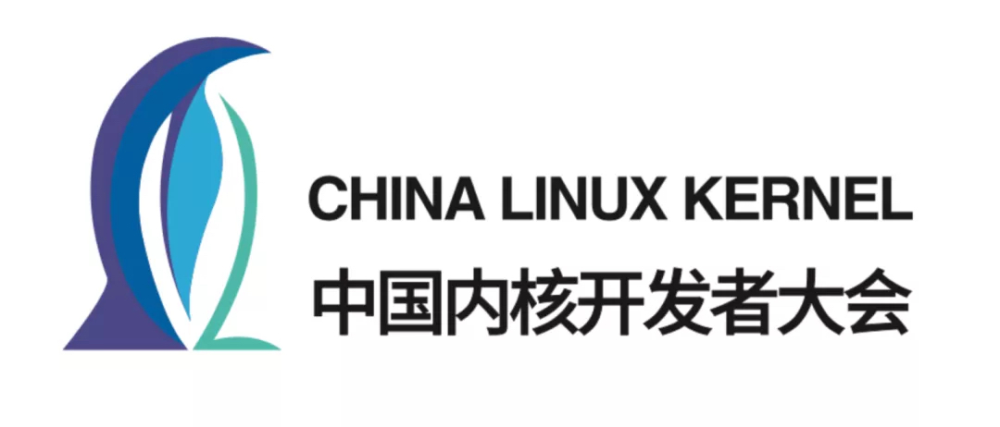

第十八届中国 Linux 内核开发者大会（CLK
）如期而至。CLK
以"自由、协作、创新"为理念，以开源技术的推广和普及为使命，旨在促进 Linux 内核开发爱好者相互交流，共同进步。

经过组委会公开征集承办单位和各意向承办单位的答辩竞选，本届大会的承办方最终确定为PPO，今年，我们计划于 10 月 28 日在广东深圳相聚。与往年不同的是，本届大会稿件的设置，我们将采用公开征稿以及组委会邀请相结合的形式，尽可能丰富会议主题，让更广泛的
Linux
内核活跃开发者参与更热烈的讨论。公开征集稿件环节，将一如往年本着纯技术、非商业的原则，向广大内核爱好者征稿。组委会邀约稿件环节，CLK
导师团将全面分析 2023 年 Linux
社区的活跃主题，向相关活跃开发者通过组委会邮箱发出邀请函。

如下为公开征集稿件环节的说明。

##  征稿主题

演讲主题围绕 Linux 内核展开，接受稿件涉及的技术领域包括但不限于：

-   Linux 与硬件架构的结合（RISC-V，ARM64，X86，LoongArch等）

-   调度与 Linux 实时性

-   内存管理

-   存储与文件系统

-   网络

-   容器与虚拟化

-   微内核与 Linux 内核的结合

-   异构系统下的 Linux

-   性能、功耗优化

-   测试与静态分析

-   Profiling/Debugging/Tracing 技术

我们同时也欢迎涉及Linux内核在IoT、Android与移动设备、车载、云、AI等应用场景深度优化的稿件。

##  征稿时间

征稿开放时间：2023 年 9 月 22 日征稿截止时间：2023 年 10 月 10 日

##  征稿要求

严格按照征稿时间提交相关内容。征稿初期，**需要提供作者简介（不少于
150 字）、 稿件的标题和内容简介（不超过
500 字）**，不需要提供完整的文稿。通过评选的社区演讲者，需要提供 PPT
演讲材料。

##  投稿方式

请将稿件电子版投送至
E-mail：clk_committee@126.com。**如下为组委会邀请稿件环节的说明。**

##  邀稿时间

组委会发出邀请：2023 年 10 月 12 日或之前受邀讲师答复截止时间：2023 年 10 月 15 日

##  专家评选

本届会议的征稿和邀稿主题，均由 CLK
导师团评审或发起，导师团名单详见[[《2023
CLK大会启动！委员会和导师团名单公布，承办单位开放报名》]](http://mp.weixin.qq.com/s?__biz=MzA5Mzg2MjU3MQ==&mid=2647507839&idx=1&sn=b67c0a3620cf5276b0402487f5ec35fe&chksm=886e0cbbbf1985ad2e7aa11933c943ca32bfb1dcc7af6a2d7f0e8649dd9d952a5d99a763564a&scene=21#wechat_redirect)。

两类稿件结果将于同一时间发布，发布时间：2023 年 10 月 18 日

演讲 PPT 截止提交时间：2023 年 10 月23 日

##  大会时间地点

2023 年 10 月 28 日 广东深圳

##  联系我们

大会官网：ckernel.org

大会微博：中国 Linux 内核开发者大会

微信公众号：Linux 内核开发者大会

联系邮箱：clk_committee@126.com
