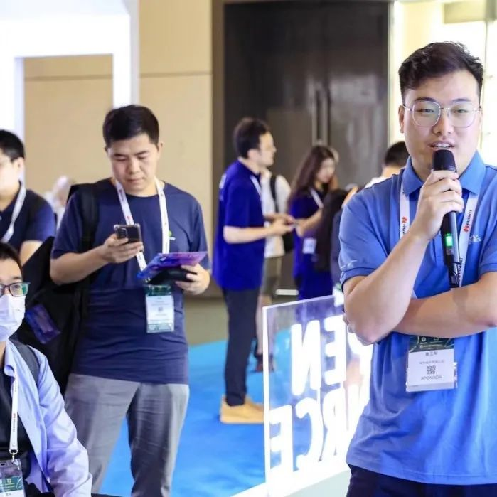
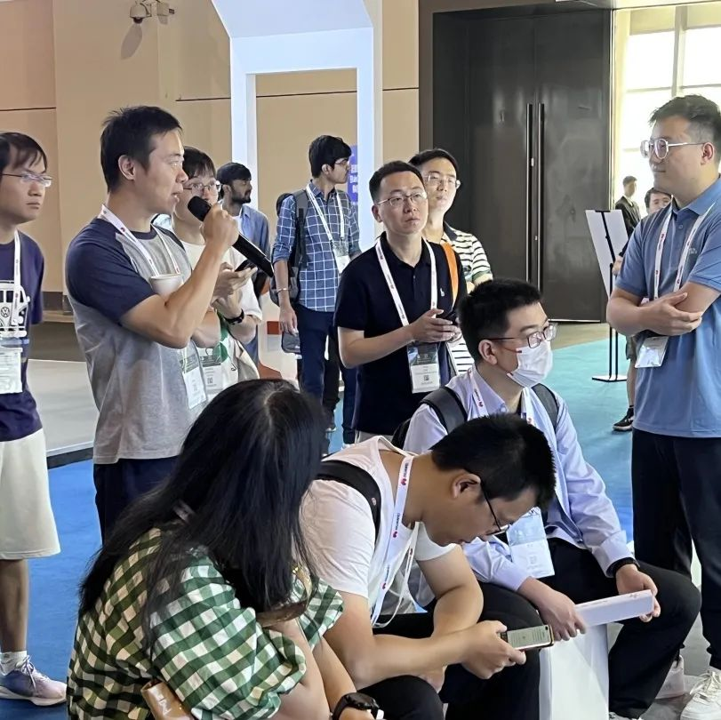
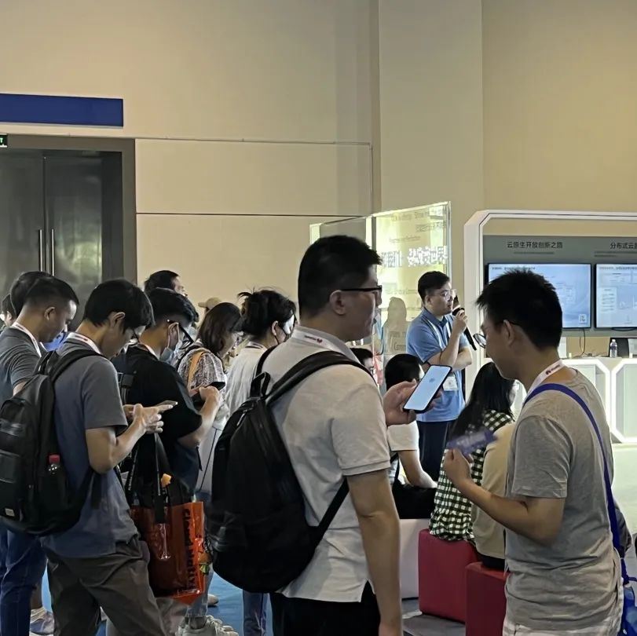
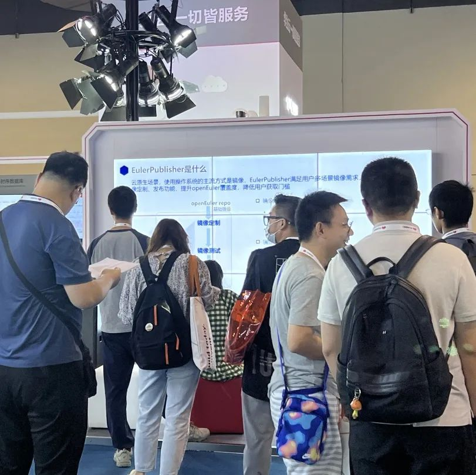
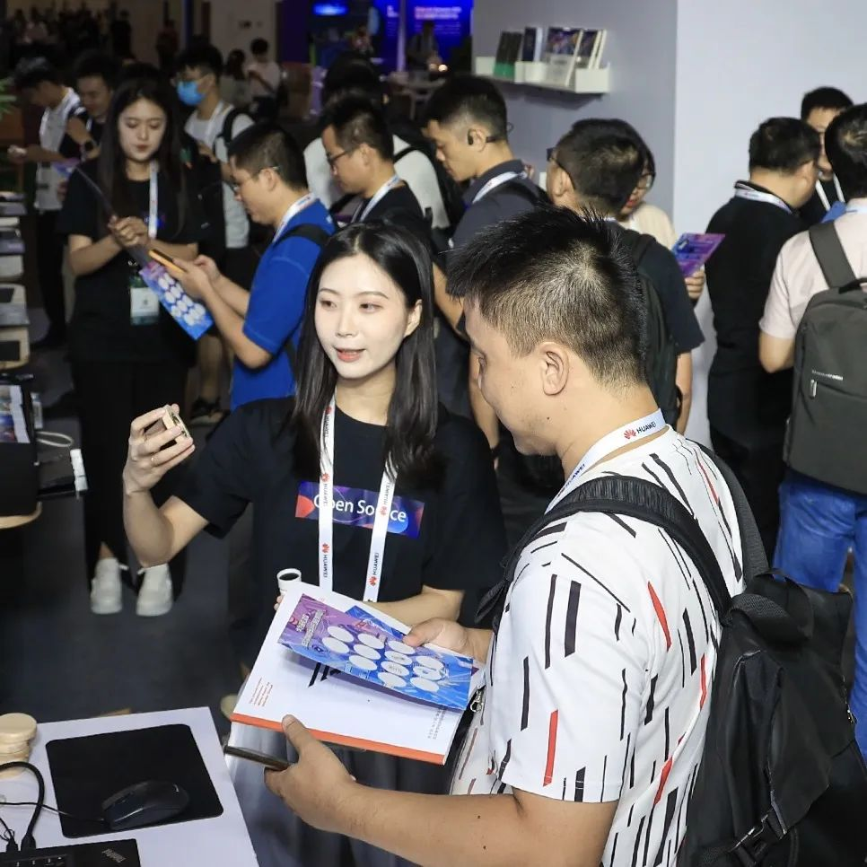
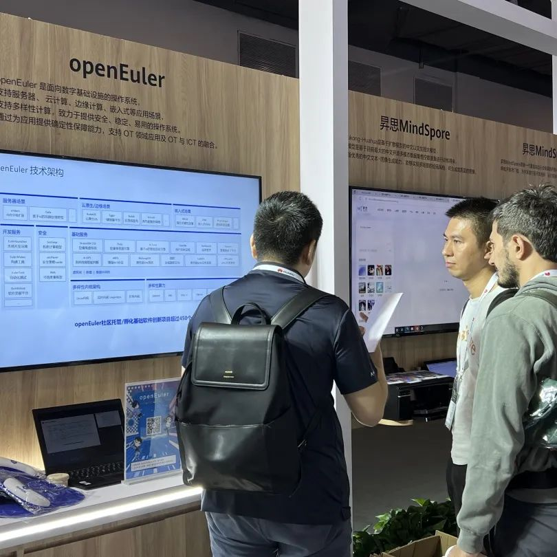
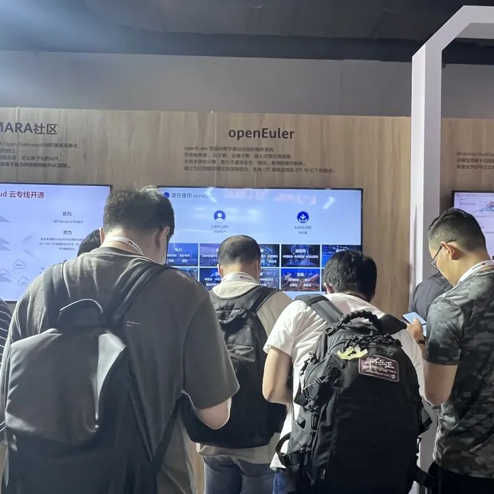
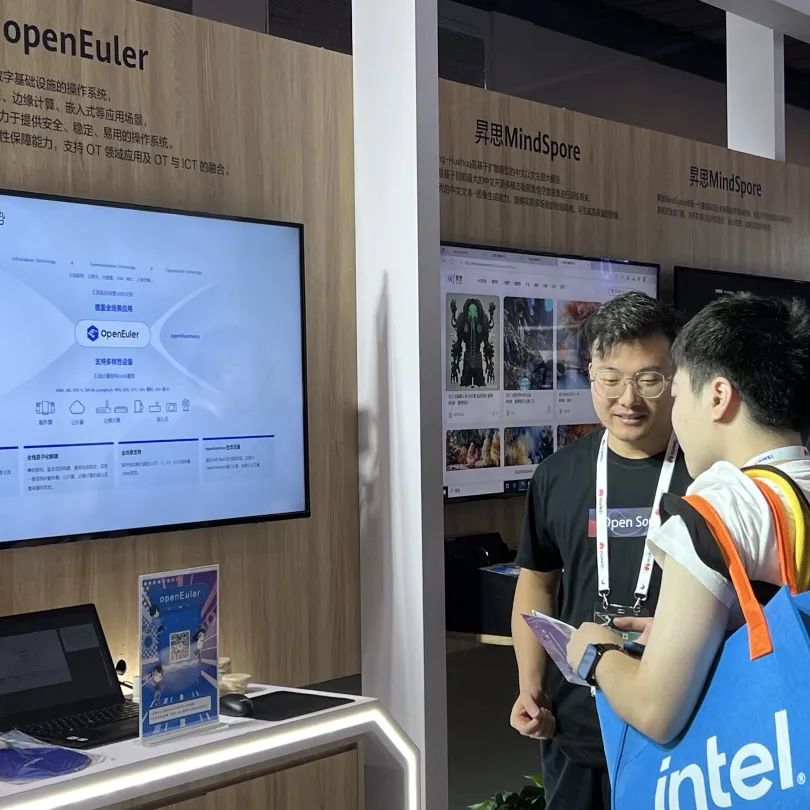

由 Linux 基金会、云原生计算基金会（CNCF）主办的 KubeCon +
CloudNativeCon + Open Source Summit China 2023 于2023 年 9 月 26-28
日在上海举办。**openEuler
团队在本次峰会的OpenSpeech带来议题分享，此外还有展台活动！**

## openEuler 议题

今天 （9 月
28日）是踏入KubeCon的第三天，活动非常丰富。**来自openEuler社区的鲁卫军分享了社区创新项目---EulerPublisher**。云原生时代，云镜像及容器镜像是用户使用OS的主流形态，这与OS社区典型的ISO发布有较大区别；同时，各公有云平台对OS镜像的具体要求各有不同，这对于OS开源社区提出了新的挑战。针对云原生场景下用户定制和获取openEuler镜像难这一痛点，鲁卫军老师为大家介绍了EulerPublisher。**EulerPulisher可以对接AWS、华为云、腾讯云、阿里云等主流云平台，DockerHub等主流容器镜像仓库，提供自动构建、测试、发布openEuler镜像的能力，能极大地提升发布效率。\
鲁卫军老师还为大家展示了目前EulerPublisher取得的成果，以及未来的规划，并且希望更多开发者参与其中，共同打造EulerPublisher。

## openEuler 展台活动

在本次峰会中，openEuler在展台空间也有很多精彩的展示。展台上有openEuler社区情况，技术优势和应用场景的展示、开源大咖面对面等，我们还准备了现场活动，参加展台活动就有机会可以把openEuler定制礼品带回家！现场人气十分火爆！

KubeCon China
2023已经落下帷幕，但年轻一代的开源之窗才刚刚被开启。本次KubeCon
2023中，openEuler社区专家分享了社区创新工具\--EulerPublisher的最新研究成果和实践经验，展示了openEuler社区创新工具的蓬勃发展，为开发者带来新视野和新思路。\
相关链接：EulerPublisher: https://gitee.com/openeuler/eulerpublisher
