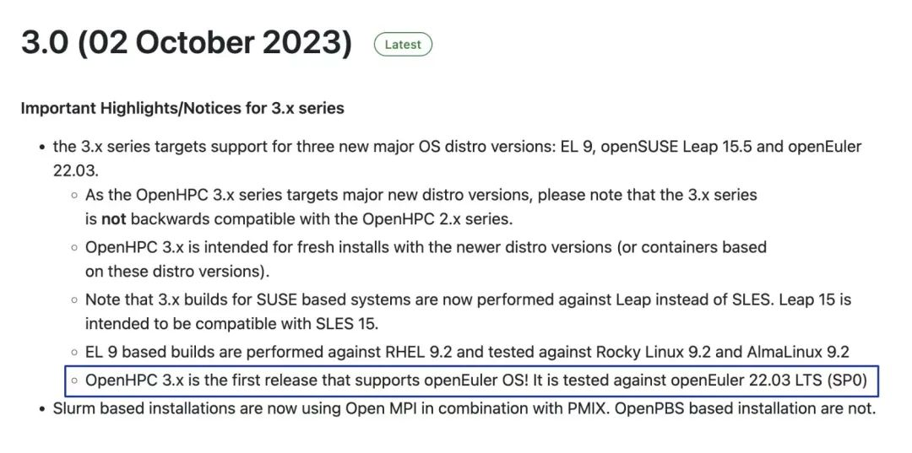
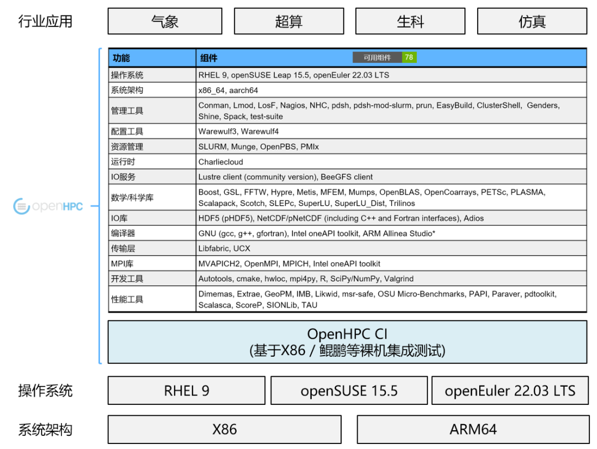

近日，OpenHPC社区宣布最新版本OpenHPC v3.0 for
openEuler发行，并为openEuler社区用户提供了详细的安装指引，帮助用户在openEuler上利用OpenHPC快速部署HPC集群、使用HPC基础软件栈。

据了解该版本添加了针对openEuler 22.03
LTS版本的支持，**这是首个支持openEuler的OpenHPC版本，意味着OpenHPC中的重要HPC组件（例如MPI库、运行时、资源管理）在openEuler平台上直接可用，全球HPC用户可以更方便地部署使用openEuler。**

openEuler社区与OpenHPC社区共同合作，开发、测试CI深度集成，OpenHPC社区的每个新增特性、问题修复在合入前均会自动进行单元测试、集成测试。从而保证OpenHPC所有组件在openEuler上持续可用。

在HPC领域，openEuler社区全面支持多样性算力，包括ARM64，X86等各种架构的处理器。在CICD流程中已经融入了鲲鹏，intel等芯片的支持。 

未来， openEuler
开源社区将继续与用户、上下游伙伴等携手并进，积极融入全球HPC开源体系，深入HPC场景创新，加速行业应用。

## 相关链接：

1.  OpenHPC 3.0安装指南: https://github.com/openhpc/ohpc/wiki/3.x#openeuler-2203-lts

2.  OpenHPC 3.0版本：https://github.com/openhpc/ohpc/releases/tag/v3.0.GA

## 关于OpenHPC

 OpenHPC是Linux基金会项目，其使命是提供开源HPC软件组件和最佳实践的参考集合，从而降低部署，升级和使用现代HPC方法和工具的障碍。OpenHPC社区用户登记的集群物理节点数超过2W，用户来自100+国家，月访问IP
10W+，其中来自中国的仓库访问量占35%。
