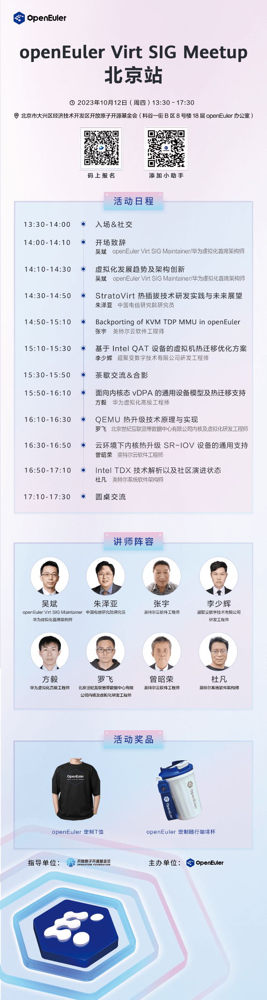

**10月12日， openEuler Virt SIG 将在北京举办一场虚拟化技术交流的
meetup。本次交流会邀请了多位来自Intel、中国电信、超聚变、北京世纪互联、华为的技术专家**，分享他们在虚拟化技术领域的经验和见解，欢迎大家报名参加。\
openEuler Virt SIG
致力于打造面向全场景、支撑多样性算力的虚拟化解决方案，负责 openEuler
虚拟化相关组件社区技术发展和决策，相关软件包的规划、升级和维护，并及时响应
openEuler
虚拟化产品用户反馈和解决虚拟化相关问题。我们乐于和广大开发者积极交流，探索虚拟化领域的技术和未来。\
**活动信息**

**时间**：2023年10月12日（周四） 13:30-17:30

**地点**：北京市大兴区经济技术开发区开放原子开源基金会（科谷一街 B 区 8
号楼 18 层 openEuler 办公室）

无论你是虚拟化技术的专家、爱好者，或者是对该领域感兴趣的开发者，这都是一个极好的机会来学习、分享和交流。

## 扫码报名

请扫码填写报名表，参加 openEuler 虚拟化技术交流的
meetup，与虚拟化领域的技术专家面对面，开启虚拟化技术与未来的探索之旅。

扫码报名

## 活动议程

