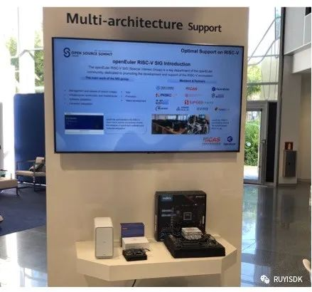
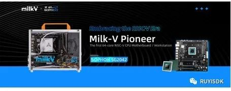
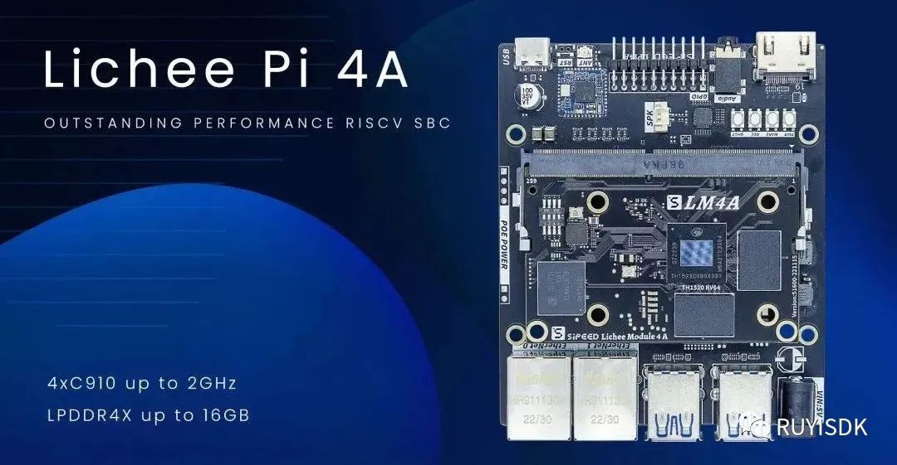
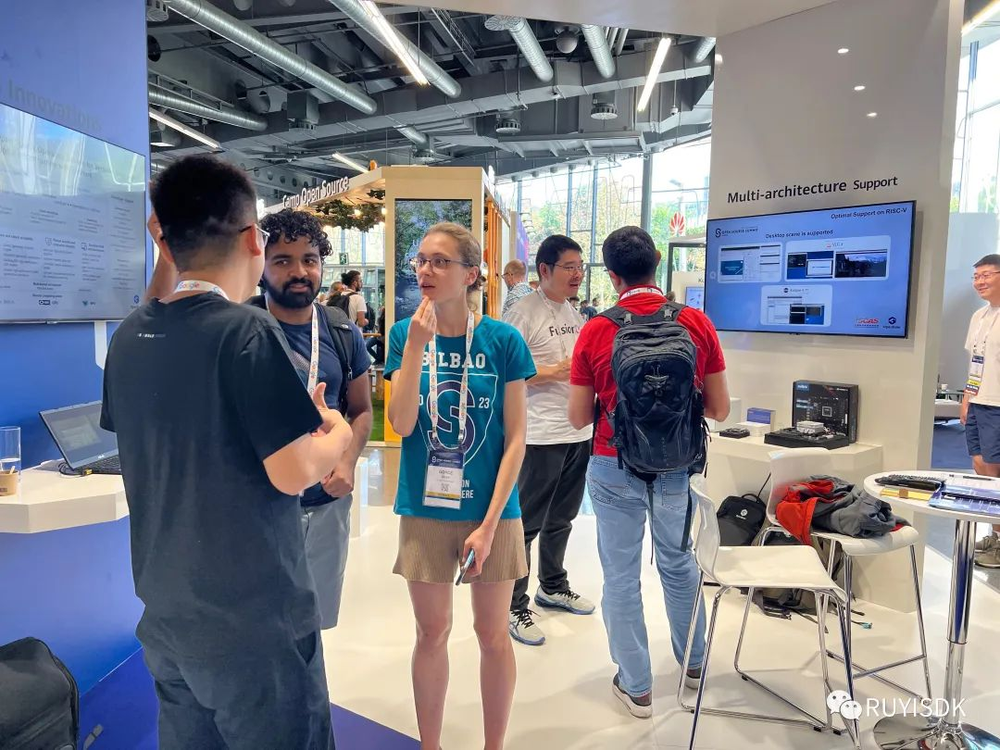

**2023年9月19日至21日，全球顶级开源峰会 OSSUMMIT EU 2023
在西班牙的比尔巴鄂隆重举办。这一由Linux基金会主办的顶尖开源活动，成功汇聚了全球开源开发者、技术专家以及高校和科研机构的代表，一同探讨和分享开源技术的创新与未来趋势，在众多精彩议程中，openEuler
RISC-V 的展示无疑成为了一大亮点。**

本次峰会上，openEuler RISC-V 借助 Milk-V 和 Sipeed
矽速科技的硬件，展示了其在 RISC-V
架构上的运行效果，充分展现了openEuler在此架构上的强大兼容性和广阔的应用前景，并预告了即将发布第一款面向商业生态的
RISC-V 架构长期发行版。与会的国际开源人士对openEuler
的多架构支持和创新技术展现出浓厚的兴趣，并进行了热烈的交流，他们对其迅速的发展表示赞叹，并迫切希望能够亲自体验。

Milk-V 的这款 Pioneer 主板集成了高性能的64核RISC-V CPU ------ 算能
SG2042，最高主频可达2 GHz。与常见的 RISC-V 单板计算机不同，它采用标准
mATX 尺寸，支持高达128GB ECC 内存，提供多个 10Gbps USB 3.2、双 NVMe SSD
插槽、无线 WiFi 6 扩展、多路 SATA 口及标准 PCIe
卡扩展。强大的性能和丰富的扩展性使其在 RISC-V
生态中脱颖而出，为开发者提供了一个高性能的多功能硬件平台，无疑是 RISC-V
爱好者和专业人士的首选。

Sipeed矽速科技推出的 LicheePi 4A
是首款与树莓派4性能相匹敌的RISC-V开发板，基于 TH1520 模组，搭载 4 核
2.0GHz C910 内核、4TOPS NPU 和 50GFLOPS
GPU，为开发者提供强大的性能，满足各种应用场景需求。除此之外，它还支持千兆以太网、USB
3.0、HDMI
2.0等丰富外设，并集成WiFi、蓝牙及MIPI接口。这些丰富的硬件特性使得
LicheePi 4A
成为一个功能强大且灵活的开发平台，满足开发者在各个领域的需求。

**Milk-V 和 Sipeed 作为两大展示平台，向与会者和全球开源社区展示了
openEuler 在 RISC-V 架构上的上的流畅运行和高度优化，也让人们看到了
RISC-V
的实际应用和潜在价值。**此次展示不仅增强了openEuler在全球操作系统领域的影响力，也为RISC-V架构在未来的发展和应用打下了坚实的基础。随着更多的开源项目和企业选择
RISC-V，相信openEuler 将在未来的技术生态中扮演更加重要的角色。

### 联系我们

如果您对 RISC-V 感兴趣，欢迎加入 RISC-V SIG 交流群，讨论更多关于 RISC-V
的更多内容，为推动 openEuler & RISC-V 生态贡献力量！

中科院软件所吴伟微信

**添加请备注 oerv**

### 关于作者

杨延玲，中科院软件所 PLCT 实验室实习生，openEuler社区 RISC-V SIG
成员，目前在温州大学读研二，负责协助RISC-V SIG 和 ROS SIG 的日常运营。
