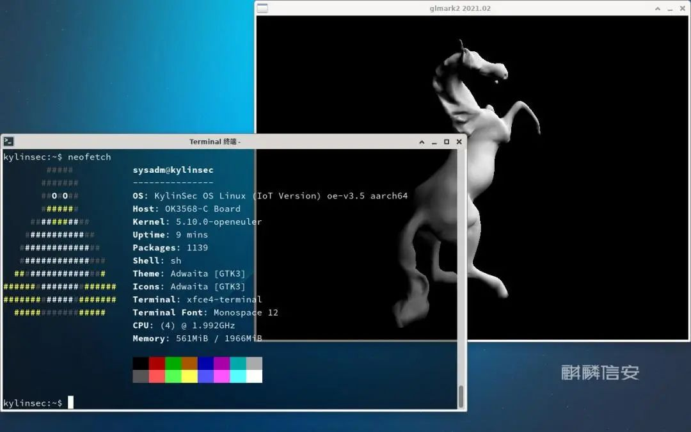
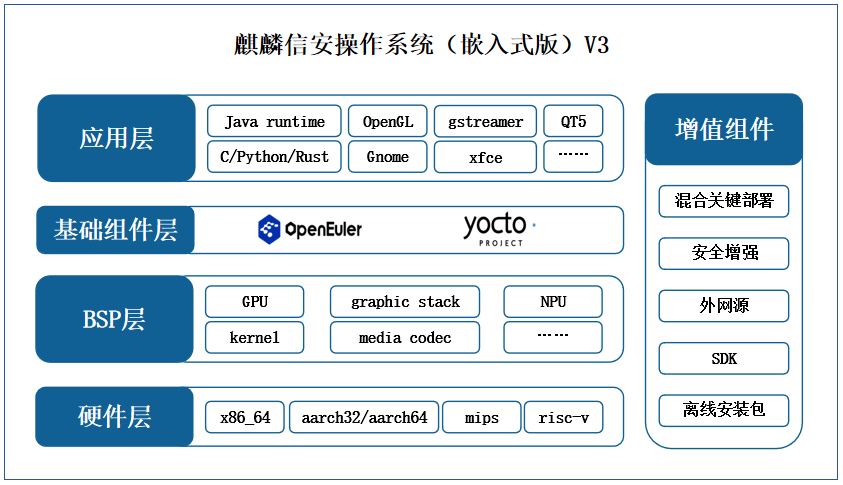
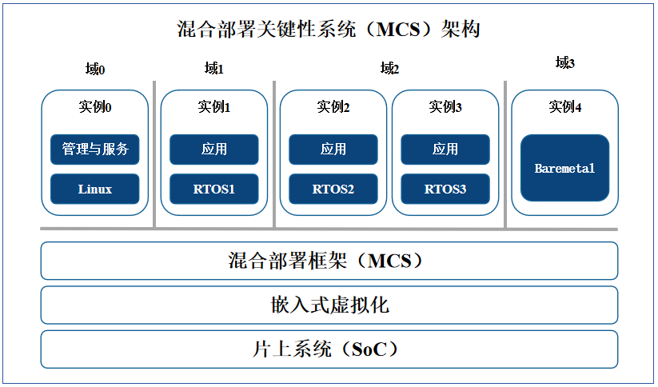

随着万物互联和工业领域数智化时代的到来，嵌入式应用日益广泛，嵌入式系统技术已成为促进智能制造快速发展的关键要素之一。麒麟信安作为国产操作系统领军企业，始终走在行业前列，**本次发布的麒麟信安操作系统（嵌入式版）V3基于openEuler Embedded 23.09构造，同时兼容Yocto社区4.0版本（Kirkstone），增加麒麟信安增值功能软件包并搭配麒麟信安原厂专业技术服务，支持X86_64、AArch32、AArch64、MIPS和RISC-V共计五款指令集架构，使能工业控制、机器人、云边端协同等用户创新场景。**

麒麟信安操作系统（嵌入式版）V3可高效满足重要领域对工业控制系统的安全性和可靠性需求，**尤其针对指令实时控制、实时响应要求高的场景**，不仅能准确高效地执行控制指令并按预期做出响应、运行实时任务，而且支持多OS混合部署，可同时部署实时操作系统和通用Linux，通过通用Linux承担提供开发工具等能力。

##   **典型应用场景**  **上天入地，智能升级**   

嵌入式操作系统在工业等领域中应用广泛，对设备运行至关重要，实现嵌入式操作系统的自主创新对工业安全、信息安全具有重要意义。

麒麟信安操作系统（嵌入式版）V3可用于工业自动化、航空航天、轨道交通和能源电力等行业领域，例如：

**在工业自动化领域**，帮助实现实时控制和监控，可应用在工控设备、机器人、自动化生产线和智能网关等场景中，从而提高生产效率和质量；**麒麟信安操作系统（嵌入式版）已在电力智能监控系统便携式运维网关中大规模应用，提高了电力系统的运维效率和可靠性，为电力行业的发展和安全提供了有力支持；**

**在汽车电子、航空航天等领域**，提供实时控制和数据处理能力；

**在物联网设备领域**，如智能家居、智能城市、智能交通等，实现设备之间的互联和数据交换，实现智能化控制和管理。

##   **新增特性**   **创新迭代，持续优化**   

默认使用基于OPKG的包管理器，提供软件包外网源；

改进源码获取机制，**系统跨架构重复构建加快50%；**

Yocto元数据基线升级到**4.0版本（Kirkstone）**，以获得最新功能、改进和安全性增强，支持最新的硬件平台，并能够获得社区的支持和参与；

支持更多Rockchip板卡，如RK3568和RK3588，具有更快的时钟速度、更多的核心和更高的计算能力；

**支持RISC-V版卡**，具有低功耗、高性能和可扩展性等优势；

形成了一套相对完整的开发工具体系，包含能够有力支持嵌入式开发工作的软件开发工具包(SDK)、嵌入式系统仿真方案和集成开发环境(IDE)；

生态兼容性扩大，支持X86_64、AArch32、AArch64、MIPS和RISC-V共计五款架构，支持外设驱动移植，能够兼容主流工控外设；并在内核态进行了大量针对实时性优化的同时，提供了丰富的用户态配套工具。

## 产品特点

## 高效实时，安全可靠

### 01、多OS混合部署

目前工控设备、航天设备、机器人系统、智能车系统对功能和生态的需求日益丰富，对实时性、可靠性、安全性提出了更高的要求，由单一OS承载所有功能面临的挑战越来越大。针对市场需求，麒麟信安操作系统（嵌入式版）V3产品具备了混合部署关键性系统(MCS,
Mixed Criticality
System)功能，实现在一颗SoC芯片中部署多个操作系统，同时提供Linux的服务管理能力以及实时操作系统带来的高实时、高可靠的关键能力。

### 02、强实时

通过使用实时Linux内核，在内核中增加高精度时钟、新增进程优先级标注与继承技术，实现进程的实时调度。针对中断响应进行线程化改造，提高了中断的响应效率。**经过测试，麒麟信安操作系统（嵌入式版）V3产品的调度延迟小于25微秒。**

### 03、高安全

麒麟信安操作系统（嵌入式版）V3产品继承麒麟信安通用操作系统的高安全特性，具备三权分立、多因子身份认证、强安全身份认证策略和强制访问控制等特性。

### 04、可定制

嵌入式操作系统的可定制能力是衡量厂商技术实力、工程能力的关键指标之一。麒麟信安操作系统（嵌入式版）V3能够根据用户应用需求进行灵活定制和配置，满足不同嵌入式设备的特定需求，提高系统的效率、性能、可靠性和安全性。

### 05、高可用

通过提高硬件、软件、网络与业务系统的高可用性，确保麒麟信安嵌入式系统在面对各种异常情况和故障时能够快速恢复，并保持正常运行。

### 06、易维护

提供丰富的系统工具，提升了系统在开发、部署和维护过程中的可管理性和可维护性，并具备丰富的调试工具和日志记录功能，帮助运维人员快速定位和解决问题。

伴随物联网和人工智能快速发展，嵌入式操作系统在智能系统中发挥越来越大的作用。面对多元化应用场景，麒麟信安不断沉淀技术、打磨产品，持续研发投入、释放创新活力，在操作系统自主创新征程中攻坚克难、砥砺前行，为数字经济发展筑牢安全底座。
