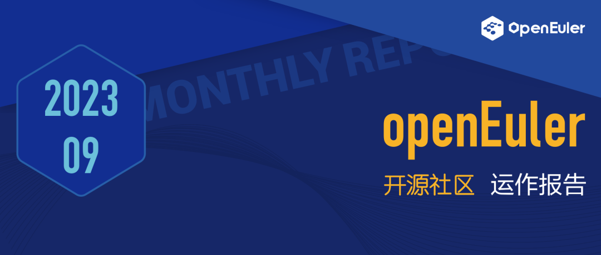

## 概述

经全体TC委员商议通过，openEuler
2023年年度优秀项目评选正式启动。任意3名以上社区参与者联名，可以向
tc@openeuler.org 推荐您认可的项目。

技术方面，openEuler 23.09 创新版发布，该版本采用 EulerMaker
构建服务器、云计算、边缘计算镜像。新增代码主要集中在 Linux Kernel 6.4
特性继承、基础软件包版本选型升级、异构通用内存管理框架
GMEM、统一容器运行时框架 Kuasar、ROS2
humble、utshell、utsudo。内核代码新增 18 万行，主要集中在 CFS
带宽控制改进、支持多代 LRU（Multi-Gen
LRU）、支持开放式编码迭代器、支持用户定义的 BPF 对象、支持 ARM 架构 SME2
和 SME2.1 新特性。同时，openEuler
23.09可支持用户在本地部署和使用开源大模型。

其他工作上，由Security Facility SIG维护的DIM（Dynamic Integrity
Measurement）动态完整性度量特性在社区开源。FangTian视窗引擎完成对接ArkUI应用开发框架，使得openEuler初步具备运行鸿蒙ArkUI应用的能力。在基础设施团队的推动下，openEuler
23.09
WSL应用已同步上线微软商店；社区缺陷公告的生成和发布系统、基于openEuler
22.03-LTS-SP2版本的在线man手册也已上线官网，方便开发者查阅使用。BigData
SIG新增创新项目vectorBlas 和
omnidata-hive-connector，并积极拓展openEuler与Apache社区的生态合作等等。

在生态拓展上，OpenHPC社区发布了新版本OpenHPC v3.0 for
openEuler，这是首个支持openEuler的OpenHPC版本，意味着OpenHPC中的重要HPC组件在openEuler平台上直接可用。

在本月的活动中，openEuler与OpenAtom基金会首次联袂参加在西班牙举办的国际开源峰会OSSUMMIT
2023。在华为全连接大会、KubeCon China
2023等一系列活动上，openEuler携手伙伴积极参加，向全球开发者多方面展现社区繁荣生态。

感谢社区用户与开发者对openEuler的贡献和支持。本月报阅读时长预计20分钟。欢迎细品。

## 社区规模

截止2023年9月底，openEuler社区用户累计超过189万。一万六千余名开发者在社区持续贡献。社区累计产生
132.9K 个PR、68.3K 条Issue。截至目前，加入 openEuler 社区的单位成员超过
1100 家，9月新增 42 家。

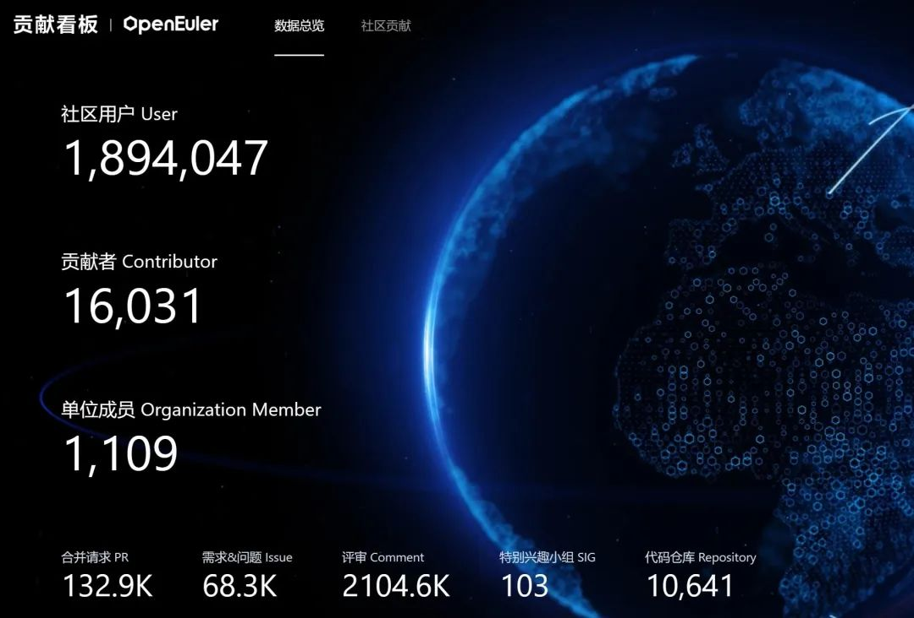

社区贡献看板（截至2023/09/30）

## 社区事件

### openEuler亮相全球顶级开源峰会OSSUMMIT

### 持续推动智能化未来的实现

2023年9月19日，为期3天的欧洲顶级开源峰会OSSUMMIT 2023（Open Source
Summit Europe
2023）在西班牙举办。openEuler作为开放原子开源基金会旗下的项目，本次以钻石级别赞助参会。**这也是openEuler和OpenAtom基金会首次联袂在国际舞台上进行展示和亮相**。

峰会首日，openEuler技术委员会主席胡欣蔚在Keynote环节发表主题演讲\"openEuler:
Ushering in a Future of Intelligent, Diversified
Computing\"。峰会现场，openEuler持续输出，向全球的开发者分享社区在全场景创新、多样性算力、人工智能等方面取得的进展和成果，并携手超聚变、中科院软件所等伙伴共同展现社区繁荣生态。

相关阅读

-   [[openEuler亮相全球顶级开源盛会OSSUMMIT 2023，持续推动智能化未来的实现]](https://mp.weixin.qq.com/s?__biz=MzI2NDE4OTE2Mg==&mid=2247506859&idx=1&sn=3c614f44f8bdca57845fe1766e3f5594&chksm=eab2fe2eddc57738ef541b39a31fc127ca76867aec5699fbf295020b89fa2fb2450bf9e79630&token=206672917&lang=zh_CN&scene=21#wechat_redirect)

-   [[开源大咖说 \| openEuler:技术引领，走向世界]](https://mp.weixin.qq.com/s?__biz=MzI2NDE4OTE2Mg==&mid=2247507036&idx=1&sn=947b6c39b52aaa3e4c025f8534028621&chksm=eab2f9d9ddc570cf336d20a2dc895eb0f69fb6be9674cf92b90837c3e7298df2316b1071dfea&token=206672917&lang=zh_CN&scene=21#wechat_redirect)

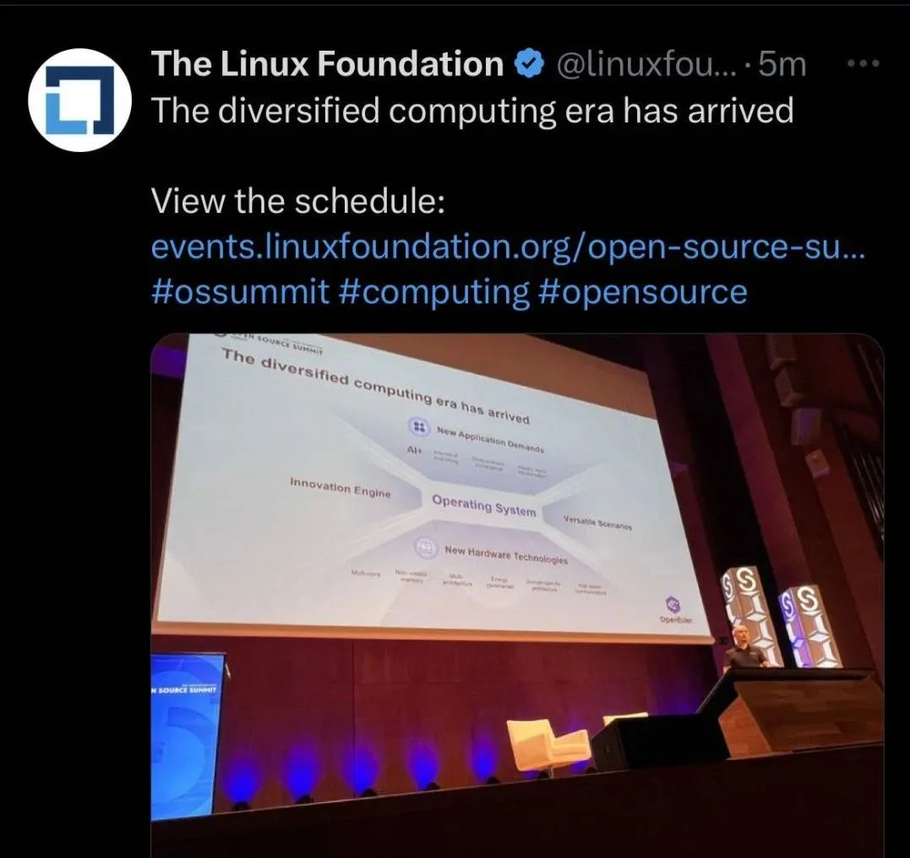

### 华为全联接 2023，openEuler使能AI更高效

华为全联接大会 2023（HUAWEI CONNECT 2023）于
9月20-22日在上海举行。同期，"openEuler 使能全场景创新
夯实算力底座"分论坛成功举办。

大会期间，openEuler
充分展现操作系统AI能力上的技术演进和全场景创新能力的升级。**openEuler作为首个广泛支持AI的开源操作系统，颠覆了传统的命令行交互方式，基于大模型，训练出了
EulerCopilot，初步实现代码辅助生成、问题智能分析、辅助运维等功能。**此外，openEuler通过异构资源统一管理与调度，实现CPU和XPU的深度融合，有效提升AI训练和推理性能。

在分论坛上，麒麟软件、统信软件、麒麟信安、中国电建华东院、软通动力等社区伙伴及行业大咖分享了基于
openEuler 的行业解决方案，充分展示了 openEuler 开源项目的运作成果。

相关阅读

-   [[以 AI 赋能openEuler更智能，以openEuler使能 AI更高效]](https://mp.weixin.qq.com/s?__biz=MzI2NDE4OTE2Mg==&mid=2247506918&idx=1&sn=f8ec684dffeb1f595d65b933a2dcb219&chksm=eab2fe63ddc57775dba0deb61fee2699541b58ebfb269e0d9063b35c1332ea0a9bcf5c9fa2bf&token=206672917&lang=zh_CN&scene=21#wechat_redirect)

-   [[HC2023 |openEuler使能全场景创新，夯实算力底座]](https://mp.weixin.qq.com/s?__biz=MzI2NDE4OTE2Mg==&mid=2247506967&idx=2&sn=92b816deebb30bcab7e51cc0b1bcab8c&chksm=eab2f992ddc57084b348de47aa985449e29f6081925c60a42db6472f702513b6daabf517f6be&token=206672917&lang=zh_CN&scene=21#wechat_redirect)

-   [[HC2023 |融合编译，协同优化，释放多样算力最大性能]](https://mp.weixin.qq.com/s?__biz=MzI2NDE4OTE2Mg==&mid=2247507036&idx=3&sn=a49c0b3a556f02faaea1648fed296bab&chksm=eab2f9d9ddc570cf1e6477e256b300f7751816415e463e774234fc9f35a58528eb8db56d010b&token=206672917&lang=zh_CN&scene=21#wechat_redirect)

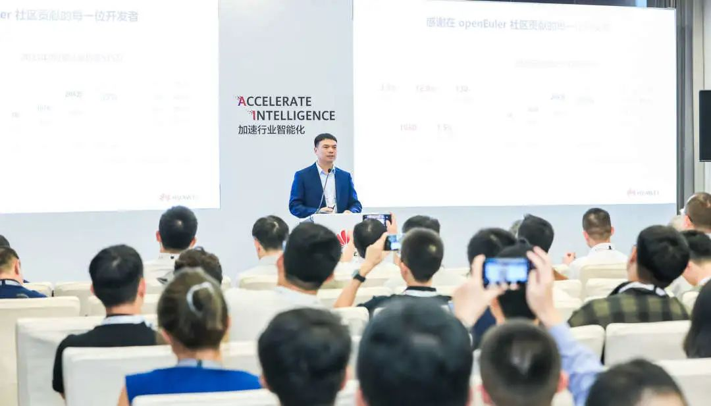

### openEuler 23.09 创新版发布

### 深化全场景创新，加速AI训练推理

 9 月 30 日，openEuler 23.09 创新版正式发布，该版本采用 EulerMaker
构建服务器、云计算、边缘计算镜像。版本代码总计 9.1 亿行。相比 openEuler
23.03，新增代码 8900 万行。新增代码主要集中在 Linux Kernel 6.4
特性继承、基础软件包版本选型升级、异构通用内存管理框架
GMEM、统一容器运行时框架 Kuasar、ROS2 humble、utshell、utsudo。

内核代码新增 18 万行，主要集中在 CFS 带宽控制改进、支持多代
LRU（Multi-Gen LRU）、支持开放式编码迭代器、支持用户定义的 BPF
对象、支持 ARM 架构 SME2 和 SME2.1 新特性。

openEuler 社区软件包新增 2443 个，总数超过 3.5
万个，与国际主流操作系统社区的软件包数量持平。

[原文阅读\>\>\>](https://mp.weixin.qq.com/s?__biz=MzI2NDE4OTE2Mg==&mid=2247507102&idx=1&sn=b17d8b922dfe40d0c46ea1989d49ffe1&chksm=eab2f91bddc5700d7600978f448bbdf0598e31cfbd832667a8a2bf4b6cb72c365f4e574f8aaf&token=696475523&lang=zh_CN&scene=21#wechat_redirect)

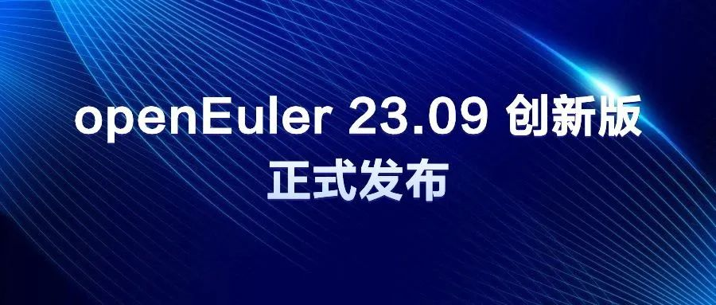

### OpenHPC 社区宣布正式支持 openEuler

近日，OpenHPC社区宣布最新版本OpenHPC v3.0 for
openEuler发行，并为openEuler社区用户提供了详细的安装指引，帮助用户在openEuler上利用OpenHPC快速部署HPC集群、使用HPC基础软件栈。

据了解该版本添加了针对openEuler 22.03
LTS版本的支持，这是首个支持openEuler的OpenHPC版本，意味着OpenHPC中的重要HPC组件（例如MPI库、运行时、资源管理）在openEuler平台上直接可用。

[原文阅读\>\>\>](https://mp.weixin.qq.com/s?__biz=MzI2NDE4OTE2Mg==&mid=2247507107&idx=1&sn=b92e0011e22b4366baada96e083da764&chksm=eab2f926ddc5703087ca0ae70fd34412d1c1d71fa2b40c9a11352c50883afc49d0db4dfd802c&token=696475523&lang=zh_CN&scene=21#wechat_redirect)

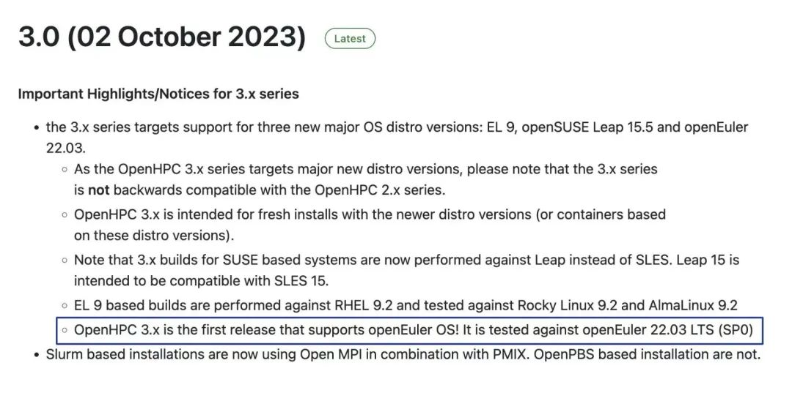

### openEuler 22.03 LTS SP1正式上架腾讯云市场

9月底，经过产品的适配和调试，软通动力信息技术(集团)股份有限公司将openEuler
22.03 LTS SP1 镜像正式上架腾讯云市场，欢迎体验！

地址：https://market.cloud.tencent.com/products/39669

[原文阅读 \> \>
\>](https://mp.weixin.qq.com/s?__biz=MzI2NDE4OTE2Mg==&mid=2247506731&idx=2&sn=98361626cb81a1e3c4bfb879859915e0&chksm=eab2feaeddc577b8c4a3ee14cc87b8d35b4874f5c388eea5f2d12943da5bcc4e4c47711c5826&token=696475523&lang=zh_CN&scene=21#wechat_redirect)

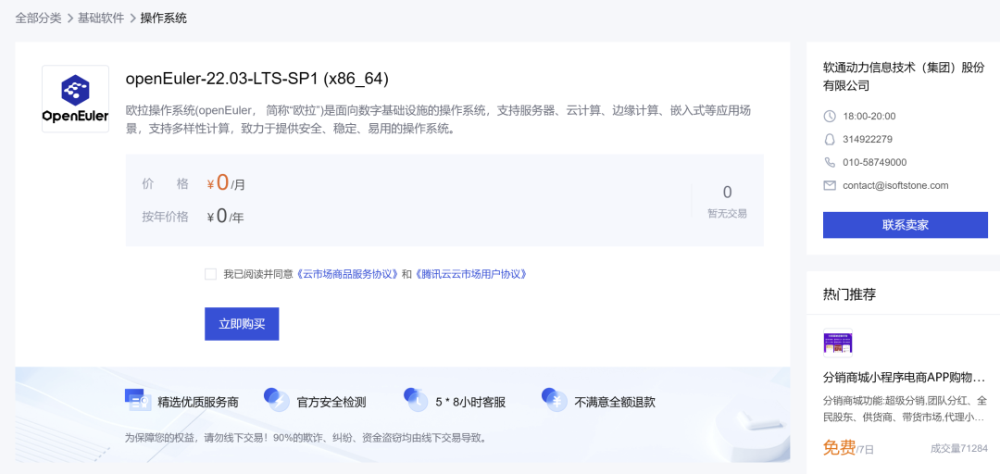

### openEuler参加KubeCon China 2023

9月底，由Linux 基金会、云原生计算基金会（CNCF）主办的 KubeCon +
CloudNativeCon + Open Source Summit China 2023（简称KubeCon China
2023）在上海举办。openEuler社区专家鲁卫军发表的演讲《EulerPulisher：面向云原生的OS发布工具》，获得现场开发者的关注。

[原文阅读\>\>\>](https://mp.weixin.qq.com/s?__biz=MzI2NDE4OTE2Mg==&mid=2247507096&idx=2&sn=abbb2a345964f79b39bb0de816ae2117&chksm=eab2f91dddc5700be3f698422f3fb90546215da78aca0ad6591f30e759def2e85eb1f87f68a2&token=696475523&lang=zh_CN&scene=21#wechat_redirect)

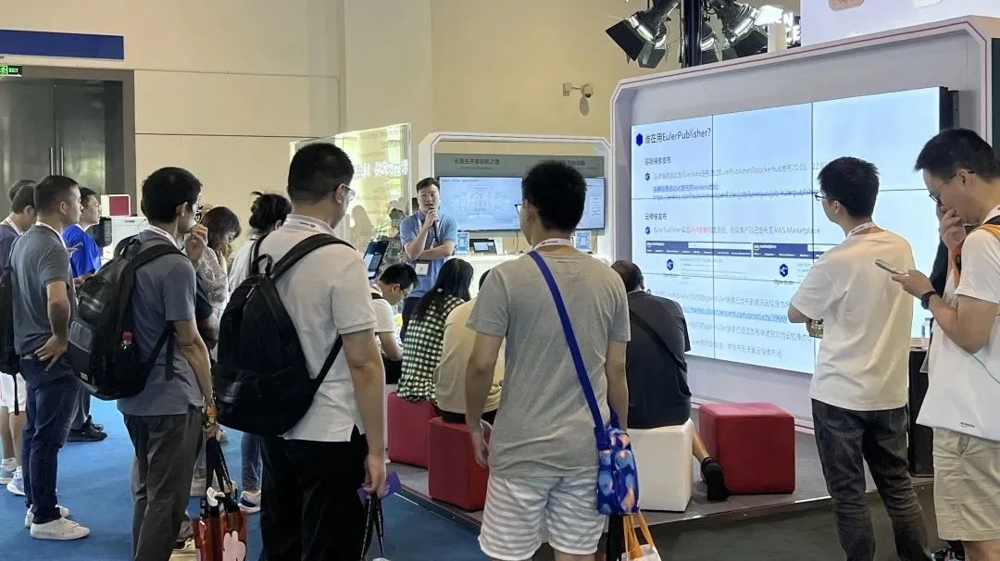

### openEuler走进高校

### 开放原子"校源行" 在哈尔滨举办

9月17日，[[开放原子校源行（哈尔滨站）在哈尔滨工业大学成功举行]](https://mp.weixin.qq.com/s?__biz=MzI2NDE4OTE2Mg==&mid=2247506891&idx=2&sn=74add066c1c665140034aabc632e15f5&chksm=eab2fe4eddc57758e96fe42fc0e04096887c87a462a3742260f8f2831ff181d56b1a3ac64c22&token=206672917&lang=zh_CN&scene=21#wechat_redirect)。openEuler作为开放原子开源基金会孵化的项目，同样积极参与到开源人才的培养当中。openEuler基础软件服务总监邓晖龙分享了《openEuler人才培养的必要性及产教融合实践》，并现场与在校学生代表积极交流。他表示，openEuler社区会继续联合开放原子开源基金会及各产业公司共同提供了竞赛、实习等机会和平台，帮助高校学生快速提升能力。

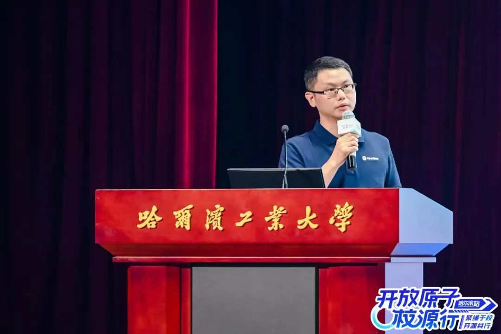

### openEuler G11N SIG 内容英文化实践分享

G11N
SIG致力于为社区网站、文档材料等提供多语言翻译支持，助力构建国际化社区环境。为提升开发者对文档资料的了解，G11N
SIG
于9月19日在社区B站平台直播，围绕G11N服务全景、英文文档撰写、Readme的高质量输出等话题进行全面的实践分享，以期帮助开发者提升文档内容阅读体验。

### openEuler Bigdata SIG 创新项目分享

近期，openEuler Bigdata
SIG在社区开源了两个创新项目：使用Java语言实现的向量化BLAS高性能库[VectorBLAS](https://mp.weixin.qq.com/s?__biz=MzI2NDE4OTE2Mg==&mid=2247505780&idx=1&sn=1e1d493e5b9a79143aa1611d47c979c3&chksm=eab2f2f1ddc57be7229e862630cd42384df3ce51c43f2e92a96854e4d0ed842c0e5caf5cd62a&scene=21#wechat_redirect)，和将大数据组件Hive的算子下推到存储节点上的服务[omnidata-hive-connector](https://mp.weixin.qq.com/s?__biz=MzI2NDE4OTE2Mg==&mid=2247506425&idx=1&sn=e8d145eb41aa1f0dc5adfd0dc5460924&chksm=eab2fc7cddc5756aefd8a23e57eda8b78263ab39916abad6fce7c61fb90731a5f64cb4552c69&scene=21#wechat_redirect)。

为了方便开发者更深入地了解和使用这些项目，Bigdata
SIG于9月14日在社区B站平台进行技术分享，详细介绍各项目的功能、应用场景和优化方法。

### openEuler Compiler Meetup在杭州举办

9月14日，由openEuler Compiler SIG
发起的线下Meetup活动在杭州举办。openEuler、HelloLLVM、CNRV、RISC-V等社区专家、编译器和OS专家齐聚一堂，共同探讨openEuler
Compiler的最新进展和未来发展方向。

会上，社区 Compiler、Kernel、Release、QA、兼容性等SIG组Maintainer围绕"当openEuler遇上LLVM"主题，讨论各SIG在后续发展上对编译器的述求和期望，推动提升LLVM构建openEuler的竞争力。

[原文阅读\>\>\>](https://mp.weixin.qq.com/s?__biz=MzI2NDE4OTE2Mg==&mid=2247506777&idx=1&sn=b5f95edfb99b1c45c96aad0c0b70138d&chksm=eab2fedcddc577cab030c1a2cca9e82816321e3ad430347507a6bdb7fa1a4932285b9bcbcdd1&token=206672917&lang=zh_CN&scene=21#wechat_redirect)

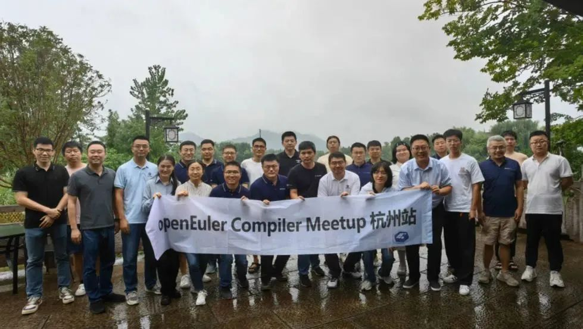

### openEuler嵌入式Meetup在长沙举办

9月8日，由openEuler社区、麒麟信安、湖南欧拉生态创新中心以及湖南大学联合主办的openEuler嵌入式Meetup长沙站在湖南大学成功举办。活动现场，来自openEuler社区、麒麟信安、湖南大学、中国科学院软件研究所的技术专家及50+参会者面对面交流，就openEuler
Embedded、ZVM、LLVM、RISC-V等行业热点议题分享技术见解。湖南大学openEuler技术小组在Meetup上正式成立，进一步加强的校企合作和产学研结合。

[原文阅读\>\>\>](https://mp.weixin.qq.com/s?__biz=MzI2NDE4OTE2Mg==&mid=2247506640&idx=1&sn=377a24de32f3d7aa68b93f1aa5e49eef&chksm=eab2ff55ddc576438af1d8a376161c8c9519a2efa10360d3ad420ef6a02e9e676e1f350900b6&token=206672917&lang=zh_CN&scene=21#wechat_redirect)

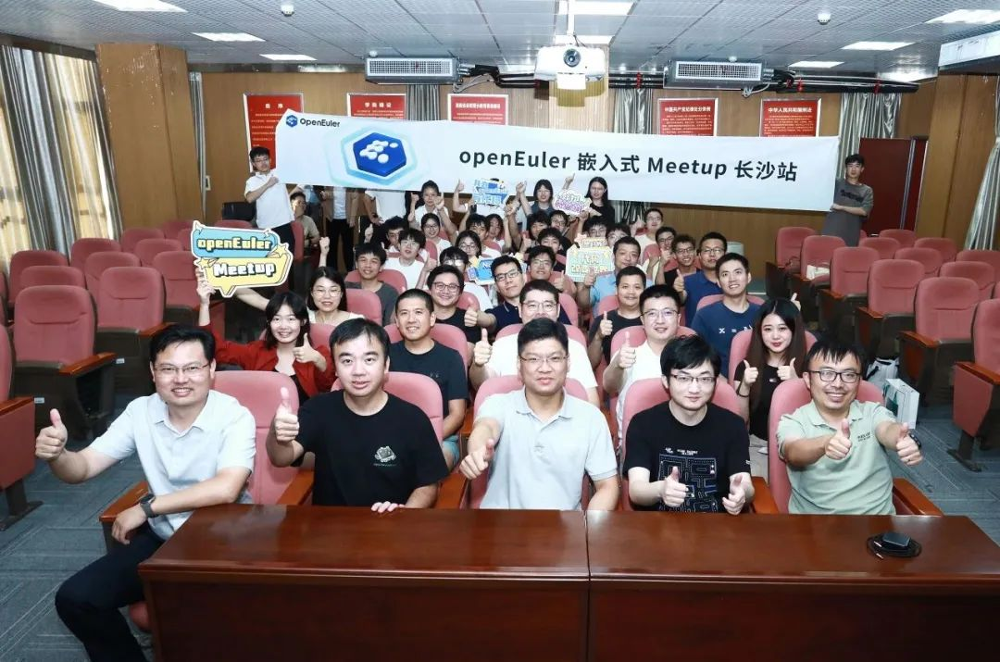

### openEuler西安用户组成立

9月1日，openEuler西安用户组Meetup成功举办。本次活动由openEuler社区、软通动力、陕西鲲鹏生态创新中心联合主办，统信软件协办。软通动力、统信软件、亚信科技、陕西远鑫信息技术、Apache
Doris社区等行业专家齐聚西安，共同探讨openEuler操作系统的应用经验，并分享交流openEuler生态进展、运维经验和实践案例。

活动上，西安用户组正式成立，该组织旨在聚集西安区域的openEuler行业用户，打造一个本地化交流平台，拓展区域用户生态。

[原文阅读\>\>\>](https://mp.weixin.qq.com/s?__biz=MzI2NDE4OTE2Mg==&mid=2247506450&idx=1&sn=dbe6abbbd4b7ea99f5288bcefe35d51d&chksm=eab2ff97ddc57681b78f07ea1adeea21a9b96a4f87890b38429251a2656cd52deaaf4ddaa543&token=206672917&lang=zh_CN&scene=21#wechat_redirect)

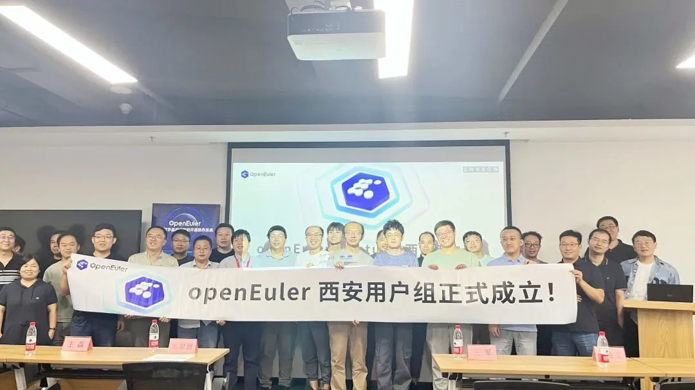

### 开放原子开源大赛openEuler AI应用挑战赛启动

8月29日，由工业和信息化部、江苏省人民政府、湖南省人民政府共同主办的2023开源和信息消费大赛新闻发布会在北京召开，首届开放原子开源大赛正式启动。

作为主流OS社区，openEuler联合超聚变在本次赛事中贡献了赛题：openEuler
AI应用挑战赛。该赛题主要目标是在openEuler平台上适配主流开源AI框架，即参赛者使用openEuler社区相关开发者工具，完成开源AI框架的软件包搭建，并通过完成常用AI模型的部署和使用，实现基于openEuler的AI应用适配和应用。

本赛题奖金总额30w，欢迎感兴趣的朋友参加。

活动报名截止日期：2023年11月9日

[原文阅读 \> \>\>](https://mp.weixin.qq.com/s?__biz=MzI2NDE4OTE2Mg==&mid=2247506615&idx=1&sn=a3d70db0ebb516f24d656773c2a8e081&chksm=eab2ff32ddc57624ba057aff38fa8167d48a581bc0cd0e2df2c778bfbf4e55711ee9f67d0b3e&token=1224708595&lang=zh_CN&scene=21#wechat_redirect)

### 社区论坛贡献值制度上线

为鼓励社区开发者分享交流，互相帮助解决使用中所遇到的问题，openEuler论坛推出贡献值制度。活动期间，开发者登录论坛解答他人疑问、分享经验帖子、点赞评论等均可以获得一定的贡献值。贡献值达到一定数值，还能兑换社区的纪念品。（活动时间：2023/9/19-2023/12/31）

社区论坛：https://forum.openeuler.org/

原文阅读：[[openEuler论坛贡献值制度上线]](https://mp.weixin.qq.com/s?__biz=MzI2NDE4OTE2Mg==&mid=2247506797&idx=2&sn=340a24f2cf054cff732ac309fe8f6f59&chksm=eab2fee8ddc577fe7e2c0ced762b8c33cc6ab1ed16d2d723ac36d9600fc2cf84ce9a651d525b&token=206672917&lang=zh_CN&scene=21#wechat_redirect)

### openEuler 用户案例持续征集中

openEuler社区与社区伙伴们正在共同打造《openEuler开源操作系统行业应用案例集》，以展示openEuler在不同行业的应用场景与优势，为其他用户提供借鉴和参考，共同探索openEuler的更多可能性。

9月精选案例：

-   [[长沙智慧民政国产操作系统迁移，树立政务系统建设优秀示范]](https://mp.weixin.qq.com/s?__biz=MzI2NDE4OTE2Mg==&mid=2247506731&idx=1&sn=ecba9c2d0a8c84350c2e1dc66b4a6247&chksm=eab2feaeddc577b8523ac1b5cae7800846eca0f982553f496d6827c60ca85cc71fd38edafabb&token=1224708595&lang=zh_CN&scene=21#wechat_redirect)

-   [[中移苏州研究院完成服务器操作系统无感知迁移，实现业务高效稳定运行]](https://mp.weixin.qq.com/s?__biz=MzI2NDE4OTE2Mg==&mid=2247506891&idx=1&sn=02241cf6ada44517e854df4e7c53795b&chksm=eab2fe4eddc57758ce3345622b0d5b6777954ac6aea4cc97235df5e29978d3583b09cf2828f9&token=1224708595&lang=zh_CN&scene=21#wechat_redirect)

如果您想投稿案例，欢迎联系 user@openeuler.sh

## 社区治理

### 2023-2024年openEuler技术委员会9月会议摘要

openEuler技术委员会委员通过每月双周例会，及时审视社区各项工作。

在9月的例会中，经技术委员会全体委员商议通过，openEuler 2023
年度优秀项目评选正式启动。截至 2023 年 10 月 15 日
（周日）为止，任意3名以上社区参与者联名，可以向 tc@openeuler.org 推荐您认可的项目。详情可访问[openEuler
2023
年度优秀项目评选启动](https://mp.weixin.qq.com/s?__biz=MzI2NDE4OTE2Mg==&mid=2247506967&idx=1&sn=1af0c35a1b298de505618c499fe4ed5e&chksm=eab2f992ddc57084922ea4c89e5e2bd0e5c5b9114dfb696c9578de67f1bef73056bf014e8baf&token=206672917&lang=zh_CN&scene=21#wechat_redirect)」进行了解。

**朱健伟 接替 魏刚 担任安全委员会主席**

2023年9月20日，经安全委员会全体委员确认同意，openEuler技术委员会全体委员批准，魏刚
卸任安全委员会工作，由 朱健伟 接替其职责，担任安全委员会主席。

朱健伟任职华为，社区安全委员会首批成员，曾参与社区漏洞治理和安全规范体系的建设、主导社区机密计算、可信计算、全栈国密等安全技术的构建。后续他将与其它安全委员会成员一起进一步提升社区安全能力。

\* openEuler安全委员会（SC）是负责接收和响应openEuler产品安全问题报告、提供社区安全指导，开展安全治理的组织，旨在为openEuler用户提供最安全的产品和开发环境。

## 技术进展

### openEuler 23.09可支持用户在本地部署和使用开源大模型

近期，openEuler A-Tune SIG在openEuler
23.09版本引入llama.cpp&chatglm-cpp两款应用，以支持用户在本地部署和使用免费的开源大语言模型，CPU机器上也能运行。

大语言模型（Large Language Model,
LLM）是一种人工智能模型，旨在理解和生成人类语言。openEuler通过集成llama.cpp&chatglm-cpp两款应用，降低了用户使用大模型的门槛，为Build
openEuler with AI, for AI, by AI打下坚实基础。

相关阅读：

https://www.openeuler.org/zh/blog/znzjugod/2023-09-26-Use-LLM-On-openEuler.html

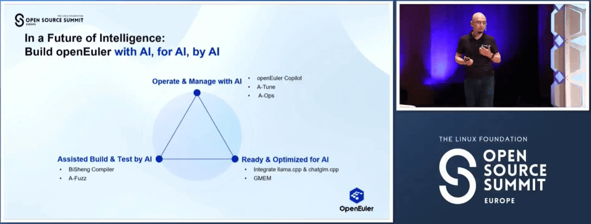

### GMEM在openEuler 23.09上正式发布

2023年9月30日，异构通用内存管理框架 GMEM（Generalized Memory
Management）随openEuler 23.09发布。

GMEM提供了异构内存互联的中心化管理机制，且GMEM
API与Linux原生内存管理API保持统一，易用性强，性能与可移植性好。在加速器HBM（High-Bandwidth
Memory）内存不足时，GMEM可将CPU内存作为加速器缓存，透明地超分HBM，无需应用手动SWAP。同时，GMEM提供高效免搬移的内存池化方案，当内存池以共享方式接入后，可解决数据反复搬移的痛点。

在9月19日的OSSUMMIT大会上，由朱维希(Gitee
ID@weixizhu94)介绍的GMEM特性获得了SUSE等其他厂商的认可，后续我们也会尽快将GMEM推入Linux社区，让更多的开发者认识和了解GMEM。

GMEM使用指导：

https://gitee.com/openeuler/docs/tree/master/docs/zh/docs/GMEM

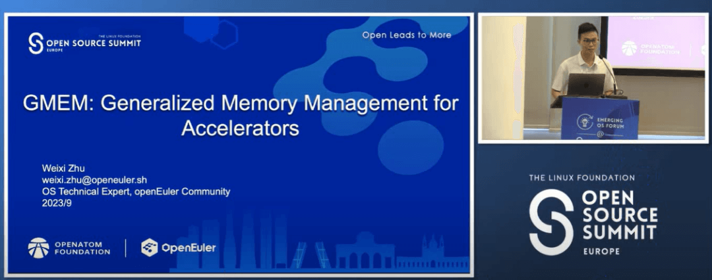

### DIM动态完整性度量特性在社区开源

由Security Facility SIG维护的DIM（Dynamic Integrity
Measurement）动态完整性度量特性已在社区开源。DIM特性能够对运行状态中的内存关键数据（如代码段）进行度量，并将度量结果和基准值进行对比，确定内存数据是否被篡改、攻击，并采取应对措施。

DIM特性作为OS层提供的基础安全机制，为信息系统各个组件提供内存数据的完整性保护，其典型使用场景为：

-   用户通过配置动态完整性度量策略，为系统中关键程序配置动态度量功能。DIM完成目标数据度量后，将度量结果上报至安全管理平台；

-   在安全要求较高的场景下，用户还可对接可信计算远程证明机制，通过TPM证明度量结果的完整性。

**项目地址：**

https://gitee.com/openeuler/dim

https://gitee.com/openeuler/dim_tools

### Fangtian SIG 工作进展

经过近段时间的开发、调试，FangTian视窗引擎已成功对接ArkUI应用开发框架。这意味着openEuler初步具备了运行鸿蒙ArkUI应用的能力。同时也标志着欧拉鸿蒙应用生态开始互通，同一个ArkUI应用（简易类应用）Hap，openEuler、鸿蒙皆可运行，体验一致。

方天引擎作为全新的一套视窗引擎，在为应用提供视窗显示能力的同时，提出新的FT协议，采用自绘制+统一渲染架构以及数据驱动表达，降低Cilent与Server之间交互数据量，达到性能、内存、功耗等各方面的提升。

原文阅读：

-   [[FangTian视窗引擎已成功对接ArkUI应用开发框架]](https://mp.weixin.qq.com/s?__biz=MzI2NDE4OTE2Mg==&mid=2247506596&idx=2&sn=fe23b41e5970be0e565d4b0ecb3a7327&chksm=eab2ff21ddc57637e374e9425f8ce51d2c8351d02e5de13740142c2ba363f184bed214954293&token=1224708595&lang=zh_CN&scene=21#wechat_redirect)

-   [[方天视窗引擎：提供灵活的多窗口显示能力]](https://mp.weixin.qq.com/s?__biz=MzI2NDE4OTE2Mg==&mid=2247506918&idx=2&sn=bb5db5150d1a6ac2f7faa0051167e062&chksm=eab2fe63ddc5777525caf49c395a53fed25ba0f0ac6d55174ecb6dba61fe45770c7e4c318ca1&token=1224708595&lang=zh_CN&scene=21#wechat_redirect)

### BigData SIG 工作进展

BigData
SIG持续构建和完善openEuler社区下的大数据生态，打造活跃的大数据交流平台，丰富和提升大数据组件功能和性能，发掘用户大数据需求，孵化有潜力的大数据组件。

本月，BigData SIG工作主要有以下几个方面：

**新增技术创新项目：**

 **(1) vectorBlas**

vectorBlas是一个Java平台的BLAS库，在Java端支持了BLAS库中Level1/2/3中的向量与向量、向量与矩阵、矩阵与矩阵等运算，例如GEMV、GEMM等。

相关阅读：
[[向量化BLAS高性能库VectorBLAS介绍]](https://mp.weixin.qq.com/s?__biz=MzI2NDE4OTE2Mg==&mid=2247505780&idx=1&sn=1e1d493e5b9a79143aa1611d47c979c3&scene=21#wechat_redirect)

**(2) omnidata-hive-connector**

 omnidata-hive-connector作为一个基于Hive实现的创新项目，提供算子下推新特性提升Hive性能。

相关阅读：
 [[大数据服务omnidata-hive-connector介绍]](https://mp.weixin.qq.com/s?__biz=MzI2NDE4OTE2Mg==&mid=2247506425&idx=1&sn=e8d145eb41aa1f0dc5adfd0dc5460924&scene=21#wechat_redirect)

**Apache社区生态拓展：**

**(1) Apache bigtop社区**

 完成了支持openEuler OS toolchain、docker
image、所有组件和smoke-test适配等，所有代码合入适配openEuler代码。该成果已在2023
OSSUMMIT EU上Linaro伙伴展示。

https://github.com/apache/bigtop/tree/openEuler-support

 **(2) Apache Ambari社区**

解决社区trunk分支适配若干问题，包括Byte和str转换、subprocess替换等，代码已上传Ambari社区trunk分支。

 项目地址：

 https://issues.apache.org/jira/browse/AMBARI-26000

**BigData SIG**

https://gitee.com/openeuler/bigdata

### Infrastructure SIG 工作进展

深入分析社区需求，提升开发者使用体验，一直是openEuler基础设施团队努力的方向。本月，基础设施团队持续发力：

-   openEuler 23.09
    WSL应用已同步上线到了微软应用商店，欢迎大家体验反馈。

-   metalink功能已经通过update版本实现了对下列版本的支持：\

    \[1\] 20.03 LTS SP3/SP1（需升级到openEuler-repos-1.0-3.3）

    \[2\] 22.03 LTS SP1和22.03 LTS （需升级到openEuler-repos-1.0-3.6）

-   社区缺陷公告的生成和发布系统已经上线。目前社区软件包仓（src-openEuler）缺陷类的issue模板都已经更新，按照新模板填写即可进入社区的缺陷处理流程，具体的issue模板填写和处理流程，可以参考

https://www.openeuler.org/zh/security/management/

-   openEuler正式上线在线man页面。基于openEuler
    22.03-LTS-SP2版本的在线man手册，可以让开发者在无openEuler环境的情况下，也能及时查询openEuler标准命令、系统调用、库函数等的使用方法。欢迎访问体验：https://man.openeuler.org/

-   社区官网搜索功能提升：基于国内AI大模型微调后，新增自然语言问答功能、相关服务平台推荐，并支持开发者对博客、新闻、论坛、文档等社区平台的全局搜索。

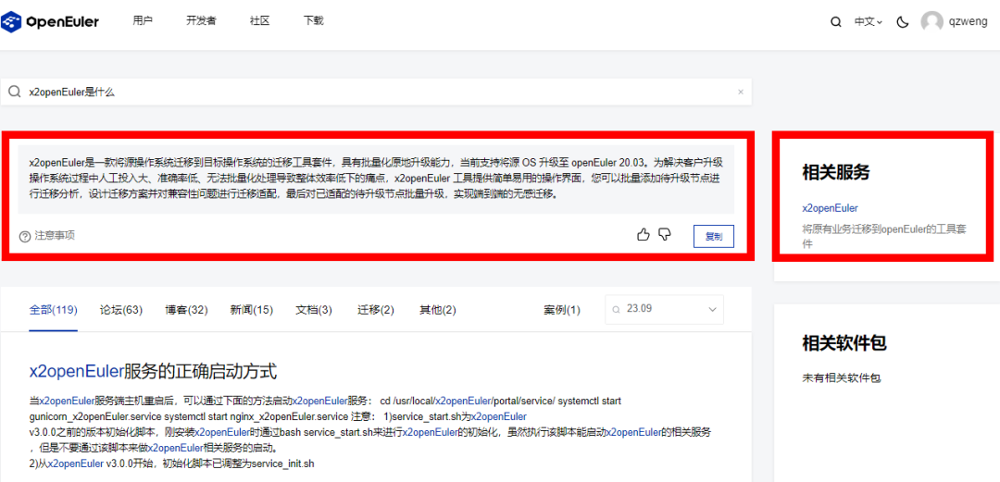

-   社区全球镜像站点建设累计总共34个。9月新增2个，分别为：

 韩国 Siwoo：https://mirror.siwoo.org//openeuler/

印尼 nevacloud：https://mirror.nevacloud.com/openeuler/ 

### message-middleware SIG 工作进展

message-middleware SIG专注于探索为开源用户提供基于 openEuler
基础软件的消息中间件性能加速、安全加固、提升稳定性的解决方案，助力消息相关的技术项目孵化。

本月，message-middleware
SIG完成了RocketMQ仓库的创建，并提交了相关代码PR，后续将持续优化，完善该项目对openEuler的支持，包括但不限于RocketMQ
5.0的诸多特性，比如支持极致弹性、pop消费、流式存储能力等，并计划发布至openEuler
22.03LTS SP3版本中。请大家期待。

此外，message-middleware
SIG将联合移动云、安托盟丘（AutoMQ）等伙伴共同举办消息中间件Meetup。据了解，该Meetup将在10月14日杭州举行[[（点击了解详情）]](https://mp.weixin.qq.com/s?__biz=MzI2NDE4OTE2Mg==&mid=2247506880&idx=2&sn=c4e076f8dc6db8fcbf2b1aa900baf63e&chksm=eab2fe45ddc57753000672e6b12ba733cf74aad03fdfde8688645f2d77132e0bfcee9e937668&token=1224708595&lang=zh_CN&scene=21#wechat_redirect)，欢迎感兴趣的朋友关注。

**项目地址：**

https://gitee.com/openeuler/community/tree/master/sig/sig-message-middleware

## 软硬件兼容性清单

2023年9月，openEuler兼容性方案累计1208个，北向740，南向427，OS
107。9月新增 北向58，南向 21，OS 15。

社区兼容性清单：

https://www.openeuler.org/zh/compatibility/

## 安全公告

2023年8月社区共发布安全公告156个，修复漏洞493个（其中 Critical
36个，High 201个，其它 256个）。

openEuler社区针对在维版本例行修复漏洞，发布安全补丁。建议用户关注openEuler官网安全公告，及时安装漏洞补丁进行防护。

openEuler安全公告：

https://www.openeuler.org/zh/security/security-bulletins/

**感谢每一位朋友、开发者的支持**

因为大家的辛勤贡献，openEuler的每一天都发生着好的事情。小编限于视野和能力，难免有所遗漏，在此表示歉意。同时，衷心感谢社区朋友、开发者们以及openEuler
SIG组成员的贡献：

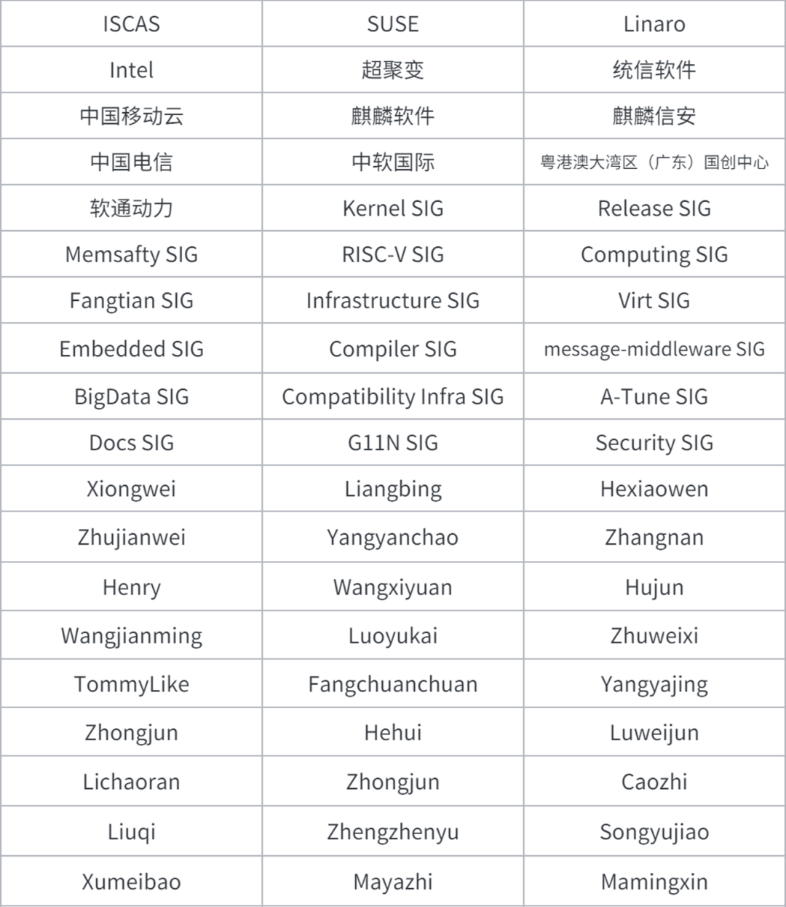

\* 以上不分先后顺序

如果您希望在月报中增加您的工作内容，或对内容有任何改进建议，请联系wengqiaozhen@openeuler.sh。

**- END -**

编辑/排版：翁巧贞

封面设计：王一婷

审校：李永乐、熊伟、梁冰、郑振宇
