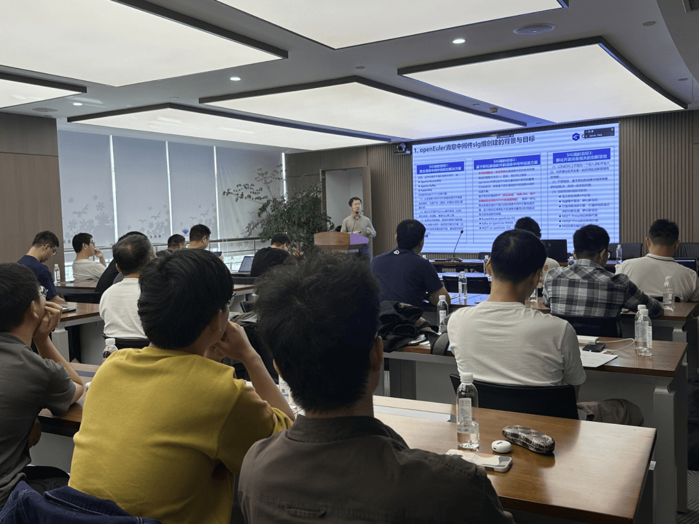

2023年10月14日，由openEuler message-middleware
SIG和移动云主办，安托盟丘（AutoMQ）协办的消息中间件主题Meetup在杭州举办。来自移动云、腾讯云、网易云音乐和字节跳动等业界一流大厂的多位知名技术专家一起探讨消息中间件技术架构、大规模实践、深度性能优化和创新领域等内容。

## openEuler消息中间件sig组的开源技术创新与未来计划

**来自移动云消息中间件团队负责人/openEuler消息中间件sig组Maintainer---胡宗棠**分享了openEuler消息中间件sig组在消息中间件开源领域的工作目标以及近期在开源创新技术领域取得的最新进展，同时重磅发布了移动云原创开源AMQP/MQTT
Proxy协议组件和RocketMQ/MQTT
Operator组件的技术亮点以及openEuler消息中间件sig工作组的未来创新计划和项目等内容。

## Kafka 分级存储在腾讯云的实践与演进

**来自腾讯云的消息技术专家---鲁仕林**介绍了Apache
Kafka技术架构当前遇到几个问题（难运维、资源浪费、客户端兼容性、历史数据影响SLA）和Kafka的弹性技术架构的2方案对比与技术选型（算存分离架构和弹性云盘存储架构）；鲁仕林老师还重点介绍了腾讯云弹性Kafka的分级存储读写的关键几个技术点（分级存储读写流程、数据状态流转和Offset约束）和分级存储在腾讯云Kafka的落地与实现。

## Apache RocketMQ 5.0 在腾讯云的落地实践

**来自腾讯云的RocketMQ团队研发负责人---岳小均**带我们回顾了RocketMQ的技术演进历史；对RocketMQ
5.0的三大演进目标（云原生化、轻量API化、流场景与丰富生态拓展）进行了介绍；随后，老师还给大家分享了RocketMQ
5.0的几大关键新特性与技术（主要是POP消费模式、基于gRPC的新API、秒级定时消息、分层存储实现和基于KV存储的新索引等）和RocketMQ
5.0在腾讯云大规模落地实践。

## Kafka Without Zookeeper

**来自字节跳动研发工程师---邓子明**分享了状态机和数据日志系统的概念；总结了Raft共识性算法中几个关键点与难点（Leader选举、日志复制、安全及额外提交限制）；邓子明老师还和大家一起深入探讨了KRaft的详细算法设计与实现，介绍了KRaft
的使用案例：QuorumController；最后，对KRaft的后续工作进行了展望；

## RocketMQ 在网易云音乐应用实践

**来自网易云音乐Java技术专家---林德智**和大家一起探讨了网易云音乐选择RocketMQ的初衷；介绍了网易云音乐基于开源RocketMQ技术架构的性能优化方案（索引优化和批量消费优化），和网易云音乐在RocketMQ产品化建设与实践（消费线程池隔离/消费限流/线程池动态调整/可靠广播消费/Topic迁移流量调度）；最后，本次技术演讲进行总结和未来规划（RocketMQ
5.0算存分离升级、多CommitLog读写和云原生化）；

## 移动云Kafka的云原生架构演进之路

**来自移动云Kafka研发负责人---王嘉凌**介绍了基于云主机Kafka的技术架构和基于k8s云原生Kafka技术架构中遇到的问题和痛点；老师还介绍了Kafka
on
Pulsar算存分离的弹性消息中间件的技术架构中的优势，并与开源Kafka容器化的建设方案进行了对比；此外，老师还深入介绍了基于pulsar的Kafka的多维度流量限制技术方案；

*添加小助手，回复【杭州 Meetup】，即可领取本次Meetup部分议题嘉宾授权分享的演讲PPT。备注【Message】，加入openEuler message-middleware SIG交流群。*

