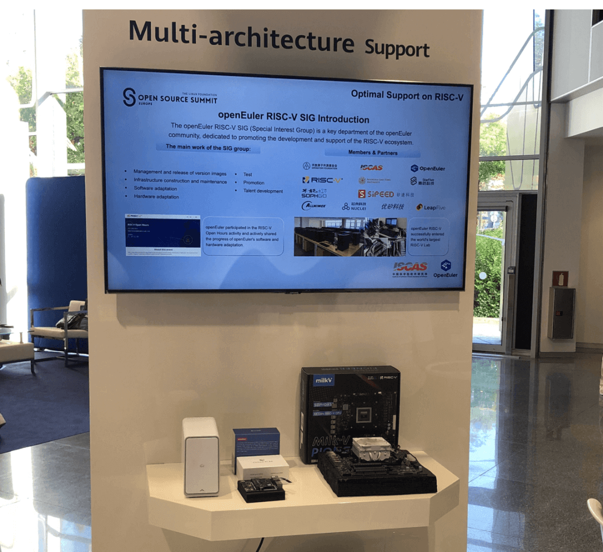

9月19日至21日，中国科学院软件研究所受邀参加在西班牙举办的全球顶级开源峰会OSSUMMIT EU 2023。本次峰会由Linux基金会主办，汇聚了全球开源开发者、产业领袖、技术专家和科研学者，共同探讨和分享开源技术的创新与未来趋势。

软件所创新设计项目"AO.space
傲空间"最新科研成果------傲空间原型硬件在峰会主展区亮相。作为开源操作系统领域的研发成果，傲空间以个人为中心、多设备多架构融合等方面的大胆尝试得到众多开发者的关注。软件所高级工程师王建民作为项目负责人在会上围绕"AO.space
傲空间"发表了专题演讲"AO.space：An Open Source Solution for Personal
Data Ownership"。

软件所作为openEuler社区的主要参与单位之一，在主展区同时展示了其牵头负责的openEuler
RISC-V操作系统，并预告了首款即将面向商业生态发布的RISC-V架构长期发行版。openEuler
RISC-V操作系统在Milk-V Pioneer和Sipeed LicheePi
4A硬件上展现的强大兼容性、创新技术、广阔应用前景等得到了现场参会人士的热烈交流讨论。

现场成果介绍及展示

这次参会展示了软件所及openEuler社区在开源操作系统领域的最新研发成果，提升了其在操作系统领域的国际影响力，也为RISC-V架构在未来的发展和应用打下了坚实基础。
