2023 年 10 月 12 日， openEuler Virt SIG 举办了线下 Meetup。本次 Meetup
由 openEuler Virt SIG
发起，旨在为开发者和用户创建一个分享和交流虚拟化技术的平台。本次活动邀请来自 **Intel
、中国电信、超聚变、北京世纪互联、华为**的技术专家，分享了他们在虚拟化领域的技术实践和优化方案，深入探讨了虚拟化技术的最新动向和未来发展方向。

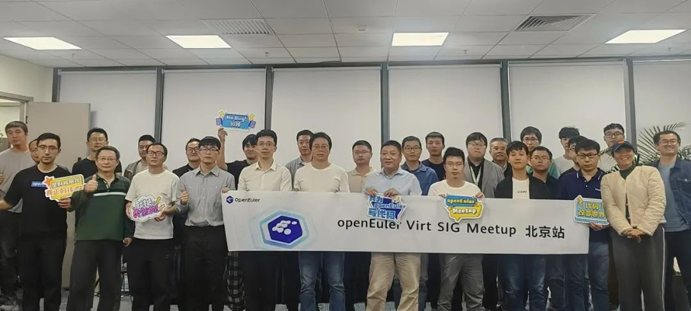

下面就让我们来回顾本次 Meetup 的精彩内容。

## 开场致辞

**openEuler Virt
SIG Maintainer、华为虚拟化首席架构师吴斌**做了精彩的开场致辞，介绍了
openEuler
开源项目的基本情况和技术架构，鼓励大家为虚拟化技术分享更多的思考和成果。

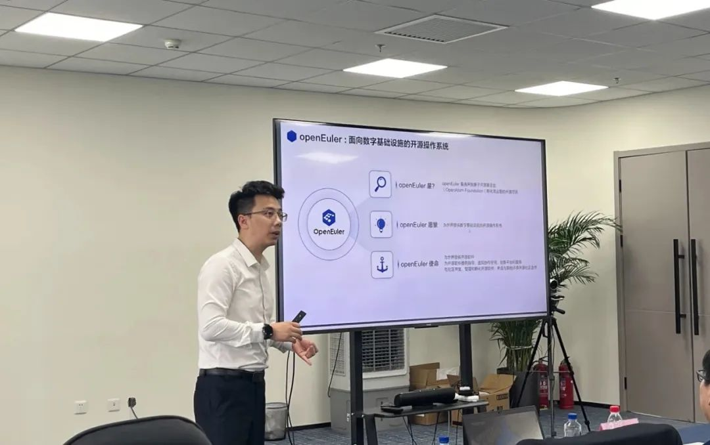

## 虚拟化发展趋势及架构创新

随后，吴斌专家介绍了虚拟化技术的发展趋势和架构创新方向。过去三年，
openEuler Virt SIG 围绕高性能、高可靠、高安全等方面落地竞争力特性 15+
，并推出了社区轻量级虚拟化平台 StratoVirt 。未来将围绕三热、DPU
卸载、下一代芯片软硬协同等方向，与社区伙伴一起让业界前沿技术和创新方向在社区生根发芽。吴斌专家同时也对业界发展趋势和创新方向进行了分享，未来虚拟化技术将向着智能化、轻量化、安全化和融合化方向不断演进，并提出了虚拟化从"一虚多"演化到"多虚多"的想法，实现数据中心场景打破资源边界，打造全场景操作系统解决方案。

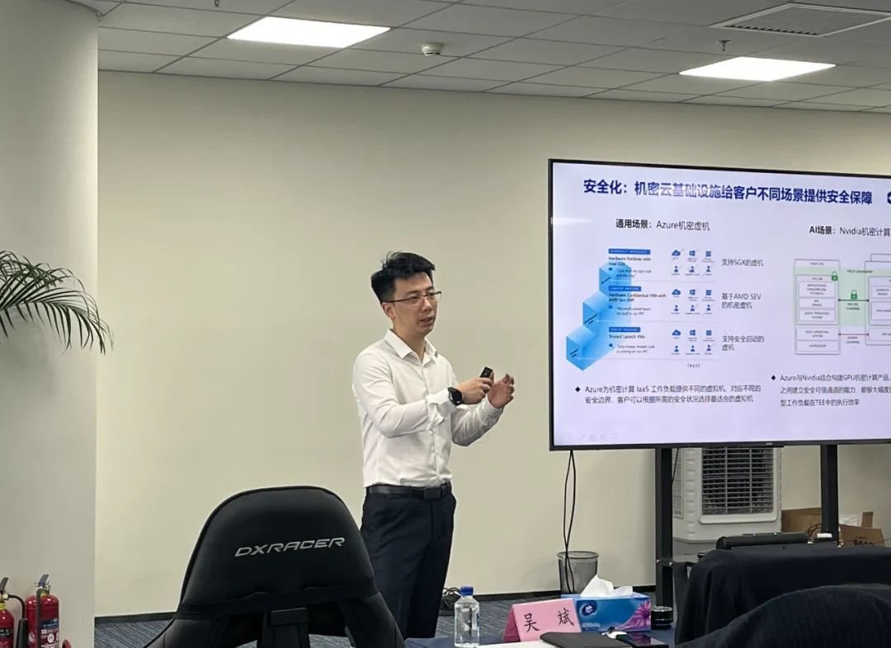

## StratoVirt 热插拔技术研发实践与未来展望**

**中国电信研究院研究员朱泽亚**为我们分享了 StratoVirt
热插拔技术的研发实践和未来展望。StratoVirt 是社区2020年推出的轻量级
RUST-VMM ，提供了相比 QEMU 更高的启动速度和内存底噪，但在 CPU
和内存的热插能力上，仍处于缺失状态。基于此项背景，中国电信研究院提出了基于
ACPI 的 CPU 热插拔和内存热插拔方案，并向我们展示了 StratoVirt
的具体实现方法和验证效果。未来的热插拔技术，朱泽亚专家了提出三点探索方向：基于
ARM 指令集下的热插拔功能实现、将 StratoVirt 作为一种沙盒运行时以及将跳出
ACPI
的框架之外的热插拔技术。中国电信研究院将于本年第四季度将该特性开源至社区。

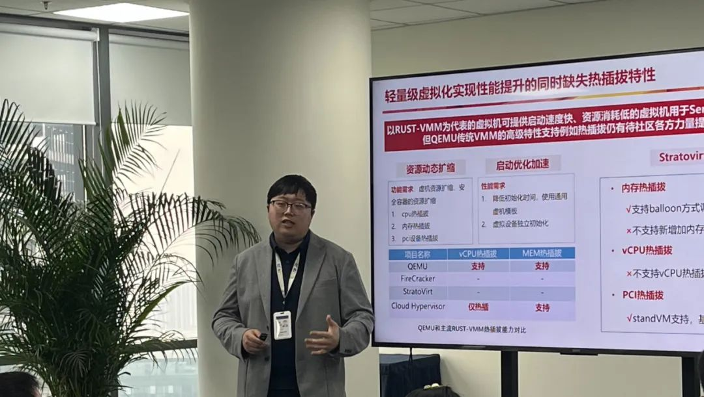

## Backporting of KVM TDP MMU in openEuler

**来自英特尔的云软件工程师张宇**为大家介绍了 KVM TDP MMU
的技术原理和优势。首先他指出了 legacy KVM MMU
方案在启动大规格虚拟机时存在 MMU
锁竞争从而导致性能下降等其他问题。在此之上，张宇专家向我们展示了 KVM TDP
(Two-Dimensional Paging) MMU 通过 rwlock 替换spinlock、使用 atomic
cmpxchgs 写 EPT 等方式来解决该问题。最后张宇专家就 "在 openEuler 22.03
LTS SP3 版本上回合该特性"
与大家展开了讨论。

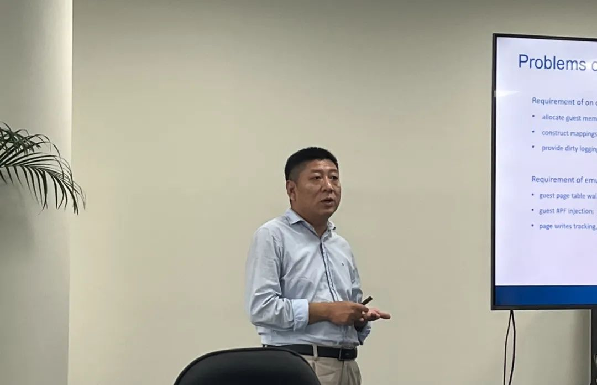

## 基于 Intel QAT设备的虚拟机热迁移优化方案

**超聚变数字技术有限公司研发工程师王利民**分享了基于 Intel QAT
设备的虚拟机热迁移优化方案。王利民专家首先对虚拟机热迁移进行了背景介绍，包括使用场景、热迁移流程以及业界方案介绍。针对方案中存在的
CPU 资源消耗大、热迁移时间长以及用户感知差的问题，提出了 QAT/SVM
虚拟机热迁移方案，并详细分享了 QAT
加速器实现热迁移的流程。实验室环境下使用此方案，热迁移时间最大缩短 94%
，CPU
峰值基本持平，网络带宽受限时迁移成功率更高。

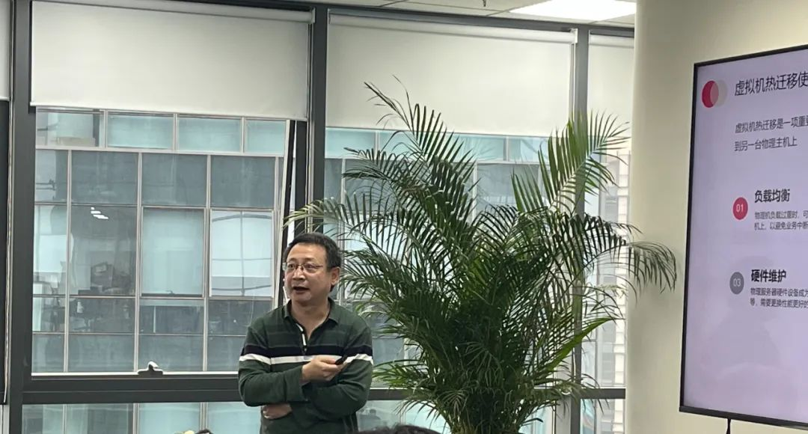

## 面向内核态 vDPA 的通用设备模型及热迁移支持

**华为虚拟化高级工程师方毅**介绍了面向内核态 vDPA
的通用设备模型及热迁移支持。vDPA
方案实现软硬结合、控制面与数据面分离，性能与灵活性的兼容。内核态 vDPA
相比用户态 vDPA
具有全卸载、无额外进程占用开销、支持磁盘等其他设备的优势。方毅专家介绍了当前内核态
vDPA
面临的三类问题以及华为做出的方案探索，其中对于内核态设备仅支持网卡的问题，已推送并合入
Generic vDPA 方案至 QEMU 社区，一套框架支持 virtio-net/blk/scsi/fs
等所有 virtio 设备。预计在 2023 年 12 月，openEuler 22.03 LTS SP3
版本将对外发布内核态 vDPA
基本能力及迁移支持。

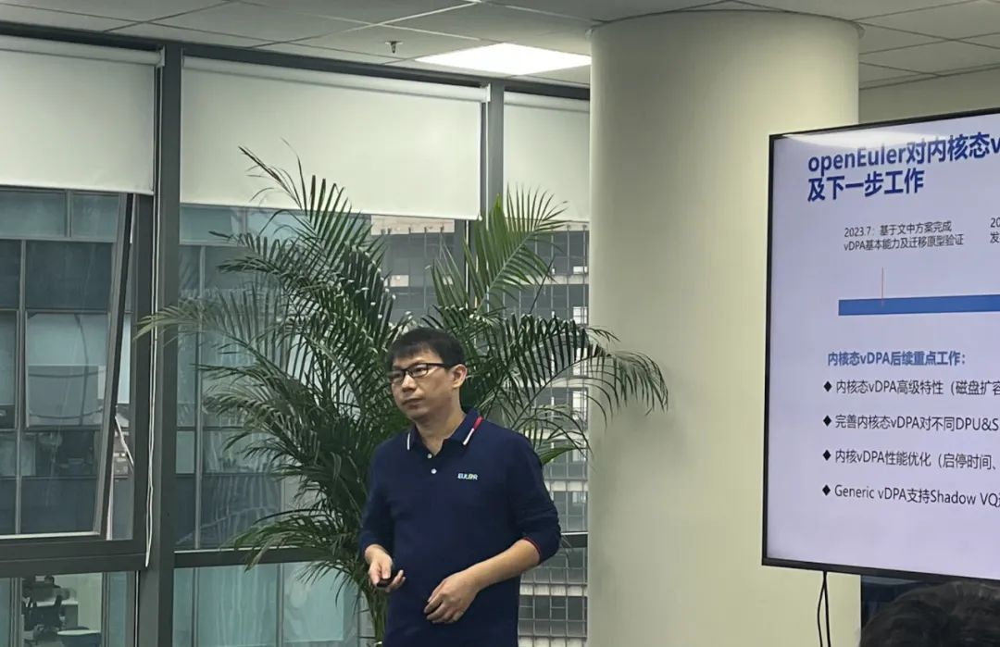

## QEMU 热升级技术原理与实现

**北京世纪互联宽带数据中心有限公司内核及虚拟化研发工程师罗飞**分享了
QEMU
热升级技术原理与实现。当前的迁移流程需要花费巨大时间，迁移耗费很多内存和
CPU 资源并且当前直通设备不支持热迁移。而 QEMU
热迁移技术能够在几十毫秒内完成，且对线上服务影响很小，具有占用资源少，支持透传设备的特点。罗飞专家随后对
QEMU 热升级技术实现原理和优化特性（支持 libvirt
等）进行了详细的介绍，并规划了下一步的优化方案以及开源至社区的计划。

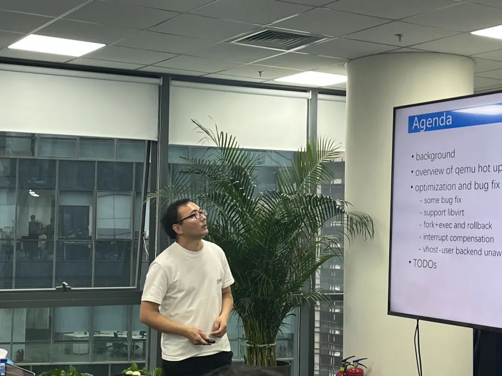

## 云环境下内核热升级 SR-IOV 设备的通用支持

**英特尔云软件工程师曾昭荣**对云环境下内核热升级 SR-IOV
设备的通用支持做了分享。SR- IOV 是云环境下常用的设备，若想实现内核热升级
SR-IOV 设备的支持，需在整个升级过程中保留 PF HW
状态。为此，需由供应商提供定制的 PF
驱动，这个影响是非常大的。曾昭荣专家介绍了一种通用的解决思路：将 PF
直通到一个特殊的 VM（带有定制的PF驱动），通过这个特殊的 VM 创建 VF
给其他虚机使用。

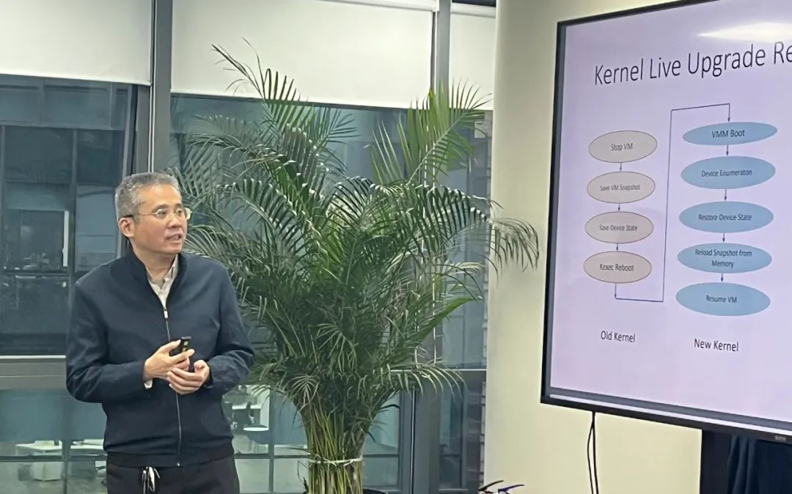

## Intel TDX 技术解析以及社区演进状态

最后一个分享嘉宾是**英特尔系统软件架构师杜凡**。首先为我们介绍了 TDX
技术原理以及社区演进状态。TDX 是 VMX 和 MKTME 技术的扩展，将 CSP/VMM
与信任计算基础隔离开。杜凡老师向我们分享了 TDX
的整体架构图，并详细描述了 TDX live migration 和 TDX connect
的设计思路和技术原理。目前，TDX Guest 部分的实现已合入 upstream
社区，Host 部分的实现还在持续推进中，预计在 kernel v6.8
合入。

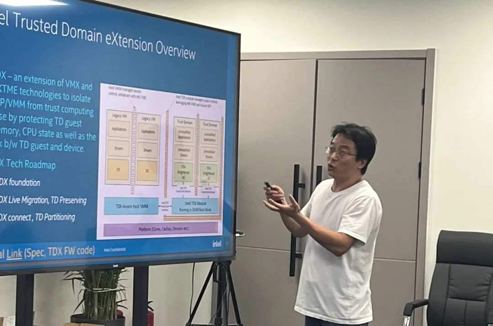

## 自由交流&茶歇

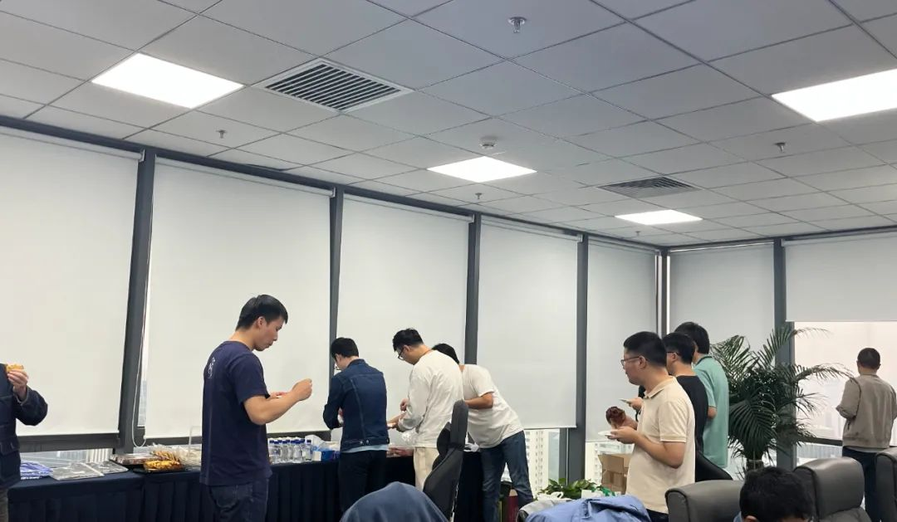

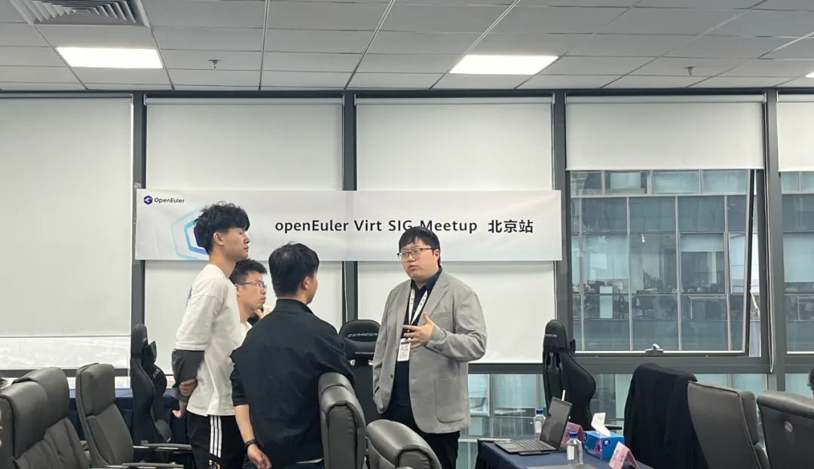

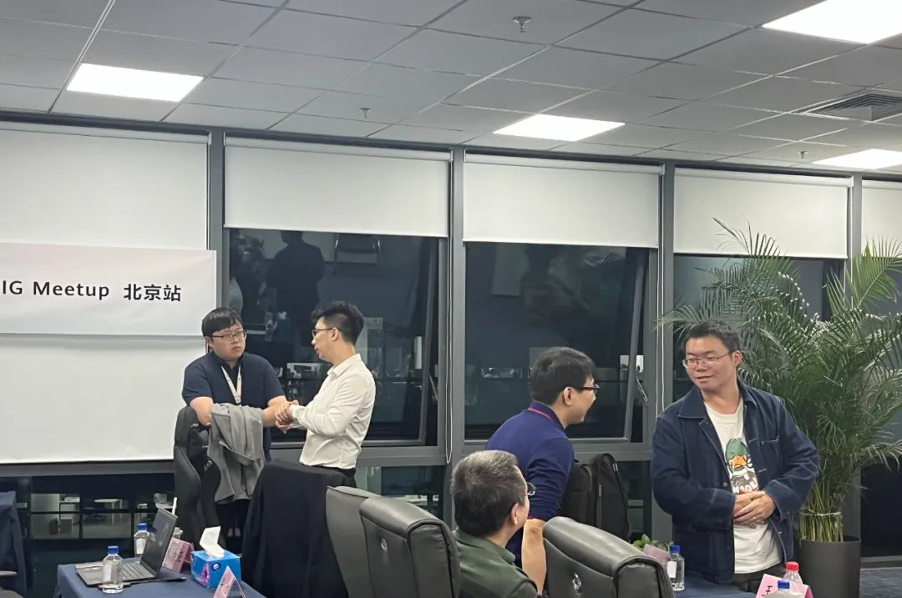

**彩蛋！！**

本次Meetup直播回放已经上传至B站 openEuler官方号。如果您错过了本次线下活动，可前往B站关注查看，期待您的下次参与 ！\

回看链接：<https://space.bilibili.com/527064077/channel/collectiondetail?sid=1805628\>

*添加小助手，回复【虚拟化 Meetup】，即可领取本次Meetup讲师授权分享的演讲PPT。*

欢迎与openEuler一起组织开发者活动
