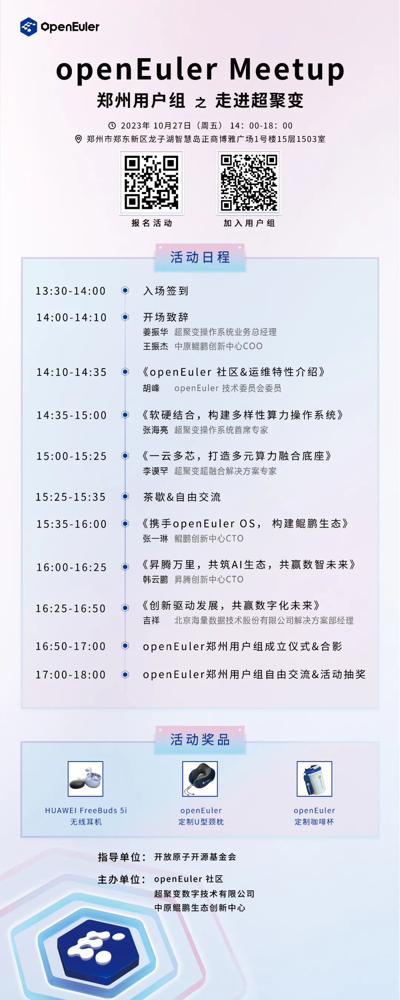

openEuler用户组Meetup 下一站来到郑州！\
\
10月27日，**openEuler社区、超聚变、中原鲲鹏生态创新中心**将联合在郑州举办Meetup，本次Meetup将面向河南区域的用户企业、开发者，分享操作系统相关技术和生态进展，并在本次活动上成立郑州用户组，建立河南区域用户交流圈。欢迎您的加入！（[**点击申请加入用户组\>\>**](http://mp.weixin.qq.com/s?__biz=MzI2NDE4OTE2Mg==&mid=2247505855&idx=1&sn=37a593a9a931b94f1d84570ed160b6d1&chksm=eab2f23addc57b2c60ce1ad041135f4ab51da4831af2b4b894b5761c08d692fbc2b9c30f1fe6&scene=21#wechat_redirect)）。

## 活动信息

活动时间：2023年10月27日  14:00-18:00

活动地点：郑州市郑东新区龙子湖智慧岛正商博雅广场1号楼15层1503室

## 报名参会

扫码报名

## 活动流程

