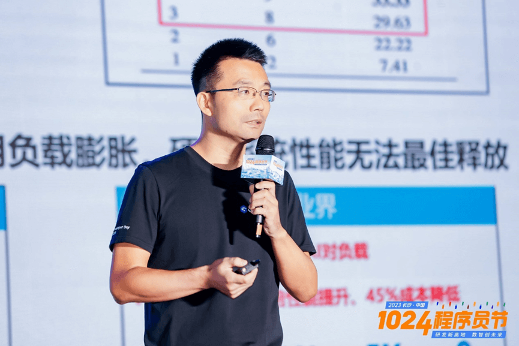
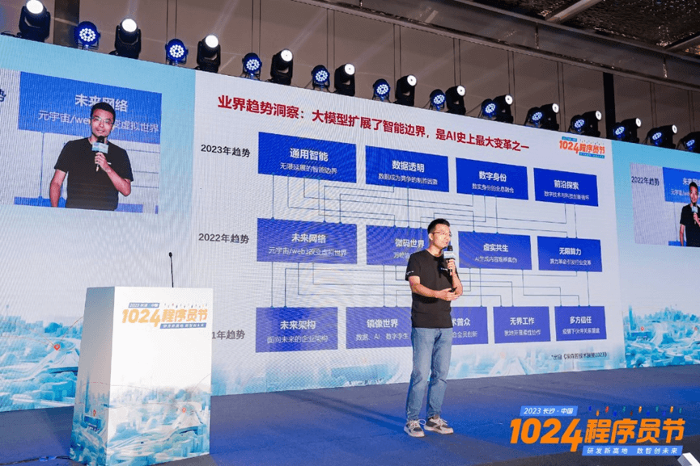

操作系统是计算机系统中的核心组成部分，也是架设在计算机硬件和软件之间的桥梁，它对计算机系统的性能和稳定性产生直接影响，是开发者和企业关注的关键根技术之一。在ChatGPT浪潮下，促进了各项技术创新发展，操作系统也不例外，那么在智能化时代，操作系统将迎来哪些挑战和机遇？**openEuler社区TC委员熊伟**在"长沙·中国
1024 程序员节的"2023
技术英雄会"上带来《智能化操作系统的机遇和挑战》的主题演讲，带来了他对智能化操作系统的前沿思考与探索实践。

openEuler社区TC委员熊伟以下为熊伟的演讲内容：

## * 1024 * 大模型与OS协同优化已成趋势

##         操作系统将现大变局

据埃森哲在《技术展望2023》中显示，技术正朝着通用智能、数字身份、数据透明和前沿探索方向演进。其中特别指出：基础模型的问世，堪称人工智能历史上的最大变革之一。熊伟表示，大模型扩展了智能边界，而且智能边界将持续拓展，因此数据共享和数据安全将越来越重要。

面向大规模复杂系统的调优和运维等，传统的人工手段已难以为继，大模型与操作系统协同优化已成必然趋势。熊伟具体从以下两方面阐述，一是在运维上，由于数据中心和云的复杂性，造成定位效率低，修复时间长。例如大规模集群系统涉及器件的数量达百万甚至千万级，而平均稳定运行时间仅为天级。而且跨越故障的流程长，单器件故障，业界的处理时间为1-30天，这将严重影响系统的效率。针对此问题，微软尝试用大模型对40000个生产事故做微调，据数据显示，处理故障大约得到了70%的改善。此外，在社区和开源领域，K8sGPT通过将SRE经验编入大模型来诊断和分类集群问题。其次是在调优上，由于应用负载膨胀，软件栈厚重，参数众多且关联，人工调优已很难获得最佳性能。另外在硬件上，芯片工艺持续落后，负载协同复杂，硬芯微架构优化难，也造成硬件系统性能无法得到最佳释放。针对这个问题，在业界，Granulate通过AI对负载或者0代码修改获得5倍性能提升，降低了45%的成本；在学术界，纽约州立大学使用大模型应用参数自动调优，Google使用可学习AI数据结构代替hash算法。因此熊伟表示，大模型在运维等领域的加速应用，AI协同复杂、多场景的覆盖，打造操作系统智能化平台，实现大模型与操作系统的协同优化已成为必然趋势。譬如前不久，微软宣布将GPT-4大模型嵌入到操作系统里，利用GPT知识构建自主AI能力，改变了传统三十年的交互方式，实现了机器人流程自动化。

## *1024 * 算力效率与泛在智能应用

##        OS走向异构融合

在人工智能迅速发展下，未来人类向智能社会过渡。在这种大趋势下，人工智能的变化对操作系统造成的影响将主要体现在两个方面。一个是日愈复杂的算力系统，一个是泛在智能应用。智能应用对操作系统的诉求是人机实时智能交互，性能和资源利用与服务质量同等重要，也就是"鱼和熊掌兼得"。熊伟表示，

AI应用服务对系统低时延、高性能、高可用的综合诉求高，因此需构建低熵高效的操作系统。因为在传统的计算机体系中，如果吞吐量上升，其可靠性就会稍微下降一些，时延也会增加。但是AI时代以来，既要吞吐量更高，同时要求时延小，可靠性要求也高。所以可想而知，其难度有多大。此外，数据模型集增长迅速，但是开发效率低下。HuggingFace每天新增1000多个模型、300多个数据集，且仍在加速增长。但是在真正训练过程中，超80%的开发周期都在8天以上，模型开发的等待时间超60%，无效算力非常多。因此，AI工程化诉求强烈。AI技术发展牵引软件工程由传统敏捷开发工具链DevOps，向人工智能开发工具链DataOps、AIOps、DevOps演进。对于硬件来讲，传统处理器越来越多，如何调度？多样性计算时代，软硬件的发展给了操作系统调度重新设计的空间。但随着高速缓存造成的影响更适合硬件任务切换，任务的切换随着SMT/warp的增加会日渐复杂，硬件的调度和OS会形成互补。计算理论表明，计算模式最终趋向收敛，多种计算模式融合是应用发展的必然结果，系统层异构融合是趋势。异构融合的趋势下，多样性算力产品与生态不再孤立，正如NVIDIA
DGX往全栈协同与融合方向发展，芯片硬件也会发生非常剧烈的变革，从单芯片发展为超级芯片，软件栈也会从传统的CUDA生态演进到集群融合完整栈。

## *1024 * openEuler的未来：

##        打造AI原生的异构融合OS

面向未来多样性计算的智能时代，openEuler秉持"以AI赋能openEuler更智能，以openEuler使能AI更高效"的理念，尝试通过自然语言和操作系统进行交互沟通，打通领域知识，不仅支持GLM、LlaMA、Baichuan等大模型，还支持辅助运维、辅助编程等，通过AI赋能开发者，即"AI
for openEuler"。下一步openEuler的设想是实现"openEuler
for AI"，即通过异构算力协同，实现超大容量和高效算力。通过PB级异构内存管理，使训练效率提升20%以上，通过异构算力多维调度，使推理并发提升50%以上。展望openEuler的未来，其定位为
"面向未来多样性计算的智能时代，打造AI原生的异构融合OS"。熊伟表示，大模型和AI时代来临后，基础设施还将产生哪些变化，华为与各界仍在不断探索中，而华为将持续提供优质服务，为开发者和企业提供坚实
"装备"。
