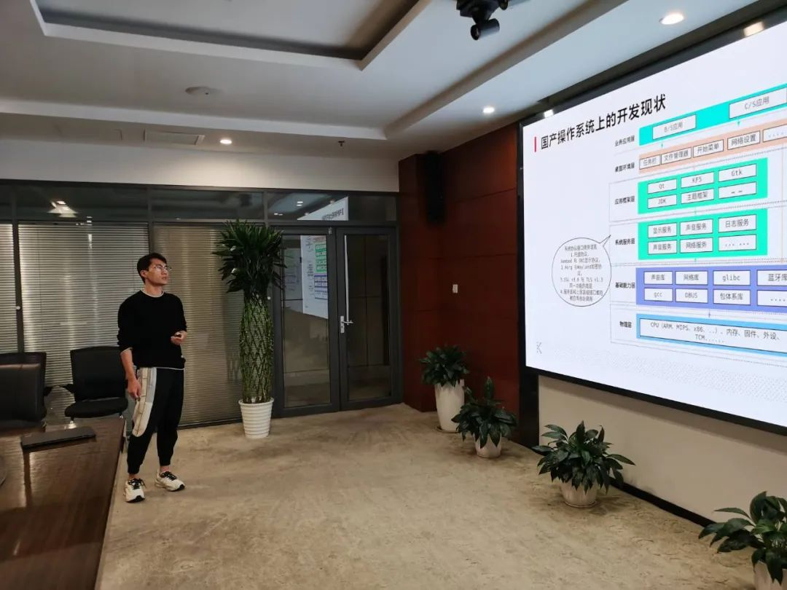

2023年10月20日，openEuler方天SIG与openKylin桌面环境SIG举办线下研讨会。本次活动为闭门会议，**由openEuler&openKylin联合主办**。活动邀请了来自华为、麒麟等公司的技术专家，分享了他们在桌面环境与视窗引擎的主要工作实践及技术思考，深入探讨了桌面环境的最新动向和未来创新等内容。

下面就让我们来回顾本次 Meetup 的精彩内容。

## 开场致辞

**openEuler TC委员熊伟**介绍了FangTian
SIG建立的背景及目标，期望FangTian推出新型显示协议，解决当前Linux桌面环境的问题。之后，**TC委员侯健**表示，这次是openEuler
FangTian
SIG与openKylin桌面SIG的首次线下活动，期待本次研讨会围绕视窗、桌面的技术碰撞出新的火花。

## 视窗的机遇挑战及FangTian SIG规划

**FangTian SIG Maintainer
冯绍波**介绍了视窗的技术原理、优势，以及视窗的发展。当前视窗存在3种挑战：视窗性能和功耗挑战、感知与空间视窗挑战、视窗协同挑战。同时也出现了遮挡剔除、融合渲染、数据驱动等新的技术。FangTian
SIG
当前已初步对接了ArkUI、Wayland协议，并在今年完成50窗60FPS高帧率技术目标。后续也打造稳定流畅的视窗引擎并在行业进行推广。

## UKUI 框架浅谈

**openKylin桌面环境SIG Maintainer
翟康宁**分享了UKUI框架的发展。UKUI版本需快速迭代用以满足用户对UI的视觉、操控的不断变化的要求。解决快速迭代思路是UKUI框架+
轻量级UI
。框架分为应用、API、核心服务、基础库。重点介绍通知服务、搜索服务、应用管理服务的功能及实践。老师还分享了对UKUI在轻量化、多元化、智能化的展望。

## FangTian视窗-Wayland兼容

**FangTian SIG Committer
靳国恩**围绕当前Linux主流显示协议进行讲解。阐述了Wayland及X11的区别，随后给大家带来了FangTian视窗引擎兼容Wayland的方案，包含架构解析、线程模型等。最后就目前兼容范围进行了分享，同时演示Wayland应用在FangTian视窗引擎上运行的效果。

## Wayland模态窗口功能实践

**麒麟软件刘杰**分享了Wayland模态窗口的一种实现。该实现扩充了Wayland协议，其中QtWayland负责收集用户模态属性信息，转发到UKUI-KWIN。UKUI-KWIN作为合成器负责父窗口拦截及动效，同时限制模态窗口行为。

## 多模输入介绍

**华为视窗开发工程师蒋文宇**介绍了多模输入基本概念与FangTian视窗引擎多模输入(FT
MMI)子系统的能力现状，还介绍了FT
MMI子系统与其他FangTian视窗引擎子系统的关系与交互情况，说明了FT
MMI子系统的内部架构。并以鼠标事件为例向大家分享了输入事件的分发、处理响应的基本流程。

## GUI开发框架发展

**FangTian SIG
Commiter谢益君**带大家回顾了GUI开发框架的技术演进历史，从框架架构层次分享了其优势与挑战，解释了技术演进的推动原因；分享了当前FangTian视窗引擎决定ArkUI作为重点适配的GUI开发框架的选择理由，并分享了ArkUI框架的基本结构；最后，老师还介绍了当前ArkUI开发框架在openEuler上的适配现状以及后续的工作规划。

## Kylin SDK使能图形应用

**麒麟软件孙振**介绍了麒麟SDK的背景、目标价值及SDK整体架构，并详细剖析了自研控件模块libkysdk-qtwidgets及窗口管理模块libkysdk-waylandhelper。其中libkysdk-qtwidgets可实现主题切换、自适应平板/PC模式、支持控件半透明及动画效果等。libkysdk-waylandhelper则能够实现窗口操作和属性设置、窗口样式和显示效果等。

## UKUI在Linux发型版本上的迁移与适配-以openEuler社区为例

**麒麟软件裴健康**老师分享了UKUI在openEuler适配。2020年麒麟开始在openEuler社区支持UKUI3.0，
22年开始支持UKUI3.1，持续丰富应用生态。随后详尽说明了openEuler社区构建UKUI软件包的具体实践、操作。

## 自由交流&茶歇

*添加小助手，回复【方天】，即可加入方天SIG交流群。*

