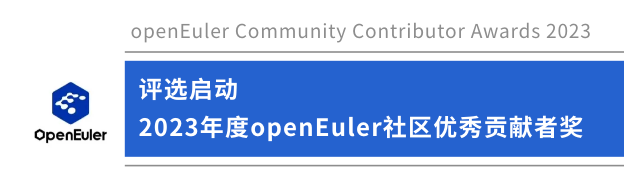
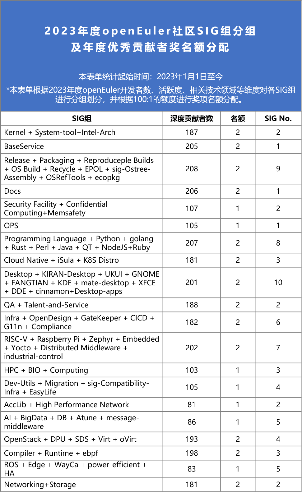

Hi，朋友们

2023年，在社区开发者的点滴贡献下，openEuler在技术创新、产业发展、生态繁荣等方面均取得了一些喜人的进展。

为了对本年度（2023年）在openEuler社区技术创新、技术生态发展、工程能力提升等工作中有成果突出的开发者表示肯定，**2023年度openEuler社区优秀贡献者奖评选启动**。为保证评选过程的公平透明，本奖项获奖成员将由SIG组/跨SIG组自行组织评选，openEuler委员会审定。颁奖典礼将在openEuler
Summit
2023的Keynote环节进行。下文为优秀贡献者者奖项评选的标准与流程。欢迎大家参与本次评选活动。

## 【评选导向】

对2023年度在openEuler社区的技术创新、技术生态发展、工程能力提升等工作中成果突出的工程师，包含但不限于PR提交、Issue反馈、Issue修复、CVE修复、特性开发、生态发展、公共事务等。

## 【评选方法】

**范围：**

在2023年度对社区有代码贡献的社区开发者

**额度：**

100:1，即每100名贡献者选出1名。

组委会根据本年度（2023年）贡献者数、技术领域、活跃度等维度对社区各SIG组进行分组划分以及奖项名额分配，详情请见文末表单。

**产生办法：**

-   根据文末表单，**以相关SIG组为单位进行评选**，符合评选导向即可。

-   **各SIG组/跨SIG组可根据自身导向制定评选标准细节**，选择适合的形式（SIG例会、邮件投票或其他形式）自行评选本年度优秀贡献者，评选维度包括但不限于PR提交、Issue反馈、Issue修复、CVE修复、特性开发、生态发展、公共事务、技术布道等。

-   SIG组评选结果出来后，由SIG组Maintainer代表需将评选标准、评选结果及其理由、贡献事迹等信息邮件至public@openeuler.io，邮件主题为：2023年度openEuler社区优秀贡献者。

-   最终结果由openEuler委员会审定。

**排他条件：**

近两年（2022-2023）在社区中出现过违反《openEuler社区行为准则》以及《openEuler社区开发行为规范》的开发者。

《openEuler社区行为准则》

<https://www.openeuler.org/zh/community/conduct/>

《openEuler社区开发行为规范》

<https://gitee.com/openeuler/community/blob/master/zh/technical-committee/governance/openEuler社区开发行为规范.md>

## 【评选流程】

10月27日-11月20日：

评选启动，社区SIG组组织评选

由SIG组Maintainer代表需将评选标准、评选结果（人选、giteeid、邮箱）及推荐理由、贡献事迹等信息邮件public@openeuler.io，邮件主题为：2023年度openEuler社区优秀贡献者

11月20日-11月22日：

会务组初审

11月23日-11月29日：

 openEuler委员会审定

11月30日-12月1日：

名单邮件列表公示

12月8日：

官网公示

12月16日：

openEuler Summit 2023 - Keynote 颁奖：2023年度openEuler社区优秀贡献者奖

## 【表单】

## 【联系】

有任何疑问可邮件联系 public@openeuler.io 或社区小助手

**扫码加社区小助手**

**微信号｜**openeuler123
