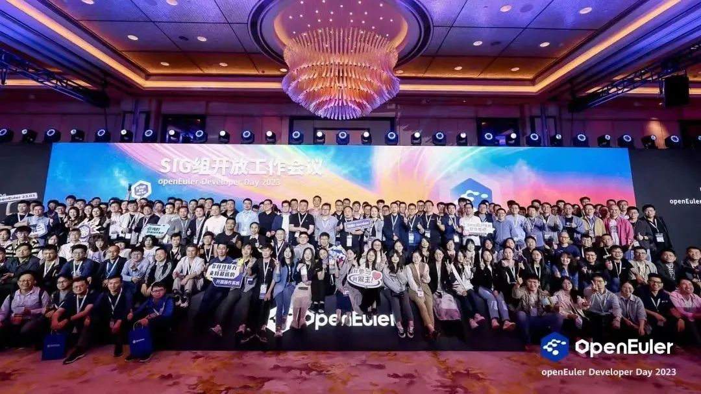
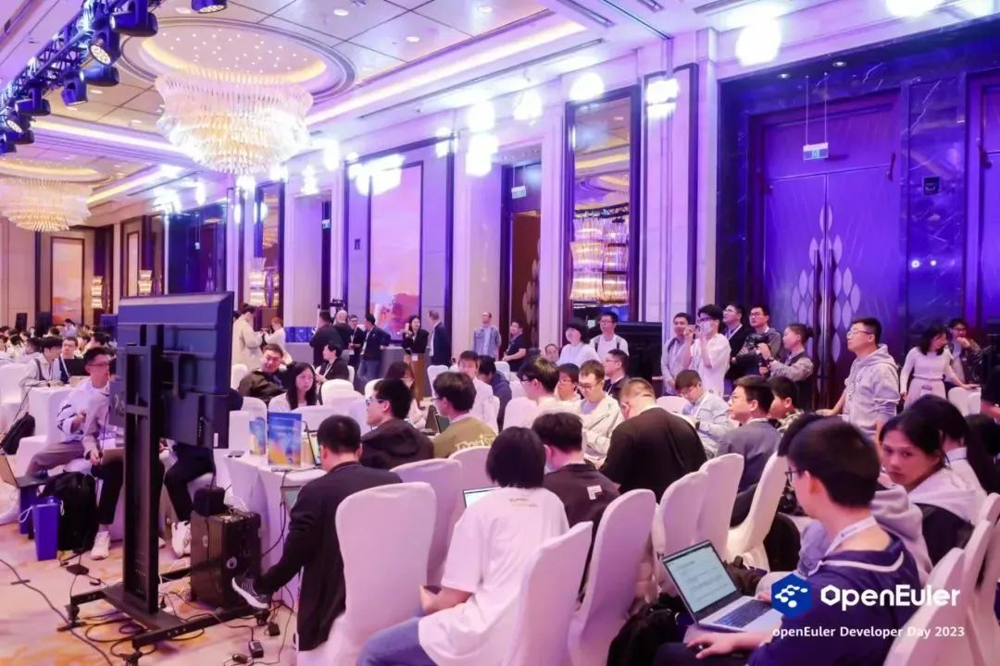
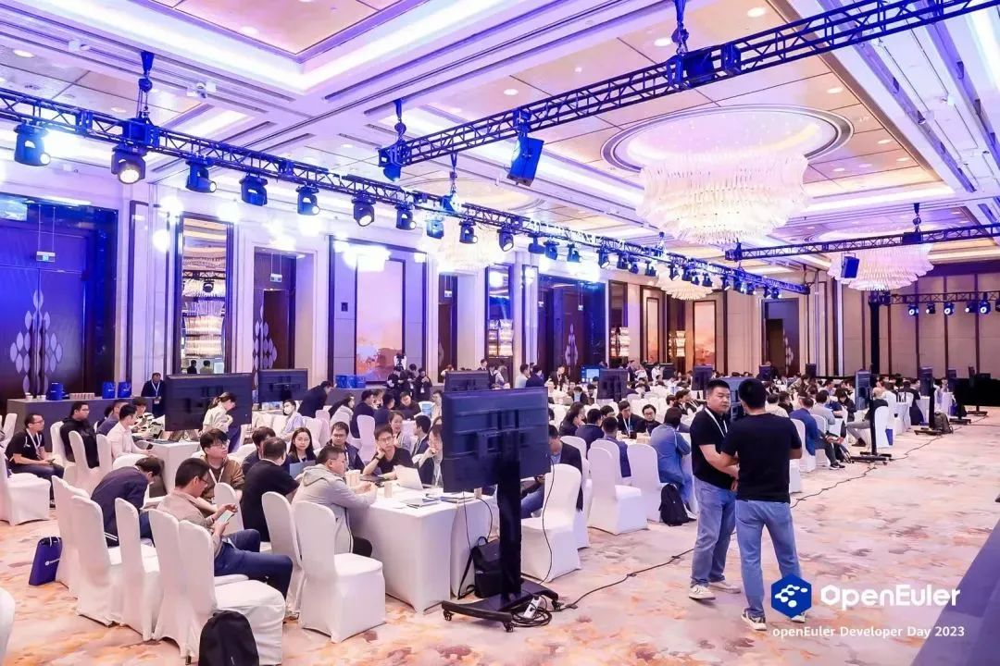

openEuler Summit 是 openEuler 社区年度旗舰会议，是开放原子开源基金会旗下
openEuler 社区发起的年度开源操作系统峰会。

## Call for SIG

**作为大会的重要环节之一，SIG组开放工作会议现已全面开放报名。欢迎各SIG报名参加。**

本次SIG组开放工作会议将收集社区用户与开发者的需求，诚邀SIG组成员探讨未来的工作事项，尤其是对openEuler社区下个LTS版本的探讨，以期开发者们能够更好地投入到社区工作当中，共同繁荣社区技术生态。

扫码报名

## 参会信息

参会时间：12月16日 

参会地点：北京

SIG报名截止时间：11月20日

## 往期盛况

在ODD2023的SIG组开放工作会议上，**41个SIG组聚焦不同技术方向，近400位开发者齐聚大会现场**，同时展开SIG组开放工作会议。现场的开发者们根据不同的技术方向展开热烈的讨论，气氛十分热闹。

作为openEuler社区的开发者盛会，SIG组开放工作会议将吸引广大用户及开发者的关注和全程参与。欢迎各个SIG报名参加会议，现场与开发者进行交流。

## 会议类型

「单 SIG 组工作会议」：单一 SIG 组内的工作会议，由该 SIG 组 Maintainer
进行组织，包括议题收集、议程安排、主持讨论、会议纪要输出等。

「跨 SIG 组工作会议」：跨 SIG 组之间的协作工作会议，需要各相关 SIG 组
Maintainer 提前与会议组织者联系并沟通场地安排，由各相关 SIG 组
Maintainer
负责进行组织，包括议题收集、议程安排、主持讨论、会议纪要输出等。

想要报名参加本次活动的SIG组快快行动起来！
