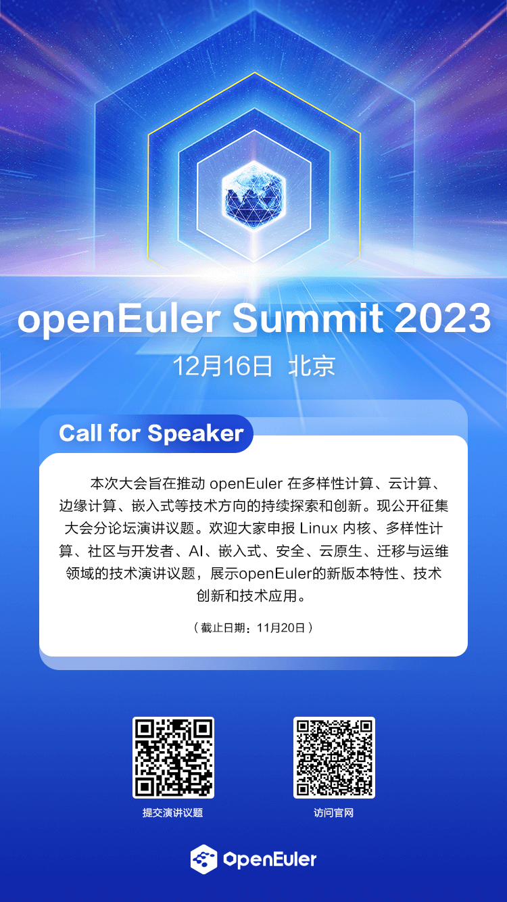
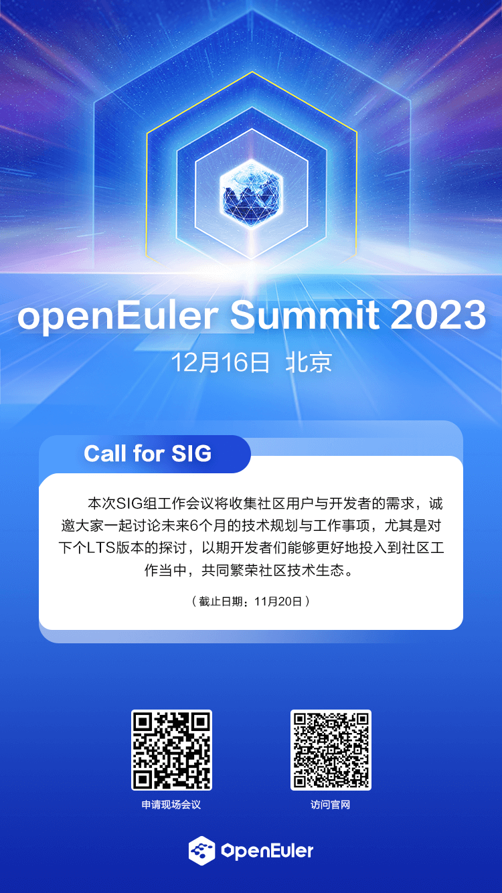
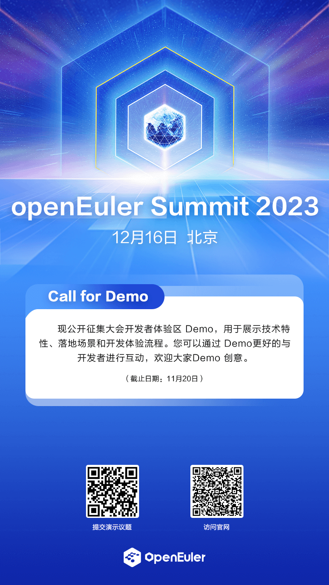

操作系统产业大会 2023
旨在聚集全产业链乃至海内外的力量，聚焦基础软件核心能力构建，引领基础软件技术持续创新，共建全球开源共同体，推动智能化操作系统在数字化时代的发展，共辟未来数字化世界的发展新征程。

openEuler
Summit - openEuler 社区年度旗舰会议，是开放原子开源基金会旗下 openEuler
社区发起的年度开源操作系统峰会。openEuler
专注核心技术和全场景能力创新，构建多样性计算、智能计算支持的基础软件能力。通过开源开放，不断探索科技创新的边界，驱动物理世界与数字世界的深度融合。全球开源基金会、开源组织、社区贡献者、行业用户、合作伙伴在
openEuler Summit
汇聚，驱动无止境的创新与拓展，闪耀数字时代星辰大海。开源是一种态度，分享是一种精神。

**Call for Speaker、Call for SIG、Call for Sponsor、Call for
Demo** 现已全面开放报名。我们诚挚的邀请您提交演讲议题、发表联合演讲、申报现场
SIG 会议、成为共建单位、贡献展示方案、参与社区建设。

