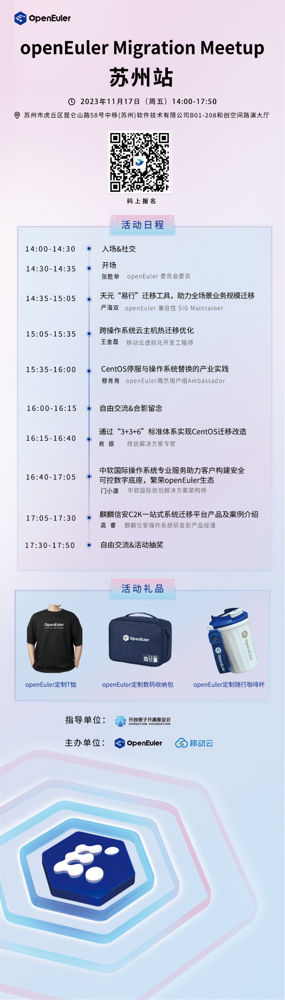

随着数字化转型深入，操作系统正在向支持多样性计算、支持全场景的方向发展。在数字化转型的过程中，企业面临迁移操作系统的刚性需求，由于不同操作系统之间存在差异，企业在迁移操作系统时面临这些问题：如何处理软硬件兼容性问题？如何快速恢复系统环境？如何发挥系统的极致性能？\
这一站openEuler
Meetup来到了美丽的苏州，一同在深秋感受古城风采和技术碰撞的魅力。11月17日，openEuler社区联合移动云将举办迁移主题Meetup，邀请来自不同领域的技术专家分享迁移实践案例，欢迎大家报名活动。

活动信息
--------

**时间**：2023年11月17日（周五）14:00-17:50

**地点**：苏州市虎丘区昆仑山路58号中移(苏州)软件技术有限公司B01-208和创空间路演大厅

**主题**：openEuler Migration Meetup苏州站

扫码报名
--------

请扫码填写报名表，锁定活动参会名额，面对面与技术专家探索迁移优秀实践，更有openEuler定制周边礼大放送，快来现场Get吧！

扫码报名

精彩议题
--------

