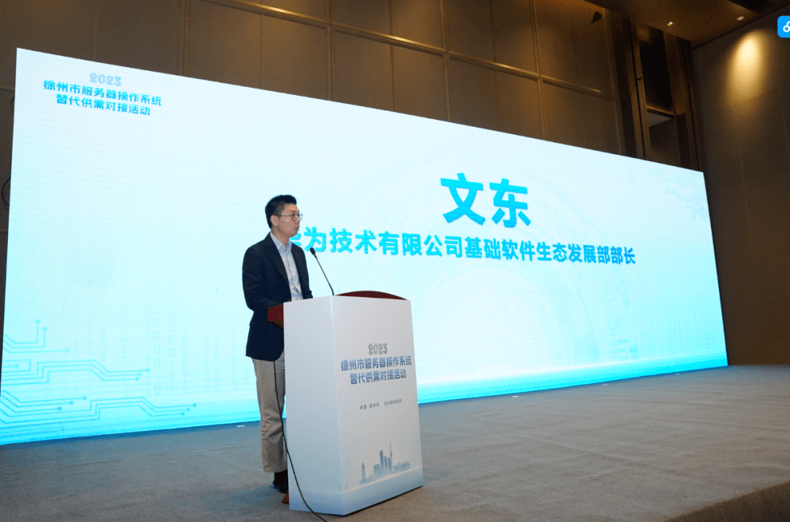

近日，徐州服务器操作系统替代供需对接活动成功举办。华为基础软件生态发展部部长文东以及徐州市近百家政企参加了本次会议。

徐州市相关领导介绍了全市操作系统替代情况，并对后续工作开展提出建议。海量数据技术股份有限公司、麒麟软件有限公司在会上分享了基于openEuler的优秀实践，为徐州市广大政企介绍服务器操作系统替代经验。

华为基础软件生态发展部部长文东围绕openEuler最新进展和未来发展分享发言。他表示，openEuler在2019年正式开源，2020年捐献给开放原子基金会，经过发展，openEuler社区目前有伙伴超过1100家，核心贡献者1.6万，累计代码合入PR
13.6万次，支持软件包达3.5万，全球开发者下载量超过109万，与国际主流开源社区相当。面向未来，社区将联合广大伙伴和客户持续建设欧拉生态体系、创新体系，将欧拉打造成为全球领先的数字基础设施操作系统，共同筑牢产业根基。

会上正式发布了基于openEuler的《徐州市服务器操作系统替代白皮书》，从搬迁背景出发，针对业务系统的部署形态以及业务影响角度分类，分别给出具体搬迁方案，并对徐州市政企用户进行服务器操作系统替代提供全面指导，指导书对于基于openEuler的商业发行版同样适用。

来自华为负责openEuler解决方案架构师郑弦为大家全面介绍了openEuler社区和产业进展以及CentOS替代方案。累计有12家企业基于openEuler发布了商业发行版，至少18家企业发布了企业自用版。截止到今年9月，openEuler系操作系统已经累计商用515万套，成为国内服务器操作系统首选路线。

面向CentOS停服背景下的挑战，麒麟软件南京分公司售前总监穆肖肖重点介绍了银河麒麟操作系统融合社区最新技术成果的应用与实践情况。麒麟软件依托多年行业经验，结合CentOS停服的技术痛点，针对存量替换场景与新增扩容场景，推出对应的操作系统替换方案，充分展现了麒麟软件通过开源合作推动操作系统核心技术自主创新，实现开源技术与千行百业融合发展的创新成果。

openEuler社区将持续支持各地企业的创新发展，推动openEuler作为中国服务器操作系统的根社区能够赋能千行百业，为中国的IT基础产业发展做出贡献。
