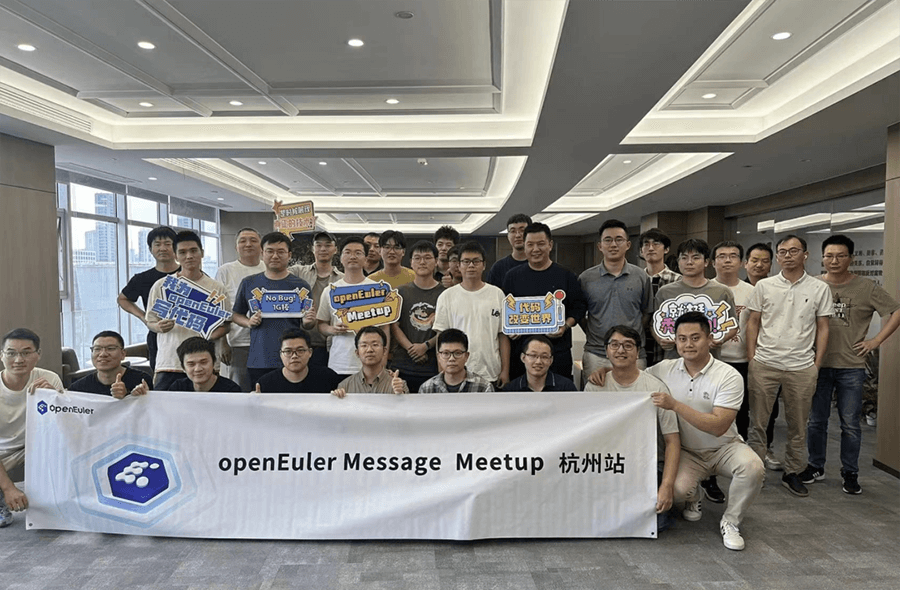

概述
----

在本月的技术进展上，openEuler Embedded
23.09版本发布，带来了poky-4.0底座升级、混合部署Jailhouse与OpenAMP打通、iSula和ROS2能力得到持续构筑、RK系列BSP支持等特性增强，丰富了南北向生态。同期，RISC-V
SIG 领头完成了 openEuler RISC-V 23.09 的主线集成工作，推动 RISC-V 成为
openEuler 的官方支持架构。NestOS
项目推出双模式版本，提供了两款分别专注于容器化和虚拟化场景的操作系统版本。嵌入式实时虚拟机ZVM近期也迎来了更新，开发者通过脚本可便捷地搭建虚拟化管理平台ZVM。openEuler运维专区、运维工具OSMind等已陆续在社区上线。社区技术测评新增openEuler嵌入式OSV认证标准及其测评流程，目前已有3家OSV伙伴发起嵌入式兼容性认证。

OpenAtom开源项目Cloud
HPC选择openEuler作为默认操作系统；CNCF云原生储存项目Curve原生支持openEuler；数据存储加速引擎CANTIAN、面向云原生的创新项目EulerPublisher等相继在openEuler开源运作，感兴趣的朋友可以关注。

openEuler积极拥抱开源生态，在本月，除了5场社区Meetup之外，在第四届"长沙·中国
1024
程序员节"上，社区TC委员熊伟带来了他对智能化操作系统的前沿思考与探索实践。在第18届CLK大会上，社区Kernel、可编程内核等SIG组的多位专家分享了GMEM、eBPF等项目的实践进展。

2023年12月15-16日，令人期待的年度旗舰在征集大家的建议中，欢迎朋友们关注参加。

感谢各位开发者们对openEuler的贡献，本月报阅读时长20分钟，欢迎细读。

社区规模
--------

截止2023年10月31日，openEuler社区用户累计超过191万。一万六千余名开发者在社区持续贡献。社区累计产生
137K 个PR、70.1K 条Issue。截至目前，加入 openEuler 社区的单位成员超过
1100 家，10月新增54家。

社区贡献看板（截至2023/10/31）

社区大事件
----------

### openEuler Summit 2023将在12月15-16日举办，欢迎申请议题、申报SIG会议、成为共建单位...

由开放原子开源基金会旗下 openEuler 社区发起的年度旗舰会议openEuler
Summit 2023将在2023年12月15-16日北京举办。

开源是一种态度，分享是一种精神。Call for Speaker、Call for SIG、Call for
Sponsor、Call for Demo 现已全面开放报名，欢迎大家申报。

除了四大主题的Call
for欢迎大家申请之外，2023年度openEuler领先商业实践奖项、2023年度openEuler社区优秀贡献者奖项等征集工作已面向社区全面启动，评选结果将在本年度峰会上发布，欢迎伙伴、开发者们关注。

openEuler Summit 2023 \|
诚挚的邀请您提交议题、申报SIG会议、成为共建单位......

openEuler Summit 2023 \| 欢迎申报SIG组开放工作会议

2023年度openEuler领先商业实践遴选征集工作启动

2023年度openEuler社区优秀贡献者奖项评选启动

### openEuler社区2023年度满意度调研启动

为了给社区用户带来更好的体验，openEuler社区2023年度满意度调研已经启动，欢迎社区开发者们参加活动，反馈您在社区官网的使用情况。社区将持续吸纳您的建议，创造更好的用户使用环境。

### 社区TC委员熊伟博士代表openEuler参加1024程序员节

2023年10月24日，openEuler社区TC委员熊伟在第四届"长沙·中国 1024
程序员节的"2023
技术英雄会"上带来《智能化操作系统的机遇和挑战》的主题演讲，带来了他对智能化操作系统的前沿思考与探索实践。

### 社区多位技术专家代表openEuler参加第 18 届 CLK 大会

10 月底，第 18 届中国 Linux 内核开发者大会（简称 CLK
2023）在深圳成功举办。openEuler 社区 Kernel SIG Maintainer
郭寒军参加了圆桌会议，与腾讯、龙芯中科、英特尔、蚂蚁等多位专家共同探讨开源社区发展中的实际问题和解决思路，为新手乃至资深内核开发者提供了建设性建议。

Kernel
、可编程内核等SIG组的多位专家在大会分论坛上分享社区项目成果与经验。其中，朱维希分享的项目GMEM（一种面向领域加速器的Linux通用内存管理框架），已成功demo使用Linux
MM托管华为昇腾AI加速卡的内存管理，由OS透明地支持单卡训练13B大模型。

### Summer Code Camp已圆满结束

近日，由云原生计算基金会 (CNCF) Sandbox 项目Curve与 openEuler
联合推出Summer Code
Camp已圆满结束。本次活动中，Curve完成了与openEuler/arm64的适配，丰富社区技术生态。

PR地址：

https://github.com/opencurve/curve/pull/2789/files

### openEuler 郑州用户组 Meetup

10月27日，openEuler社区与超聚变联合举办郑州用户组线下Meetup，此次活动邀请河南区域的操作系统用户走进超聚变，围绕openEuler和Fushion
OS
相关技术、生态进行分享和交流。本次活动有60余人参加，并在活动中正式成立openEuler郑州用户组，为河南区域用户后续持续交流、寻求生态合作机会提供一个大本营。

### openEuler 迁移&运维专题赋能交流会线上举办

10月26日，为了提高社区伙伴对用户的服务效率和质量，由openEuler社区人才与服务SIG组织的迁移&运维专题赋能交流会于线上举办，会议主要围绕openEuler迁移工具x2openEuler及运维工具OSMind的新特性进行了讲解、演示及答疑，会议覆盖多家合作伙伴，共计120+人参加。

### openEuler 方天SIG & openKylin桌面环境SIG

### 技术研讨会在天津举办

10月20日，openEuler方天SIG与openKylin桌面环境SIG在天津举办线下研讨会。openEuler
TC委员熊伟、TC委员侯建以及来自FangTian、UKUI等桌面及图形系统领域的SIG
Maintainer、成员出席该研讨会。会上，他们就桌面环境与视窗引擎的主要工作实践及技术思考进行深入讨论，交流桌面环境的最新动向和未来创新。

而在10月初，FangTian SIG 开展了第二期直播（Link:
https://b23.tv/r63mN0T），主要分享方天引擎视窗显示框架及流程，包括显示过程中涉及的部分关键技术：DRM、自适应刷新率、遮挡剔除等。

### openEuler 消息中间件 Meetup 在杭州举办

10月14日，由openEuler message-middleware
SIG和移动云主办，安托盟丘（AutoMQ）协办的消息中间件主题Meetup在杭州举办。来自移动云、腾讯云、网易云音乐和字节跳动等多位知名技术专家一起探讨消息中间件技术架构、大规模实践、深度性能优化和创新领域等内容。

### openEuler Virt Meetup 在北京举办

10 月 12 日， openEuler Virt Meetup在北京举办。本次 Meetup 由 openEuler
Virt SIG
发起，旨在为开发者和用户创建一个分享和交流虚拟化技术的平台。本次活动邀请来自
Intel
、中国电信、超聚变、北京世纪互联、华为的技术专家，分享了他们在虚拟化领域的技术实践和优化方案，深入探讨了虚拟化技术的最新动向和未来发展方向。

### openEuler 用户案例持续征集中

openEuler社区与社区伙伴们正在共同打造《openEuler开源操作系统行业应用案例集》，以展示openEuler在不同行业的应用场景与优势，为其他用户提供借鉴和参考，共同探索openEuler的更多可能性。

10月精选案例：

-   [[荣泽科技基于openEuler打造高性能可信数据要素流通平台]{.underline}](https://mp.weixin.qq.com/s?__biz=MzI2NDE4OTE2Mg==&mid=2247507366&idx=1&sn=9947023b90d4a812de02dc14abc09d04&chksm=eab2f823ddc57135f4a8182de4fa9b7fe800d266a4adfd5d0ed09eb39d54e0efd1c4890033f4&token=194340531&lang=zh_CN&scene=21#wechat_redirect)

-   [[麒麟信安助力长沙市就业与社保数据服务中心政务系统向自主创新演进]{.underline}](https://mp.weixin.qq.com/s?__biz=MzI2NDE4OTE2Mg==&mid=2247507267&idx=1&sn=ec8b8bb3ea0bde0301f64ce70ca1f01e&chksm=eab2f8c6ddc571d0d8a9425febef5903904128487a08356fe920ccf01e1e1271d0f074350ea0&token=194340531&lang=zh_CN&scene=21#wechat_redirect)

如果您想投稿案例，欢迎联系 user@openeuler.sh

技术进展
--------

### OpenAtom开源项目Cloud HPC选择openEuler作为默认操作系统

Cloud
HPC是开放原子开源基金会孵化筹备期的项目。上海即算科技有限公司贡献该项目，并且基于Cloud
HPC打造了云上高性能计算商业方案HPC-NOW。近几个月来，openEuler社区与Cloud
HPC团队展开深入合作，共同推动基于openEuler操作系统的完整云上高性能计算（Cloud
High-Performance Computing, Cloud
HPC）解决方案。

**CANTIAN引擎在openEuler开源**

CANTIAN引擎是一个能让普通的单机数据库变成具有类似Oracle
RAC能力数据库的中间件。CANTIAN引擎采用了创新的存算分离架构，通过分布式缓存技术/事务MVCC机制/多主集群高可用等关键技术，使能分布式数据库，打造多读多写的分布式数据库存储架构。目前已经在openEuler社区开源，由
DB SIG 维护。
仓库地址：https://gitee.com/openeuler/cantian

### 面向云原生的创新项目EulerPublisher在社区开源

EulerPublisher作为"一键式"自动构建、测试和发布openEuler镜像的工具链，可以对接AWS、华为云、腾讯云、阿里云等主流公有云平台，以及Docker
Hub等主流容器镜像仓库，极大地提升openEuler镜像发布效率，降低用户获取和体验openEuler的门槛。EulerPublisher源码托管在gitee上
，目前已向PyPI发布v0.0.2版本供用户使用体验。[（原文阅读）]{.underline}

链接：https://gitee.com/openEuler/eulerpublisher

### RISC-V 正式成为openEuler的官方支持架构

近期，RISC-V SIG 领头完成了 openEuler RISC-V 23.09
的主线集成工作，该项目涵盖了主线代码回合、官方工程整合及镜像发布。RISC-V
正式成为 openEuler 的官方支持架构。

openEuler RISC-V 23.09 主线版本基于 BaseOS 列表，依托 openEuler OBS
构建系统，完成了代码主线化，生成流程正规化等流程。最终通过 Release SIG
和 QA SIG 的正式评审，并在 openEuler 官方网站进行发布。

### openEuler Embedded 23.09版本已发布

openEuler Embedded 23.09版本已发布，版本重点增强特性与软件包功能：

1.  poky-4.0底座升级，Yocto对齐上游最新LTS版本4.0.x,
    支持周期可达2026年,为社区LTS版本奠定基础；

2.  优化前置版本关键特性：混合部署Jailhouse与OpenAMP打通，以更好的支持OS多实例在同构和异构场景下的生命周期管理与通信，为混合部署场景提供更灵活的管理方法与更高效的通信方式；iSula和ROS2能力持续构筑，完善iSulad
    OCI标准功能支持，支持ROS2
    Humble机器人运行时和交叉编译快捷开发模式，扩展业务支撑面；RK系列BSP支持，富化南向生态；

3.  新引入100+软件包，持续丰富openEuler Embedded版本北向生态。

相关链接：

https://docs.openeuler.org/zh/docs/23.09/docs/Releasenotes/release\_notes.html

### NestOS双模式版本云场景全覆盖正式发布

openEuler 社区云底座操作系统 NestOS
项目正式推出双模式版本，旨在满足云场景中容器化和虚拟化两种主要场景下用户的多样需求。这次发布引入了全新的运作模式，提供了两款分别专注于容器化和虚拟化场景的操作系统版本，并且引入了六大基础特性，以期满足用户在各种应用场景的需求。

### openEuler嵌入式OS兼容性认证标准通过，嵌入式OSV测评流程已打通

由Embedded SIG起，并联合Compatibility-Infra
SIG、鲲鹏创新中心（开放原子开源仅仅授权的openEuler社区兼容性认证实体组织）、社区运营团队共同制定完成openEuler嵌入式操作系统兼容性认证标准和认证流程。

openEuler嵌入式操作系统兼容性认证标准在Embedded
SIG经过一次sig例会评审，会议上各个嵌入式OSV厂商积极参与讨论相关标准条目，最终修改后于9月7日评审通过。于10月13日在Compatibility-Infra
SIG首次评审通过，按照社区公示两周流程，于10月28日正式通过。同时推动鲲鹏创新中心打通评测申请提交、社区展示页面、证书格式制定等事宜。

目前已有三家OSV伙伴发起嵌入式兼容性认证。

openEuler嵌入式操作系统兼容性认证标准：https://gitee.com/openeuler/oecp/blob/master/doc/OECP工具嵌入式测试标准.md

### openEuler运维专区上线，运维工具OSMind发布

近日，由openEuler社区人才与服务SIG发起，联合Infrastructure
SIG共同开发的openEuler运维专区已正式在官网上线，同期发布了openEuler运维工具------OSMind，用以协助用户更好地使用openEuler操作系统。

官网入口：导航栏\--用户\--运维专区

访问地址：https://www.openeuler.org/zh/om/

### Zephyr SIG 工作进展

Zephyr
SIG负责的开源项目嵌入式实时虚拟机ZVM近期迎来一次更新，感兴趣的社区开发人员可以通过脚本便捷地搭建虚拟化管理平台ZVM。此次更新提高了系统的可用性，并吸引了一批新的使用者。ZVM的下一个目标是在真实硬件上实现ZVM+openEuler
Embedded+Zephyr的混合部署。

同时，秉承着社区\"upstream first\"的理念，Zephyr
SIG开始直接向上游Zephyr社区贡献，分别由来自国科础石和湖南大学的成员贡献了两款广泛使用的ARM64高性能硬件(树莓派4b和RK3568)基础支持，丰富了Zephyr的生态，提高了Zephyr
SIG的影响力。

### Infrastructure SIG 工作进展

深入分析社区需求，为社区开发者提供更好的体验环境，一直是openEuler基础设施团队努力的方向。本月，基础设施团队持续发力：

-   发布系统实现在线发布流水线，包括radiaTest-AT测试、生成CVE
    manager安全公告、生成bugfix缺陷公告、自动签名验签、病毒扫描、radiaTest版本测试、线上评审、发布归档。

-   openEuler运维专区、openEuler年度调研问卷功能均已在官网上线，欢迎大家体验。

> 地址：https://openeuler.org/zh

-    \"/summary-message\"
    的机器人功能上线，用来总结提交的代码PR文件中所修改的内容。

> 示例：https://gitee.com/openeuler/openEuler-portal/pulls/1653

### 软硬件兼容性认证

2023年10月，openEuler兼容性方案累计1251个，北向776个，南向 431个，OS
110个。10月新增北向36个，南向4个，OS 3个。

在本月openEuler技术评测中，墨芯人工智能精心打造的S4/S30推理加速卡V3.2.0成功通过评测，并获得openEuler
22.03
LTS算力平台Intel的兼容性认证、openEuler技术评测证书和徽标使用权，展现了墨芯人工智能的推理加速卡与openEuler操作系统的兼容性及其出色的运行和适配性能。通过这次兼容性认证，墨芯人工智能将进一步加深在终端和云端AI芯片加速方向的应用领域布局，为各行业提供高算力、低功耗、高性价比的AI计算服务。

此外，社区兼容性技术评测已新增openEuler嵌入式OSV测评流程，目前已有3家OSV伙伴发起嵌入式兼容性认证。

社区兼容性列表：

https://www.openeuler.org/zh/compatibility/

安全公告
--------

2023年10月社区共发布安全公告69个，修复漏洞58个（其中 Critical 2个，High
21个，其它35个）。

-   **重点漏洞提醒**

如下漏洞评估影响较大，请重点关注：

**6.5.3版本之前的内核中IGB驱动存在漏洞（CVE-2023-45871）**

**CVSS评分为9.8分**

公告链接：

https://www.openeuler.org/zh/security/cve/detail/?cveId=CVE-2023-45871&packageName=kernel

影响范围：

openEuler-20.03-LTS-SP1

openEuler-20.03-LTS-SP3

**zlib中MiniZip从1.3版本开始，存在整数溢出漏洞（CVE-2023-45853）**

**CVSS评分为9.8分**

公告链接：

https://www.openeuler.org/zh/security/cve/detail/?cveId=CVE-2023-45853&packageName=zlib

影响范围：

openEuler-20.03-LTS-SP1

openEuler-20.03-LTS-SP3

openEuler-22.03-LTS

openEuler-22.03-LTS-SP1

openEuler-22.03-LTS-SP2

-   **漏洞防护**

openEuler社区针对在维版本例行修复漏洞，发布安全补丁。建议用户关注openEuler官网安全公告，及时安装漏洞补丁进行防护。

openEuler安全公告：

https://www.openeuler.org/zh/security/security-bulletins/

人才发展
--------

### 开放原子开源大赛-openEuler AI应用挑战赛已进入报名阶段，欢迎感兴趣的开发者参加

由开放原子开源基金发起的首届"开放原子开源大赛"已进入报名阶段。openEuler社区参与其中并贡献赛题：openEuler
AI应用挑战赛，欢迎感兴趣的开发者报名参加！

地址：https://competition.atomgit.com/competitionInfo?id=1ea056d0418e11eeb9c0eb26c552c0c4

### openEuler社区人才能力评定合作伙伴已发展11家

青软创新科技集团股份有限公司通过openEuler社区项目群评审，成为openEuler社区人才能力评定合作伙伴之一。当前，openEuler社区已发展了11家人才能力评定合作伙伴，助力openEuler专业生态人才的发展。

openEuler人才能力评定体系，是由openEuler社区与社区合作伙伴共同打造，通过课程培训、工程师认证、布道活动等快速培养专业openEuler生态人才，让技术爱好者更好地融入社区技术生态建设。10月，157名开发者通过openEuler人才能力评定，成为openEuler认证工程师。发展至今，openEuler认证工程师已超过1200名。

openEuler人才能力评定：

https://talent-assessment.openeuler.org/\#/

感谢每一位朋友、开发者的支持
----------------------------

因为大家的辛勤贡献，openEuler的每一天都发生着好的事情。小编限于视野和能力，难免有所遗漏，在此表示歉意。同时，衷心感谢社区朋友、开发者们以及openEuler
SIG组成员的贡献：

\* 以上不分先后顺序

如果您希望在月报中增加您的工作内容，或对内容有任何改进建议，请联系wengqiaozhen@openeuler.sh。
