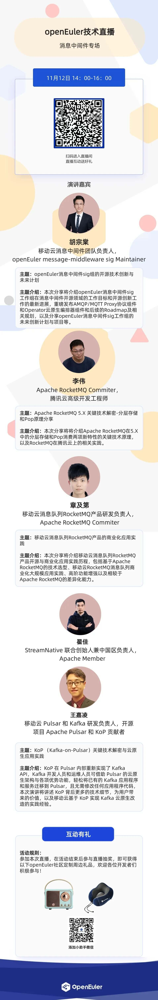

消息中间件是一种用于实现分布式系统之间通信的技术领域。它提供了一种可靠、高效的机制，用于在不同的应用、服务或组件之间传递消息。\
为了方便大家更深入地了解消息中间件，openEuler社区message-middleware
SIG将在11月12日进行技术分享。**本次技术直播邀请了来自移动云、腾讯云等公司的技术专家，分享他们在Apache
RocketMQ、Kafka-on-Pulsar等消息中间件的实践经验，分享各项目的功能、技术原理和应用**.赶快预约直播，一探究竟吧！

openEuler message-middleware SIG 将专注于探索为开源用户提供基于
openEuler
基础软件的消息中间件性能加速、安全加固、提升稳定性的解决方案，同时孵化消息相关的新项目（多协议消息转换组件、消息
API 标准和消息流转引擎等），补齐国内在该领域的相关能力。
