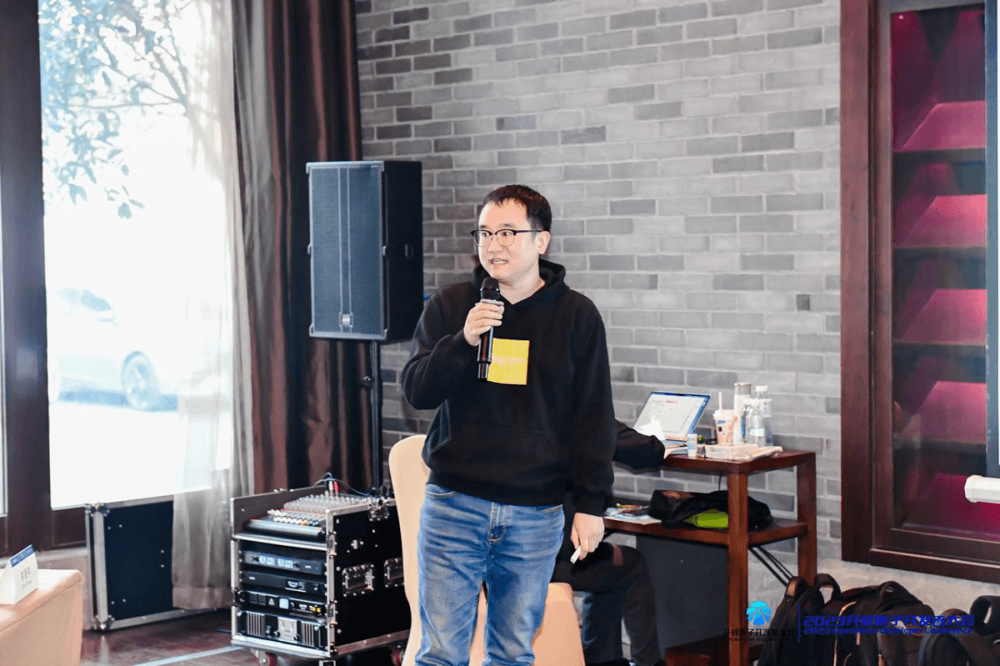

12 月 17 日，在无锡这座江南之城，OpenAtom 开发者大会 openEuler Code Camp
如约而至。众多业界翘楚、一线开发者以及用户汇聚一堂，共同见证 openEuler
为大家带来的生态快速繁荣的成功经验分享。在这场盛会中，openEuler
与大家一起探讨了社区在生态和技术发展的今朝与未来展望。

openEuler
开源四年以来，在技术、生态、社区影响力等方面取得了长足的进展，目前已经汇聚来自
1300 家单位的超过 1.6 万名社区开发者参与社区开发；**openEuler
社区运营总监郑振宇**为大家介绍了 openEuler
当前社区、技术、海外合作、开发者生态的最新情况以及未来的发展规划。

openEuler 社区运营总监 郑振宇

**openEuler message-middleware sig committer 申栋**和 **kosmos
核心开发者王一之**共同为大家带来了《移动云 RocketMQ
云原生演进之路》，本次分享以移动云 RocketMQ
在云原生领域的发展历程为主线，介绍了 RocketMQ
是如何一步步演化为如今的分布式云架构。在本议题中，申栋结合了实际的示例，详细介绍
RocketMQ
在云原生发展的各个阶段所面临的问题、解决方案及架构的演进。王一之为大家介绍了在分布式云原生领域的开源项目
kosmos，包含其功能、架构的介绍以及核心实现等。

openEuler message-middleware sig committer 申栋

kosmos 核心开发者 王一之

**《代码中的软件工程》和《庖丁解牛Linux操作系统分析》作者、WasmFunction
开源项目创始人孟宁**为大家介绍了 WasmFunction，这是一个基于 Kubernetes +
WebAssembly 的新一代高性能 Serverless FaaS 平台，充分利用 WebAssembly
技术的轻量、快速、跨平台优势，提升 Serverless FaaS
冷启动性能，大幅降低资源占用成本，为未来万物智联泛在计算场景中的云、边、端计算资源统一调度探索技术路径。

WasmFunction 开源项目创始人 孟宁

在算力多样化的发展趋势下，openEuler
和昇腾一直在探索，为各种领域的开发者提供国产的解决方案。在AI赋能全行业的今天，计算机视觉技术走进了人们的生活，而
OpenCV
作为全球最大的计算机视觉库，拥有着庞大的开发者用户群体，因此华为在提升
openEuler 和昇腾在 OpenCV 的支持度也做了很多努力。**openEuler
开源开发工程师花逢春、曹梦晴**联合演讲了《源于中国，惠及全球：openEuler+Ascend
的 OpenCV 原生支持之路》，带大家了解openEuler 和 Ascend，揭秘
openEuler+Ascend 的 OpenCV 原生支持是如何实现的。

openEuler 开源开发工程师 花逢春

openEuler 开源开发工程师 曹梦晴

云原生逐步跨入成熟阶段，安全、资源利用率提升、降低开销、性能提升等成为新的热点。**华为云化网络架构师陈传雨**在《云原生场景下的软硬件深度协同实践分享》议题中，详细介绍了在云原生场景下，容器平台通过与操作系统、硬件的深度协同，在企业级的容器安全、离线业务混部、硬件加速以及异构协同等方面发力，提升系统性能与资源利用率，从而降低用户开销。

华为云化网络架构师 陈传雨

本次活动在开放原子开源基金会的大力支持下，完美落幕。同时 openEuler
社区欢迎更多企业伙伴、用户、开发者加入，一起参与、共同贡献、共创开源美好未来。

