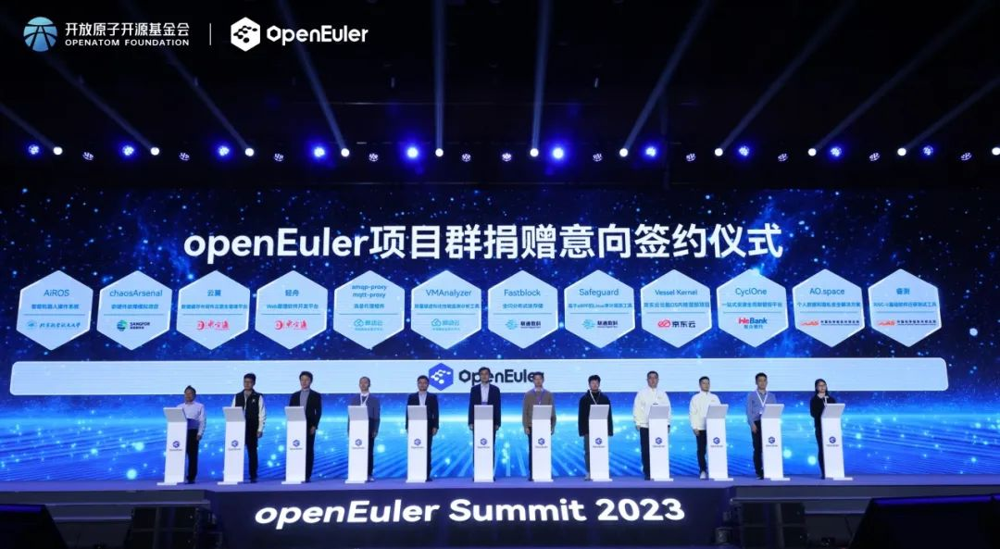
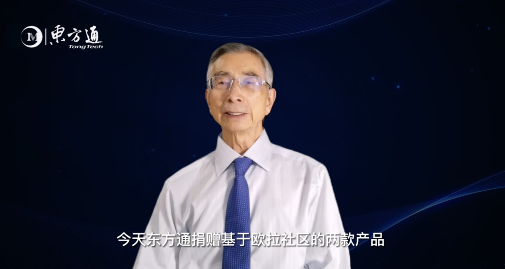
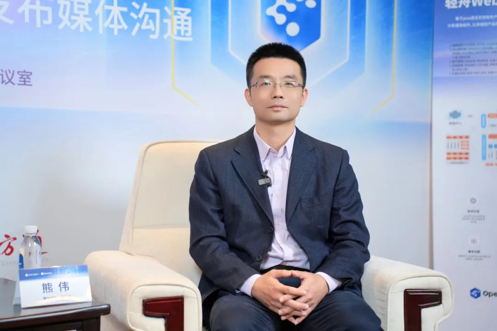
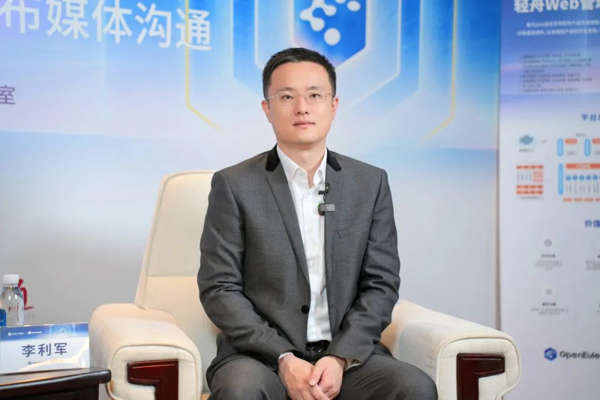
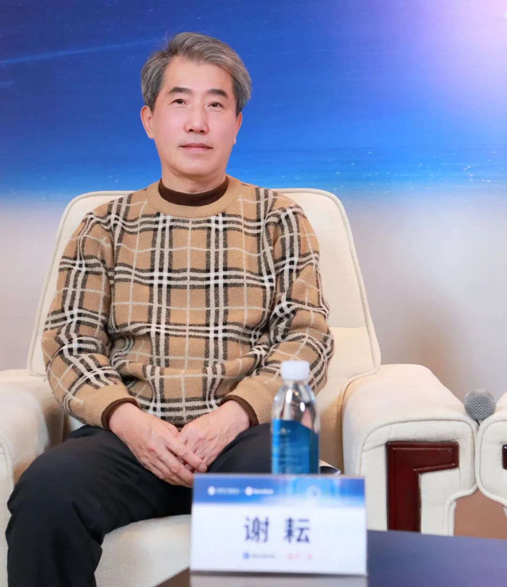

2023年12月15日-16日，操作系统大会 & openEuler Summit
2023在京举办。东方通等企业、机构与开放原子开源基金会openEuler社区签订项目群捐赠意向，丰富开源社区产品生态。

东方通捐赠轻舟Web管理软件开发平台、云翼数据缓存中间件云原生管理平台两个项目。同时，发布基于BishengJDK的TongJDK商用产品，繁荣基础软件生态。

中国工程院院士倪光南对东方通此次捐赠表示赞许，他表示，东方通捐赠展示了中国中间件厂商自主创新的能力和信心，东方通是中国中间件领域的龙头企业，具有很大的行业影响力，他们积极拥抱开源，将有力推动商用中间件产业化落地的能力，并推动开源社区的商业化发展。他相信随着中国开源社区影响力的逐步强大，以及越来越多企业、开发者的加入，未来，中国将为全球开源创新贡献中国力量。

openEuler委员会执行总监，开放原子开源基金会TOC副主席熊伟表示，放眼全球开源社区中，大型的开源项目一般都是由企业主导贡献，未来希望社区和东方通共同协作探索更有特色、创新的社区和企业协作的发展模式，推动社区的繁荣发展与企业的商业化发展， 
openEuler
社区将持续支持东方通等企业，基于社区不断获得产品、方案等更多创新发展，实现共赢。

东方通董事长兼总经理李利军接受媒体采访时表示，开源生态集合产业链力量，是推动产业数字化、智能化发展的重要力量，受到华为捐赠开源社区的鼓舞，东方通成为首个向openEuler社区贡献的专业中间件厂商，捐赠的两个项目是东方通自用的成熟软件研发平台以及云原生方向最新成果，并同步发布基于开源的产品，进一步与合作伙伴协调赋能，发挥东方通在基础软件领域的积累与优势，提供更多技术、资源支持，聚焦基础软件核心能力构建。

东方通首席科学家谢耘博士，向采访媒体介绍了东方通本次捐赠的两个开源项目以及新发布产品，将围绕openEuler社区打造产品开发的重要生态平台，提升基础软件云原生管理能力。他提倡像东方通这样具有行业代表性的基础软件厂商，自主创新能力不应局限于企业内部的自主研发，更需探索快速实现社会和经济效益的路径，以产业繁荣带动企业长远发展。

据悉，轻舟Web管理软件开发平台主要面向一站式软件开发与集中化管理的业务场景，充分复用软件开发过程中的架构设计和通用组件，以快速完成产品的开发；云翼数据缓存中间件云原生管理平台主要面向云转型趋势下，为企业业务系统上云，提升云原生弹性伸缩、负载均衡、运维监控等能力支持。两个项目将帮助企业及开发者提升软件开发效率，以及云转型、智能化发展等。东方通TongJDK则是基于BishengJDK，扎根基础软件底层，面向海量使用Java程序的客户需求而研发发布，产品内核保持与OpenJDK同步，东方通定期发布其安全和漏洞补丁，为企业用户提供更安全保障。

作为大会协办单位，峰会期间，东方通受邀参加软通动力伙伴分论坛、麒麟信安伙伴分论坛和云原生技术分论坛，向各产业组织、全球开源基金会、学术领袖、行业用户、生态伙伴以及开发者展示最新创新成果，分享数字化转型实践，共析产业发展新趋势。
