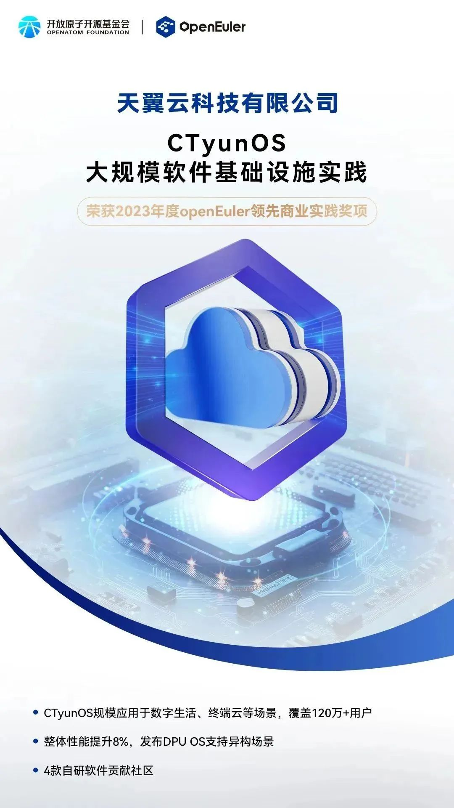

12月15日，在操作系统大会上，重磅揭晓了2023年度openEuler领先商业实践项目。

2023年度openEuler领先商业实践由OpenAtom
openEuler社区联合国家工业信息安全发展研究中心，携手业界专家，围绕技术创新性、示范推广价值、应用规模、服务运维能力、社区贡献五大维度对公开征集的商业实践成果完成多轮遴选，最终评选出15家企业。

（企业名单：中移（苏州）软件技术有限公司、天翼云科技有限公司、咪咕视讯科技有限公司、美团、中国建设银行股份有限公司、招商银行股份有限公司、中国工商银行股份有限公司、中信银行股份有限公司、微众银行、国能信息技术有限公司、联通数字科技有限公司、超聚变数字技术有限公司、京东科技信息技术有限公司、恒生电子股份有限公司、上海交通大学）

赶紧下滑，一起来看看这些项目领先之处。

