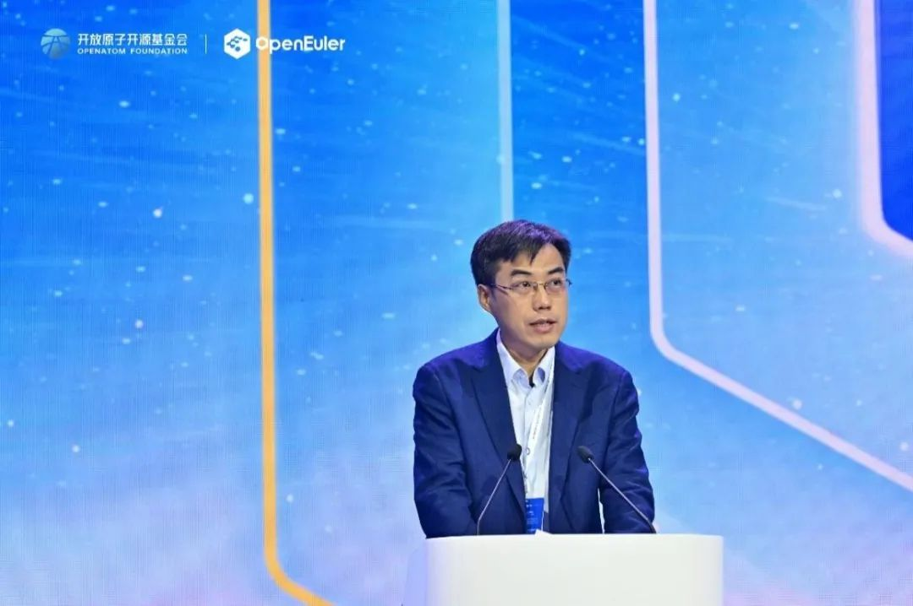
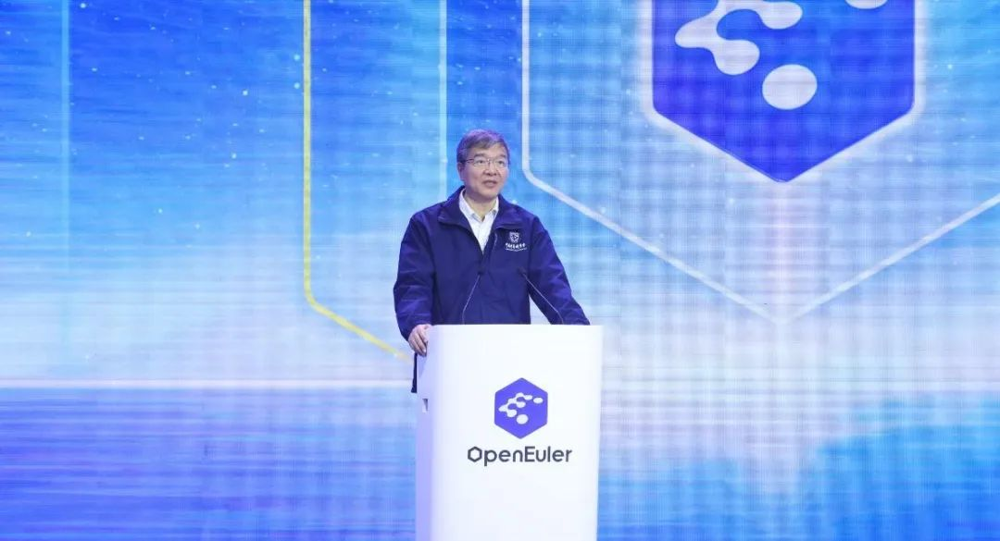
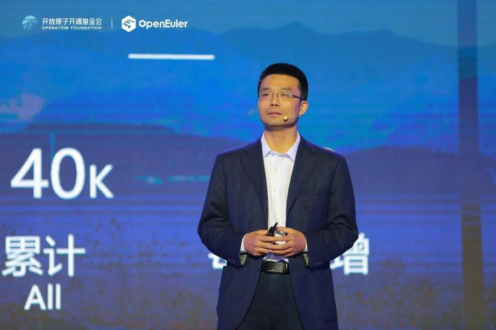
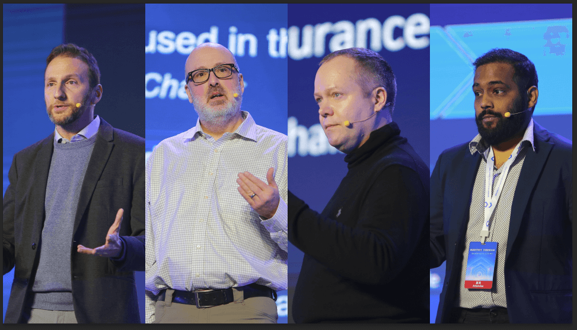
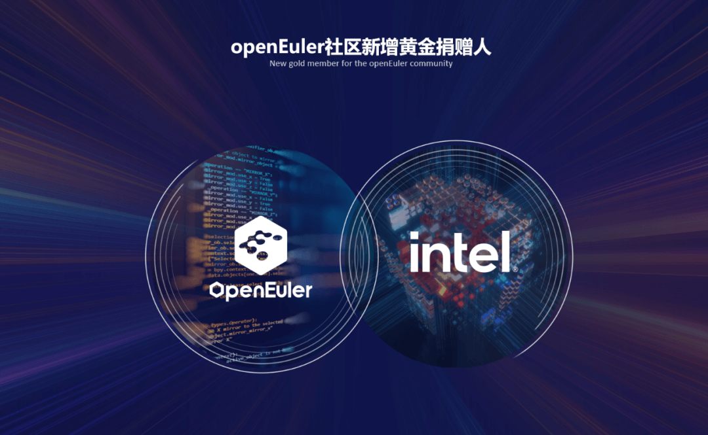
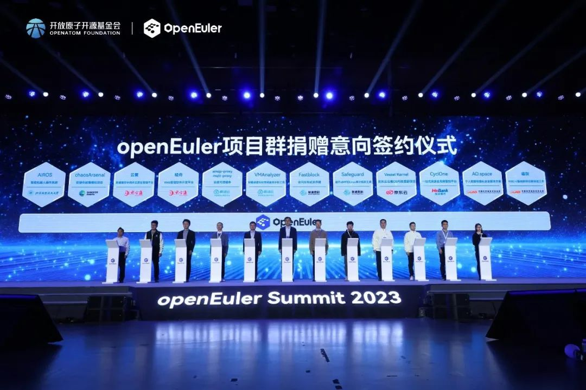
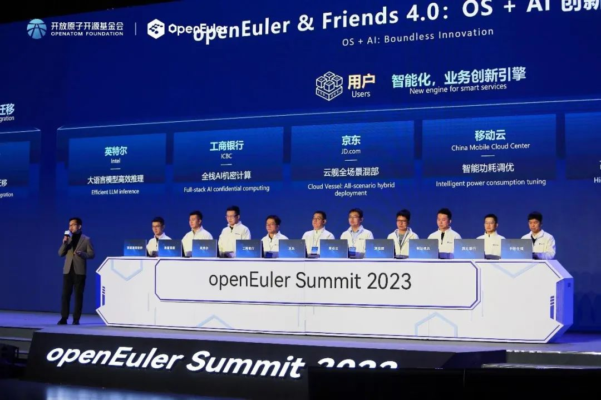
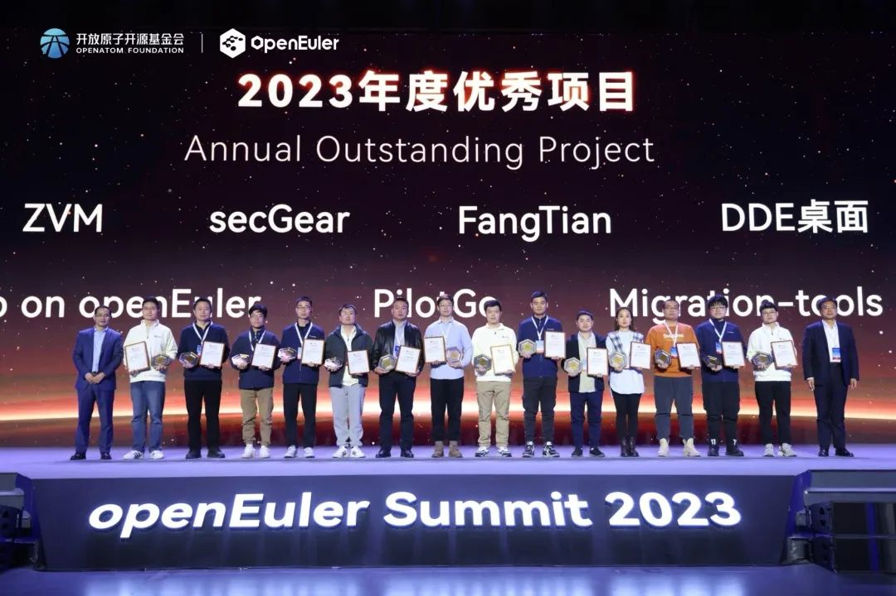
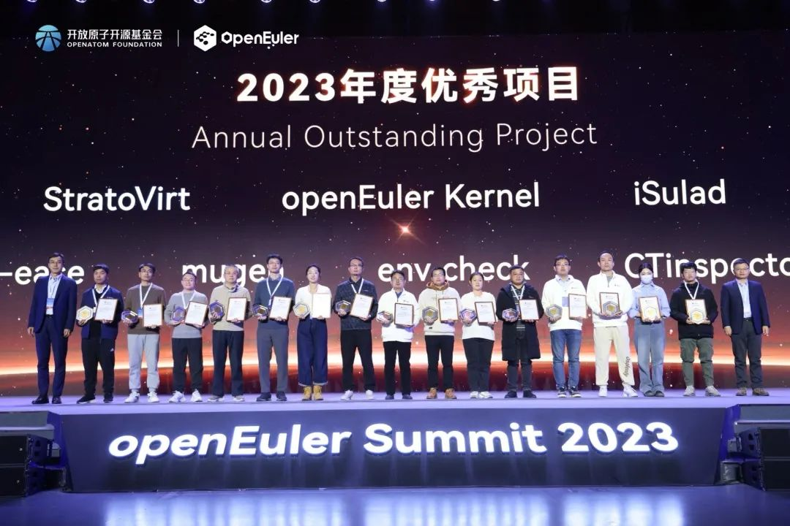
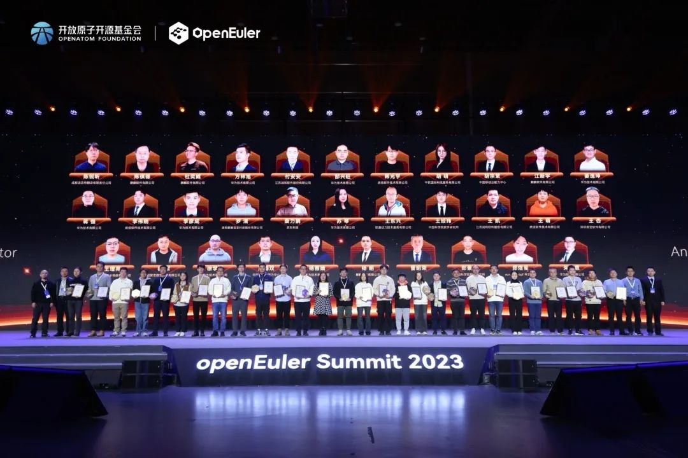

\[中国，北京，2023年12月16日\] openEuler Summit
2023在北京国家会议中心圆满落幕。本次峰会由openEuler社区成员单位麒麟软件、麒麟信安、华为公司、超聚变、英特尔、软通动力、统信软件、中科院软件所、凝思软件、东方通、中软国际等共同举办。openEuler社区始终坚持"共建、共享、共治"的原则，与全产业链伙伴共同努力，构建可持续发展的开源新生态。

openEuler委员会主席、开放原子开源基金会理事长助理江大勇在致辞中表示，2021年产业界生态伙伴共同将openEuler项目捐献到开放原子开源基金会，两年多以来，基金会在商标托管、生态发展、开放治理等方面为openEuler项目的发展提供了更好的平台，进一步推动openEuler实现了由企业主导向产业共享共建的转变。

目前，openEuler系累计装机量已超过610万套，根据IDC预测，2023年openEuler系在中国服务器操作系统市场份额达到36.8%。openEuler社区已吸引1300+家头部企业、研究机构和高校加入，汇聚16800+名开源贡献者，成立100+个特别兴趣小组（SIG），发布了2个长周期版本、5个创新版本，且社区版本下载量已突破200万。openEuler开源社区已成为中国最具活力和创新力的开源社区。

openEuler委员会主席、开放原子开源基金会理事长助理 江大勇

中国计算机学会（CCF）是计算领域的学术共同体，其使命是推动计算事业发展和提升专业能力建设，目前拥有10.7万会员。CCF积极围绕会员需求开展服务，每年开展各类活动就超过1500场，是中国最活跃的优秀社团。中国计算机学会秘书长唐卫清在致辞中表示，未来CCF将积极探讨和openEuler在开源和操作系统方向展开合作，共同促进中国操作系统的应用和发展。

中国计算机学会秘书长唐卫清

过去4年，openEuler实现了飞速发展。开放原子开源基金会TOC副主席、openEuler委员会执行总监熊伟表示，面向数智时代，openEuler以技术为根，持续创新，增强全场景布局，完善云网端边软件栈；深化与AI的融合，发布EulerCopilot，初步实现代码辅助生成、问题智能分析、系统辅助运维等功能，让欧拉更智能，统一异构资源管理与调度，提升有效利用率，使能AI更高效，从而逐步逐步构筑智能时代最佳算力底座。同时，以生态为基，携手头部企业及海外开源基金会，构建全球开源新生态。

开放原子开源基金会TOC副主席、openEuler委员会执行总监熊伟

**以技术为根，持续创新\
构筑智能时代最佳算力底座**

**增强全场景布局，完善云网端边软件栈**

2021年，面向数字基础设施的开源操作系统欧拉正式发布，实现同时支持服务器、云计算、边缘计算、嵌入式等各种形态设备的需求。目前，欧拉除了在服务器领域、云、边缘和嵌入式等关键场景持续增强布局之外，也在同步推动基于openEuler原生开发，实现在基础设施上可以支持多架构、多版本、可视化的编排和构建。并通过FangTian、高性能视窗等项目，实现在更多场景与鸿蒙生态的互通，进一步拓展欧拉和鸿蒙之间协作的边界，逐步构建智能时代最佳的算力底座。

**从数字openEuler，到智慧openEuler**

智能时代，操作系统需要面向AI不断创新。当前，欧拉和AI深度结合，一方面使用ChatGLM基础模型，基于大量欧拉操作系统的代码和数据，训练出EulerCopilot，初步实现代码辅助生成、问题智能分析、系统辅助运维等功能，让欧拉更智能。另一方面，欧拉通过异构资源统一管理与调度，统筹内存和算力，实现CPU和NPU的深度融合，充分挖掘空闲资源，提升有效利用率，进而提升AI训练和推理性能，使能AI更高效。

**以生态为基，汇聚全球开源力量\
构建全球开源新生态**

**携手9大海外头部开源基金会，构建全球开源新生态**

openEuler致力于打造国际化开源协助平台，与国际主流基金会深度合作，已支持全球98%的主流开源软件。欧拉深度参与OpenChain、OpenSSF等全球主流软件供应链安全标准与规范的制定、推广，率先通过OpenChain
ISO 5230开源软件协议认证，社区基础设施达到OpenSSF SLSA
L3标准。此外，还与SPDX、CHAOSS等全球主流社区和组织合作，满足全球各区域本地化要求，规范欧拉开源社区的国际化治理。目前，openEuler社区与9大海外头部开源基金会开展深入合作，为150多个国家和地区提供服务，构建全球开源新生态，开创了中国开源新模式。

**英特尔成openEuler社区黄金捐赠人，携手产业界共建生态底座**

英特尔（Intel）自2021年签署CLA加入openEuler社区，积极贡献x86平台的生态适配和技术优化，将x86的多代平台Ice
Lake、SPR、Emerald
Rapids引入到openEuler上，并将AI计算加速框架集成到openEuler，同时在openEuler的多个核心的SIG都有深入贡献。会上，英特尔宣布正式成为openEuler社区的黄金捐赠人，携手产业界共建操作系统生态底座，为全球开发者提供更优质的资源和支持。英特尔开源技术中心总监杨继国表示："未来Intel将持续把Intel的上游开源项目集成到openEuler，并与openEuler共同在AI上持续发力，从软硬协同使能AI算力，满足各行业对于AI智算技术的需求。

**社区共建，联合社区成员与开发者\
为openEuler注入创新力量**

**8家单位13个项目签署向openEuler捐赠意向**

自去年年底openEuler成立项目群后，各行业领域头部企业及开发者的项目开始不断加入，openEuler项目群的开源项目数量持续赠加，社区涵盖的行业也日趋多样化。会上，来自中国移动云能力中心、联通数字科技有限公司、中国科学院软件研究所、北京航空航天大学、微众银行、北京东方通科技股份有限公司、深信服科技股份有限公司及京东科技信息技术有限公司8家公司的13个项目与openEuler项目群签订捐赠意向。本次捐赠意味着openEuler进入开源治理的新阶段，来自不同行业和领域的捐赠项目为openEuler注入新的创新力量，进一步增强社区技术创新能力，促进社区生态繁荣。

**openEuler & Friends 4.0，十大联合创新成果走向行业用户**

openEuler不为创新而创新，而是把创新带给千行万业，让创新成果走向更多行业用户。openEuler
& Friends
4.0十大联合创新成果发布，浪潮UBML、浩瀚深度、英特尔、工商银行、京东、移动云、深信服、咪咕视讯、微众银行和中移在线10家企业围绕用户实际使用场景进行全流程、全场景的联合创新。openEuler通过强化跨平台支持和提升AI、ML支持，在为开发者提供更加方便、强大的技术支持，推动整个开源操作系统生态的繁荣和发展。十大联合创新成果的发布，也意味着多行业、多场景下的应用对openEuler社区的技术认可。

创新项目是openEuler社区发展的推动力，开发者是社区可持续发展的能源。会上，openEuler社区评选出29个"openEuler
2023年度社区优秀项目"和34名"openEuler 2023年度贡献之星"。

未来，openEuler社区将继续秉持"共建、共享、共治"的理念，通过与伙伴和全球开发者共同努力，推动基础软件技术的持续创新和应用，构建一个更加开放、多元的全球开源社区。
