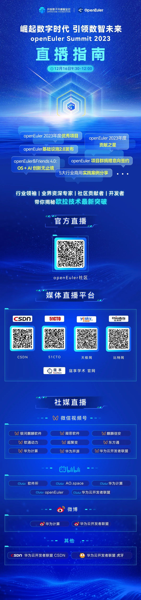

12月15日，以"崛起数字时代，引领数智未来"为主题的操作系统大会在北京国家会议中心举办，大会由开放原子开源基金会、中国电子技术标准化研究院、国家工业信息安全发展研究中心、中国软件行业协会共同主办。

会上，openEuler委员会主席江大勇发表《崛起数字时代，引领数智未来》主题演讲，他表示："openEuler开源四年，实现跨越式发展，累计部署610万套，2023年中国服务器操作系统新增市场份额第一。仅用4年时间，就在全球最大的单一市场成为第一，创造了基础软件领域的纪录。我们将继续坚持技术为根的宗旨，在最佳支持多样性计算、使能数字全场景的基础上，增强openEuler和AI的融合，从数字openEuler，向智慧openEuler演进。"

openEuler委员会主席江大勇

**以下为江大勇主题演讲全文**

尊敬的倪光南院士、邬贺铨院士，各位来宾，各位开发者朋友们，大家上午好！欢迎各位参加操作系统大会。

感谢领导对openEuler开源社区提出的殷切期望，感谢各位院士对操作系统发展提出的指导意见。

刚才我们一同见证重磅奖项的颁发、全球化合作仪式，以及各行业用户实践案例分享，让大家了解openEuler在技术创新、行业应用、产业生态和全球化方面所取得的重大进展。

下面我代表openEuler委员会，向大家报告社区最新的进展和面向未来的思考。

openEuler开源四年，实现了跨越式发展。从2019年9月openEuler社区正式上线，到12月31日代码正式开源，再到今天历经1400多天，openEuler系已经成为中国服务器操作系统新增第一，累计部署610万套。根据IDC报告预测，openEuler系市场份额达到36.8%，并在技术创新、行业应用、产业生态建立了完善的发展体系，形成了正循环。

**这是在全球最大的单一市场，基础软件领域，仅用4年时间就成为第一份额，创造了纪录。**

openEuler开源社区快速的发展，离不开产业界、学术界各位领导、专家与开发者朋友们的支持和贡献，是大家共同的努力，帮助openEuler快速成长。在这里表示由衷的感谢，谢谢大家！

我们看到，行业数字化正不断深入，智能化浪潮迎面而来。

过去一年，在AI大模型方面取得了令人瞩目的突破和发展，从感知理解世界，迈向了智能创造价值。以大模型、大算力为代表的技术创新不断推动着人工智能的发展，AI加速进入行业生产系统，改变千行万业的格局。

智能时代，操作系统需要面向AI不断创新。一方面，用AI赋能操作系统，在操作系统开发、部署、运维全流程以AI加持，让操作系统更智能；另一方面，操作系统也需要发展自身，支撑AI的发展需求，满足通用算力和AI算力异构融合趋势，更好地使能上层AI应用。

**从数字openEuler，到智慧openEuler**

openEuler定位是数字基础设施的开源操作系统，通过开源协作的社区创新平台，汇聚从处理器、硬件整机、OSV、ISV，以及高校、开源组织和万千开发者的力量，以开源的技术创新、开放的产业生态，赋能千行万业生产，支撑数字化转型和智能化升级。

面向未来，我们将继续坚持技术为根的宗旨，在最佳支持多样性计算、使能数字全场景的基础上，增强openEuler和AI的融合，从数字openEuler，向智慧openEuler演进。同时，持续在融入全球生态、发展产业人才上发力，为openEuler的发展创造更大的舞台和更强的动力，将openEuler打造成为数智时代全球领先的操作系统，引领数智未来。

**以AI赋能openEuler更智能\
以openEuler使能AI更高效**

首先是引领技术创新。

openEuler是支持多样性计算的先锋，已经支持ARM、x86、RISC-V等全部主流通用计算架构；在智能时代，openEuler也已经支持了包括英伟达、昇腾等在内的全部主流AI处理器，成为使能多样性算力的首选。

在openEuler和AI的深度结合上：一方面，我们使用ChatGLM基础模型，基于大量openEuler操作系统的代码和数据，训练出了EulerCopilot，初步实现代码辅助生成、问题智能分析、系统辅助运维等功能，让openEuler更智能。

另一方面，openEuler通过异构资源统一管理与调度，统筹内存和算力，实现CPU和NPU的深度融合，充分挖掘空闲资源，提升有效利用率，进而提升AI训练和推理性能，使能AI更高效。

通过AI加持与结合，覆盖系统开发、应用运行和系统运维的全流程，打造智能时代操作系统的最佳选择。

2024年，openEuler将发布全新内核的24.03 LTS版本，持续增强全场景能力。

openEuler与全球主流处理器厂商和OSV，共同协商选定Linux
6.6作为openEuler新的LTS版本的内核，实现生态统一，避免重复适配，提升效率。

新内核带来全新的EEVDF调度器和folio内存管理机制，将极大提升调度和内存使用效率，同时也在IO管理、新网络标准支持以及对CXL的支持上有全面提升。

在云计算场景，通过CPU聚合调度，将低负载算力智能聚合，实现负载与算力协同，减少任务的调度时延与切换开销，虚机密度15%以上的提升；提供openEuler配套的云原生最小集发行版，支持一键部署。

在嵌入式场景，openEuler将支持BMC，并发布面向服务器BMC的原创开源项目Metabmc；还将提供原生内置openEuler的标准化开发板\--"openEuler派"、以及工业机器人框架\--"openEuler臂"。

在AI加持方面，除了EulerCopilot，还有实现操作系统"自优化"的智能调优，在应用运行中通过感知业务特征，动态调整调度优先级、配置参数等优化策略，可实现场景化性能15%以上的提升。

新版本将于2024年5月发布，敬请期待。

**汇聚全球开源力量，为世界开源贡献中国智慧**

其次，是全球生态构建。

openEuler一直致力于打造国际化的开源协作平台，汇聚全球开源力量，为世界开源贡献中国智慧。

在技术生态方面，openEuler始终坚持Upstream
First原则，与国际主流基金会深度合作，已支持了全球98%的主流开源软件；更进一步，openEuler已经作为持续集成的操作系统，进入云原生、大数据、存储、数据库、HPC等开源社区，实现了上游openEuler原生支持，开箱即用。

在软件供应链的稳定和安全方面，openEuler深度参与OpenChain、OpenSSF、SPDX等全球主流软件供应链安全标准与规范的制定、推广，率先通过OpenChain
ISO 5230开源软件协议认证，社区基础设施达到OpenSSF SLSA
L3标准，为用户提供安全可靠的系统。

openEuler还与全球主流社区和组织合作，帮助openEuler满足全球各区域本地化要求，规范openEuler开源社区的国际化治理。让全球用户和开发者充分使用openEuler、贡献openEuler。

全球化的openEuler，需要全球化的社区基础设施的支撑。

我们围绕开发、构建和协作的全流程社区活动，打造高效易用的社区基础设施平台，助力openEuler全球生态。

全球化开发方面，支持多代码托管平台接入社区，方便贡献者就近开发；支持多平台多类型镜像的分发，方便用户就近获取openEuler。

全场景构建方面，定义创新的软件元数据描述文件，适配众多格式的上游软件，通过EulerMaker，实现全场景的统一构建。

全链路协作方面，通过应用软件平台，连接海量上游软件和社区用户，实现上游软件的分类聚合和预验证，以及用户共性问题反馈快速闭环，大幅提升协作效率。

**开创产教融合新模式，加速openEuler人才发展**

最后，是发展产业人才。

人才是产业发展的原动力，高校是培养人才的摇篮。2022年7月，开放原子开源基金会正式启动了"开放原子校源行"，通过资助开源社团、推广开源课程、设置开源助学金等方式，面向全国高校培育开源人才，加快推动开源生态繁荣。

openEuler作为基金会的重要项目群，我们也积极参与到这个项目中来，和北京航空航天大学、北京大学、上海交通大学、湖南大学、大连理工大学、兰州大学等多所高校深度合作，相关研究成果已通过社区，快速完成实践和验证，开创了产研融合、产教融合的新模式。

未来，openEuler将与更多高校合作，为全球基础软件培育更多的人才。

朋友们，让我们携手同行，共建更好的openEuler，引领数智未来！
