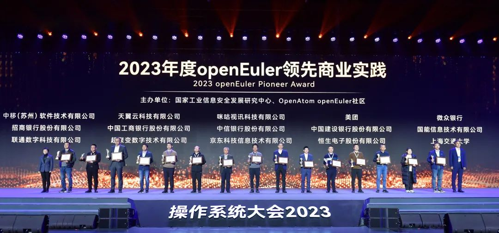
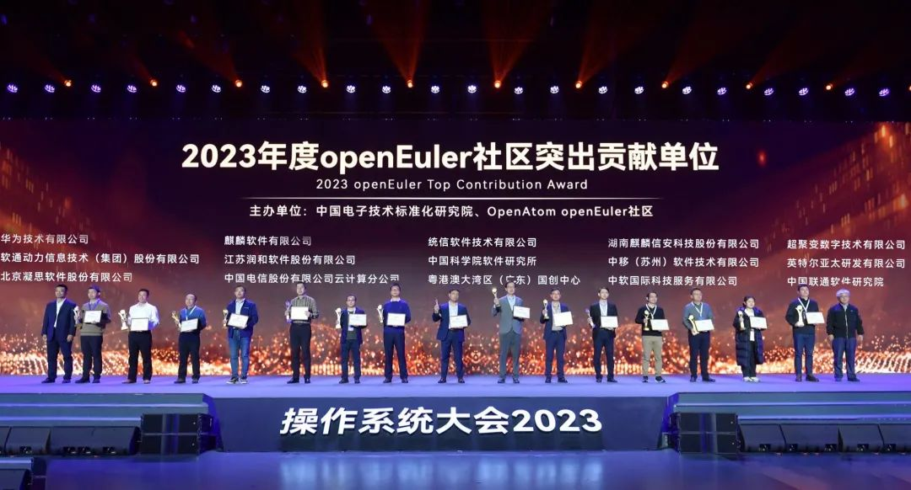
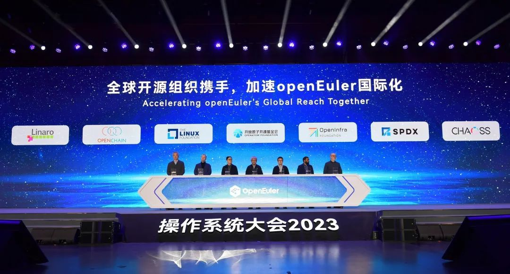

\[中国，北京，2023年12月15日\] 以"崛起数字时代，引领数智未来"为主题的操作系统大会2023今日在北京国家会议中心举办，大会由开放原子开源基金会、中国电子技术标准化研究院、国家工业信息安全发展研究中心、中国软件行业协会共同主办，旨在汇聚全球产业界创新力量，构筑坚实的基础软件根基，推动基础软件技术持续创新，共建全球开源新生态。

过去一年，openEuler加速发展。**截至目前，openEuler系累计装机量超过610万套，根据IDC预测，2023年openEuler系在中国服务器操作系统市场份额达到36.8%。**开源四年，openEuler实现了跨越式发展，成长为中国第一服务器操作系统，并在技术创新、生态发展、社区合作、商业落地上建立了完善的发展体系，形成了产业正循环。openEuler成为中国首个达成市场份额第一的基础软件，这是中国基础软件产业发展的重要里程碑，为数字中国打造了坚实可靠的软件底座。

开放原子开源基金会理事长孙文龙在大会致辞中表示，充分利用开源、参与开源、支持开源、回馈开源，是实现操作系统技术创新和产业繁荣的有效路径。

openEuler开源社区秉承"共建、共享、共治"的原则，携手全产业链共建可持续发展的操作系统产业生态。社区开源以来，已吸引1300+家头部企业、研究机构和高校加入，汇聚16800+名开源贡献者，成立100+个特别兴趣小组（SIG），openEuler开源社区已成为中国最具活力和创新力的开源社区。

作为openEuler社区成员单位之一，华为高级副总裁、ICT战略与Marketing总裁彭松在大会致辞中表示，华为将持续聚焦根技术投入，提升基础软件的创新力和竞争力，支撑数字基础设施的建设和应用软件生态繁荣；拥抱智能化，促进操作系统和AI融合，激发基础软件创新；推动产学研结合，培养基础软件以及ICT产业人才，为技术创新提供源源不断的动力。

**2023年度openEuler领先商业实践项目揭晓，\
22个项目签约捐赠意向**

随着openEuler在各行各业规模应用，涌现出大批优秀的创新实践，有力推动行业数字化转型深入。为充分发挥openEuler领先商业实践在行业内的示范作用，引导更多新行业新领域应用落地，加快构筑繁荣共赢的产业生态，OpenAtom openEuler社区联合国家工业信息安全发展研究中心，携手业界专家，围绕技术创新性、示范推广价值、应用规模、服务运维能力、社区贡献五大维度对公开征集的商业实践成果完成多轮遴选，最终评选出15个2023年度openEuler领先商业实践项目。

openEuler的繁荣离不开社区成员的持续贡献，OpenAtom
openEuler社区联合中国电子技术标准化研究院及多位业界专家，根据团体标准T/CESA
1270.5-2023，从技术、治理、生态建设等贡献维度进行评价，选出15家突出贡献的先进单位。

从openEuler捐献给开放原子开源基金会之后，得到加速发展，2022年12月，开放原子开源基金会宣布openEuler升级为项目群，在治理章程、社区运作、资金募集等方面可独立项目运作，接受开源项目加入，使用openEuler项目群基础设施、运营、营销等资源。2023年上半年，9个项目完成捐赠意向签约，此次大会新增13个项目捐赠意向签约，多为解决方案类、涉及全场景、全开发流程的项目，捐赠后将从云原生、AI、智能化、可监控等维度为openEuler注入新的创新力量。

**拥抱智能时代，引领智能化创新**

过去一年，以大模型、大算力为代表的技术创新不断推动人工智能的发展，AI加速进入行业生产系统，改变千行万业产业格局。智能时代，操作系统需要面向AI不断演进。一方面，在操作系统开发、部署、运维全流程以AI加持，让操作系统更智能；另一方面，操作系统也需要适应AI的发展要求，满足通用算力和AI算力异构融合，更好的使能上层AI应用。openEuler已支持ARM，x86，RISC-V等全部主流通用计算架构，在智能时代，openEuler也率先支持NVDIA、昇腾等主流AI处理器，成为使能多样性算力的首选。

openEuler和AI深度结合，一方面使用ChatGLM基础模型，基于大量openEuler操作系统的代码和数据，训练出EulerCopilot，初步实现代码辅助生成、问题智能分析、系统辅助运维等功能，让openEuler更智能。另一方面，openEuler通过异构资源统一管理与调度，统筹内存和算力，实现CPU和NPU的深度融合，充分挖掘空闲资源，提升有效利用率，进而提升AI训练和推理性能，使能AI更高效。

中国工程院邬贺铨院士在主题发言中表示，紧抓"算网融合"大趋势，相信在openEuler社区上万名开发者和千家伙伴的努力下，
openEuler将成为全场景协同数字基础设施的坚实底座，也将助力中国工业互联网实现跨越式的发展。

**汇聚全球开源力量，为世界开源贡献中国智慧**

中国工程院倪光南院士在主题发言中表示，"openEuler"的经验充分证明，只要中国开发者协同起来，就有能力创建世界一流的开源社区。呼吁产业界共同携手，推动开源openEuler成为中国业界带头创建的、首个具有世界影响力的开源社区。

openEuler致力于打造国际化的开源协助平台，在技术生态方面，与国际主流基金会深度合作，已支持全球98%的主流开源软件；作为CI操作系统在云原生、大数据、存储、数据库、HPC等数十款开源社区，openEuler实现了上游原生支持，开箱即用。openEuler深度参与OpenChain、OpenSSF等全球主流软件供应链安全标准与规范的制定、推广，率先通过OpenChain
ISO 5230开源软件协议认证，社区基础设施达到OpenSSF SLSA
L3标准。此外，还与全球主流社区和组织合作，满足全球各区域本地化要求，规范openEuler开源社区的国际化治理。目前，openEuler社区与9大海外头部开源基金会开展深入合作，为150多个国家和地区提供服务，构建全球开源新生态，开创了中国开源新模式。

**开创产教融合新模式，加速openEuler人才发展**

人才是产业发展的原动力，高校是产业人才的摇篮。去年7月开放原子开源基金会正式启动"开放原子校源行"，通过资助开源社团、推广开源课程、设置开源助学金等方式，面向全国高校培育开源人才。作为基金会的重要项目群，openEuler和北京航空航天大学、北京大学、上海交通大学、湖南大学、大连理工大学、兰州大学等多所高校深度合作，相关研究成果通过开源社区，快速完成实践和验证，开创了产教融合、产学实践的新模式，为中国基础软件培育人才。
