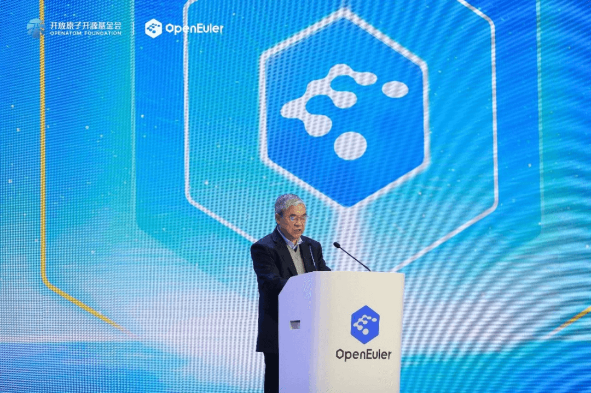

12 月 15 日，以"崛起数字时代，引领数智未来"为主题的操作系统大会 2023
在北京国家会议中心举办，中国工程院院士邬贺铨在大会上致辞，紧抓"算网融合"大趋势，相信在
openEuler 社区上万名开发者和千家伙伴的努力下，openEuler
将成为全场景协同数字基础设施的坚实底座，也将助力中国工业互联网实现跨越式的发展。

以下是致辞全文。

人工智能时代的到来，催生了智能计算和边缘计算的巨大需求，依靠单一数据中心算力提供服务已经越来越难以支撑产业发展，算网融合成为大势所趋。国务院"十四五"规划明确指出，推进"云网协同"和"算网融合"发展；加快构建算力、算法、数据、应用资源协同的全国一体化大数据中心体系。在算网融合的大趋势下，工业互联网的内网和外网将实现更深度的融合。内网主要是现场工控系统，包括
PLC、可编程逻辑控制器等工控单元，以及嵌入式软件；而外网的重要组成则是工业互联网平台。算网融合可以为工业互联网提供强大的计算和网络支持，使得工业互联网的各种应用能够更好地实现其价值。同时，工业互联网的发展也为算网融合提供了广泛的应用场景和实践基础。两者相辅相成，共同推动工业互联网技术创新和规模化应用，更好地服务支撑我国新型工业化。无论是算网融合的大趋势还是新型工业互联网的变革，都需要操作系统强力的支持。这些不同领域对操作系统的需求即有共性，也有区别，以工业互联网为例：工业现场级操作系统需要运行在嵌入式设备上，对低功耗、实时性、可靠性、安全性有更高的要求，因此一般都是轻量化的嵌入式实时
OS，负责嵌入式系统全部软、硬件资源分配、任务调度、控制、协调并发活动。另外，工业互联网平台汇聚算力、算法、数据和应用，支撑产业数据分析、资源连接、弹性供给、高效配置等，通常采用边缘+云端的云原生部署方式。因此，工业的现场级操作系统需要统筹全部软、硬件资源，又需要协同云端，边缘，端侧的数据和算力，是实现云、边、端协同的关键。

openEuler
定位为面向数字基础设施的开源操作系统，覆盖服务器、云计算、边缘和嵌入式场景，致力于打通数字基础设施的端、边、云全场景协同与创新，实现数字世界的跨场景、跨设备的无缝联接与协同，这种设计理念与工业互联网，算网融合等发展趋势不谋而合，契合产业未来发展规律。经过前面几年的快速发展，openEuler
在嵌入式、机器人等工业控制领域积极创新探索和实践，成果初现。openEuler
嵌入式版本能够满足工业场景微秒级确定性时延需求，同时又共享 openEuler
在服务器场景的产业生态和工具链。openEuler
孵化了嵌入式实时虚拟机方案，实现单个硬件平台上同时运行多个操作系统，在保障系统的安全性，灵活性和可靠性的同时，有效提升在混合部署场景下的资源利用效率。此外，openEuler
通过分布式软总线、分布式数据管理等技术，在工业控制、机器人、边缘计算等场景，实现数据在端、边、云的高效联接和高效流转。我国的工业互联网领域是一个万亿元规模的巨大赛道，但也存在场景碎片化、软硬件设计缺乏统一标准、难以兼容等诸多难题。因此，需要通过构建标准化软件框架，积极参与和主导开源社区建设，选择重要行业软件入手，建立良好生态。操作系统作为连接软硬件的枢纽，是一个很好的生态标准化建设的切入点。同时，结合开源社区的共享和共建，能够更快的吸纳众多企业和组织，形成完整的产业生态链。

openEuler
社区以开源社区为创新协作平台，积极投入构建良好的操作系统软硬件生态，在硬件层面，支持了丰富的硬件多样性算力生态，实现对
x86，ARM，RISC-V
等多种架构的多样性算力支持。在软件层面，积极和国际开源社区展开技术合作，逐步实现对
ROS 等各领域软件的相互支持。未来，希望 openEuler
社区进一步加大对工业互联网，算网融合等领域的投入，以更多的创新技术支持新型工业互联网和算网融合的发展。紧抓"算网融合"大趋势，我相信在
openEuler 社区上万名开发者和千家伙伴的努力下， openEuler
将成为全场景协同数字基础设施的坚实底座，助力中国工业互联网实现跨越式的发展，为我国打造"数实融合"的"新基建"，为实现中国数字经济高质量发展做出更大的贡献。
