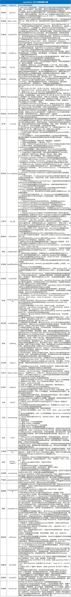

openEuler
社区的发展，离不开每一位贡献者在社区的专业和辛勤付出。从2019年底社区成立至今，已经有超过16,000名开发者在社区做出贡献。在12月16日openEuler
Summit 2023的**年度贡献之星揭晓仪式上**，揭晓了 openEuler
社区34名年度开源贡献之星名单，并给获奖代表颁发了荣誉证书。本奖项获奖成员由SIG组/跨SIG组自行组织评选，openEuler委员会审定。旨在对**在代码、文档和社区活动中做出突出贡献**的代表表达敬意。

在此也向社区每一位贡献者表示感谢，是你们成就了openEuler，成就了用户。openEuler
社区始终秉持"共建、共享、共治"的理念，期待更多开发者、开源爱好者加入社区，共创最具创新力的操作系统开源社区！

**openEuler 2023年度贡献之星名单**

