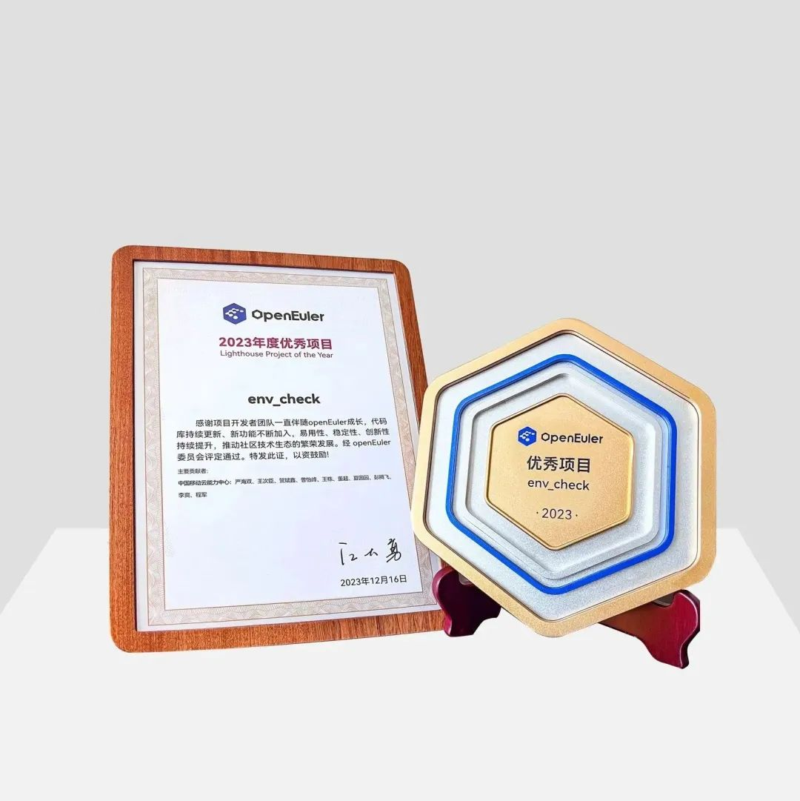

2023年12月15日，第四届操作系统大会&openEuler Summit
2023在北京盛大召开，此次盛会以"崛起数字时代 引领数智未来"为主题，汇聚了业界众多顶尖企业和专家，共同探讨基础软件领域的发展趋势和创新实践，共建和谐共赢的产业生态。

在大会上，移动云凭借在openEuler社区的突出贡献和商业实践，荣获"2023年度openEuler领先商业实践"、"2023年度openEuler社区突出贡献单位"、"2023年度贡献之星"、"2023年度优秀项目"四项大奖，为数智未来创造无限可能。

**最佳商业实践**

大云天元操作系统（BC-Linux），凭借其在应用规模、示范推广价值、技术创新性、服务运维能力、社区贡献五大维度卓越表现，赢得了大会组委会和业界的高度认可，**荣膺"2023年度openEuler领先商业实践"奖项**。

大云天元操作系统是中国移动基于业务发展和核心技术自主掌控需要，自主研发的服务器操作系统。自2015年启动研发，历经超八年的技术沉淀，聚焦全栈自主、多样算力、内核创新和安全可信技术领域，深耕系统安全、虚拟化和云原生等基础软件根技术，全面支持国产软硬件生态。大云天元操作系统在中国移动全场景业务中大规模应用，**累计部署超过45万套，广泛应用于金融、政务、交通、能源等重要行业**，全面覆盖服务器、云计算、云原生、边缘计算等应用场景，满足不同行业数字化、国产化转型需求。

中国移动今年率先启动了全国最大规模的国产化操作系统迁移替换工作，移动云发布天元"易行"迁移工具，与移动云智维平台深度集成，实现操作系统原地升级流程的自动化编排，支持60余条流水线并发执行，**构建了业界最优的一站式迁移作业平台，全网累计迁移规模超38万套，打造了国内最大规模、最高标准、最优效益的迁移实践标杆**。

**社区贡献突出**

作为最早加入openEuler社区的理事会成员之一，**移动云凭借社区年度排名前茅的贡献值，荣膺"2023年度openEuler社区突出贡献单位"奖项**。

移动云在openEuler社区累计贡献711个PR，主导成立了消息中间件SIG组，并向openEuler社区贡献SecScanner、VMAnalyzer和KSPack、mqtt-proxy、amqp-proxy共5款自研项目，参与30余个SIG组建设，贡献领域包括内核、虚拟化、云原生、消息中间件、系统迁移等多个方面，持续推动openEuler社区技术创新发展。

另外，移动云在开源社区也担任了重要席位，包括开放原子开源基金会openEuler项目群黄金捐赠人、openEuler社区委员会委员和用户委员会主席，SIG组Maintainer
3名，并牵头举办了多次线下meetup活动，进一步提升了移动云在开源社区的影响力。 

**年度贡献之星**

在本次大会上，**中国移动云能力中心的严海双和胡宗棠分别荣获"2023年度贡献之星"奖项**。

作为兼容性
SIG组Maintainer，严海双长期参与SIG组的开发和运营工作，积极邀请ISV合作伙伴加入openEuler社区，并牵头举办了1次线下Meetup活动，带领操作系统团队为社区贡献550个PR，其中，其主导的迁移工具env\_check项目自社区建仓以来，贡献并合并了190个PR，获得了年度优秀项目奖项。

作为消息中间件SIG组的Maintainer/发起人，胡宗棠从0至1创建该SIG组，参与SIG组项目的开发与运营治理工作，多次主持SIG组双周会议，先后培养6名同学成为社区Committer，同时在openEuler公众号上发布5篇文章，提升业界影响力；牵头举办了2次Meetup活动；孵化多款消息组件至openEuler社区；自23年SIG组创建以来，带领团队累计已贡献160+PR。

**年度优秀项目**

**由移动云操作系统团队主导研发的env\_check项目荣获了"2023年度优秀项目"奖项**，该项目是一款在操作系统迁移后对操作系统进行全面检查的工具，用户可以通过检查报告确认系统环境的健康状况，确保迁移后的操作系统不会出现潜在稳定性问题。该项目在国产化操作系统迁移改造中发挥了极其重要的健康检测作用，为后续业务的稳定运行提供了有力的支撑。

"路漫漫其修远兮，吾将上下而求索"。未来，在数字化、智能化浪潮下，移动云勇担数字中国建设国家队，努力建成技术领先、客户信赖、开放合作的一流云服务商，在基础软件技术创新之路上永不停歇，为数智时代的新基建建设和发展贡献力量。
