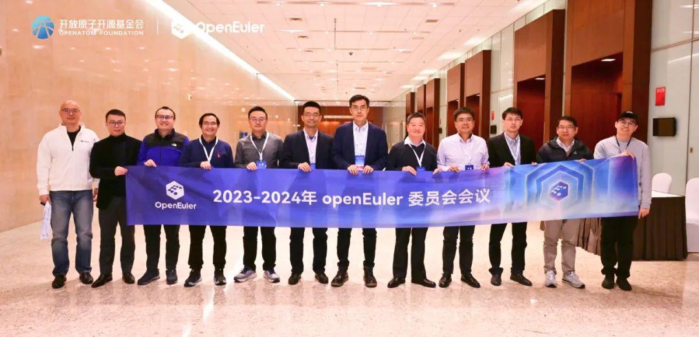

2023年12月14日，2023-2024年openEuler委员会第五次会议在北京国家会议中心召开。\
本次会议上，全体委员正式欢迎来自英特尔（中国）有限公司的杨继国加入openEuler委员会。同时，根据《openEuler项目群开源治理制度》，全体委员对更换openEuler委员会执行总监进行评议，投票通过了战略捐赠人提名的候选人熊伟成为新任执行总监，待开放原子开源基金会秘书处正式任命。此外在本次会议上，openEuler委员会审议了2023年openEuler项目群工作进展和2024年的工作规划、操作系统大会&openEuler
Summit 2023筹备工作进展，并提出了指导意见。

2023-2024年openEuler委员会第五次会议合影

（部分openEuler委员会委员和与会人）
