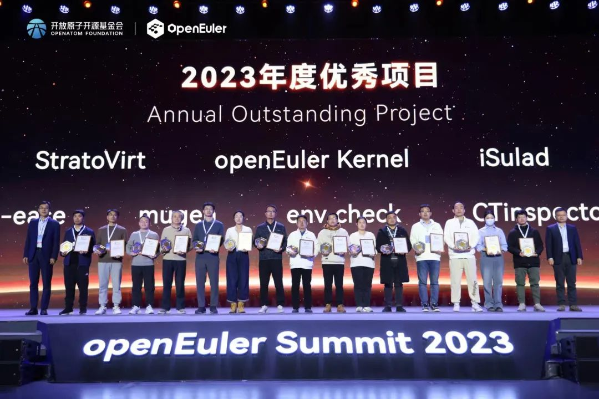
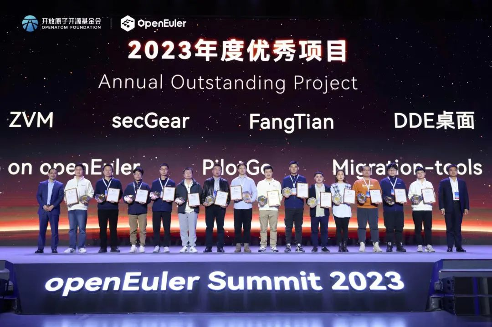
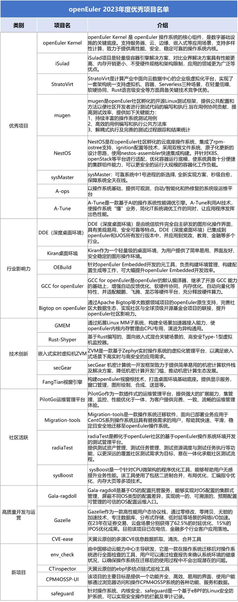

创新项目是openEuler社区发展的推动力。自社区建立以来，openEuler已经有将近500个创新项目仓库。在openEuler
Summit 2023 的**年度优秀项目揭晓仪式上**，揭晓了 openEuler
社区29个优秀项目名单，并给获奖代表颁发了荣誉证书。

2023年度优秀项目经过社区开发者的推选，openEuler技术委员会委员评选，从技术创新、生态建设、项目活跃度、行业影响力等多个维度选出29个优秀项目代表，旨在感谢这些项目及其幕后的开发者团队对社区的贡献，也对每一个项目开发者团队表示敬意。

在此也向社区每一个项目开发者团队表示感谢，是你们成就了openEuler，成就了用户。openEuler
社区始终秉持"共建、共享、共治"的理念，期待更多开发者、开源爱好者加入社区，共创最具创新力的操作系统开源社区！

**openEuler年度优秀项目名单**

