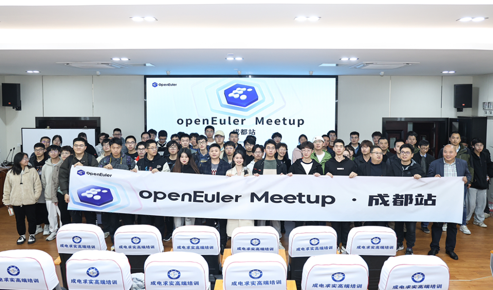

**概述**
====================================
11月中旬，上游社区正式确定了本年度的LTS版本 Linux
6.6。根据openEuler技术委员会会议决策结果（2023年8月）：\"openEuler 24.03
LTS将采用 2023 年年底的上游内核社区LTS版本作为其内核选型版本\" ，**Linux
6.6 将作为 openEuler 24.03 LTS 的内核基线版本**。

OpenCV 社区、Kata Containers
社区相继支持openEuler。高性能分布式块存储系统
fastblock、基准性能调优分析工具 kytuning、运维变更观测工具 Aguith、基于
eBPF 的 Linux 安全防护系统 safeguard
在社区开源，进一步丰富社区软硬件生态。

在技术进展中，由 DPU SIG 维护的开源项目 DPU-OS
迎来了一次更新，提供更轻量化 OS 安装镜像。iSulad 通过 Kuasar
沙箱运行时提供了高效和稳定的沙箱管理能力，实现了在单节点上轻松运行10w+
WASM沙箱。openEuler嵌入式OS兼容性技术测评标准已正式通过，当前已有3家OSV伙伴完成该技术测评。基于secGear的科研成果被中科院一区物联网顶级期刊
IOTJ
录取，这是机密计算框架secGear首次被正式发表在国际顶级期刊上。另外，社区新增
Haskell SIG，该SIG组将持续关注并丰富社区的语言工具生态。

本月，openEuler社区举办了3场技术讨论会，openEuler成都用户组、电子科技大学openEuler
技术小组成立。深受高校开发者欢迎的开源之夏2023结项成果也在本月底公示，欢迎查阅。

2023年12月15-16日，操作系统大会&openEuler Summit 2023
将在北京国家会议中心举办，十余场分论坛、三十余场社区专题会议以及近百个展位期待您的莅临，[欢迎报名参加]{.underline}。

感谢各位开发者们对openEuler的贡献，本月报阅读时长15分钟，欢迎细读。

**社区规模**
====================================
截止2023年11月30日，openEuler社区用户累计超过200万。16,778名开发者在社区持续贡献。社区累计产生
143.7K个PRs、72.6K条Issues。截至目前，加入 openEuler
社区的单位成员超过1200家，11月新增117家。

社区贡献看板（截至2023/11/30）

**社区大事件**
====================================
**操作系统大会&openEuler Summit
2023将在12月15日-16日北京举办，欢迎报名**

2023年12月15-16日，操作系统大会&openEuler Summit 2023
将在北京国家会议中心举办。大会旨在汇聚全球产业界创新力量，构筑坚实的基础软件根基，推动基础软件技术持续创新，共建全球开源新生态。

本次大会将搭建开放、合作、共享的平台，携手产业组织、全球开源基金会、学术领袖、领先的行业用户、生态伙伴以及开发者等，共同探讨操作系统产业发展方向和未来机遇，并联合伙伴展示最新合作成果，分享数字化转型实践，共建和谐共赢的产业生态。十余场分论坛、三十余场社区专题会议以及近百个展位期待您的莅临！

操作系统大会&openEuler Summit 2023 议程抢先看！

**OpenCV 社区原生支持 openEuler**

2023年11月，OpenCV 社区正式接纳 openEuler 作为持续集成（Continuous
Integration，CI）系统的操作系统之一，对openEuler提供上游原生支持。openEuler成为继Ubuntu之外第二个被OpenCV上游社区原生支持的Linux发行版。

**Kata Containers 社区原生支持 StratoVirt**

近期，Kata Containers 上游社区正式接纳 StratoVirt 作为原生支持的
VMM(Virtual Machine Manager) 之一，相关 API 已完成适配，StratoVirt
的容器生态得到进一步拓展。合入 Kata
上游社区简化了合作伙伴在安全容器场景下使用 StratoVirt
的流程，用户可以更方便地部署和使用 StratoVirt。

**基于secGear的科研成果被国际顶级期刊录取**

近日，由兰州大学智能计算技术研究团队的科研论文"Improved LTE-R Access
Authentication Scheme Based on Blockchain and
secGear"被中科院一区物联网顶级期刊IOTJ（IEEE Internet of Things
Journal）录取为长文（Regular）。这篇论文由刘忻副教授、硕士生王家寅、博士生王淼、以及张瑞生教授共同合作完成，这是机密计算框架secGear首次被正式发表在国际顶级期刊上，目前论文已经被预发表：https://ieeexplore.ieee.org/stamp/stamp.jsp?tp=&arnumber=10288119 。

由Confidential Computing
SIG维护的secGear，是面向计算产业的机密计算安全应用开发套件，开发者可基于
secGear 贡献开源中间件或解决方案，也可以基于 secGear 构建商用解决方案。

secGear doc:

https://www.openeuler.org/zh/other/projects/secgear/

**openEuler 成都用户组及电子科技大学 openEuler 技术小组成立**

11月24日，openEuler Meetup 在成都举办。本次 Meetup 由 openEuler
社区、成都菁蓉联创科技有限公司、电子科技大学主办，四川鲲鹏&欧拉创新中心协办，吸引了40余位来自工业制造业、物联网、芯片、装备工程研究所等行业的技术专家，120余位社区用户、学习者参加。

本次活动上正式成立了 openEuler 成都用户组以及电子科技大学 openEuler
技术小组，为四川区域用户和高校学生构建持续学习交流openEuler的平台。

**openEuler 操作系统迁移 Meetup 在苏州举办**

11月17日，openEuler社区携手移动云在中国移动云能力中心举办了一场以操作系统迁移为主题的Meetup活动。移动云、麒麟软件、统信软件、中软国际、麒麟信安的行业专家分别就操作系统迁移、虚拟机迁移、迁移实践等话题分享了他们的经验与解决方案，为现场与会嘉宾提供了os迁移实践上的更多思考与探索。

**开源之夏2023结项成果公布**

由中国科学院软件研究所与openEuler共同主办的开源之夏2023已于11月中旬已完成结项评审工作。本次活动，openEuler社区上线96个项目，最终66个项目成功结项，合入社区。恭喜成功结项的同学，也衷心感谢每位项目导师的悉心指导。

结项公示地址：https://summer-ospp.ac.cn/final

开源之夏 2023 结项审核结果公示

**开放原子校源行活动走进复旦大学**

11月14日，开放原子校源行复旦大学破冰活动在复旦大学江湾校区成功举办。开放原子开源基金会副秘书长辛晓华、复旦大学计算机科学技术学院党委书记王新、复旦大学计算机科学技术学院副院长彭鑫、复旦大学计算机科学技术学院副院长吴杰出席该活动。

开放原子开源基金会资深研究顾问郭晧，openEuler AI SIG
Maintainer黄之鹏，华为数据库专家、openGauss Certification SIG
Maintainer许小钦分别为参会师生分享了如何引导大学生步入开源世界以及如何参与优秀开源项目贡献的宝贵经验。他们提倡大学生积极拥抱开源，并为开源事业作出贡献。

**openEuler 消息中间件技术分享专场线上举办**

11月12日，openEuler
消息中间件技术分享专场在线上进行。来自移动云的多位技术专家，分享他们在Apache
RocketMQ、Kafka-on-Pulsar等实践经验，为社区开发者提供更多关于消息中间件技术的思考与尝试。

**openEuler 用户案例持续征集中**

openEuler社区与社区伙伴们正在共同打造《openEuler开源操作系统行业应用案例集》，以展示openEuler在不同行业的应用场景与优势，为其他用户提供借鉴和参考，共同探索openEuler的更多可能性。

如果您想投稿案例，欢迎联系 user@openeuler.sh

**社区治理**
====================================
**openEuler技术委员会11月会议摘要**

在11月的例会中，经 openEuler 社区技术委员会讨论决定，Haskell
SIG在社区成立。

Haskell是一种函数式、静态、隐式类型、惰性的编程语言，目前已经被广泛使用。基于
Haskell
开发的不少组件和工具也已经得到开发者的广泛应用，如pandoc，一种在多种文档格式间进行转换的工具。Haskell也在一些大型企业得到应用，例如GitHub的代码分析工具Semantic，Meta内部的反垃圾工具等。该SIG组将持续关注并为openEuler引入
Haskell
语言工具及其相关的组件，进一步丰富开发者工具使用，繁荣社区的软件生态。

项目地址：

https://gitee.com/openeuler/community/tree/master/sig/sig-haskell

**openEuler安全委员会成员变更**

经安全委员会全体委员确认同意，openEuler技术委员会全体委员批准，魏刚
卸任安全委员会工作，由 朱健伟
接替其职责，担任安全委员会主席。马威、罗钰凯升任安全委员会正式成员，唐杰、张相锋成为候补委员。

朱健伟为社区安全委员会首批成员，曾参与社区漏洞治理和安全规范体系的建设、主导社区机密计算、可信计算、全栈国密等安全技术的构建。后续他将与其它安全委员会成员一起进一步提升社区安全能力，提供安全可靠的社区环境。

\* openEuler安全委员会（SC）是负责接收和响应openEuler产品安全问题报告、提供社区安全指导，开展安全治理的组织，旨在为openEuler用户提供最安全的产品和开发环境（链接：https://gitee.com/openeuler/security-committee）。

**技术进展**
====================================
**Linux 6.6 确定为**

**openEuler 24.03 LTS 内核基线版本**

经今年8月份openEuler TC全体委员同意，openEuler 24.03
将作为社区下一个LTS版本，并采用 2023 年年底的上游内核社区LTS 版本作为
openEuler 24.03 LTS版本的内核选型版本 。

链接：

https://www.openeuler.org/zh/news/20230908-yuebao/20230908-yuebao.html

11月15日，上游社区已经正式确定了本年度的LTS版本，即 Linux
6.6。因此，根据会议决议，Linux 6.6 作为 openEuler 24.03 LTS
的内核基线版本。

上游社区将 Linux 6.6 确定为长周期版本

链接：https://kernel.org/category/releases.html

上游社区将 6.6 确定为长周期版本的提交记录

链接：https://git.kernel.org/pub/scm/docs/kernel/website.git/commit/?id=d3c85f300d9214949efae275e519f30cce155cca

**联通云贡献了高性能分布式块存储系统-fastblock**

2023年10月11日，经过openEuler技术委员会（TC）审核批准，联通云正式向openEuler社区贡献了面向全闪场景的高性能分布式块存储系统
fastblock，并于11月6日将代码推送至社区。

fastblock重点解决数据库场景和中小企业的虚拟化场景对低成本高性能块存储的急缺需求，总结了联通云在云存储方向多年的开发、运维和运营的经验及教训，在只使用普通NVME介质的情况下，三副本单路单并发时延性能是ceph的5倍以上。

fastblock团队坚信基础软件将来会变得越来越开放，主动拥抱开源，采用了社区友好的木兰V2宽松License协议，使用了领域内主流的的C++/Golang语言和SPDK框架作为主要开发工具，使用成熟正确的Raft协议作为核心一致性算法，尽最大可能的降低协作门槛和成本，期望可以跟社区的小伙伴一起努力，打造全闪时代的云计算数据基石。

**麒麟软件贡献了基准性能调优分析工具 kytuning**

随着企业对Linux操作系统的基准性能和稳定性提出了更高的要求，为了解决基准性能优化的挑战，麒麟软件自研了基准性能调优分析工具
kytuning，并在openEuler社区开源。该工具专注于Linux系统中的基准性能测试与调优，并具有以下特点和功能：

1.一键化搭建测试机器的操作系统：kytuning能够一键化搭建测试环境，确保测试机器的操作系统一致性，提供可靠的测试基础。

2.自动化基准性能测试：kytuning支持多轮、多种类的自动化基准性能测试，简化了测试过程，提高了效率。

3.可视化测试报告：kytuning提供Web页面展示测试报告，使工程师能够直观地查看测试结果，方便分析和对比。

4.自动化参数调优：kytuning通过迭代测试和历史测试案例分析等方法，自动寻找较优的系统参数，帮助优化系统基准性能。

项目地址：

https://gitee.com/openeuler/kytuning-client

https://gitee.com/openeuler/kytuning-server

**运维变更观测工具 Agith 在 openEuler 开源**

针对 openEuler 运维变更过程观测困难的问题，华为 2012服务实验室 OSMind
团队开发了基于 eBPF 的变更观测工具------ Agith。Agith
可以识别与变更相关的行为，并将变更过程表示为一种拓扑结构------变更影响面。通过变更影响面可以完成变更告警、审计、根因定位、依赖分析等功能（原文阅读）。

**基于 eBPF 的 Linux 安全防护系统 safeguard 在 openEuler 社区开源**

针对操作系统、内核安全，联通云操作系统团队开发了的一个基于 eBPF 的 Linux
安全防护系统
safeguard，可以实现安全操作的审计拦截及安全防护功能。项目采用 libbpfgo
库，使用 go 语言实现顶层控制。safeguard 在联通云 CULinux
操作系统中已得到应用，目前项目已在 openEuler 社区开源（原文阅读）。

**iSulad 与 Kuasar联合，实现在单节点上轻松运行10w+ WASM沙箱**

WASM沙箱凭借极速启动、极低开销和安全隔离能力，成为云原生领域关注的热点，但如何将WASM沙箱接入到云原生生态，并发挥出WASM沙箱的优势仍存在巨大挑战。

openEuler 容器引擎项目 iSulad 通过 Kuasar
沙箱运行时提供了高效和稳定的沙箱管理能力，支持直接管理 WASM
沙箱的生命周期，消除了通过容器来模拟沙箱带来的性能开销，实现在单节点上轻松运行
10w+ WASM 沙箱（原文阅读）。

**openEuler嵌入式OS兼容性技术测评标准正式通过**

由Embedded SIG发起，联合Compatibility-Infra
SIG、欧拉生态创新中心（开放原子开源基金会授权的openEuler社区兼容性技术测评组织）、社区运营团队共同制定的openEuler嵌入式操作系统兼容性技术测评标准与流程正式通过（原文阅读）。

截至目前，相关评测申请提交、社区展示页面、证书格式制定等流程事宜已经打通。已有3家OSV伙伴完成嵌入式兼容性技术测评。

openEuler嵌入式操作系统兼容性技术测评标准：https://gitee.com/openeuler/oecp/blob/master/doc/OECP工具嵌入式测试标准.md

**嵌入式 SIG 工作进展**

当前粤港澳大湾区国家技术创新中心已经在openEuler嵌入式社区提交对主流Rockchip芯片（RK3588，3568，3399）的支持，能生成完整的SD卡镜像和单独的内核与文件系统的升级镜像，完善了社区在Rockchip方面的生态；同时，Embedded
SIG也正在和Raspberry SIG合作，推动Rockchip内核和BSP的统一维护。

此外，openEuler
嵌入式操作系统对qemu提供了更加友好的支持，使用户对qemu镜像的仿真应用更加方便、简洁，提升用户开发效率。未来也在规划推动成立基于qemu的嵌入式仿真相关SIG。

**DPU SIG 工作进展**

由 DPU SIG 维护的开源项目 DPU-OS 近期迎来了一次更新。针对 DPU
通用处理能力资源受限、安装方式多样等问题，目前 DPU-OS 基于 openEuler
现有内核及外围包，使用镜像裁剪工具 imageTailor 进行裁剪，提供轻量化 OS
安装镜像（原文阅读）。

DPU SIG 始终与伙伴们保持紧密合作。作为 openEuler
的重要合作伙伴，天翼云自身的 CTyunOS 系统脱胎于 openEuler，CTyunOS
目前在 DPU-OS 方面进行了前期的构建与试验工作，并在后续规划里主推使用基于
CTyunOS3 构建的 DPU-OS 。中科驭数已经完成第一代 DPU-OS
的裁剪定制开发并在众多客户业务中落地应用。

**Infrastructure SIG 工作进展**

本月，openEuler Infrastructure SIG
对社区证书查询服务系统、代码仓的使用进行了提升。

openEuler证书查询服务完成统一账号接入，可自动识别账号服务邮箱信息。

地址：https://www.openeuler.org/zh/community/certification-services/search.html

而代码仓的使用上，开发者通过评论@pr-review，
可让机器人对代码进行review。例如：https://gitee.com/openeuler/infrastructure/pulls/648/files

**软硬件兼容性认证**

2023年11月，openEuler兼容性方案累计1314个，北向830个，南向 433个，OS
117个。11月新增北向54个，南向4个，OS 7个。

社区兼容性列表：

https://www.openeuler.org/zh/compatibility/

**安全公告**
====================================
2023年11月社区共发布安全公告85个，修复漏洞192个（其中 Critical 7个，High
30个，其它 155个）。

**重点漏洞提醒**

如下漏洞评估影响较大，请重点关注：

**activemq存在RCE漏洞（CVE-2023-46604）**

**CVSS评分为10.0分**

公告链接：

https://www.openeuler.org/zh/security/cve/detail/?cveId=CVE-2023-46604&packageName=activemq

影响范围：

openEuler-20.03-LTS-SP1

openEuler-20.03-LTS-SP3

openEuler-22.03-LTS

openEuler-22.03-LTS-SP1

openEuler-22.03-LTS-SP2

**squid存在缓冲区溢出漏洞（CVE-2023-46847）**

**CVSS评分为9.9分**

公告链接： 

https://www.openeuler.org/zh/security/cve/detail/?cveId=CVE-2023-46847&packageName=squid

影响范围：

openEuler-20.03-LTS-SP1

openEuler-20.03-LTS-SP3

openEuler-22.03-LTS

openEuler-22.03-LTS-SP1

openEuler-22.03-LTS-SP2

**mysql存在UAF漏洞（CVE-2022-32221）**

**CVSS评分为9.8分**

公告链接：

https://www.openeuler.org/zh/security/cve/detail/?cveId=CVE-2022-32221&packageName=mysql

影响范围：

openEuler-22.03-LTS

openEuler-22.03-LTS-SP1

openEuler-22.03-LTS-SP2

**sqlite-jdbc版本从3.6.14.1到3.41.2.1存在RCE（CVE-2023-32697）**

**CVSS评分为9.8分**

公告链接：

https://www.openeuler.org/zh/security/cve/detail/?cveId=CVE-2023-32697&packageName=sqlite-jdbc

影响范围：

openEuler-20.03-LTS-SP1

openEuler-20.03-LTS-SP3

openEuler-22.03-LTS

openEuler-22.03-LTS-SP1

openEuler-22.03-LTS-SP2

**traceroute版本从2.0.12到2.1.2存在命令行解析问题（CVE-2023-46316）**

**CVSS评分为9.8分**

公告链接：

https://www.openeuler.org/zh/security/cve/detail/?cveId=CVE-2023-46316&packageName=traceroute

影响范围：

openEuler-20.03-LTS-SP1

openEuler-20.03-LTS-SP3

openEuler-22.03-LTS

openEuler-22.03-LTS-SP1

openEuler-22.03-LTS-SP2

**squid存在请求/响应走私漏洞（CVE-2023-46846）**

**CVSS评分为9.3分**

公告链接：

https://www.openeuler.org/zh/security/cve/detail/?cveId=CVE-2023-46846&packageName=squid

影响范围：

openEuler-20.03-LTS-SP1

openEuler-20.03-LTS-SP3

openEuler-22.03-LTS

openEuler-22.03-LTS-SP1

openEuler-22.03-LTS-SP2

**httpd 2.4.57以前的版本存在越界读（CVE-2023-31122）**

**CVSS评分为9.1分**

公告链接：

https://www.openeuler.org/zh/security/cve/detail/?cveId=CVE-2023-31122&packageName=httpd

影响范围：

openEuler-20.03-LTS-SP1

openEuler-20.03-LTS-SP3

openEuler-22.03-LTS

openEuler-22.03-LTS-SP1

openEuler-22.03-LTS-SP2

**漏洞防护**

openEuler社区针对在维版本例行修复漏洞，发布安全补丁。建议用户关注openEuler官网安全公告，及时安装漏洞补丁进行防护。

openEuler安全公告：

https://www.openeuler.org/zh/security/security-bulletins/

**感谢每一位朋友、开发者的支持**
====================================
因为大家的辛勤贡献，openEuler的每一天都发生着好的事情。小编限于视野和能力，难免有所遗漏，在此表示歉意。同时，衷心感谢社区朋友、开发者们以及openEuler
SIG组成员的贡献：

\* 以上不分先后顺序

如果您希望在月报中增加您的工作内容，或对内容有任何改进建议，请联系wengqiaozhen@openeuler.sh。
