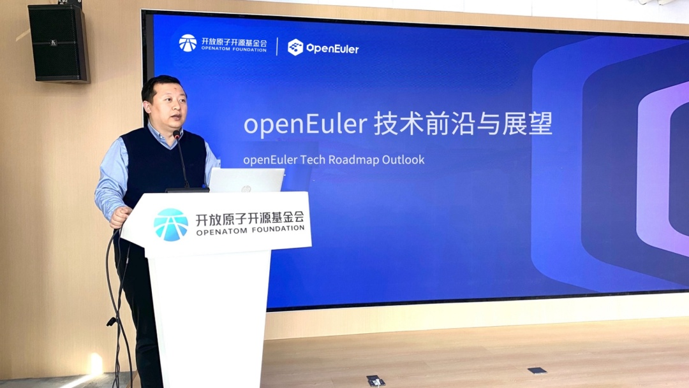
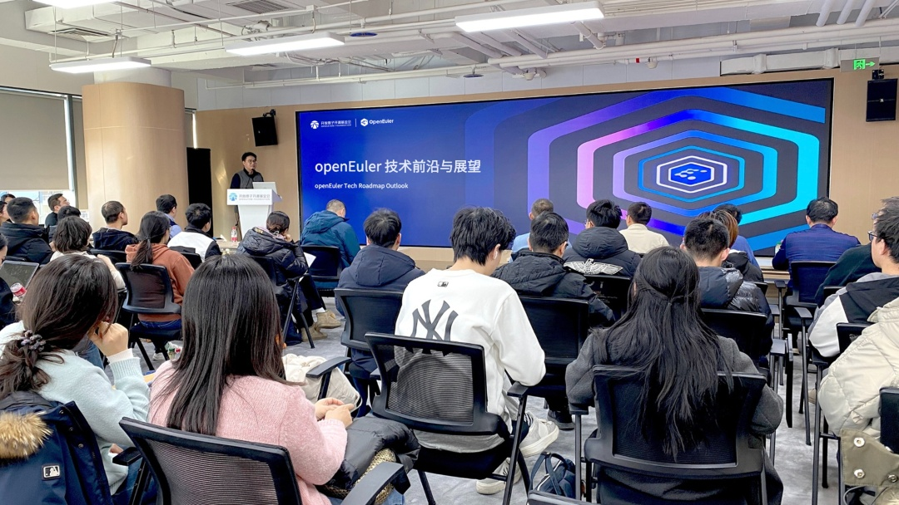
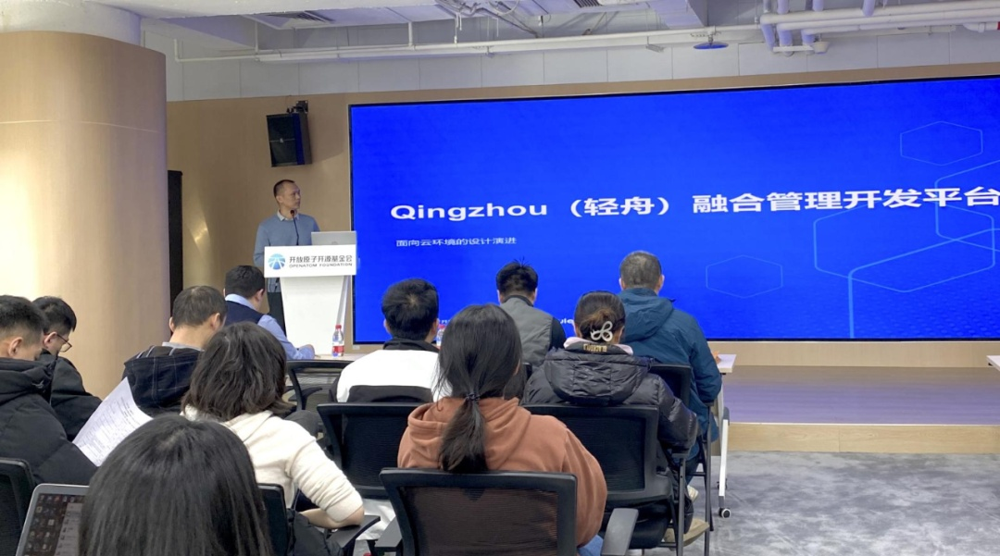
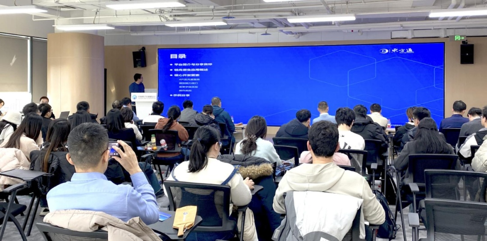
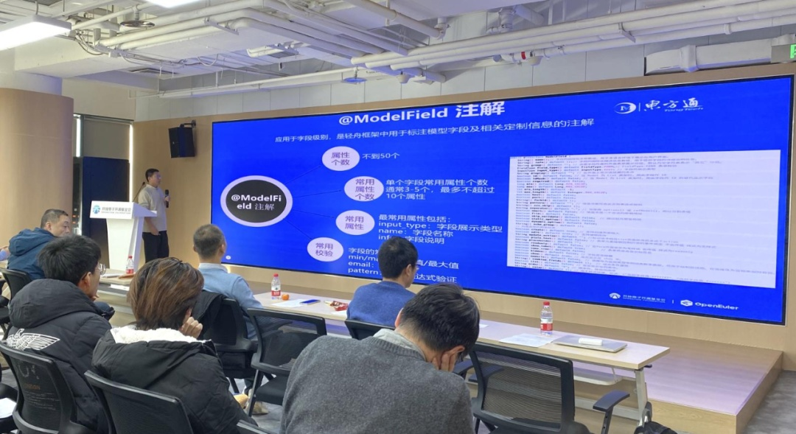
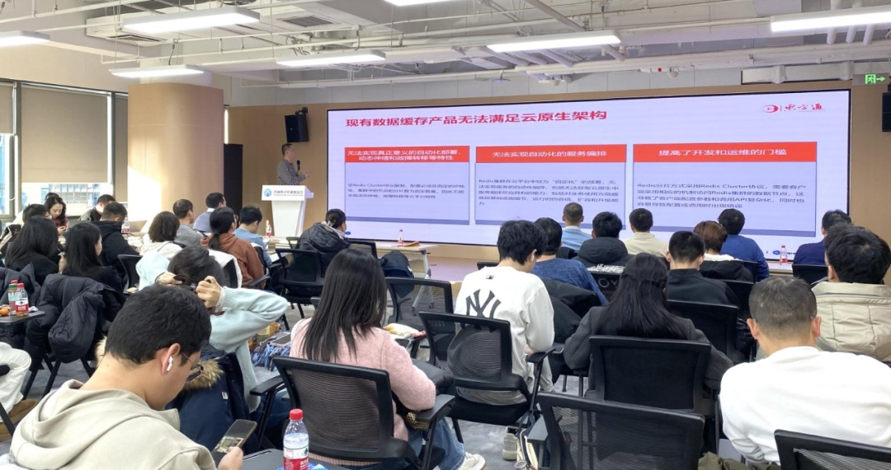
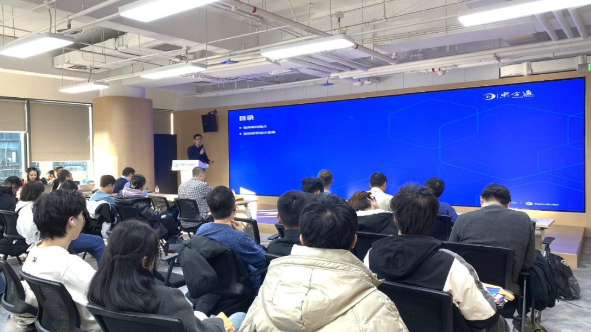
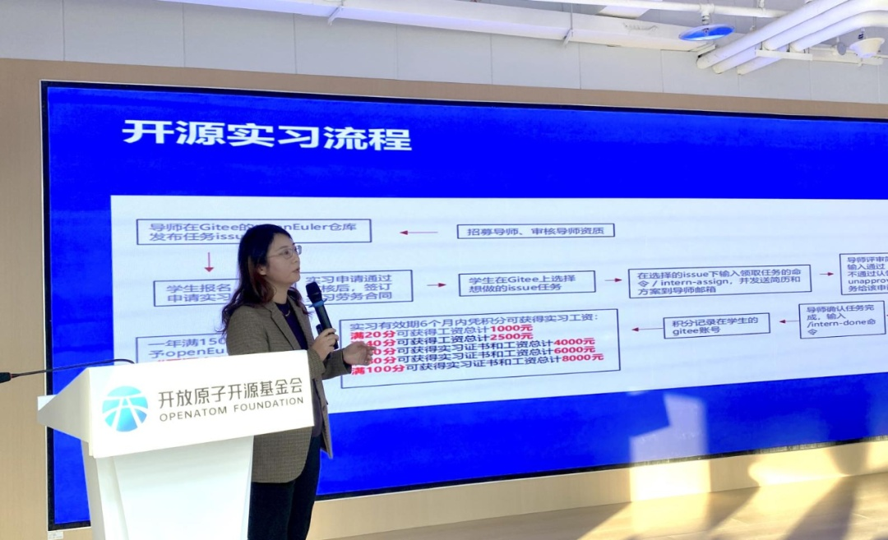

中间件+云原生+开源＝？ 

这一组合并非寻求唯一答案，而是推动持续的进化。

12月27日，由东方通与OpenAtom
openEuler（简称\"openEuler\"）社区联合主办的openEuler社区云原生开源中间件Meetup北京站圆满落幕。活动围绕开源与云原生中间件，吸引了技术爱好者、行业从业者及高校学生的关注与参与。本次Meetup以共享云原生开源中间件的技术动态与前沿信息为主旨，提升专业技术人才对云原生中间件技术的兴趣与参与度，促进生态进一步繁荣，携手为中间件云原生发展注入的"开源"动力。

**开场致辞**
----

作为openEuler社区轻舟与云翼项目的贡献方，东方通持续关注项目进度，投入研发力量，积极推动项目技术完善、迭代、改进与进一步创新。东方通开发一部经理王普代表东方通致开场辞，他表示，东方通一直致力于推动云原生中间件的创新与发展，依托openEuler社区强大的生态影响力和技术支持，共同推动了开源项目的优化与创新，为技术人员解锁了更加高效、便捷的开发方式，助力企业更加灵活、轻松的"上云"，东方通将持续、有力地推进云原生技术的广泛普及与深度应用。他诚挚邀请更多开发者加入openEuler社区，以更加开放的姿态、更加务实的行动，激活云原生中间件"无限可能"。

**openEuler社区的最新进展与未来规划**
----

openEuler社区Maintainer郑振宇分享了openEuler社区的最新进展与未来规划，重点介绍了openEuler
24.03 LTS版本在四大领域的突破性进展：基础设施强化、Linux
6.6内核升级、智能解决方案创新以及全场景体验优化。该版本通过集成LLVM技术、异构算力拓扑感知功能及oeAware微架构优化等手段，显著提升了AI原生支持能力与多样性算力全场景的应用表现，为用户及开发者打造了一个更智能、更持续、更友好的开发平台。未来，openEuler
25.03版本将进一步全面升级AI能力，深化全场景应用支持，为开发者提供更加便捷高效的开发环境，持续推动技术创新与生态繁荣。

**轻舟面向云环境的设计演进**
----

东方通资深技术专家王鹏亮深入探讨了"轻舟面向云环境的设计演进"。该项目通过提供全面的API接口和高度模块化的设计架构，助力开发者快速构建功能完备的应用框架，实现开发提速、自动化集成、集中管控以及模块化部署于云环境的优势。此外，面向云环境发展的特性，轻舟还具备多租户支持、单点登录机制以及严格的数据隔离等优势，完满足更加复杂多变的业务场景需求，为开发者带来前所未有的便捷、高效开发体验。

**轻舟Web管理软件开发平台原生应用开发实践**
----

东方通资深技术专家徐亚楠与参会嘉宾分享了"轻舟Web管理软件开发平台原生应用开发实践"他深入介绍了轻舟平台如何通过快速开发、自动集成、集中管理和模块化设计等特性，帮助开发者高效构建Web管理控制台。同时，他还详细阐述了轻舟平台丰富的API、内置服务、表单字段类型、操作类型和模型能力接口等核心开发要素，为开发者提供了实用的建议，帮助开发人员简化开发流程，实现更高效的项目交付。

**轻舟Web管理软件开发平台原生应用开发实践**
----

openEuler社区Qingzhou项目Committer袁文才聚焦于"轻舟Web管理软件开发平台公共组件与视图模板的灵活扩展"，详细介绍了轻舟的扩展机制与实现策略，包括如何通过@ModelField注解进行字段级别的定制，如何利用前端字段类型展示扩展来满足多样化的输入需求，以及如何通过@ModelAction注解自定义模型操作等，并展示了轻舟未来在支持自定义页面嵌入、自定义js实现、富文本编辑器集成等方面的优化计划，进一步提升开发效率与应用的可维护性，为开发者提供了极具价值的实践参考。

**云翼数据缓存中间件云原生管理平台Proxy性能优化的设计思路**
----

东方通云翼核心研发组技术负责人李罡深度解析了"云翼数据缓存中间件云原生管理平台Proxy性能优化的设计思路"。他表示，传统数据缓存产品已无法满足云原生架构的需求，为此，东方通团队为云翼项目进行了Proxy性能优化，通过零拷贝技术提升数据传输效率。李罡详细介绍了零拷贝的设计思路，并指出其面临的挑战，如剥离业务数据、内存管理等。Proxy的优化可以实现屏蔽云原生特性、提供灵活接入方式和更好扩展能力等功能，为客户端提供稳定接入。这一设计思路，将为云翼数据缓存中间件在云原生环境下的应用提供有力支持。

**云翼数据缓存中间件云原生管理平台管理控制台实现多指标监控**
----

openEuler社区云翼项目Committer张晨龙带来了"云翼数据缓存中间件云原生管理平台管理控制台实现多指标监控"的分享，他全面介绍了云翼管理控制台的架构设计，该控制台通过中心服务节点与工作节点，能够实时收集并展示系统的运行状态，实现全面的多指标监控。整体架构支持自动化部署、自动伸缩和故障恢复，确保集群的高可用性。通过监控数据的精准推送、接收与存储，以及基于历史数据的定时分析报警，为用户提供了邮件、站内推送等多重通知方式，极大地提升了系统的运维效率与智能化水平。

**开源实习**
----

科技创新，唯在得人。为加强人才培养，为社区引入新生力量，东方通联合openEuler社区推出了面向高校学生的openEuler开源"实习计划"，在此次活动中，东方通生态发展经理祝晓阳为参会高校师生详细解读了此次实习计划，包括实习方式、实习流程、实习任务、奖励机制等，旨在通过理论知识与实战开发结合的实践机会，帮助年轻开发者更好地融入实际开发环境，提升创新能力与实际开发技能。

本次Meetup北京站活动，通过技术特性剖析、实践应用展示以及优化升级路径探讨等多个维度，全面而深入地展现了轻舟与云翼两大开源项目的"实战能力"。多位一线开发者对轻舟和云翼两大开源项目给予了高度评价，他们认为这些项目在技术方向上具有前瞻性，但目前需要更多的深入研究，配合实践应用拓展相关能力，相信未来将持续为专业开发者带来惊喜。部分高校学生表示，这次活动不仅了解到实用的技术知识，更结识了认识了很多行业前辈，非常感谢东方通和openEuler社区搭建了这样一个宝贵的学习与交流平台。

交流还将继续，欢迎来openEuler社区解锁你的开源之旅\~ 

**轻舟项目地址**

https://gitee.com/openeuler/qingzhou

**云翼项目地址**

https://gitee.com/openeuler/yunyi

**想要加入实习项目的小伙伴可通过以下方式联系**

轻舟项目联系方式: wangpl@tongtech.com 

云翼项目联系方式: wuyd@tongtech.com
