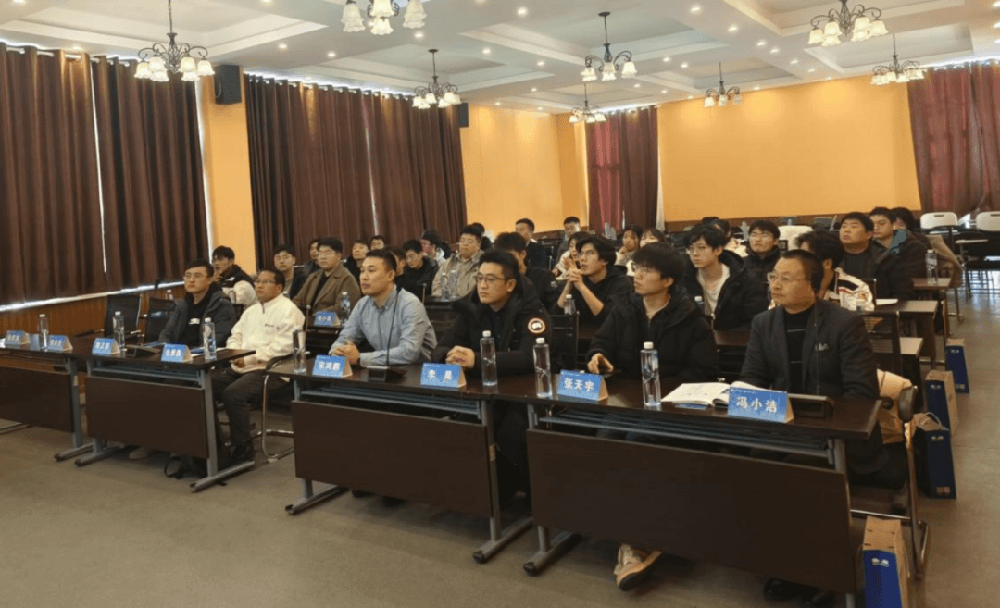
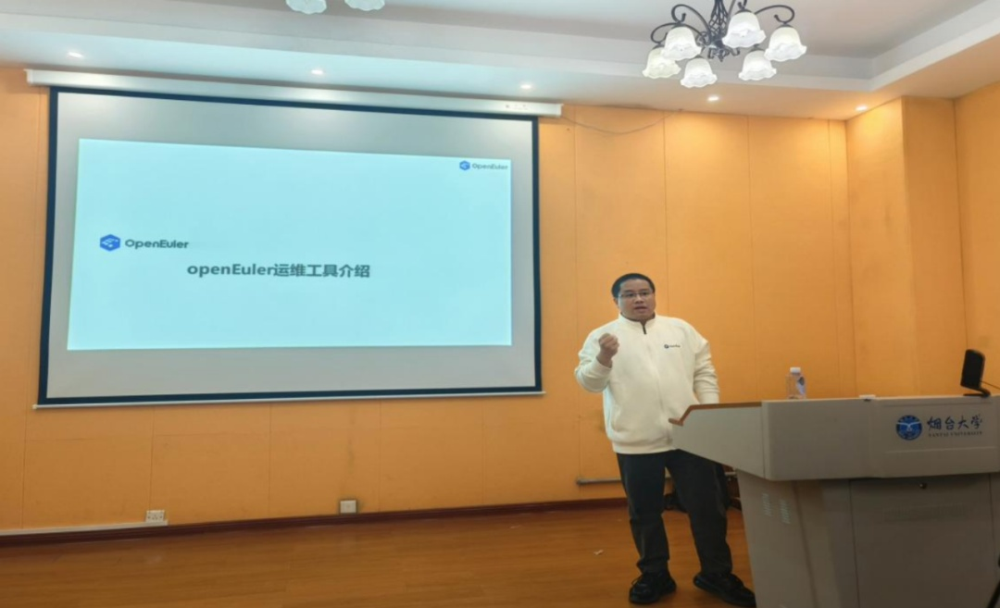
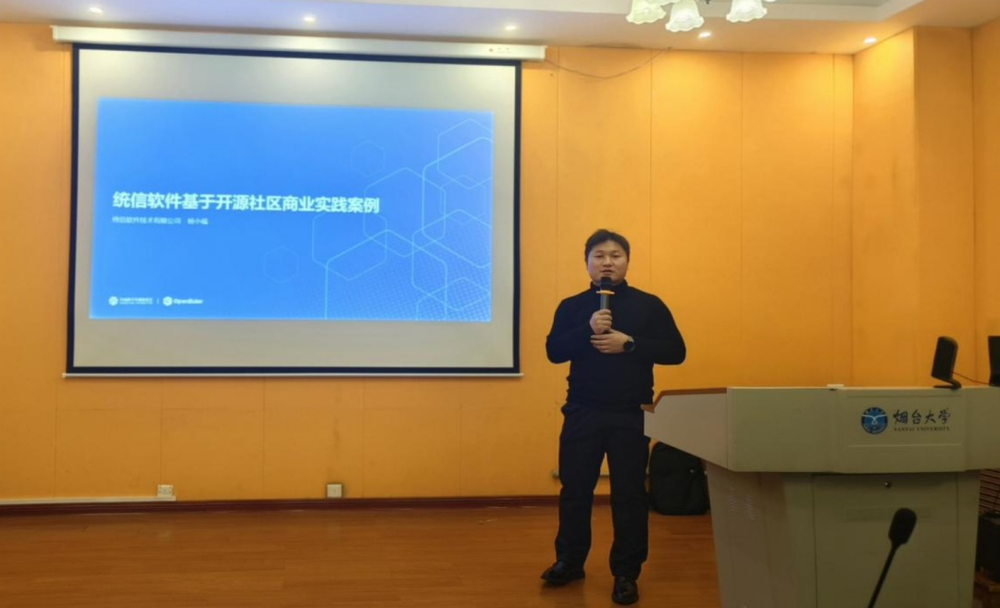
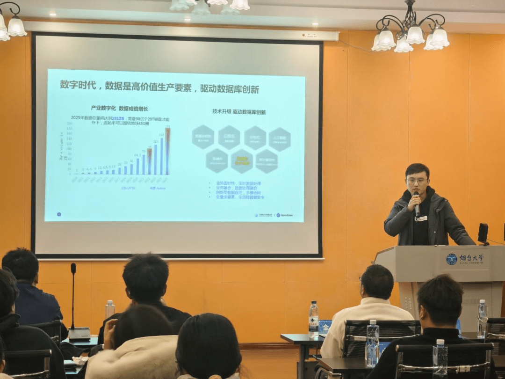
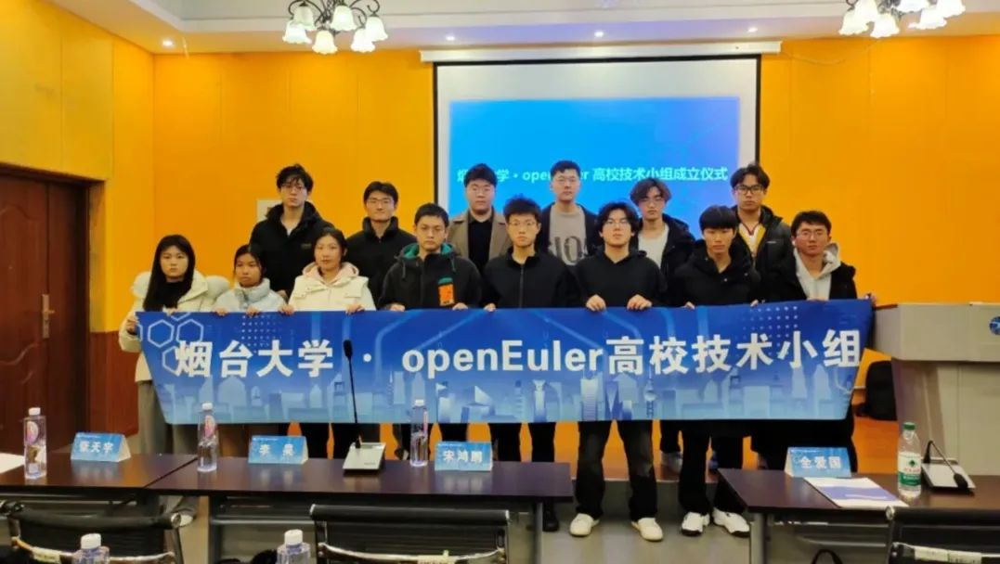

2024年12月22日，OpenAtom
openEuler（简称\"openEuler\"）与openGauss社区举办的以操作系统&数据库技术为主题的技术交流Meetup在山东烟台顺利召开。本次Meetup面向山东胶东地区用户与高校，就操作系统与数据库两大基础软件技术底座进行分享和交流，正式成立了openEuler胶东用户组和烟台大学openEuler高校技术小组。

**开场致辞**
----

openEuler 胶东用户组Organizer 宋鸿鹏老师发表致辞。为了推动 openEuler
、openGauss
开源社区的区域生态的发展，此次活动聚焦于操作系统与数据库这两大至关重要的基础软件技术底座。通过深入探讨和交流，将两者紧密结合，为区域社区用户带来最前沿的技术创新内容。

**openEuler社区发展进展以及未来规划**
----

openEuler 胶东用户组organizer宋鸿鹏老师对openEuler 24.03 LTS
的最新特性进行分享，全新的LTS版本在基础设施、Linux
6.6内核、智能解决方案以及全场景体验四大方面实现了全面升级，为用户和开发者带来了高性能、高可靠、高灵活的开发体验，特别是其AI原生支持和创新的操作系统设计理念，以及内核、文件系统、安全等方面的多项技术创新，为数字基础设施的全场景应用提供了坚实的基础。

"

**openEuler运维服务解决方案**
----

openEuler社区人才与服务SIG专家全爱国老师介绍了openEuler在运维监控自动化领域创新探索，随着openEuler
大量部署，针对系统侧的故障诊断愈发复杂，尤其在高并发和大规模的云环境下，故障自证能力成为提升的重点。

openEuler投入重点在增强运维工具的功能和性能上，基于此提出了三个层别的运维方案：基于ssh和自研协议的远程执行框架的基础运维、基于eBPF智能探针的高级运维和基于大模型能力的智能运维。

openEuler通过技术优化和工具创新，增加openEuler系统的稳定信、降低运维复杂度、提高故障响应速度，最终实现自主可控操作系统的核心运维能力提升，满足用户在多场景下的高效运维需求。

openEuler运维专区入口：https://www.openeuler.org/zh/om/

**统信软件基于开源社区商业实践案例**
----

统信软件是openEuler社区重要的贡献者，贡献排名前列。统信软件积极参与openEuler社区建设，多个来自统信的工程师作为Maintainer主导DDE桌面环境、Migration迁移、openStack等多个SIG组原生开发和维护。在技术投入、供应链安全、OSV评测等方面做出了突出贡献。统信软件产品业态已覆盖桌面操作系统、服务器操作系统、智能终端操作系统以及在线网盘文档等多个场景。未来统信软件将积极开展生态适配和联合攻关创新工作，助力新一代信息系统转型升级，打造安全可信的基础设施底座。

统信软件山东区域售前总监杨小福老师分享了统信软件与openEuler社区联创瓦特调度技术，实现了节能与性能的双优：功耗降低，性能提升;以及基于鲲鹏算力平台的国密算法性能优化与平台性能优化。

**玄铁智能小车解决方案及开发实践**
----

中国科学院软件研究所工程师张天宇来分享了RISC-V与openEuler
操作系统的适配兼容创新应用落地的场景特性。RISC-V ROS 小车是一款基于
Milk-V Meles 开发的 ROS2 智能机器人，搭载了玄铁 C910 处理器、openEuler
on RISC-V
操作系统和亚博公司提供的外设解决方案。可以实现机器人运动控制、AI
视觉交互、SLAM 建图导航、多机同步控制等多项功能。

ROS2 humble 工程由中国科学院软件研究所主导的 ROS SIG 引入 openEuler
社区，并且由 RISC-V SIG 进行移植和优化，成功为 openEuler on RISC-V
系统赋能 ROS2 功能。除了在上层软件层面，RISC-V SIG 也基于 TH1520
的外设驱动进行了一定的优化，包括利用 GPU、 NPU
和多媒体解码等多种硬件驱动加速图像采集解析，SLAM
建图渲染和多机同步网络响应。同时，RISC-V SIG 为 TH1520 的 openEuler
内核修复和开启了蓝牙和 Wi-Fi 等相应外设功能支持，使得 ROS2
系统拥有了一个功能齐全，稳定高效的运行环境。作为集成工作的一个重要成果，基于
TH1520 的 Meles 镜像专为 ROS 机器人开发和应用设计，提供了一个专用的
openEuler 系统镜像底座。RISC-V ROS 小车标志着国内首个基于 RISC-V 芯片与
openEuler 系统，并针对教育机器人开发厂商的生产解决方案形成。

**openGauss最新技术与架构创新，夯实数据底座**
----

openGauss
从2020年开源历经4年多发展，始终围绕高性能、高可靠、高安全、高智能的技术核心原则不断创新，紧跟时代，在社区生态、技术创新、行业应用等多方面均取得丰硕成果。

openGauss社区Committer胡正超介绍了 openGauss全新6.0.0
LTS版本创新特性，搭载了全新的ogEngine存储引擎，显著降低了存储空间的占用，也带来了更加平稳的性能表现；从鲲鹏硬件到openEuler操作系统再到openGauss数据库，软硬协同，优势互补，带来了极致的安全与性能；资源池化架构下围绕特性加固与故障自愈为核心着力点，全面提高了可用性、可靠性；各类迁移套件全面集成整合，打造\"一键无忧\"的极简迁移平台Datakit；DataVec插件为openGauss实现了向量化数据库能力，结合鲲鹏指令集加速，充分使能AI场景；打造高斯小智大模型，结合AI全面提升开发、运维、调优效率。

**openGauss数据库海量数据实践探索**
----

海量数据是openGauss社区的重要合作伙伴，深度参与openGauss的内核研发，包括分析器、优化器、执行器等，社区贡献Top2。海量数据大力重视研发团队的建设，以提高产品的能力。同时持续投入运维体系的构建以实现快速交付、快速响应。凭借其强大的产品能力、交付能力、运维能力，海量数据赢得众多行业客户的认可。海量数据山东售前总监李昊分享了基于openGauss
数据库多行业的运维实践，从需求调研、建设规划、部署交付到日常运维的全链条全周期管理体系。

在本次活动上正式成立了openEuler胶东用户组和烟台大学openEuler高校技术小组。后续将作为山东胶东地区的用户、开发者持续交流的线下阵地，欢迎更多伙伴加入共同建设openEuler用户生态。

本次会议圆满落下帷幕，通过社区嘉宾们的分享我们看到了openEuler 与
openGauss
社区将会在未来继续稳步前进。在技术创新方面，将不断探索新的应用领域，为科技的发展注入新的动力。在社区发展方面，将吸引更多的开发者和用户加入，共同打造一个更加繁荣的技术生态。在实际应用方面，将为各个行业提供更加稳定、高效的基础软件解决方案，夯实基础设施底座。
