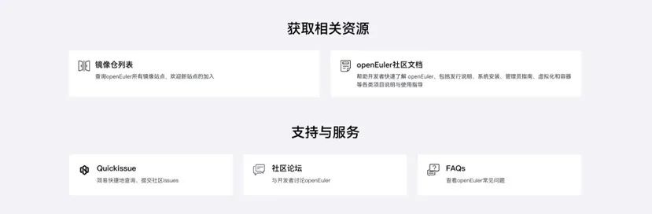

**概述**
---

12月30日，OpenAtom openEuler(简称：openEuler) 24.03 LTS
SP1版本发布。该版本基于Linux
6.6内核构建的LTS版本，主要吸收了Linux社区高版本的有益特性及社区创新特性，如xcall/xint和可编程调度，提升了系统性能。

关于openEuler的一篇论文入选第45届实时系统顶级会议RTSS，并在会上进行报告。该论文聚焦于提升操作系统内核实时性，详细介绍了openEuler发现并改进多个Linux内核实时性问题，包括提升应用端到端最差响应时间1.64倍的显著成果。

技术发展方面，openEuler在oneAPI异构计算框架和OpenVINO
AI工具套件的支持上取得进展，提升了openEuler在AI和异构计算方面的能力。安全防护系统SafeGuard和智能应用推理网关Chatig等项目发展也取得了新的进展。其他方面，Proxmox
VE
8.3版本集成了openEuler容器模板。openEuler软件中心服务初步实现了对src-openEuler语言类软件包的自动上游监控和版本升级，提高了软件包更新效率。openEuler下载中心经过优化，整合并展示了多种openEuler获取方式，提升用户体验。

社区活动方面，openEuler社区积极参与2024开放原子开发者大会，荣获"2024年度操作系统领域国内活跃开源项目"，并有7位社区开发者获得个人荣誉。同期，社区Meetup活动在北京、烟台、苏州等城市举办，促进了开源技术的交流与合作。

此外，openEuler教育工作组成功举办了首批培训讲师认证，8名学员成为openEuler培训讲师，为社区人才培养注入新动力。

本月报阅读时长18分钟。

欢迎细读。

**openEuler 24.03 LTS SP1 发布**
---

12 月 30 日，openEuler 24.03 LTS SP1 版本正式发布，该版本采用 EulerMaker
构建服务器、云计算、边缘计算镜像。版本代码总计6.34亿行，相比 openEuler
24.03 LTS，新增代码0.58亿行。

openEuler 24.03 LTS SP1 版本是基于Linux
6.6内核构建的LTS版本，从master拉取相关代码并进行演进。其中内核代码新增18.8万行，吸收了Linux社区高版本的有益特性及社区创新特性：新增支持xcall/xint、可编程调度、支持SMC-D、haltpoll，以及内存管理folio、MPTCP特性支持、按需加载支持failover等特性。

下载地址：

https://www.openeuler.org/zh/download

技术白皮书：

https://www.openeuler.org/zh/showcase/technical-white-paper/

**社区规模**
---

截至2024年12月31日，openEuler
社区用户累计超过385万。超过2.1万名开发者在社区持续贡献。社区累计产生
202.8K个PRs、106.6K条Issues。目前，加入openEuler
社区的单位成员1944家，本月新增68家。

社区贡献看板（截至2024/12/31）

**社区事件**
---

**openEuler深度参加2024开放原子开发者大会**

2024年12月20日，2024开放原子开发者大会暨首届开源技术学术大会圆满落幕。作为开放原子开源基金会重点打造的明星项目，openEuler深度参加本次大会，不仅成功举办了openEuler技术分论坛，还带来了充满活力的openEuler开源集市和动手实践的工作坊，让开发者们零距离感受开源的魅力，为与会者提供了深入交流和实践操作的平台。

同时，在本次大会的"2024年度国内活跃开源项目&开发者致谢仪式"上，openEuler荣获"2024年度操作系统领域国内活跃开源项目"。大会还特别表彰了2024年度在操作系统领域表现突出的国内活跃开源开发者，以认可他们对开源社区发展的显著贡献。在这一环节中，openEuler社区共有7位杰出开发者被授予"突出贡献者"和"明星开发者"等荣誉，彰显了他们在推动社区进步中的重要作用和影响力。

**openEuler论文入选第45届实时系统顶级会议RTSS**

12月10日-12日，第45届IEEE实时系统学术会议（RTSS：45th IEEE Real-Time
Systems
Symposium）在英国约克召开。关于openEuler的一篇论文被录用并报告。该论文聚焦于提升操作系统内核实时性，详细介绍了openEuler发现并改进多个Linux内核实时性问题，包括提升应用端到端最差响应时间1.64倍的显著成果。

此次论文入选不仅彰显了openEuler社区在操作系统技术创新和研究方面的卓越成就，也体现了openEuler与学术界的紧密联系和合作，为openEuler的发展注入了新的活力。openEuler社区致力于扎实推动操作系统各个领域的发展与合作，期待未来能与更多学术研究相结合。

**论文具体信息：**

**题目：**Interference-free Operating System: A 6 Years' Experience in
Mitigating Cross-Core Interference in Linux

**作者：**第一作者为北京大学计算机学院博士生邓朝萌（在华为实习期间完成），作者还包括北京大学张子琪、李锭老师和郭耀教授，华为高级技术专家叶云峰，华为高级技术专家贾宁，openEuler
Valuable Professional 任玉鑫，openEuler 技术委员会主席胡欣蔚。

**RTSS 2024：**https://2024.rtss.org/conference-program/

**openEuler参加ROSCon China 2024**

12月8日，为期两天的 ROSCon China 2024
在上海举办。大会聚焦机器人操作系统（ROS）及相关技术生态，吸引了来自全球的机器人技术精英、开发者与爱好者的关注。openEuler社区开发者参与本次大会并发表主题演讲。中国科学院软件研究所工程师、openEuler
ROS SIG Maintainer王晓云，openEuler Embedded SIG Maintainer
方林旭在本次大会上围绕"机器人操作系统新纪元: Global ROS
与自研系统"，分享并展示了 ROS在openEuler和RISC-V上的发展与应用。

**多名openEuler贡献者入选Linux Kernel存储模块的重要席位**

Linux Kernel
社区采用分层管理的方式，按照各个子系统不断向下细分，每一层级/子系统都由各自模块的
Maintainer/Reviewer
负责把关来自全球各地开发者的提交，确保代码的可靠与稳定。openEuler内核开发者团队重视对上游
Linux Kernel
的投入。作为社区的核心贡献者，华为团队在存储领域，特别是稳定性与高性能方面取得突破，并在2024年成功担任了Linux
Kernel
的三个重要职位：bfq模块的Maintainer、软raid模块的Maintainer以及ubifs/ubi模块的Reviewer，这些角色的担任将进一步巩固openEuler社区的影响力，并推动了社区的持续发展。

**openEuler首批培训讲师名单揭晓**

12月7-8日，openEuler教育工作组组织了首批openEuler培训讲师认证，经过严格严肃的考核与评价，来自5家openEuler授权培训单位共计10名学员中，有8名学员通过认证考核，成为第一批openEuler培训讲师。

这些讲师不仅具备专业知识和实践经验，还展现了优秀的沟通技巧和教育热情，将成为openEuler与用户间的桥梁，推动操作系统的推广和应用。

为了鼓励越来越多的专业人才加入openEuler队伍，推广openEuler技术，特此在2024开放原子开发者大会暨首届开源技术学术大会上为首批通过认证的培训讲师举行了证书颁发仪式。

**开源之夏2024，openEuler参赛项目顺利结项**

从3月到12月，2024年开源之夏已走入尾声。在本届开源之夏的活动中，openEuler社区累计贡献了96个项目任务，共计收到319份申请书，最终产生95位中选学生；历经3个月的项目开发和1个月的代码合入期，最终82位同学通过了导师、社区和组委会的考核，项目得以成功结项。

其中，来自郑州大学的程宏豪同学和来自中国科学院大学的余秋初同学，获得本届开源之夏最佳质量奖。恭喜两位同学，也感谢所有选择openEuler社区项目并为之努力成功结项的同学们，希望大家继续开源热情，在开源贡献中实现和突破更高的自我价值。同时，也感谢在本届开源之夏中为openEuler项目保驾护航的每一位导师。

开源之旅，因你们而精彩！

**openEuler社区云原生开源中间件Meetup**

12月27日，由东方通与openEuler社区携手举办的云原生开源中间件Meetup在北京圆满落幕。本次Meetup以共享云原生开源中间件的技术动态与前沿信息为主旨，提升专业技术人才对云原生中间件技术的兴趣与参与度，促进生态进一步繁荣，携手为中间件云原生发展注入的"开源"动力。

**openEuler & openGauss Meetup**

12月22日，openEuler社区与openGauss社区联合举办的以操作系统&数据库技术为主题的技术交流Meetup在山东烟台顺利召开。本次Meetup面向山东胶东地区用户与高校，就操作系统与数据库两大基础软件技术底座进行分享和交流，正式成立了openEuler胶东用户组和烟台大学openEuler高校技术小组。

**openEuler&openKylin AI及云原生技术交流 Meetup**

12月12日，由开放原子开源基金会孵化及运营的openEuler社区和openKylin社区联合举办的AI及云原生技术交流Meetup在北京顺利召开。本次会议旨在促进开源技术的创新与应用，在分享openEuler社区和openKylin社区创新技术的同时，了解AI在业务场景中的部署优化，探索云原生架构的高效开发和企业级部署应用。

 

**openEuler on RISC-V Meetup**

12月6日，openEuler社区与中国移动云能力中心联手，在苏州举办了一场以RISC-V为主题的Meetup活动。本次活动邀请了来自中国移动云能力中心、中国科学院软件研究所及进迭时空的行业专家来共同分享及探讨RISC-V的前沿技术成果与实战经验。

**技术进展**
---

**oneAPI异构计算框架支持**

oneAPI作为Unified Acceleration
Foundation（UXL）初始项目的目标是为行业提供一套开放、基于标准的异构编程和加速模型，并为异构加速器（如
CPU、GPU、FPGA
和专用加速器）提供统一的异构计算融合能力。oneAPI规范扩展了现有的异构语言编程模型，提供了灵活的并行编程语言（Data
Parallel
C++）的编译及运行框架，同时也通过一组加速软件库以及底层硬件抽象接口（Level
Zero）来支持跨架构，从而支持多种加速硬件和处理器平台以及多语言的运行库。目前在Intel
Arch SIG和AI
SIG的共同推动下，oneAPI在openEuler已经完成了依赖包的本地集成，并且适配了oneAPl
BaseKit和Runtime等工具包的安装和使用。

为了在openEuler上完整的支持oneAPI，我们从openEuler 24.03
LTS开始分别集成了oneAPI的开发环境(Basekit)和运行态环境(Runtime)的容器镜像。并从
openEuler 24.03 LTS
SP1开始，openEuler原生支持了oneAPI系列底层框架库的适配和集成，包括oneAPI运行所需的各类依赖库，以及英特尔的图形加速编译器，OpenCL的runtime，和支持不同平台（x86\_64和aarch64）的底层硬件抽象层（Level-Zero）等。

同时为了完整支持Data Parallels
C++和基于加速库的API编程的两种oneAPI编程模式，我们也对oneAPI官方提供的各类软件包在openEuler上做了相应的适配和验证的工作，这样我们可以便利地在openEuler中增加oneAPI的官方DNF/YUM源来安装和更新全部的oneAPI的运行依赖库、开发工具和调试工具等。

在openEuler的oneAPI入口可获得更多的支持信息：

https://gitee.com/openeuler/intel-oneapi

**OpenVINO在openEuler的支持**

OpenVINO是一套开源的AI工具套件和运行库，其能用于优化几乎各类主流框架的深度学习模型，并在各种Intel处理器和加速器及其他硬件平台（如ARM）上，能够以最佳性能进行部署并高效提供AI服务。AI
SIG和Intel Arch SIG从openEuler 24.03 LTS
SP1开始，提供了OpenVINO原生的适配和集成，进而在openEuler上提供了完整的OpenVINO的计算能力。

目前openEuler上集成的OpenVINO的模型转化功能可以将已经使用的流行框架（如
TensorFlow、PyTorch、ONNX和PaddlePaddle等）预训练模型进行转换和优化，并在各类的Intel处理器和加速器或者ARM的硬件环境中进行部署，包括在本地、设备端、浏览器或云端等场景下提供服务能力。其主要功能包括：

**训练模型库、模型转化和优化：**支持OpenVINO的Open Model
Zoo提供了数百种开源的预训练模型，可以快速的运行在OpenVINO运行框架下。OpenVINO支持将多种深度学习框架训练得到的模型转换为中间表示（IR）格式，以便在
OpenVINO
中进行优化。比如OpenVINO通过NNCF对模型剪枝或者稀疏性压缩优化、减少模型大小、提高推理速度等。同时OpenVINO提供了性能分析工具用于分析模型性能和瓶颈等。

**硬件加速：**将优化后的模型部署到Intel或者其他支持的硬件上，充分利用硬件的并行计算能力，加速推理过程。同时，OpenVINO提供了Plugin机制，可以扩展和实现第三方的硬件计算加速能力。

**OpenVINO运行时（Runtime）支持：**OpenVINO推理引擎运行时支持跨硬件和跨操作系统和多语言（C、C++、Python等），并能提供异步推理能力，提高系统吞吐量。

**OpenVINO GenAI**是 OpenVINO 的一个新分支，旨在简化生成式 AI
模型的推理过程。它隐藏了生成过程的复杂性，并最大限度地减少了所需的代码量。OpenVINO
GenAI 是一个由流水线和方法组成的库，扩展了 OpenVINO
运行时，使其能够更有效地处理生成式 AI
模型，从而快速的提供生成式AI的能力。

在openEuler的OpenVINO入口可获得更多支持信息：

https://gitee.com/openeuler/intel-openvino

**安全防护系统SafeGuard项目进展**

SafeGuard是一个基于eBPF+LSM的Linux系统安全服务，可以实现对进程、文件、目录、网络、mount操作的拦截及审计记录。近期进展：

1.  升级了go library和libbpf-1.4.6。

1.  完成了openEuler 24.03的适配，放到了src-openEuler仓库。

1.  完善了拦截的实现方式，支持move\_mount hook。

1.  重构了日志记录。

1.  项目地址：https://gitee.com/src-openeuler/safeguard

**智能应用推理网关Chatig项目在社区完成建仓**

Chatig是一个高效、统一的推理网关，旨在为开发者和企业提供兼容OpenAI的API层，充当了智能应用与大模型服务之间的中介。该项目由联通云操作系统团队发起，并且已在社区建仓运作。

通过Chatig，开发者能够更轻松地接入大模型服务，为智能应用赋能。Chatig
集成租户管理、流量控制、模型调度、安全审计等模块，除了提供统一的API接口，还能够实现多模型灵活切换、模型管理、数据隐私保护及使用日志监控等功能，帮助开发者和企业更高效地管理和优化智能应用的部署与运行。

1.  增加了用户管理相关的接口，包括查询、删除、修改用户等等。

1.  增加了API\_KEY的管理，包括API\_KEY的鉴权、邀请等。

1.  增加了对vllm与mindie推理引擎模型的支持。

1.  增加了项目管理相关的接口。

1.  项目地址：https://gitee.com/openeuler/chatig

**openEuler语言类软件包实现上游监控和自动升级**

openEuler软件中心服务成功实现了对src-openEuler中1287个语言包相关仓库的自动监控，并在发现与上游版本存在差异时，自动提交Pull
Request（PR）进行版本升级，显著提升了软件包的更新效率。

软件中心服务累计触发了144个仓库的自动升级PR提交，升级PR通过CI成功率为40.2%，未升级的仓库因上游软件无新版本发布而无需更新。对于升级失败的PR，后续服务将提供自动分析以及提交Issue功能，从而帮助社区维护者减少维护工作量，提升软件包维护效率。

src-openEuler源码仓：https://gitee.com/src-openEuler

自动升级PR可参考：https://gitee.com/src-openeuler/perl-CPAN/pulls/16

**Proxmox Virtual Environment支持openEuler**

Proxmox Virtual Environment (Proxmox VE)
是一个开源的虚拟化平台，主要用于管理虚拟机（VM）和容器的创建、管理和监控。它集成了
KVM（用于虚拟机）和
LXC（用于容器）技术，提供了一个统一的管理界面，适用于虚拟化环境的部署和维护。

在Proxmox VE最新的8.3版本上已经集成了openEuler的容器模板，可以在Proxmox
VE中直接启动openEuler 24.09版本的容器。

Proxmox VE 官方文档：

https://pve.proxmox.com/wiki/Roadmap\#Proxmox\_VE\_8.3

**openEuler下载中心优化**

为了提升开发者获取openEuler操作系统的便捷性，我们对下载中心进行优化，整合了openEuler多种获取方式，增加相关资源、支持与服务等功能楼层，丰富下载中心配套服务，让开发者能够快速、轻松地访问和下载所需的系统版本：https://openeuler.cn/zh/download

下载中心特别设有"所有版本"，开发者能够迅速访问历史版本的下载页面，并轻松切换至所需版本。经过精心整合，历史下载页面的信息呈现更加集中，简化了查找和下载流程，让开发者能够高效地获取不同版本的openEuler资源。

**RISC-V SIG工作进展 **

RISC-V SIG 经过6个月的研究和开发，正式实现了对 RustVMM
RISC-V架构的完整支持，填补了RISC-V 在 Rust
虚拟化生态基础设施的关键空白。RustVMM 同时也是 RISE Project
的关注重心，Kernel and Virtualization WG 在跟踪记录 RustVMM 的 RISC-V
支持状态。虚拟化小组于 11
月的工作组例会中同步了工作进展，并获授权在工作组计划里持续更新维护
RustVMM (LK\_03\_014) 项。

未来，RISC-V SIG 将持续跟进并维护 RustVMM，并将 RISC-V
的架构支持工作扩大至依赖于它的 Cloud-Hypervisor、Dragonball 和
StratoVirt，加速 RISC-V 平台上虚拟化应用的落地与发展，推动 RISC-V
在虚拟化领域的全面支持。RISC-V SIG 将维护在 openEuler 社区 积极维护
RustVMM 以及相关依赖的软件包，以推动 openEuler RISC-V 作为 Rust
云原生软件栈的第一验证平台。

**嵌入式SIG的工作进展**

本月，嵌入式SIG的工作主要集中在：

1.  ZVM集成

1.  由湖南大学谢国琪教授团队开发的嵌入式实时虚拟机ZVM已经实现了与openEuler
Embedded的初步集成，具体文档可以参考https://embedded.pages.openeuler.org/master/features/zvm.html

1.  KP920 的支持\
目前openEuler
Embedded实现了对KP920(鲲鹏920）BSP的支持，可以运行在鲲鹏服务器硬件上，为后续支持鲲鹏模组奠定了良好基础。
 

**大模型训练故障异构弹性恢复技术介绍**

随着大模型训练规模的扩大，集群故障问题日益严重，影响训练效率，openEuler异构融合SIG分享了构建大模型训练异构弹性恢复技术。文中阐述了大模型训练故障恢复的四个主要步骤：故障检测、决策、处理和恢复，并强调了NPU状态保存与恢复技术、集合通信免建链技术的重要性。这些技术能够减少故障恢复时间和提高算力利用率。感兴趣的朋友欢迎参与openEuler异构融合SIG组，一起一起参与讨论。

原文阅读：

https://mp.weixin.qq.com/s/WbcZyphS9aP-TWQP3FuaZA

**软硬件兼容性测评**

本月，openEuler软硬件兼容性测评新增59个，其中，北向新增40个，南向新增10个，OS新增9个。

openEuler兼容性列表：

https://www.openeuler.org/zh/compatibility/

**安全公告**

2024年12月，社区共发布安全公告106个，修复漏洞222个（其中 Critical
22个，High 92个，其它108个）。

 

**重点漏洞提醒**

如下漏洞评估影响较大，请重点关注。
 

在 Django 5.1 版本（5.1.4 之前）、5.0 版本（5.0.10 之前）以及 4.2
版本（4.2.17 之前）中发现了一个问题：当使用 Oracle
数据库时，如果将不受信任的数据用作左侧值（lhs 值），直接使用
django.db.models.fields.json.HasKey 查找可能会遭受 SQL
注入攻击。**（CVE-2024-53907）**

CVSS评分为9.8分

公告链接：

https://www.openeuler.org/zh/security/cve/detail/?cveId=CVE-2024-53907&packageName=python-django

影响范围：

openEuler-20.03-LTS-SP4

openEuler-22.03-LTS-SP1

openEuler-22.03-LTS-SP3

openEuler-22.03-LTS-SP4

openEuler-24.03-LTS

在 socat 1.8.0.1 及之前的版本中，readline.sh 脚本依赖于
/tmp/\$USER/stderr2
文件。readline.sh脚本使用可预测的临时目录，允许无特权用户覆盖属于脚本调用者的任意文件。**（CVE-2024-54661）**

CVSS评分为9.8分

公告链接：

https://www.openeuler.org/zh/security/cve/detail/?cveId=CVE-2024-54661&packageName=socat

影响范围：

openEuler-20.03-LTS-SP4

openEuler-22.03-LTS-SP1

openEuler-22.03-LTS-SP3

openEuler-22.03-LTS-SP4

openEuler-24.03-LTS

**漏洞防护**

 

openEuler社区针对在维版本例行修复漏洞，发布安全补丁。建议用户关注openEuler官网安全公告，及时安装漏洞补丁进行防护。

openEuler 安全公告：

https://www.openeuler.org/zh/security/security-bulletins/

**感谢每一位朋友、开发者的支持**

因为大家的辛勤贡献，openEuler
的每一天都发生着好的事情。小编限于视野和能力，难免有所遗漏，在此表示歉意。同时，衷心感谢社区朋友、开发者们以及openEuler
SIG组成员的贡献：

\* 以上不分先后顺序

如果您希望在月报中增加您的工作内容，或对内容有任何改进建议，请联系wengqiaozhen@openeuler.sh。
